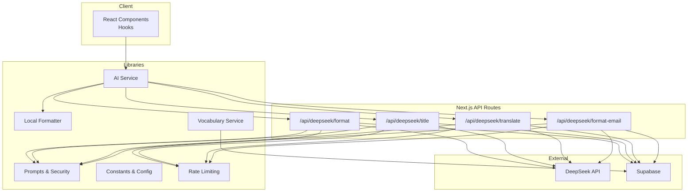
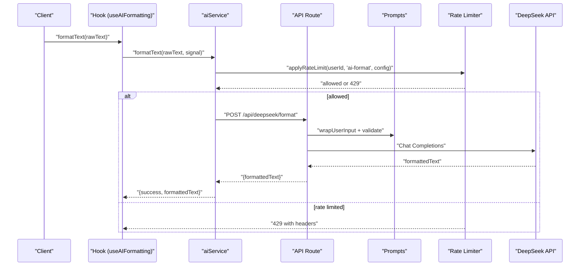
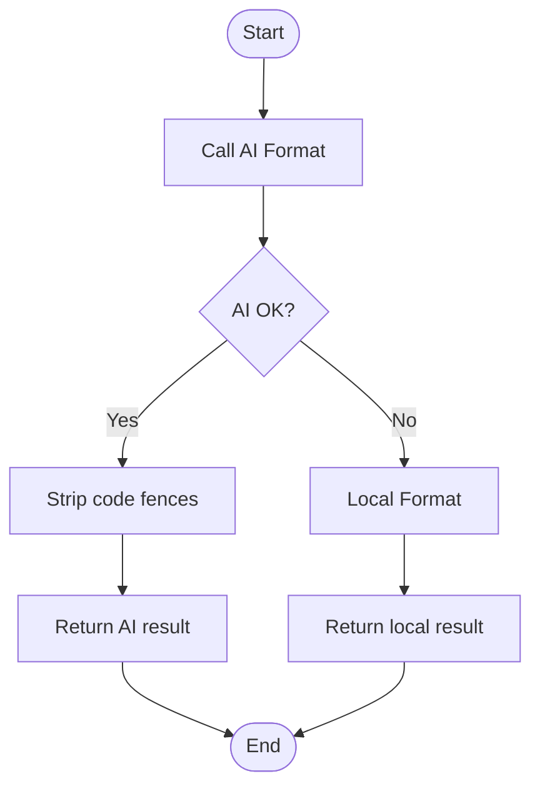
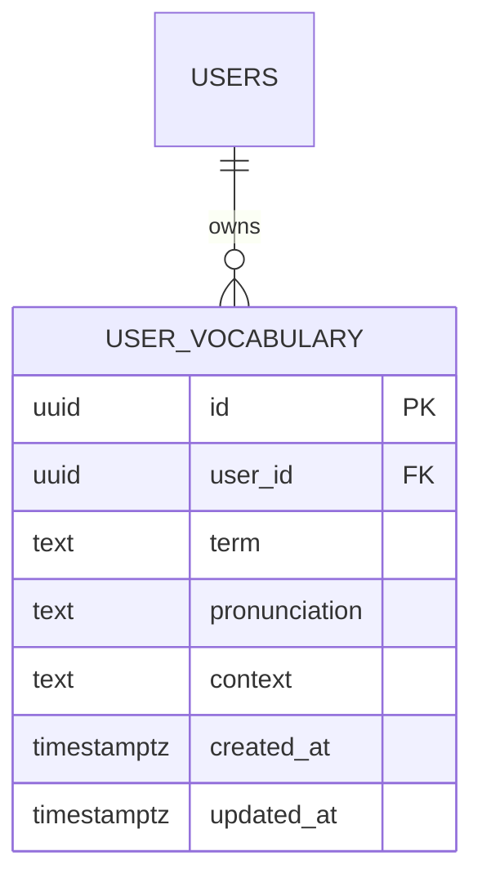
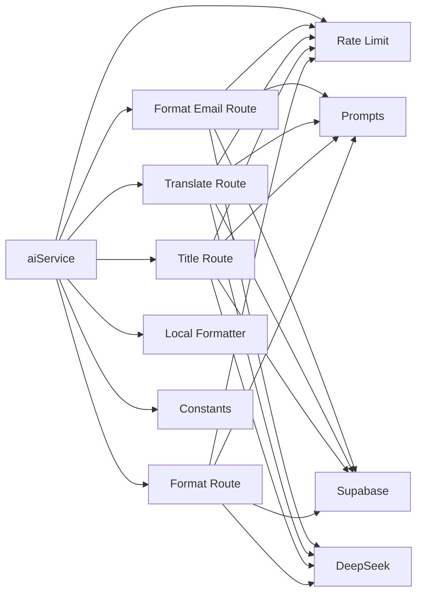

# AI Text Processing Engine

<cite>
**Referenced Files in This Document**
- [route.ts](file://app/api/deepseek/format/route.ts)
- [route.ts](file://app/api/deepseek/title/route.ts)
- [route.ts](file://app/api/deepseek/translate/route.ts)
- [route.ts](file://app/api/deepseek/format-email/route.ts)
- [prompts.ts](file://lib/prompts.ts)
- [constants.ts](file://lib/constants.ts)
- [rate-limit.ts](file://lib/middleware/rate-limit.ts)
- [ai.service.ts](file://lib/services/ai.service.ts)
- [localFormatter.service.ts](file://lib/services/localFormatter.service.ts)
- [useAIFormatting.ts](file://lib/hooks/useAIFormatting.ts)
- [note.types.ts](file://lib/types/note.types.ts)
- [api.types.ts](file://lib/types/api.types.ts)
- [vocabulary.types.ts](file://lib/types/vocabulary.types.ts)
- [vocabulary.service.ts](file://lib/services/vocabulary.service.ts)
- [supabase-migration-vocabulary.sql](file://supabase-migration-vocabulary.sql)
</cite>

## Table of Contents
1. [Introduction](#introduction)
2. [Project Structure](#project-structure)
3. [Core Components](#core-components)
4. [Architecture Overview](#architecture-overview)
5. [Detailed Component Analysis](#detailed-component-analysis)
6. [Dependency Analysis](#dependency-analysis)
7. [Performance Considerations](#performance-considerations)
8. [Troubleshooting Guide](#troubleshooting-guide)
9. [Conclusion](#conclusion)
10. [Appendices](#appendices)

## Introduction
This document describes the AI text processing engine that integrates with the DeepSeek API to provide three primary capabilities:
- Text formatting: Converting raw transcripts into clean, readable English.
- Title generation: Creating concise, descriptive titles for notes.
- Translation: Translating text into English or Hindi.

It also documents the fallback mechanisms using a local formatter, prompt engineering strategies, custom vocabulary integration, and robust security measures against prompt injection. The guide includes detailed API documentation, request/response schemas, authentication requirements, error handling, and practical troubleshooting and performance tuning advice.

## Project Structure
The AI engine is organized around Next.js API routes that proxy requests to the DeepSeek Chat Completions endpoint. Supporting libraries implement prompt engineering, rate limiting, and local fallback formatting. A vocabulary service enables users to supply custom terms for improved recognition during formatting.

**Diagram sources**
- [route.ts](file://app/api/deepseek/format/route.ts#L1-L181)
- [route.ts](file://app/api/deepseek/title/route.ts#L1-L165)
- [route.ts](file://app/api/deepseek/translate/route.ts#L1-L171)
- [route.ts](file://app/api/deepseek/format-email/route.ts#L1-L167)
- [prompts.ts](file://lib/prompts.ts#L1-L458)
- [constants.ts](file://lib/constants.ts#L75-L98)
- [rate-limit.ts](file://lib/middleware/rate-limit.ts#L1-L264)
- [ai.service.ts](file://lib/services/ai.service.ts#L1-L479)
- [localFormatter.service.ts](file://lib/services/localFormatter.service.ts#L1-L166)
- [vocabulary.service.ts](file://lib/services/vocabulary.service.ts#L1-L94)

**Section sources**
- [route.ts](file://app/api/deepseek/format/route.ts#L1-L181)
- [route.ts](file://app/api/deepseek/title/route.ts#L1-L165)
- [route.ts](file://app/api/deepseek/translate/route.ts#L1-L171)
- [route.ts](file://app/api/deepseek/format-email/route.ts#L1-L167)
- [prompts.ts](file://lib/prompts.ts#L1-L458)
- [constants.ts](file://lib/constants.ts#L75-L98)
- [rate-limit.ts](file://lib/middleware/rate-limit.ts#L1-L264)
- [ai.service.ts](file://lib/services/ai.service.ts#L1-L479)
- [localFormatter.service.ts](file://lib/services/localFormatter.service.ts#L1-L166)
- [vocabulary.service.ts](file://lib/services/vocabulary.service.ts#L1-L94)

## Core Components
- DeepSeek API Routes: Implement POST endpoints for format, title, translate, and format-email operations. They enforce authentication, rate limits, input validation, and securely wrap user content before sending requests to DeepSeek.
- Prompts and Security: Provide system/user prompts, input sanitization, prompt injection detection, and safe wrapping of user content.
- AI Service: Orchestrates API calls, retries with exponential backoff, cancellation support, and graceful fallback to local formatting when AI fails.
- Local Formatter: Provides conservative, rule-based text cleanup as a fallback when AI is unavailable or fails.
- Rate Limiting: Enforces per-user, per-endpoint limits with in-memory storage and automatic cleanup.
- Vocabulary Service: Manages user-defined custom vocabulary for improved recognition during formatting.

**Section sources**
- [route.ts](file://app/api/deepseek/format/route.ts#L39-L181)
- [route.ts](file://app/api/deepseek/title/route.ts#L39-L165)
- [route.ts](file://app/api/deepseek/translate/route.ts#L41-L171)
- [route.ts](file://app/api/deepseek/format-email/route.ts#L36-L167)
- [prompts.ts](file://lib/prompts.ts#L10-L85)
- [ai.service.ts](file://lib/services/ai.service.ts#L126-L479)
- [localFormatter.service.ts](file://lib/services/localFormatter.service.ts#L9-L166)
- [rate-limit.ts](file://lib/middleware/rate-limit.ts#L83-L192)
- [vocabulary.service.ts](file://lib/services/vocabulary.service.ts#L16-L94)

## Architecture Overview
The engine follows a layered architecture:
- Presentation Layer: React components and hooks trigger processing.
- Service Layer: aiService coordinates requests, retries, and fallbacks.
- API Gateway Layer: Next.js routes validate inputs, enforce rate limits, and forward to DeepSeek.
- External Integrations: DeepSeek Chat Completions and Supabase for authentication and vocabulary.

**Diagram sources**
- [useAIFormatting.ts](file://lib/hooks/useAIFormatting.ts#L23-L77)
- [ai.service.ts](file://lib/services/ai.service.ts#L134-L224)
- [route.ts](file://app/api/deepseek/format/route.ts#L39-L181)
- [prompts.ts](file://lib/prompts.ts#L93-L96)
- [rate-limit.ts](file://lib/middleware/rate-limit.ts#L176-L192)

## Detailed Component Analysis

### DeepSeek API Endpoints

#### Format Endpoint
- Purpose: Convert raw transcripts into clean, formatted English.
- Authentication: Requires logged-in user; route checks Supabase auth.
- Rate Limiting: Enforced per user per minute.
- Input Validation: Rejects empty rawText and validates for prompt injection.
- Security: Wraps user input in explicit delimiters and sanitizes.
- Request Body Schema:
  - rawText: string (required)
- Response Schema:
  - formattedText: string
- Error Responses:
  - 400: Invalid JSON, missing rawText, validation failure.
  - 401: Unauthorized.
  - 429: Rate limit exceeded.
  - 500: Server missing API key or request failed.
  - 502: Invalid DeepSeek response.
- Notes:
  - Fetches user vocabulary and augments the system prompt if available.
  - Applies a timeout to prevent hanging requests.

**Section sources**
- [route.ts](file://app/api/deepseek/format/route.ts#L39-L181)
- [prompts.ts](file://lib/prompts.ts#L304-L336)
- [constants.ts](file://lib/constants.ts#L75-L98)
- [constants.ts](file://lib/constants.ts#L46-L50)
- [constants.ts](file://lib/constants.ts#L41-L42)
- [constants.ts](file://lib/constants.ts#L44-L45)
- [rate-limit.ts](file://lib/middleware/rate-limit.ts#L176-L192)

#### Title Endpoint
- Purpose: Generate a concise title for a note.
- Authentication: Requires logged-in user.
- Rate Limiting: Separate bucket from formatting.
- Input Validation: Rejects empty text and checks for injection.
- Security: Wraps user content and strips markdown fences from output.
- Request Body Schema:
  - text: string (required)
- Response Schema:
  - title: string
- Error Responses:
  - 400: Invalid JSON, missing text, validation failure.
  - 401: Unauthorized.
  - 429: Rate limit exceeded.
  - 500: Server missing API key or request failed.
  - 502: Invalid DeepSeek response.
- Fallback: On API failure, generates a heuristic title from the first sentence.

**Section sources**
- [route.ts](file://app/api/deepseek/title/route.ts#L39-L165)
- [ai.service.ts](file://lib/services/ai.service.ts#L372-L433)
- [constants.ts](file://lib/constants.ts#L75-L98)
- [constants.ts](file://lib/constants.ts#L79-L82)
- [constants.ts](file://lib/constants.ts#L139-L152)

#### Translate Endpoint
- Purpose: Translate text into English or Hindi.
- Authentication: Requires logged-in user.
- Rate Limiting: Separate bucket for translations.
- Input Validation: Rejects empty text and enforces targetLanguage enum.
- Security: Wraps user content and sanitizes.
- Request Body Schema:
  - text: string (required)
  - targetLanguage: "en" | "hi" (default "en")
- Response Schema:
  - translatedText: string
- Error Responses:
  - 400: Invalid JSON, missing text, invalid targetLanguage.
  - 401: Unauthorized.
  - 429: Rate limit exceeded.
  - 500: Server missing API key or request failed.
  - 502: Empty response from translation.
- Notes:
  - Uses a dedicated system prompt emphasizing exact meaning preservation.

**Section sources**
- [route.ts](file://app/api/deepseek/translate/route.ts#L41-L171)
- [constants.ts](file://lib/constants.ts#L75-L98)
- [constants.ts](file://lib/constants.ts#L79-L94)
- [constants.ts](file://lib/constants.ts#L89-L94)

#### Format Email Endpoint
- Purpose: Convert a note into a Gmail-ready formal email body.
- Authentication: Requires logged-in user.
- Rate Limiting: Separate bucket for email formatting.
- Input Validation: Rejects empty rawText; sanitizes title.
- Security: Wraps user content and strips markdown fences from output.
- Request Body Schema:
  - rawText: string (required)
  - title: string (optional)
- Response Schema:
  - formattedText: string
- Error Responses:
  - 400: Invalid JSON, missing rawText.
  - 401: Unauthorized.
  - 429: Rate limit exceeded.
  - 500: Server missing API key or request failed.
  - 502: Invalid DeepSeek response.
- Notes:
  - Uses a specialized system prompt for email formatting.

**Section sources**
- [route.ts](file://app/api/deepseek/format-email/route.ts#L36-L167)
- [prompts.ts](file://lib/prompts.ts#L259-L284)
- [constants.ts](file://lib/constants.ts#L75-L98)
- [constants.ts](file://lib/constants.ts#L74-L80)

### Prompt Engineering Strategies
- System Prompts: Each operation defines a strict role and narrow scope to minimize off-task behavior.
- Injection Prevention:
  - validateUserInput detects suspicious patterns.
  - sanitizeUserInput removes dangerous constructs.
  - wrapUserInput places user content inside explicit XML delimiters.
- Custom Vocabulary: The formatting prompt is dynamically extended with user-provided terms, pronunciation hints, and context to improve recognition accuracy.
- Prompt Optimization Guide: The prompts module includes a structured feedback-driven refinement process to iteratively improve prompts based on user feedback.

**Section sources**
- [prompts.ts](file://lib/prompts.ts#L34-L85)
- [prompts.ts](file://lib/prompts.ts#L10-L27)
- [prompts.ts](file://lib/prompts.ts#L93-L96)
- [prompts.ts](file://lib/prompts.ts#L304-L336)
- [prompts.ts](file://lib/prompts.ts#L339-L457)

### Text Formatting Algorithms
- Local Fallback:
  - Removes filler words.
  - Normalizes whitespace.
  - Fixes capitalization.
  - Adds missing punctuation heuristically.
  - Adds paragraph breaks for readability.
- AI Formatting:
  - Sends wrapped user content with a strict system prompt.
  - Strips markdown fences from output.
  - Falls back to local formatter on failure.

**Diagram sources**
- [ai.service.ts](file://lib/services/ai.service.ts#L134-L224)
- [localFormatter.service.ts](file://lib/services/localFormatter.service.ts#L15-L38)

**Section sources**
- [localFormatter.service.ts](file://lib/services/localFormatter.service.ts#L9-L166)
- [ai.service.ts](file://lib/services/ai.service.ts#L126-L224)

### Title Generation
- AI-based: Sends content with a title-generation system prompt; strips markdown fences.
- Fallback: Extracts the first sentence or truncates the text to a max length.

**Section sources**
- [route.ts](file://app/api/deepseek/title/route.ts#L102-L153)
- [ai.service.ts](file://lib/services/ai.service.ts#L372-L433)
- [constants.ts](file://lib/constants.ts#L93-L97)

### Translation Services
- Supports English and Hindi targets.
- Preserves meaning, names, and formatting; avoids answering questions in translated text.

**Section sources**
- [route.ts](file://app/api/deepseek/translate/route.ts#L115-L159)
- [prompts.ts](file://lib/prompts.ts#L236-L253)

### Custom Vocabulary Integration
- Users can add terms with optional pronunciation and context.
- The system prompt is augmented with these terms to improve recognition during formatting.
- Database schema and policies ensure user isolation and data integrity.

**Diagram sources**
- [supabase-migration-vocabulary.sql](file://supabase-migration-vocabulary.sql#L4-L18)
- [vocabulary.types.ts](file://lib/types/vocabulary.types.ts#L8-L16)

**Section sources**
- [prompts.ts](file://lib/prompts.ts#L304-L336)
- [vocabulary.service.ts](file://lib/services/vocabulary.service.ts#L16-L94)
- [supabase-migration-vocabulary.sql](file://supabase-migration-vocabulary.sql#L1-L38)

### API Documentation Summary
- Base URL: https://api.deepseek.com/v1/chat/completions
- Model: deepseek-chat
- Headers:
  - Content-Type: application/json
  - Authorization: Bearer DEEPSEEK_API_KEY
- Endpoints:
  - POST /api/deepseek/format
  - POST /api/deepseek/title
  - POST /api/deepseek/translate
  - POST /api/deepseek/format-email
- Common Request Fields:
  - rawText: string (format, format-email)
  - text: string (title, translate)
  - targetLanguage: "en" | "hi" (translate)
  - title: string (format-email)
- Common Response Fields:
  - formattedText: string
  - title: string
  - translatedText: string
- Error Responses:
  - 400: Invalid JSON, validation errors, missing fields.
  - 401: Unauthorized.
  - 429: Rate limit exceeded.
  - 500: Server-side issues (missing API key, request failed).
  - 502: Invalid response from DeepSeek.

**Section sources**
- [constants.ts](file://lib/constants.ts#L83-L86)
- [constants.ts](file://lib/constants.ts#L75-L98)
- [route.ts](file://app/api/deepseek/format/route.ts#L120-L144)
- [route.ts](file://app/api/deepseek/title/route.ts#L109-L124)
- [route.ts](file://app/api/deepseek/translate/route.ts#L121-L134)
- [route.ts](file://app/api/deepseek/format-email/route.ts#L108-L125)

## Dependency Analysis
The system exhibits clear separation of concerns:
- API routes depend on prompts, constants, rate-limiting, and Supabase for auth/vocabulary.
- aiService depends on constants, rate-limiting, and local formatter for fallback.
- Prompts encapsulate security logic and prompt templates.
- Vocabulary service depends on Supabase for persistence.

**Diagram sources**
- [route.ts](file://app/api/deepseek/format/route.ts#L1-L181)
- [route.ts](file://app/api/deepseek/title/route.ts#L1-L165)
- [route.ts](file://app/api/deepseek/translate/route.ts#L1-L171)
- [route.ts](file://app/api/deepseek/format-email/route.ts#L1-L167)
- [ai.service.ts](file://lib/services/ai.service.ts#L1-L479)
- [localFormatter.service.ts](file://lib/services/localFormatter.service.ts#L1-L166)
- [prompts.ts](file://lib/prompts.ts#L1-L458)
- [rate-limit.ts](file://lib/middleware/rate-limit.ts#L1-L264)
- [constants.ts](file://lib/constants.ts#L1-L314)

**Section sources**
- [ai.service.ts](file://lib/services/ai.service.ts#L126-L479)
- [rate-limit.ts](file://lib/middleware/rate-limit.ts#L83-L192)
- [prompts.ts](file://lib/prompts.ts#L10-L85)

## Performance Considerations
- Timeout Management: All external requests use timeouts to avoid hanging.
- Retries with Backoff: aiService retries transient failures with exponential backoff.
- Cancellation: AbortController support allows cancelling long-running operations.
- Rate Limits: Prevent excessive usage and protect costs.
- Token Budgets: Configured max_tokens help manage latency and cost.
- Fallback Strategy: Local formatting ensures minimal downtime when AI is slow or down.

[No sources needed since this section provides general guidance]

## Troubleshooting Guide
Common issues and resolutions:
- Unauthorized Access
  - Symptom: 401 responses from endpoints.
  - Cause: User not authenticated.
  - Resolution: Ensure user session is active before calling endpoints.
- Rate Limit Exceeded
  - Symptom: 429 responses with Retry-After and X-RateLimit-* headers.
  - Cause: Too many requests within the time window.
  - Resolution: Respect rate limits; consider batching or reducing frequency.
- Missing API Key
  - Symptom: 500 responses indicating missing DEEPSEEK_API_KEY.
  - Cause: Environment variable not set.
  - Resolution: Set DEEPSEEK_API_KEY in environment.
- Invalid JSON or Missing Fields
  - Symptom: 400 responses for malformed requests.
  - Cause: Incorrect payload structure or missing required fields.
  - Resolution: Validate request bodies against documented schemas.
- Empty or Malformed AI Responses
  - Symptom: 502 responses indicating invalid DeepSeek response.
  - Cause: Unexpected API output.
  - Resolution: Retry with backoff; confirm endpoint/model configuration.
- Prompt Injection Detected
  - Symptom: 400 responses with validation warnings.
  - Cause: Suspicious input patterns.
  - Resolution: Avoid injecting instructions or system prompts; rely on provided roles.
- Translation Target Language Error
  - Symptom: 400 responses for unsupported targetLanguage.
  - Cause: Value not "en" or "hi".
  - Resolution: Use allowed values only.

**Section sources**
- [route.ts](file://app/api/deepseek/format/route.ts#L46-L48)
- [rate-limit.ts](file://lib/middleware/rate-limit.ts#L143-L166)
- [constants.ts](file://lib/constants.ts#L45-L50)
- [constants.ts](file://lib/constants.ts#L41-L42)
- [prompts.ts](file://lib/prompts.ts#L34-L85)
- [route.ts](file://app/api/deepseek/translate/route.ts#L89-L94)

## Conclusion
The AI text processing engine provides a secure, resilient, and user-centric solution for formatting, titling, and translating text using DeepSeek. Robust input validation, prompt engineering, and rate limiting ensure safety and cost control. The local fallback guarantees usability even under AI outages. Custom vocabulary integration further improves quality. The documented APIs, schemas, and troubleshooting guidance facilitate reliable integration and maintenance.

[No sources needed since this section summarizes without analyzing specific files]

## Appendices

### Request/Response Schemas

- Format
  - Request: { rawText: string }
  - Response: { formattedText: string }
- Title
  - Request: { text: string }
  - Response: { title: string }
- Translate
  - Request: { text: string, targetLanguage: "en" | "hi" }
  - Response: { translatedText: string }
- Format Email
  - Request: { rawText: string, title?: string }
  - Response: { formattedText: string }

**Section sources**
- [api.types.ts](file://lib/types/api.types.ts#L3-L23)
- [route.ts](file://app/api/deepseek/format/route.ts#L84-L101)
- [route.ts](file://app/api/deepseek/title/route.ts#L67-L83)
- [route.ts](file://app/api/deepseek/translate/route.ts#L69-L94)
- [route.ts](file://app/api/deepseek/format-email/route.ts#L64-L82)

### Security Considerations
- Prompt Injection Prevention: validateUserInput, sanitizeUserInput, and wrapUserInput.
- Delimited Inputs: Explicit XML-style delimiters for user content.
- Role-Based Constraints: System prompts define strict roles to reduce misuse.
- Authentication: All endpoints require a valid user session.

**Section sources**
- [prompts.ts](file://lib/prompts.ts#L34-L96)
- [route.ts](file://app/api/deepseek/format/route.ts#L103-L118)
- [route.ts](file://app/api/deepseek/title/route.ts#L85-L100)
- [route.ts](file://app/api/deepseek/translate/route.ts#L96-L113)

### Rate Limiting Reference
- AI Format: 20 requests/minute per user.
- AI Title: 30 requests/minute per user.
- AI Format Email: 15 requests/minute per user.
- AI Translate: 15 requests/minute per user.
- Payment Create Subscription: 5 attempts/15 minutes.
- Payment Webhook: 100 per minute per source.

**Section sources**
- [constants.ts](file://lib/constants.ts#L276-L313)

### Cost Optimization Strategies
- Use lower temperatures and top-p values for deterministic, shorter outputs where appropriate.
- Reduce max_tokens for shorter tasks (e.g., titles).
- Batch requests when feasible.
- Monitor rate limits to avoid throttling penalties.
- Prefer local fallback for non-critical operations to reduce API calls.

[No sources needed since this section provides general guidance]