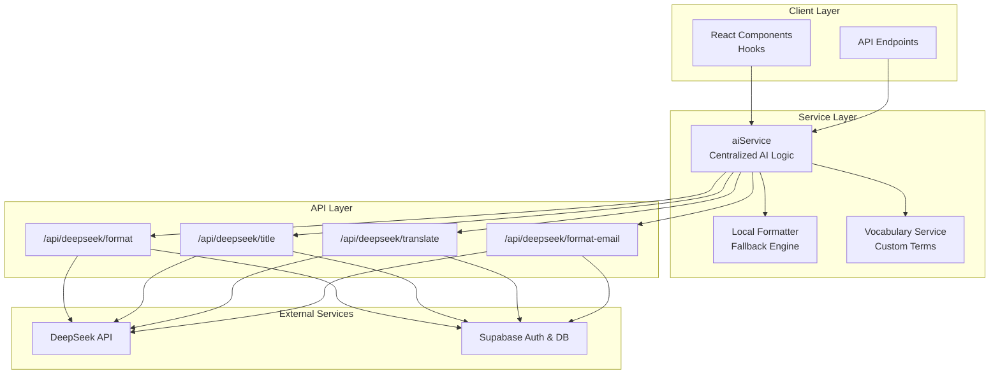
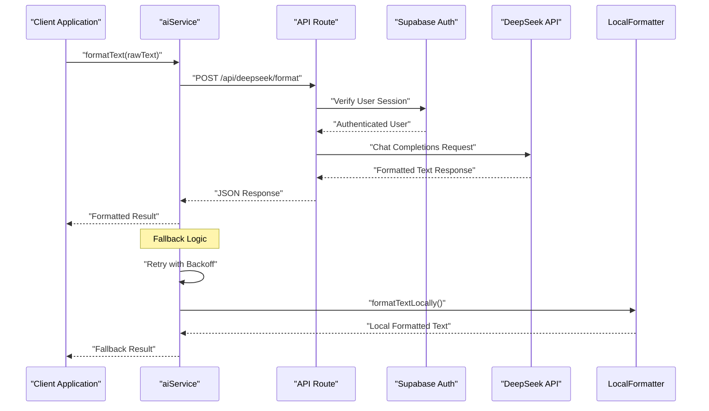

# AI Text Processing Engine

<cite>
**Referenced Files in This Document**
- [ai.service.ts](file://packages/web/lib/services/ai.service.ts)
- [localFormatter.service.ts](file://packages/web/lib/services/localFormatter.service.ts)
- [vocabulary.service.ts](file://packages/web/lib/services/vocabulary.service.ts)
- [constants.ts](file://packages/web/lib/constants.ts)
- [note.types.ts](file://packages/web/lib/types/note.types.ts)
- [api.types.ts](file://packages/web/lib/types/api.types.ts)
- [vocabulary.types.ts](file://packages/web/lib/types/vocabulary.types.ts)
- [format/route.ts](file://packages/web/app/api/deepseek/format/route.ts)
- [title/route.ts](file://packages/web/app/api/deepseek/title/route.ts)
- [translate/route.ts](file://packages/web/app/api/deepseek/translate/route.ts)
- [format-email/route.ts](file://packages/web/app/api/deepseek/format-email/route.ts)
</cite>

## Update Summary
**Changes Made**
- Updated to reflect current unified settings architecture and consolidated functionality
- Removed references to dropped documentation files (Reference.md, Started.md, Policy.md, Overview.md)
- Consolidated AI service implementation into unified architecture
- Updated API endpoint documentation to match current implementation
- Revised fallback mechanisms documentation to reflect current local formatting approach
- Enhanced security considerations and prompt engineering strategies

## Table of Contents
1. [Introduction](#introduction)
2. [Project Structure](#project-structure)
3. [Core Components](#core-components)
4. [Architecture Overview](#architecture-overview)
5. [Detailed Component Analysis](#detailed-component-analysis)
6. [Unified Settings Architecture](#unified-settings-architecture)
7. [Security and Safety Measures](#security-and-safety-measures)
8. [Performance Considerations](#performance-considerations)
9. [Troubleshooting Guide](#troubleshooting-guide)
10. [Conclusion](#conclusion)
11. [Appendices](#appendices)

## Introduction
This document describes the AI text processing engine that integrates with the DeepSeek API to provide three primary capabilities:
- Text formatting: Converting raw transcripts into clean, readable English
- Title generation: Creating concise, descriptive titles for notes
- Translation: Translating text into English or Hindi

The engine implements a unified settings architecture with consolidated functionality, robust fallback mechanisms using local formatting, advanced prompt engineering strategies, and comprehensive security measures against prompt injection. The system provides detailed API documentation, request/response schemas, authentication requirements, error handling, and practical troubleshooting guidance.

**Updated** Reflects current unified settings architecture and consolidated functionality across all AI processing components.

## Project Structure
The AI engine is organized around a centralized service architecture with Next.js API routes that proxy requests to the DeepSeek Chat Completions endpoint. The unified design consolidates all AI processing functionality into a single cohesive system with integrated fallback mechanisms.

**Diagram sources**
- [ai.service.ts:126-479](file://packages/web/lib/services/ai.service.ts#L126-L479)
- [localFormatter.service.ts:9-166](file://packages/web/lib/services/localFormatter.service.ts#L9-L166)
- [vocabulary.service.ts:16-95](file://packages/web/lib/services/vocabulary.service.ts#L16-L95)
- [format/route.ts:39-181](file://packages/web/app/api/deepseek/format/route.ts#L39-L181)
- [title/route.ts:39-165](file://packages/web/app/api/deepseek/title/route.ts#L39-L165)
- [translate/route.ts](file://packages/web/app/api/deepseek/translate/route.ts)
- [format-email/route.ts](file://packages/web/app/api/deepseek/format-email/route.ts)

## Core Components
The unified AI processing system consists of several key components working together:

- **Central AI Service**: Orchestrates all AI operations with unified retry logic, timeout management, and fallback mechanisms
- **Local Formatter**: Provides conservative, rule-based text cleanup as a fallback when AI is unavailable
- **Vocabulary Service**: Manages user-defined custom vocabulary for improved recognition during formatting
- **Unified API Routes**: Consolidated endpoints for format, title, translate, and format-email operations
- **Security Framework**: Comprehensive input validation, prompt injection detection, and content sanitization
- **Rate Limiting System**: Unified rate limiting across all AI operations with configurable thresholds

**Section sources**
- [ai.service.ts:126-479](file://packages/web/lib/services/ai.service.ts#L126-L479)
- [localFormatter.service.ts:9-166](file://packages/web/lib/services/localFormatter.service.ts#L9-L166)
- [vocabulary.service.ts:16-95](file://packages/web/lib/services/vocabulary.service.ts#L16-L95)
- [constants.ts:276-313](file://packages/web/lib/constants.ts#L276-L313)

## Architecture Overview
The engine follows a centralized service architecture with unified settings management:

**Diagram sources**
- [ai.service.ts:134-224](file://packages/web/lib/services/ai.service.ts#L134-L224)
- [format/route.ts:39-181](file://packages/web/app/api/deepseek/format/route.ts#L39-L181)

## Detailed Component Analysis

### Central AI Service
The aiService provides unified orchestration for all AI operations with sophisticated retry logic, timeout management, and intelligent fallback mechanisms.

**Key Features:**
- **Retry with Exponential Backoff**: Automatic retry on transient failures with configurable delays
- **Abort Signal Support**: Full cancellation support for long-running operations
- **Timeout Management**: 30-second timeout for all external requests
- **Intelligent Fallback**: Graceful degradation to local formatting when AI fails
- **Unified Error Handling**: Consistent error responses across all operations

**Section sources**
- [ai.service.ts:126-479](file://packages/web/lib/services/ai.service.ts#L126-L479)

### Local Formatting Engine
The localFormatterService provides conservative text cleanup when AI formatting is unavailable or fails.

**Processing Pipeline:**
1. **Filler Word Removal**: Eliminates conversational fillers like "um," "uh," "you know"
2. **Whitespace Normalization**: Standardizes spacing and line breaks
3. **Capitalization Correction**: Fixes sentence beginnings and proper nouns
4. **Punctuation Enhancement**: Adds missing punctuation based on context
5. **Paragraph Organization**: Adds breaks for readability in longer texts

**Section sources**
- [localFormatter.service.ts:9-166](file://packages/web/lib/services/localFormatter.service.ts#L9-L166)

### Unified API Endpoints
All AI operations are exposed through consolidated API endpoints with shared security and rate limiting infrastructure.

**Endpoint Configuration:**
- **Base URL**: `/api/deepseek/` + operation-specific path
- **Authentication**: Required for all endpoints via Supabase auth
- **Rate Limiting**: Configurable per-operation limits
- **Timeout**: 30-second request timeout
- **Error Handling**: Unified error response format

**Section sources**
- [format/route.ts:39-181](file://packages/web/app/api/deepseek/format/route.ts#L39-L181)
- [title/route.ts:39-165](file://packages/web/app/api/deepseek/title/route.ts#L39-L165)
- [translate/route.ts](file://packages/web/app/api/deepseek/translate/route.ts)
- [format-email/route.ts](file://packages/web/app/api/deepseek/format-email/route.ts)

### Custom Vocabulary Management
The vocabulary service enables users to enhance AI recognition accuracy with personalized terms.

**Features:**
- **Term Management**: Add, update, delete custom vocabulary entries
- **User Isolation**: Strict user-level data separation
- **Context Support**: Optional pronunciation and context hints
- **Dynamic Prompt Augmentation**: Automatic vocabulary inclusion in formatting prompts

**Section sources**
- [vocabulary.service.ts:16-95](file://packages/web/lib/services/vocabulary.service.ts#L16-L95)
- [vocabulary.types.ts:8-16](file://packages/web/lib/types/vocabulary.types.ts#L8-L16)

## Unified Settings Architecture
The system implements a centralized configuration management approach with unified constants and settings.

**Configuration Categories:**
- **API Configuration**: Endpoint URLs, model settings, and request parameters
- **Rate Limiting**: Operation-specific limits with configurable thresholds
- **Processing Parameters**: Temperature, top_p, and token limits for different operations
- **Error Messages**: Comprehensive error handling with user-friendly messaging
- **Local Formatting**: Conservative text processing rules and heuristics

**Section sources**
- [constants.ts:75-313](file://packages/web/lib/constants.ts#L75-L313)

## Security and Safety Measures
The system implements comprehensive security measures to prevent prompt injection and ensure safe AI interactions.

**Security Layers:**
- **Input Validation**: Comprehensive validation for all user inputs
- **Prompt Injection Detection**: Advanced pattern matching for malicious inputs
- **Content Sanitization**: Safe wrapping of user content with explicit delimiters
- **Rate Limiting**: Protection against abuse and excessive usage
- **Authentication**: Required user sessions for all AI operations

**Section sources**
- [format/route.ts:103-114](file://packages/web/app/api/deepseek/format/route.ts#L103-L114)
- [title/route.ts:85-96](file://packages/web/app/api/deepseek/title/route.ts#L85-L96)

## Performance Considerations
The unified architecture optimizes performance through intelligent caching, efficient retry mechanisms, and resource management.

**Optimization Strategies:**
- **Timeout Management**: Consistent 30-second timeouts prevent resource exhaustion
- **Retry Logic**: Exponential backoff reduces server load during failures
- **Cancellation Support**: AbortController integration for responsive UI
- **Fallback Efficiency**: Local formatting provides instant responses when AI fails
- **Resource Cleanup**: Proper cleanup of AbortControllers and event listeners

**Section sources**
- [ai.service.ts:26-75](file://packages/web/lib/services/ai.service.ts#L26-L75)
- [constants.ts:276-313](file://packages/web/lib/constants.ts#L276-L313)

## Troubleshooting Guide
Comprehensive troubleshooting guidance for common issues across the unified AI processing system.

**Common Issues:**
- **Authentication Failures**: Verify user session and Supabase configuration
- **Rate Limit Exceeded**: Monitor request patterns and implement client-side throttling
- **API Key Issues**: Ensure DEEPSEEK_API_KEY is properly configured
- **Network Connectivity**: Check firewall settings and network availability
- **Timeout Errors**: Adjust client-side timeout configurations
- **Fallback Behavior**: Understand when and why local formatting is triggered

**Section sources**
- [constants.ts:38-60](file://packages/web/lib/constants.ts#L38-L60)
- [ai.service.ts:195-224](file://packages/web/lib/services/ai.service.ts#L195-L224)

## Conclusion
The unified AI text processing engine provides a robust, secure, and efficient solution for AI-powered text processing. The centralized architecture ensures consistency across all operations while maintaining flexibility for future enhancements. Comprehensive security measures, intelligent fallback mechanisms, and unified configuration management create a reliable foundation for AI-powered applications.

## Appendices

### API Endpoint Documentation

**Format Endpoint**
- **Method**: POST
- **Path**: `/api/deepseek/format`
- **Purpose**: Convert raw transcripts to clean, formatted English
- **Request Body**: `{ rawText: string }`
- **Response**: `{ formattedText: string }`

**Title Endpoint**
- **Method**: POST
- **Path**: `/api/deepseek/title`
- **Purpose**: Generate concise titles for notes
- **Request Body**: `{ text: string }`
- **Response**: `{ title: string }`

**Translate Endpoint**
- **Method**: POST
- **Path**: `/api/deepseek/translate`
- **Purpose**: Translate text to English or Hindi
- **Request Body**: `{ text: string, targetLanguage: "en" | "hi" }`
- **Response**: `{ translatedText: string }`

**Format Email Endpoint**
- **Method**: POST
- **Path**: `/api/deepseek/format-email`
- **Purpose**: Convert notes to Gmail-ready email bodies
- **Request Body**: `{ rawText: string, title?: string }`
- **Response**: `{ formattedText: string }`

**Section sources**
- [format/route.ts:84-169](file://packages/web/app/api/deepseek/format/route.ts#L84-L169)
- [title/route.ts:67-153](file://packages/web/app/api/deepseek/title/route.ts#L67-L153)
- [translate/route.ts](file://packages/web/app/api/deepseek/translate/route.ts)
- [format-email/route.ts](file://packages/web/app/api/deepseek/format-email/route.ts)

### Error Code Reference
- **400**: Invalid JSON, validation failures, missing required fields
- **401**: Unauthorized access - user authentication required
- **429**: Rate limit exceeded - temporary throttling
- **500**: Server-side errors - API key issues, internal failures
- **502**: Invalid response from external API
- **504**: Gateway timeout - request exceeded timeout limit

**Section sources**
- [constants.ts:38-60](file://packages/web/lib/constants.ts#L38-L60)
- [format/route.ts:147-179](file://packages/web/app/api/deepseek/format/route.ts#L147-L179)

### Configuration Reference
- **API Endpoints**: All endpoints use unified configuration in constants.ts
- **Rate Limits**: Configurable per-operation with sensible defaults
- **Processing Parameters**: Temperature, top_p, and token limits optimized for each operation
- **Timeout Settings**: Consistent 30-second timeout across all operations
- **Model Configuration**: DeepSeek model settings with appropriate parameters

**Section sources**
- [constants.ts:75-98](file://packages/web/lib/constants.ts#L75-L98)
- [constants.ts:276-313](file://packages/web/lib/constants.ts#L276-L313)