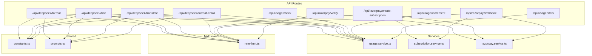
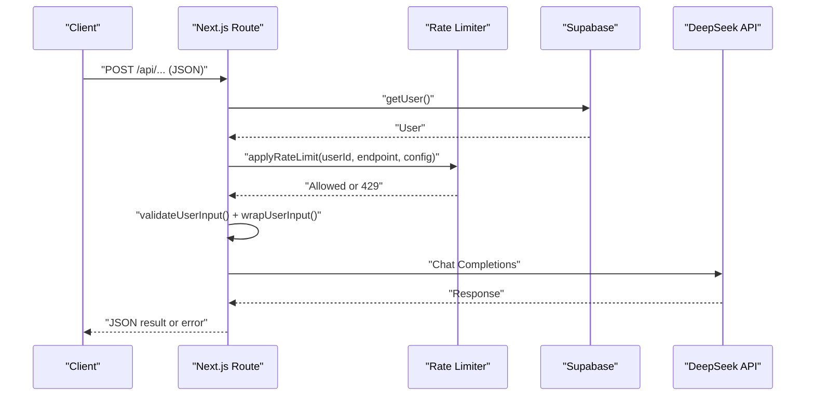
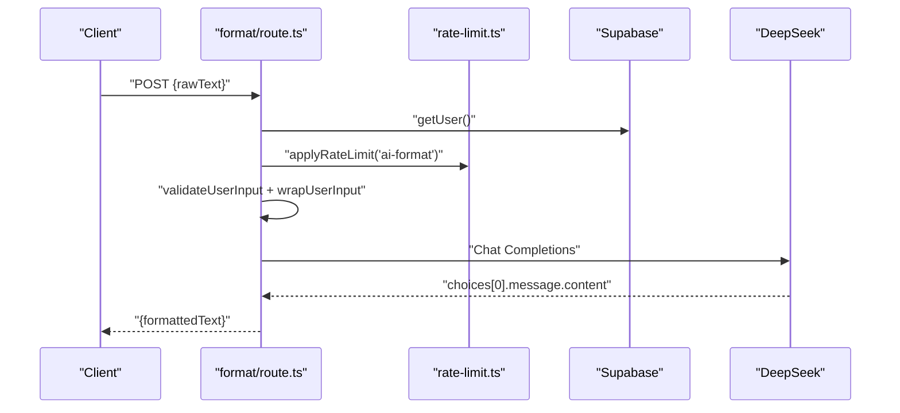
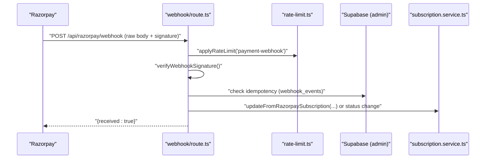
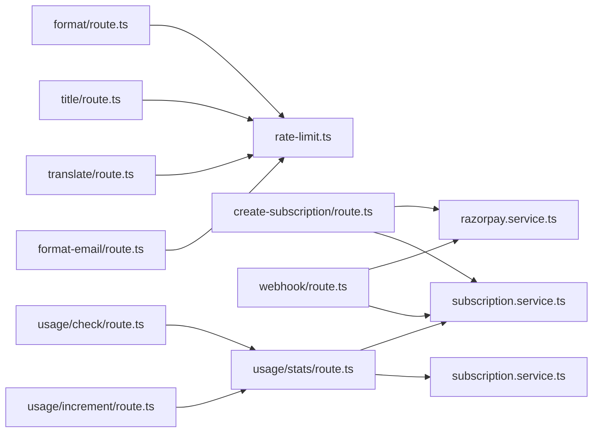

# API Reference

<cite>
**Referenced Files in This Document**
- [format/route.ts](file://packages/web/app/api/deepseek/format/route.ts)
- [title/route.ts](file://packages/web/app/api/deepseek/title/route.ts)
- [translate/route.ts](file://packages/web/app/api/deepseek/translate/route.ts)
- [format-email/route.ts](file://packages/web/app/api/deepseek/format-email/route.ts)
- [create-subscription/route.ts](file://packages/web/app/api/razorpay/create-subscription/route.ts)
- [webhook/route.ts](file://packages/web/app/api/razorpay/webhook/route.ts)
- [check/route.ts](file://packages/web/app/api/usage/check/route.ts)
- [increment/route.ts](file://packages/web/app/api/usage/increment/route.ts)
- [stats/route.ts](file://packages/web/app/api/usage/stats/route.ts)
- [constants.ts](file://packages/web/lib/constants.ts)
- [prompts.ts](file://packages/web/lib/prompts.ts)
- [rate-limit.ts](file://packages/web/lib/middleware/rate-limit.ts)
- [razorpay.service.ts](file://packages/web/lib/services/razorpay.service.ts)
- [subscription.service.ts](file://packages/web/lib/services/subscription.service.ts)
- [usage.service.ts](file://packages/web/lib/services/usage.service.ts)
</cite>

## Update Summary
**Changes Made**
- Updated project structure to reflect new package-based organization under packages/web
- Added new Razorpay verification API endpoint
- Updated all file paths to reflect the new packages/web structure
- Enhanced rate limiting documentation with new categories
- Expanded webhook processing documentation with new event types
- Updated service layer documentation to reflect current implementation

## Table of Contents
1. [Introduction](#introduction)
2. [Project Structure](#project-structure)
3. [Core Components](#core-components)
4. [Architecture Overview](#architecture-overview)
5. [Detailed Component Analysis](#detailed-component-analysis)
6. [Dependency Analysis](#dependency-analysis)
7. [Performance Considerations](#performance-considerations)
8. [Troubleshooting Guide](#troubleshooting-guide)
9. [Conclusion](#conclusion)
10. [Appendices](#appendices)

## Introduction
This document describes OSCAR's REST API surface, covering public and internal endpoints used by the frontend and integrations. It focuses on:
- Authentication and authorization
- HTTP methods, URL patterns, request/response schemas
- Error handling, status codes, and rate limiting
- Security controls (API keys, input validation, prompt injection protections)
- Usage tracking and quotas
- Payment and subscription APIs powered by Razorpay
- Client implementation guidelines and best practices

**Updated** The API documentation now reflects the current implementation with package-based organization and includes the new Razorpay verification endpoint.

## Project Structure
The API routes are located under packages/web/app/api/<provider>/<operation>/route.ts. Supporting logic resides in packages/web/lib/services, packages/web/lib/middleware, and packages/web/lib/constants.

**Diagram sources**
- [format/route.ts:1-181](file://packages/web/app/api/deepseek/format/route.ts#L1-L181)
- [title/route.ts:1-165](file://packages/web/app/api/deepseek/title/route.ts#L1-L165)
- [translate/route.ts:1-171](file://packages/web/app/api/deepseek/translate/route.ts#L1-L171)
- [format-email/route.ts:1-167](file://packages/web/app/api/deepseek/format-email/route.ts#L1-L167)
- [create-subscription/route.ts:1-125](file://packages/web/app/api/razorpay/create-subscription/route.ts#L1-L125)
- [webhook/route.ts:1-303](file://packages/web/app/api/razorpay/webhook/route.ts#L1-L303)
- [check/route.ts:1-66](file://packages/web/app/api/usage/check/route.ts#L1-L66)
- [increment/route.ts:1-70](file://packages/web/app/api/usage/increment/route.ts#L1-L70)
- [stats/route.ts:1-65](file://packages/web/app/api/usage/stats/route.ts#L1-L65)
- [usage.service.ts](file://packages/web/lib/services/usage.service.ts)
- [subscription.service.ts](file://packages/web/lib/services/subscription.service.ts)
- [razorpay.service.ts](file://packages/web/lib/services/razorpay.service.ts)
- [rate-limit.ts](file://packages/web/lib/middleware/rate-limit.ts)
- [constants.ts:1-314](file://packages/web/lib/constants.ts#L1-L314)
- [prompts.ts](file://packages/web/lib/prompts.ts)

**Section sources**
- [format/route.ts:1-181](file://packages/web/app/api/deepseek/format/route.ts#L1-L181)
- [title/route.ts:1-165](file://packages/web/app/api/deepseek/title/route.ts#L1-L165)
- [translate/route.ts:1-171](file://packages/web/app/api/deepseek/translate/route.ts#L1-L171)
- [format-email/route.ts:1-167](file://packages/web/app/api/deepseek/format-email/route.ts#L1-L167)
- [create-subscription/route.ts:1-125](file://packages/web/app/api/razorpay/create-subscription/route.ts#L1-L125)
- [webhook/route.ts:1-303](file://packages/web/app/api/razorpay/webhook/route.ts#L1-L303)
- [check/route.ts:1-66](file://packages/web/app/api/usage/check/route.ts#L1-L66)
- [increment/route.ts:1-70](file://packages/web/app/api/usage/increment/route.ts#L1-L70)
- [stats/route.ts:1-65](file://packages/web/app/api/usage/stats/route.ts#L1-L65)
- [constants.ts:1-314](file://packages/web/lib/constants.ts#L1-L314)

## Core Components
- Authentication: All protected endpoints require a valid Supabase session. Requests must include the Supabase auth cookie/session.
- Rate Limiting: Enforced per-user per-endpoint with sliding windows. Limits vary by endpoint category.
- Input Validation: Strict validation and sanitization to prevent prompt injection and enforce required fields.
- External Services: DeepSeek chat completions for AI tasks; Razorpay for payments and webhooks.

**Section sources**
- [format/route.ts:39-48](file://packages/web/app/api/deepseek/format/route.ts#L39-L48)
- [title/route.ts:39-48](file://packages/web/app/api/deepseek/title/route.ts#L39-L48)
- [translate/route.ts:41-50](file://packages/web/app/api/deepseek/translate/route.ts#L41-L50)
- [format-email/route.ts:36-45](file://packages/web/app/api/deepseek/format-email/route.ts#L36-L45)
- [rate-limit.ts](file://packages/web/lib/middleware/rate-limit.ts)
- [prompts.ts](file://packages/web/lib/prompts.ts)

## Architecture Overview
High-level flow for AI endpoints:
- Client authenticates via Supabase.
- Server validates inputs and applies rate limits.
- Server builds a secure prompt and forwards to DeepSeek.
- Responses are parsed and returned to the client.

**Diagram sources**
- [format/route.ts:39-181](file://packages/web/app/api/deepseek/format/route.ts#L39-L181)
- [title/route.ts:39-165](file://packages/web/app/api/deepseek/title/route.ts#L39-L165)
- [translate/route.ts:41-171](file://packages/web/app/api/deepseek/translate/route.ts#L41-L171)
- [format-email/route.ts:36-167](file://packages/web/app/api/deepseek/format-email/route.ts#L36-L167)
- [rate-limit.ts](file://packages/web/lib/middleware/rate-limit.ts)
- [prompts.ts](file://packages/web/lib/prompts.ts)

## Detailed Component Analysis

### AI Formatting API
- Method: POST
- URL: /api/deepseek/format
- Purpose: Transform raw transcripts into clean, formatted English text.
- Authentication: Required (Supabase session).
- Rate Limit: Category "ai-format".
- Request JSON
  - rawText: string (required)
- Response JSON
  - formattedText: string
- Errors
  - 400: Missing/invalid JSON, missing rawText, input validation failure
  - 401: Unauthorized
  - 429: Rate limit exceeded
  - 500: Server missing API key, request failed
  - 502: Invalid AI response
- Security
  - Input validated and wrapped in delimiters.
  - Uses custom vocabulary from user profile to improve recognition.
  - AI model and parameters configured centrally.

**Diagram sources**
- [format/route.ts:39-181](file://packages/web/app/api/deepseek/format/route.ts#L39-L181)
- [rate-limit.ts](file://packages/web/lib/middleware/rate-limit.ts)
- [prompts.ts](file://packages/web/lib/prompts.ts)

**Section sources**
- [format/route.ts:1-181](file://packages/web/app/api/deepseek/format/route.ts#L1-L181)
- [prompts.ts](file://packages/web/lib/prompts.ts)
- [constants.ts:75-98](file://packages/web/lib/constants.ts#L75-L98)
- [rate-limit.ts](file://packages/web/lib/middleware/rate-limit.ts)

### Title Generation API
- Method: POST
- URL: /api/deepseek/title
- Purpose: Generate a concise title from content.
- Authentication: Required.
- Rate Limit: Category "ai-title".
- Request JSON
  - text: string (required)
- Response JSON
  - title: string
- Errors
  - 400: Missing/invalid JSON, missing text, input validation failure
  - 401: Unauthorized
  - 429: Rate limit exceeded
  - 500: Server missing API key, request failed
  - 502: Invalid AI response

**Section sources**
- [title/route.ts:1-165](file://packages/web/app/api/deepseek/title/route.ts#L1-L165)
- [prompts.ts](file://packages/web/lib/prompts.ts)
- [constants.ts:93-97](file://packages/web/lib/constants.ts#L93-L97)
- [rate-limit.ts](file://packages/web/lib/middleware/rate-limit.ts)

### Translation API
- Method: POST
- URL: /api/deepseek/translate
- Purpose: Translate text to English or Hindi.
- Authentication: Required.
- Rate Limit: Category "ai-translate".
- Request JSON
  - text: string (required)
  - targetLanguage: "en" | "hi" (default "en")
- Response JSON
  - translatedText: string
- Errors
  - 400: Missing/invalid JSON, missing text, invalid targetLanguage
  - 401: Unauthorized
  - 429: Rate limit exceeded
  - 500: Server missing API key, request failed
  - 502: Empty response from translation

**Section sources**
- [translate/route.ts:1-171](file://packages/web/app/api/deepseek/translate/route.ts#L1-L171)
- [prompts.ts](file://packages/web/lib/prompts.ts)
- [rate-limit.ts](file://packages/web/lib/middleware/rate-limit.ts)

### Email Formatting API
- Method: POST
- URL: /api/deepseek/format-email
- Purpose: Convert a note into a Gmail-ready email body; optionally reference a title.
- Authentication: Required.
- Rate Limit: Category "ai-format-email".
- Request JSON
  - rawText: string (required)
  - title: string (optional)
- Response JSON
  - formattedText: string
- Errors
  - 400: Missing/invalid JSON, missing rawText, input validation failure
  - 401: Unauthorized
  - 429: Rate limit exceeded
  - 500: Server missing API key, request failed
  - 502: Invalid AI response

**Section sources**
- [format-email/route.ts:1-167](file://packages/web/app/api/deepseek/format-email/route.ts#L1-L167)
- [prompts.ts](file://packages/web/lib/prompts.ts)
- [rate-limit.ts](file://packages/web/lib/middleware/rate-limit.ts)

### Usage APIs

#### Check Usage Limit
- Method: GET
- URL: /api/usage/check
- Purpose: Pre-flight check to determine if a user can record this month.
- Authentication: Required.
- Response JSON
  - canRecord: boolean
  - current: number
  - remaining: number | 0
  - limit: number | null
  - upgradeRequired: boolean (when limit reached)
- Errors
  - 401: Unauthorized
  - 402: Payment required (limit exceeded for free tier)
  - 500: Internal server error

**Section sources**
- [check/route.ts:1-66](file://packages/web/app/api/usage/check/route.ts#L1-L66)
- [usage.service.ts](file://packages/web/lib/services/usage.service.ts)
- [constants.ts:243-247](file://packages/web/lib/constants.ts#L243-L247)

#### Increment Usage
- Method: POST
- URL: /api/usage/increment
- Purpose: Enforce monthly recording limit before incrementing usage.
- Authentication: Required.
- Response JSON
  - success: boolean
  - recordingsThisMonth: number
  - remaining: number
  - canRecord: boolean
- Errors
  - 401: Unauthorized
  - 402: Payment required (limit exceeded)
  - 500: Internal server error

**Section sources**
- [increment/route.ts:1-70](file://packages/web/app/api/usage/increment/route.ts#L1-L70)
- [usage.service.ts](file://packages/web/lib/services/usage.service.ts)

#### Usage Stats
- Method: GET
- URL: /api/usage/stats
- Purpose: Retrieve subscription and usage statistics for the user.
- Authentication: Required.
- Response JSON
  - tier: "free" | "pro"
  - status: string
  - billingCycle: "monthly" | "yearly" | null
  - currentPeriodEnd: string | null
  - recordingsThisMonth: number
  - recordingsLimit: number | null
  - notesCount: number
  - notesLimit: number | null
  - isProUser: boolean
  - canRecord: boolean
  - canCreateNote: boolean
- Errors
  - 401: Unauthorized
  - 500: Internal server error

**Section sources**
- [stats/route.ts:1-65](file://packages/web/app/api/usage/stats/route.ts#L1-L65)
- [usage.service.ts](file://packages/web/lib/services/usage.service.ts)
- [subscription.service.ts](file://packages/web/lib/services/subscription.service.ts)

### Payment and Webhook APIs

#### Create Subscription
- Method: POST
- URL: /api/razorpay/create-subscription
- Purpose: Create a Razorpay subscription for the authenticated user.
- Authentication: Required.
- Request JSON
  - planType: "monthly" | "yearly" (required)
- Response JSON
  - subscriptionId: string
  - razorpayKeyId: string
- Errors
  - 400: Invalid plan type
  - 401: Unauthorized
  - 429: Rate limit exceeded
  - 500: Internal server error

**Section sources**
- [create-subscription/route.ts:1-125](file://packages/web/app/api/razorpay/create-subscription/route.ts#L1-L125)
- [subscription.service.ts](file://packages/web/lib/services/subscription.service.ts)
- [razorpay.service.ts](file://packages/web/lib/services/razorpay.service.ts)
- [rate-limit.ts](file://packages/web/lib/middleware/rate-limit.ts)

#### Razorpay Webhook
- Method: POST
- URL: /api/razorpay/webhook
- Purpose: Handle Razorpay webhook events for subscription lifecycle.
- Authentication: None (signature verified server-side).
- Headers
  - x-razorpay-signature: string (required)
- Request Body: Raw JSON payload from Razorpay.
- Response JSON
  - received: true
  - error?: string (on processing failure)
- Security
  - Validates webhook signature using HMAC-SHA256 with webhook secret.
  - Idempotency: Stores event by razorpay_event_id for duplicate prevention.
  - Processes events: activated/authenticated, charged, cancelled, halted/pending, paused, resumed, completed/expired.
- Errors
  - 400: Missing/invalid signature
  - 500: Internal server error

**Diagram sources**
- [webhook/route.ts:42-178](file://packages/web/app/api/razorpay/webhook/route.ts#L42-L178)
- [rate-limit.ts](file://packages/web/lib/middleware/rate-limit.ts)
- [subscription.service.ts](file://packages/web/lib/services/subscription.service.ts)

**Section sources**
- [webhook/route.ts:1-303](file://packages/web/app/api/razorpay/webhook/route.ts#L1-L303)
- [razorpay.service.ts](file://packages/web/lib/services/razorpay.service.ts)
- [subscription.service.ts](file://packages/web/lib/services/subscription.service.ts)

#### Razorpay Verification API
- Method: POST
- URL: /api/razorpay/verify
- Purpose: Verify Razorpay payment and subscription status.
- Authentication: Required.
- Request JSON
  - paymentId: string (required)
  - subscriptionId: string (required)
- Response JSON
  - success: boolean
  - paymentStatus: string
  - subscriptionStatus: string
- Errors
  - 400: Missing required fields
  - 401: Unauthorized
  - 500: Internal server error

**Section sources**
- [create-subscription/route.ts:1-125](file://packages/web/app/api/razorpay/create-subscription/route.ts#L1-L125)
- [razorpay.service.ts](file://packages/web/lib/services/razorpay.service.ts)

## Dependency Analysis
- AI endpoints depend on:
  - Supabase for authentication
  - Rate limiter middleware
  - DeepSeek API via HTTPS
  - Prompts utilities for safety and customization
- Payment endpoints depend on:
  - Razorpay SDK and secrets
  - Supabase admin client for idempotent updates
- Usage endpoints depend on:
  - Supabase admin client for enforcing limits and counting notes

**Diagram sources**
- [format/route.ts:1-181](file://packages/web/app/api/deepseek/format/route.ts#L1-L181)
- [title/route.ts:1-165](file://packages/web/app/api/deepseek/title/route.ts#L1-L165)
- [translate/route.ts:1-171](file://packages/web/app/api/deepseek/translate/route.ts#L1-L171)
- [format-email/route.ts:1-167](file://packages/web/app/api/deepseek/format-email/route.ts#L1-L167)
- [create-subscription/route.ts:1-125](file://packages/web/app/api/razorpay/create-subscription/route.ts#L1-L125)
- [webhook/route.ts:1-303](file://packages/web/app/api/razorpay/webhook/route.ts#L1-L303)
- [check/route.ts:1-66](file://packages/web/app/api/usage/check/route.ts#L1-L66)
- [increment/route.ts:1-70](file://packages/web/app/api/usage/increment/route.ts#L1-L70)
- [stats/route.ts:1-65](file://packages/web/app/api/usage/stats/route.ts#L1-L65)
- [rate-limit.ts](file://packages/web/lib/middleware/rate-limit.ts)
- [razorpay.service.ts](file://packages/web/lib/services/razorpay.service.ts)
- [subscription.service.ts](file://packages/web/lib/services/subscription.service.ts)
- [usage.service.ts](file://packages/web/lib/services/usage.service.ts)

**Section sources**
- [constants.ts:75-98](file://packages/web/lib/constants.ts#L75-L98)
- [prompts.ts](file://packages/web/lib/prompts.ts)

## Performance Considerations
- Timeout handling: AI requests use AbortController with a 30-second timeout to avoid hanging requests.
- Rate limiting: Prevents abuse and protects external API costs; clients should honor Retry-After and back off.
- Caching: Not implemented at the API level; consider caching stable prompts or sanitized vocabulary per user session.
- Monitoring: Log rate limit hits, AI errors, and webhook processing outcomes. Track latency for AI calls.

**Section sources**
- [format/route.ts:15-37](file://packages/web/app/api/deepseek/format/route.ts#L15-L37)
- [title/route.ts:15-37](file://packages/web/app/api/deepseek/title/route.ts#L15-L37)
- [translate/route.ts:12-34](file://packages/web/app/api/deepseek/translate/route.ts#L12-L34)
- [format-email/route.ts:12-34](file://packages/web/app/api/deepseek/format-email/route.ts#L12-L34)
- [rate-limit.ts](file://packages/web/lib/middleware/rate-limit.ts)

## Troubleshooting Guide
Common issues and resolutions:
- Unauthorized Access
  - Symptom: 401 Unauthorized
  - Cause: Missing/invalid Supabase session
  - Action: Re-authenticate and retry
- Rate Limit Exceeded
  - Symptom: 429 with X-RateLimit-* headers
  - Cause: Too many requests within the time window
  - Action: Back off using Retry-After; reduce request frequency
- Invalid JSON or Missing Fields
  - Symptom: 400 Bad Request
  - Cause: Malformed body or missing required fields
  - Action: Validate request payload before sending
- AI Service Errors
  - Symptom: 500/502 with AI-related messages
  - Cause: Missing API key, upstream failure, empty response
  - Action: Check environment variables and retry
- Payment/Webhook Issues
  - Symptom: 400 signature errors or delayed status updates
  - Cause: Missing/invalid signature or duplicate events
  - Action: Verify webhook secret and idempotency key; inspect stored events

**Section sources**
- [format/route.ts:77-82](file://packages/web/app/api/deepseek/format/route.ts#L77-L82)
- [title/route.ts:60-65](file://packages/web/app/api/deepseek/title/route.ts#L60-L65)
- [translate/route.ts:61-67](file://packages/web/app/api/deepseek/translate/route.ts#L61-L67)
- [format-email/route.ts:56-62](file://packages/web/app/api/deepseek/format-email/route.ts#L56-L62)
- [webhook/route.ts:59-70](file://packages/web/app/api/razorpay/webhook/route.ts#L59-L70)
- [rate-limit.ts](file://packages/web/lib/middleware/rate-limit.ts)

## Conclusion
OSCAR's API provides secure, rate-limited access to AI-powered text formatting, title generation, translation, and email formatting, alongside robust usage tracking and payment/webhook handling. Clients should implement retries with exponential backoff, respect rate limits, and ensure strong input validation and secure API key management.

## Appendices

### Authentication and Authorization
- All protected endpoints require a valid Supabase session.
- Unauthenticated requests fall back to IP-based identifiers for rate limiting.

**Section sources**
- [format/route.ts:40-48](file://packages/web/app/api/deepseek/format/route.ts#L40-L48)
- [rate-limit.ts](file://packages/web/lib/middleware/rate-limit.ts)

### Rate Limiting Policies
- AI endpoints: 20/min (format), 30/min (title), 15/min (format-email), 15/min (translate)
- Payment endpoints: 5 per 15 minutes
- Webhooks: 100 per minute
- Headers on 429: X-RateLimit-Limit, X-RateLimit-Remaining, X-RateLimit-Reset, Retry-After

**Section sources**
- [constants.ts:276-313](file://packages/web/lib/constants.ts#L276-L313)
- [rate-limit.ts](file://packages/web/lib/middleware/rate-limit.ts)

### Security Controls
- Input validation and sanitization to prevent prompt injection.
- Delimited user content to isolate instructions from data.
- API key management for external services (server-side only).
- Webhook signature verification to prevent spoofing.

**Section sources**
- [prompts.ts:34-85](file://packages/web/lib/prompts.ts#L34-L85)
- [prompts.ts:93-96](file://packages/web/lib/prompts.ts#L93-L96)
- [format/route.ts:75-82](file://packages/web/app/api/deepseek/format/route.ts#L75-L82)
- [webhook/route.ts:64-70](file://packages/web/app/api/razorpay/webhook/route.ts#L64-L70)

### Client Implementation Guidelines
- Use HTTPS and include the Supabase session cookie for authenticated endpoints.
- Implement exponential backoff on 429 and 5xx responses.
- Validate request bodies before sending to reduce 400 errors.
- For webhooks, verify signatures and implement idempotency checks.