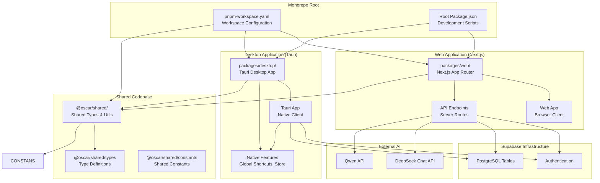
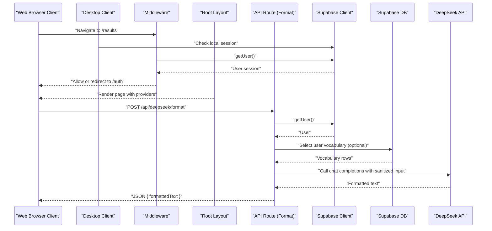
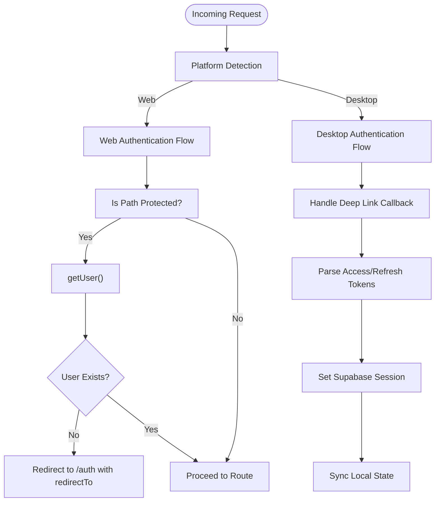
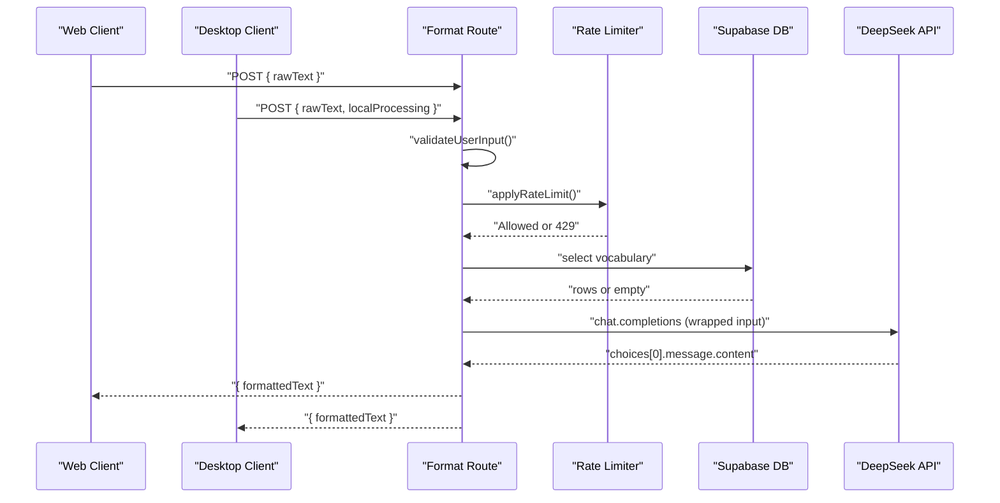
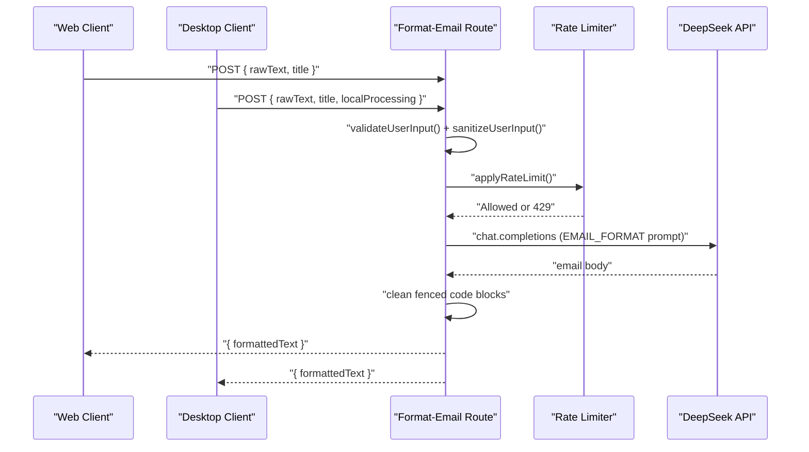
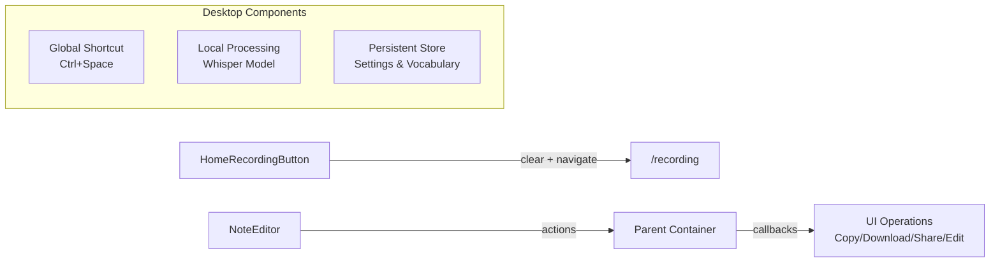

# Architecture Overview

<cite>
**Referenced Files in This Document**
- [README.md](file://README.md)
- [pnpm-workspace.yaml](file://pnpm-workspace.yaml)
- [package.json](file://package.json)
- [packages/web/package.json](file://packages/web/package.json)
- [packages/desktop/package.json](file://packages/desktop/package.json)
- [packages/shared/package.json](file://packages/shared/package.json)
- [packages/web/middleware.ts](file://packages/web/middleware.ts)
- [packages/web/app/layout.tsx](file://packages/web/app/layout.tsx)
- [packages/web/lib/constants.ts](file://packages/web/lib/constants.ts)
- [packages/web/lib/prompts.ts](file://packages/web/lib/prompts.ts)
- [packages/web/lib/middleware/rate-limit.ts](file://packages/web/lib/middleware/rate-limit.ts)
- [packages/web/lib/supabase/middleware.ts](file://packages/web/lib/supabase/middleware.ts)
- [packages/web/lib/supabase/client.ts](file://packages/web/lib/supabase/client.ts)
- [packages/web/app/api/deepseek/format/route.ts](file://packages/web/app/api/deepseek/format/route.ts)
- [packages/web/app/api/deepseek/format-email/route.ts](file://packages/web/app/api/deepseek/format-email/route.ts)
- [packages/web/components/recording/HomeRecordingButton.tsx](file://packages/web/components/recording/HomeRecordingButton.tsx)
- [packages/web/components/results/NoteEditor.tsx](file://packages/web/components/results/NoteEditor.tsx)
- [packages/desktop/src/App.tsx](file://packages/desktop/src/App.tsx)
- [packages/desktop/src/main.tsx](file://packages/desktop/src/main.tsx)
- [packages/desktop/src-tauri/tauri.conf.json](file://packages/desktop/src-tauri/tauri.conf.json)
- [packages/shared/src/index.ts](file://packages/shared/src/index.ts)
- [packages/shared/src/types/index.ts](file://packages/shared/src/types/index.ts)
</cite>

## Update Summary
**Changes Made**
- Updated project structure to reflect monorepo architecture with three packages: web, desktop, and shared
- Added Tauri desktop application architecture with native capabilities
- Documented pnpm workspace configuration and workspace package dependencies
- Updated component interaction diagrams to show both web and desktop client architectures
- Enhanced shared codebase documentation with TypeScript module exports
- Added new desktop application lifecycle and authentication flow

## Table of Contents
1. [Introduction](#introduction)
2. [Monorepo Architecture](#monorepo-architecture)
3. [Package Structure](#package-structure)
4. [Core Components](#core-components)
5. [Architecture Overview](#architecture-overview)
6. [Detailed Component Analysis](#detailed-component-analysis)
7. [Desktop Application Architecture](#desktop-application-architecture)
8. [Shared Codebase](#shared-codebase)
9. [Dependency Analysis](#dependency-analysis)
10. [Performance Considerations](#performance-considerations)
11. [Troubleshooting Guide](#troubleshooting-guide)
12. [Conclusion](#conclusion)

## Introduction
This document describes the full-stack architecture of OSCAR, an AI-powered voice-to-text application now built as a monorepo with separate web and desktop applications. The system combines a modern Next.js App Router frontend, a Tauri desktop application, shared codebase architecture, Supabase for authentication and data persistence, and external AI services for text processing. It focuses on component interactions, session management via middleware, data flow patterns, and cross-cutting concerns such as authentication security, rate limiting, and real-time synchronization across multiple client platforms.

OSCAR's primary goal is to convert speech into formatted, structured text using AI. The architecture emphasizes:
- Monorepo structure with separate web and desktop packages
- Next.js App Router with server components for web client performance and SEO
- Tauri desktop application with native capabilities and local AI processing
- Shared TypeScript codebase for consistent types and utilities
- Supabase for authentication and lightweight data storage
- Server-side API routes to protect secrets and enforce rate limits
- Modular service architecture with centralized configuration and prompt engineering
- Strong input validation and prompt injection protections

## Monorepo Architecture
OSCAR now operates as a pnpm-managed monorepo with three distinct packages, each serving different client platforms while sharing common code:



**Diagram sources**
- [pnpm-workspace.yaml:1-3](file://pnpm-workspace.yaml#L1-L3)
- [package.json:5-10](file://package.json#L5-L10)
- [packages/web/package.json:11-44](file://packages/web/package.json#L11-L44)
- [packages/desktop/package.json:12-29](file://packages/desktop/package.json#L12-L29)
- [packages/shared/package.json:7-11](file://packages/shared/package.json#L7-L11)

**Section sources**
- [README.md:3-9](file://README.md#L3-L9)
- [pnpm-workspace.yaml:1-3](file://pnpm-workspace.yaml#L1-L3)
- [package.json:5-10](file://package.json#L5-L10)

## Package Structure
The monorepo contains three distinct packages with clear separation of concerns:

### Web Package (`packages/web/`)
- Next.js 15 application with App Router
- Server components for performance and SEO benefits
- API routes for AI processing and Supabase integration
- Comprehensive UI components and styling with Tailwind CSS
- Supabase authentication and database integration

### Desktop Package (`packages/desktop/`)
- Tauri v2 desktop application with React
- Native capabilities including global shortcuts and system integration
- Local AI model processing with Whisper.cpp
- Persistent storage using Tauri store plugin
- Deep linking for seamless authentication flow
- Cross-platform desktop experience

### Shared Package (`packages/shared/`)
- TypeScript module exports for consistent types
- Shared type definitions for notes and recordings
- Common constants and utility functions
- Peer dependency on Supabase SDK for type consistency

**Section sources**
- [README.md:5-9](file://README.md#L5-L9)
- [packages/web/package.json:1-58](file://packages/web/package.json#L1-L58)
- [packages/desktop/package.json:1-44](file://packages/desktop/package.json#L1-L44)
- [packages/shared/package.json:1-19](file://packages/shared/package.json#L1-L19)

## Core Components
The monorepo architecture introduces three primary client components working in concert:

### Web Application Components
- Next.js App Router and Server Components
  - The root layout initializes providers (authentication and subscription contexts), injects runtime scripts, and renders shared UI elements
  - Server components render on the server for performance and SEO benefits
- Supabase Integration
  - Supabase client is a singleton in the browser to maintain consistent auth state
  - Server-side Supabase client is used in API routes for secure operations and database access
- Middleware
  - Global middleware updates sessions, enforces authentication for protected routes, and redirects accordingly
- AI Services
  - Server routes call external AI APIs with validated and sanitized user input, applying timeouts and rate limiting

### Desktop Application Components
- Tauri Native Application
  - React-based desktop interface with native capabilities
  - Global shortcut support for instant dictation across applications
  - Local AI model processing with Whisper.cpp for offline functionality
  - Persistent settings storage using Tauri store plugin
- Authentication Flow
  - Deep linking integration for seamless OAuth callbacks
  - Browser-based authentication with automatic session synchronization
- Local Processing
  - On-device speech recognition using downloaded AI models
  - Optional cloud AI enhancement with user-controlled API keys

### Shared Codebase Components
- Type System
  - Centralized type definitions for consistent data structures
  - Shared interfaces for notes, recordings, and user vocabulary
- Utility Functions
  - Common constants and helper functions
  - Cross-package compatibility through TypeScript module resolution

**Section sources**
- [packages/web/app/layout.tsx:1-84](file://packages/web/app/layout.tsx#L1-L84)
- [packages/web/lib/supabase/client.ts:1-34](file://packages/web/lib/supabase/client.ts#L1-L34)
- [packages/web/lib/supabase/middleware.ts:1-66](file://packages/web/lib/supabase/middleware.ts#L1-L66)
- [packages/web/middleware.ts:1-21](file://packages/web/middleware.ts#L1-L21)
- [packages/desktop/src/App.tsx:1-1285](file://packages/desktop/src/App.tsx#L1-L1285)
- [packages/shared/src/index.ts:1-6](file://packages/shared/src/index.ts#L1-L6)

## Architecture Overview
The system architecture centers around secure, server-rendered pages and server routes that orchestrate AI processing and database operations, now supporting multiple client platforms. The flow below illustrates how browser clients and desktop applications interact with server-side API routes, Supabase, and external AI services.



**Diagram sources**
- [packages/web/middleware.ts:1-21](file://packages/web/middleware.ts#L1-L21)
- [packages/web/lib/supabase/middleware.ts:1-66](file://packages/web/lib/supabase/middleware.ts#L1-L66)
- [packages/web/app/layout.tsx:1-84](file://packages/web/app/layout.tsx#L1-L84)
- [packages/web/app/api/deepseek/format/route.ts:1-181](file://packages/web/app/api/deepseek/format/route.ts#L1-L181)
- [packages/web/lib/supabase/client.ts:1-34](file://packages/web/lib/supabase/client.ts#L1-L34)

## Detailed Component Analysis

### Authentication and Session Management
Both web and desktop applications implement comprehensive authentication flows with Supabase:

#### Web Application Authentication
- Global middleware updates Supabase session cookies and enforces authentication for protected paths
- Supabase client singleton ensures consistent auth state across the browser app
- Server routes validate user presence before processing requests

#### Desktop Application Authentication
- Deep linking integration for seamless OAuth callbacks via custom URI schemes
- Browser-based authentication with automatic session synchronization
- Local session persistence with automatic polling for authentication completion
- Support for both hosted AI services and local API key configuration



**Diagram sources**
- [packages/web/lib/supabase/middleware.ts:36-62](file://packages/web/lib/supabase/middleware.ts#L36-L62)
- [packages/web/middleware.ts:8-20](file://packages/web/middleware.ts#L8-L20)
- [packages/desktop/src/App.tsx:749-800](file://packages/desktop/src/App.tsx#L749-L800)

**Section sources**
- [packages/web/middleware.ts:1-21](file://packages/web/middleware.ts#L1-L21)
- [packages/web/lib/supabase/middleware.ts:1-66](file://packages/web/lib/supabase/middleware.ts#L1-L66)
- [packages/web/lib/supabase/client.ts:1-34](file://packages/web/lib/supabase/client.ts#L1-L34)
- [packages/desktop/src/App.tsx:196-374](file://packages/desktop/src/App.tsx#L196-L374)

### AI Text Formatting Pipeline
The AI processing pipeline operates consistently across both web and desktop platforms:

#### Web Platform Processing
- Server route validates JSON payload, checks user authentication, applies rate limiting, optionally enriches system prompt with user vocabulary, sanitizes and wraps user input, calls AI API with a timeout, and returns formatted text
- Input validation and sanitization guard against prompt injection attempts

#### Desktop Platform Processing
- Local AI model processing with optional cloud enhancement
- User-controlled API key management with local storage
- Real-time transcription with immediate AI formatting capabilities



**Diagram sources**
- [packages/web/app/api/deepseek/format/route.ts:39-181](file://packages/web/app/api/deepseek/format/route.ts#L39-L181)
- [packages/web/lib/middleware/rate-limit.ts:176-192](file://packages/web/lib/middleware/rate-limit.ts#L176-L192)
- [packages/web/lib/prompts.ts:34-96](file://packages/web/lib/prompts.ts#L34-L96)

**Section sources**
- [packages/web/app/api/deepseek/format/route.ts:1-181](file://packages/web/app/api/deepseek/format/route.ts#L1-L181)
- [packages/web/lib/prompts.ts:1-458](file://packages/web/lib/prompts.ts#L1-L458)
- [packages/web/lib/middleware/rate-limit.ts:1-264](file://packages/web/lib/middleware/rate-limit.ts#L1-L264)

### Email Formatting Service
The email formatting service operates identically across both platforms, with platform-specific optimizations:

#### Web Implementation
- Server-side processing with Supabase integration
- Rate-limited API endpoints with comprehensive error handling
- Database-backed vocabulary enrichment

#### Desktop Implementation
- Local processing with optional cloud enhancement
- Persistent vocabulary storage synchronized with Supabase
- Real-time processing with immediate feedback



**Diagram sources**
- [packages/web/app/api/deepseek/format-email/route.ts:1-167](file://packages/web/app/api/deepseek/format-email/route.ts#L1-L167)
- [packages/web/lib/middleware/rate-limit.ts:176-192](file://packages/web/lib/middleware/rate-limit.ts#L176-L192)
- [packages/web/lib/prompts.ts:259-284](file://packages/web/lib/prompts.ts#L259-L284)

**Section sources**
- [packages/web/app/api/deepseek/format-email/route.ts:1-167](file://packages/web/app/api/deepseek/format-email/route.ts#L1-L167)
- [packages/web/lib/prompts.ts:259-284](file://packages/web/lib/prompts.ts#L259-L284)

### UI Components and Data Flow
Both platforms utilize similar UI patterns with platform-specific optimizations:

#### Web Platform Components
- HomeRecordingButton navigates to the recording page and clears prior session data via a storage service abstraction
- NoteEditor renders formatted notes, supports editing, copying, downloading, sharing, and feedback submission
- Integration with parent components for actions and state management

#### Desktop Platform Components
- Native UI components optimized for desktop experience
- Global shortcut integration for instant access
- Local processing indicators and status management
- Settings panel for AI model configuration and API key management



**Diagram sources**
- [packages/web/components/recording/HomeRecordingButton.tsx:1-46](file://packages/web/components/recording/HomeRecordingButton.tsx#L1-L46)
- [packages/web/components/results/NoteEditor.tsx:1-405](file://packages/web/components/results/NoteEditor.tsx#L1-L405)

**Section sources**
- [packages/web/components/recording/HomeRecordingButton.tsx:1-46](file://packages/web/components/recording/HomeRecordingButton.tsx#L1-L46)
- [packages/web/components/results/NoteEditor.tsx:1-405](file://packages/web/components/results/NoteEditor.tsx#L1-L405)

## Desktop Application Architecture
The Tauri desktop application represents a significant addition to the OSCAR ecosystem, providing native capabilities and offline functionality:

### Application Lifecycle
The desktop application follows a guided setup process with three main phases:

1. **Authentication Phase**: OAuth with Google using deep linking for seamless authentication
2. **Permissions Phase**: Microphone access and accessibility permissions for global shortcuts
3. **Setup Phase**: AI model download and configuration with optional API key entry

### Native Capabilities
- **Global Shortcuts**: System-wide hotkeys for instant dictation across applications
- **Local AI Processing**: Whisper.cpp model downloads and local transcription
- **Persistent Storage**: Tauri store plugin for settings and vocabulary management
- **Deep Linking**: Custom URI scheme integration for OAuth callbacks
- **System Integration**: Native file system access and application lifecycle management

### Technical Implementation
The desktop application leverages Tauri v2 with Rust backend and React frontend, providing:
- Secure context isolation between web content and native system access
- Cross-platform compatibility (Windows, macOS, Linux)
- Minimal resource footprint with efficient memory management
- Automatic updates and bundle optimization

**Section sources**
- [packages/desktop/src/App.tsx:1-1285](file://packages/desktop/src/App.tsx#L1-L1285)
- [packages/desktop/src-tauri/tauri.conf.json:1-51](file://packages/desktop/src-tauri/tauri.conf.json#L1-L51)
- [packages/desktop/src/main.tsx:1-11](file://packages/desktop/src/main.tsx#L1-L11)

## Shared Codebase
The shared package serves as the foundation for consistent type safety and code reuse across platforms:

### Module Structure
The shared package implements a comprehensive export strategy:
- Main entry point exports all shared functionality
- Dedicated sub-module exports for types and constants
- TypeScript declaration files for proper type inference
- Peer dependency management for Supabase SDK compatibility

### Type System
- Centralized type definitions for notes, recordings, and user vocabulary
- Consistent interfaces across web and desktop implementations
- Runtime type validation and compile-time safety
- Extensible type system supporting future feature additions

### Utility Functions
- Shared constants for API endpoints, configuration values, and UI states
- Cross-platform utility functions for common operations
- Type-safe configuration management
- Environment variable validation and processing

**Section sources**
- [packages/shared/src/index.ts:1-6](file://packages/shared/src/index.ts#L1-L6)
- [packages/shared/src/types/index.ts:1-3](file://packages/shared/src/types/index.ts#L1-L3)
- [packages/shared/package.json:7-11](file://packages/shared/package.json#L7-L11)

## Dependency Analysis
The monorepo structure introduces complex dependency relationships across packages:

### Cross-Package Dependencies
- **Web Package**: Depends on `@oscar/shared` workspace package for types and utilities
- **Desktop Package**: Depends on `@oscar/shared` workspace package for consistent types
- **Shared Package**: Peer dependency on `@supabase/supabase-js` for type consistency

### Development Dependencies
- **Web Package**: Next.js 15, TypeScript 5.9.3, Tailwind CSS, ESLint
- **Desktop Package**: Tauri CLI 2, Vite 7, React 19, TypeScript ~5.8.3
- **Shared Package**: TypeScript compiler for type checking

### Runtime Dependencies
- **Web Package**: Next.js SSR, Supabase client SDKs, AI service integrations
- **Desktop Package**: Tauri core plugins, Supabase client SDKs, React ecosystem
- **Shared Package**: Minimal dependencies with peer requirements

```mermaid
graph TB
SUBGRAPH "Web Package Dependencies"
WEBPKG["@oscar/web"]
NEXT["Next.js 15"]
SUPWEB["Supabase Web SDK"]
TYPESWEB["TypeScript 5.9.3"]
END
SUBGRAPH "Desktop Package Dependencies"
DESKTOPPKG["@oscar/desktop"]
TAURI["Tauri 2"]
SUPDESKTOP["Supabase Desktop SDK"]
REACT["React 19"]
END
SUBGRAPH "Shared Package Dependencies"
SHAREDPKG["@oscar/shared"]
PEERSUP["Peer Supabase SDK"]
TYPECHECK["Type Checking"]
END
WEBPKG --> SHAREDPKG
DESKTOPPKG --> SHAREDPKG
WEBPKG --> NEXT
WEBPKG --> SUPWEB
WEBPKG --> TYPESWEB
DESKTOPPKG --> TAURI
DESKTOPPKG --> SUPDESKTOP
DESKTOPPKG --> REACT
```

**Diagram sources**
- [packages/web/package.json:11-44](file://packages/web/package.json#L11-L44)
- [packages/desktop/package.json:12-29](file://packages/desktop/package.json#L12-L29)
- [packages/shared/package.json:15-17](file://packages/shared/package.json#L15-L17)

**Section sources**
- [packages/web/package.json:11-44](file://packages/web/package.json#L11-L44)
- [packages/desktop/package.json:12-29](file://packages/desktop/package.json#L12-L29)
- [packages/shared/package.json:15-17](file://packages/shared/package.json#L15-L17)

## Performance Considerations
The monorepo architecture introduces several performance optimization strategies:

### Web Platform Optimizations
- Server Components and Static Assets: Rendering UI on the server reduces client-side work and improves initial load performance
- Supabase Client Singleton: Reusing a single browser client avoids redundant initialization and auth state churn
- Rate Limiting: Limits reduce API costs and prevent abuse; in-memory store is efficient for single-instance deployments
- Request Timeouts: AI requests are bounded to prevent hanging and resource exhaustion

### Desktop Platform Optimizations
- Local AI Processing: Whisper.cpp models process entirely on device, reducing latency and bandwidth usage
- Persistent Caching: Local storage of models and settings minimizes startup time
- Efficient Memory Management: Tauri's architecture provides better memory efficiency than traditional Electron apps
- Background Processing: AI enhancement runs asynchronously without blocking the UI

### Shared Codebase Benefits
- Type Safety: Centralized type definitions eliminate runtime errors and improve development experience
- Code Reuse: Shared utilities reduce duplication and ensure consistent behavior across platforms
- Testing Efficiency: Shared test utilities and mock data improve test coverage and reliability

## Troubleshooting Guide
The monorepo introduces new troubleshooting scenarios across multiple platforms:

### Cross-Platform Issues
- **Authentication Synchronization**: Verify deep link configuration and OAuth callback handling between web and desktop
- **Shared Type Conflicts**: Ensure consistent version of `@oscar/shared` across all packages
- **Workspace Resolution**: Confirm pnpm workspace configuration and package linking

### Web Platform Troubleshooting
- **Authentication Redirect Loops**: Verify middleware matcher excludes static assets and API routes
- **Unauthorized Access in API Routes**: Ensure Supabase getUser() is called and user exists before processing
- **Rate Limit Exceeded**: Inspect rate limiter logs and headers, adjust quotas or implement client-side backoff

### Desktop Platform Troubleshooting
- **Global Shortcut Not Working**: Verify accessibility permissions and system shortcut configuration
- **AI Model Download Failures**: Check network connectivity and download progress events
- **Deep Link Handling**: Ensure custom URI scheme registration and deep link event listeners are properly configured
- **Local Storage Issues**: Verify Tauri store plugin initialization and file system permissions

### Shared Codebase Troubleshooting
- **Type Import Errors**: Verify module resolution and export paths in the shared package
- **Peer Dependency Conflicts**: Ensure consistent Supabase SDK versions across packages
- **Build Compilation Issues**: Check TypeScript configuration and module resolution settings

**Section sources**
- [packages/web/middleware.ts:8-20](file://packages/web/middleware.ts#L8-L20)
- [packages/web/lib/supabase/middleware.ts:36-62](file://packages/web/lib/supabase/middleware.ts#L36-L62)
- [packages/web/app/api/deepseek/format/route.ts:40-48](file://packages/web/app/api/deepseek/format/route.ts#L40-L48)
- [packages/web/app/api/deepseek/format-email/route.ts:36-45](file://packages/web/app/api/deepseek/format-email/route.ts#L36-L45)
- [packages/web/lib/middleware/rate-limit.ts:143-166](file://packages/web/lib/middleware/rate-limit.ts#L143-L166)
- [packages/desktop/src/App.tsx:490-681](file://packages/desktop/src/App.tsx#L490-L681)
- [packages/shared/src/index.ts:1-6](file://packages/shared/src/index.ts#L1-L6)

## Conclusion
OSCAR's monorepo architecture successfully extends the original Next.js design to support multiple client platforms while maintaining code consistency and developer productivity. The integration of Tauri desktop application provides native capabilities, offline functionality, and improved user experience, while the shared codebase ensures type safety and reduces duplication. The design prioritizes security (input validation, prompt injection protections), scalability (rate limiting, timeouts), and user experience (providers, animations, responsive UI across platforms). The modular structure and centralized configuration facilitate maintenance and future enhancements, supporting both web and desktop deployment strategies.

The architectural transformation demonstrates successful evolution from a single-platform application to a comprehensive multi-client solution, leveraging modern web technologies and native capabilities to serve diverse user needs while maintaining technical excellence and code quality.