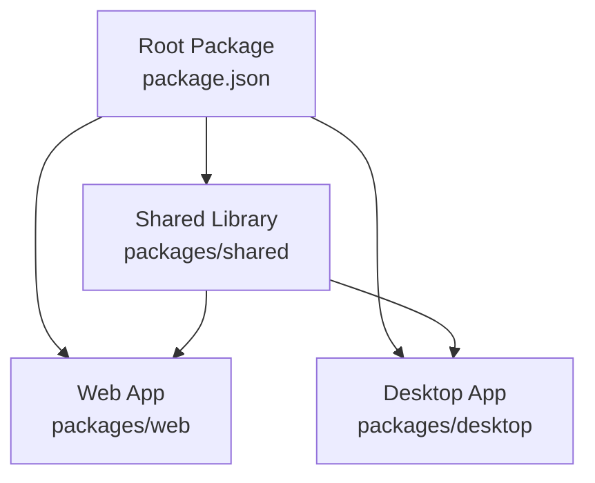
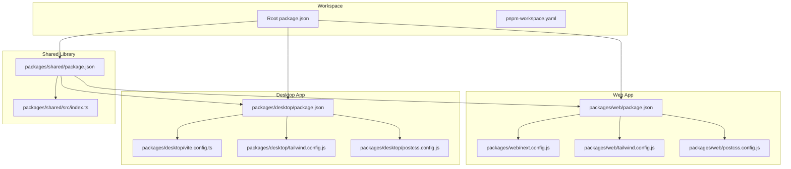
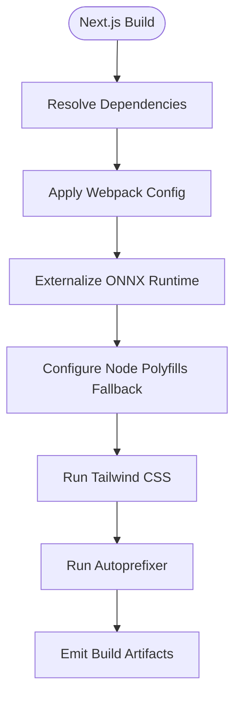
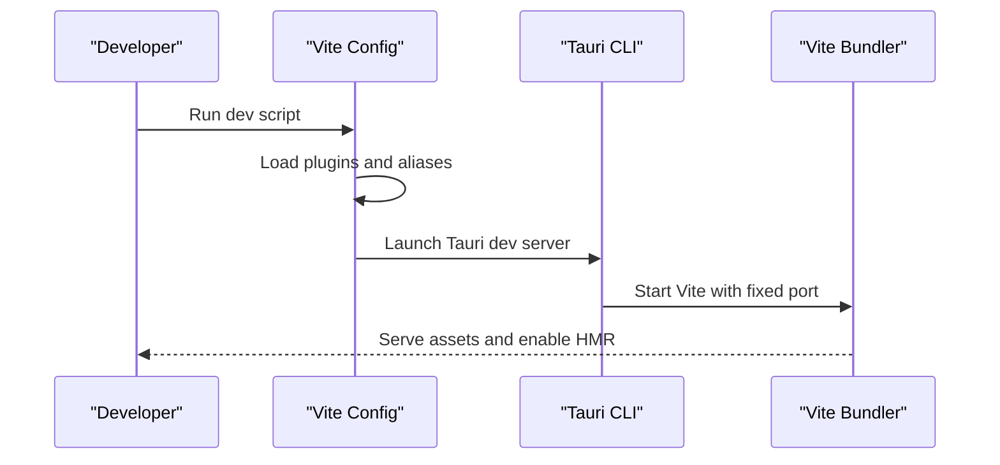
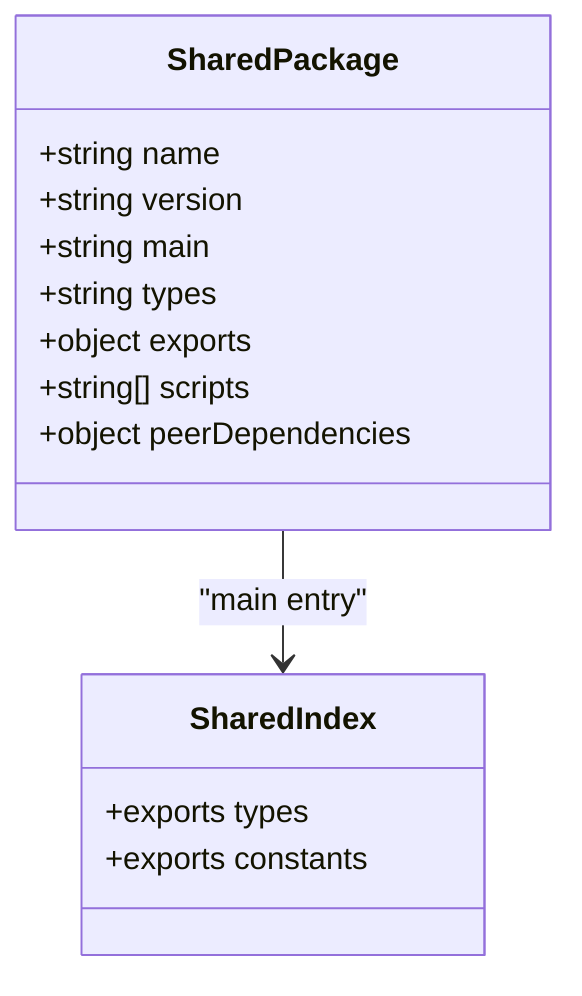
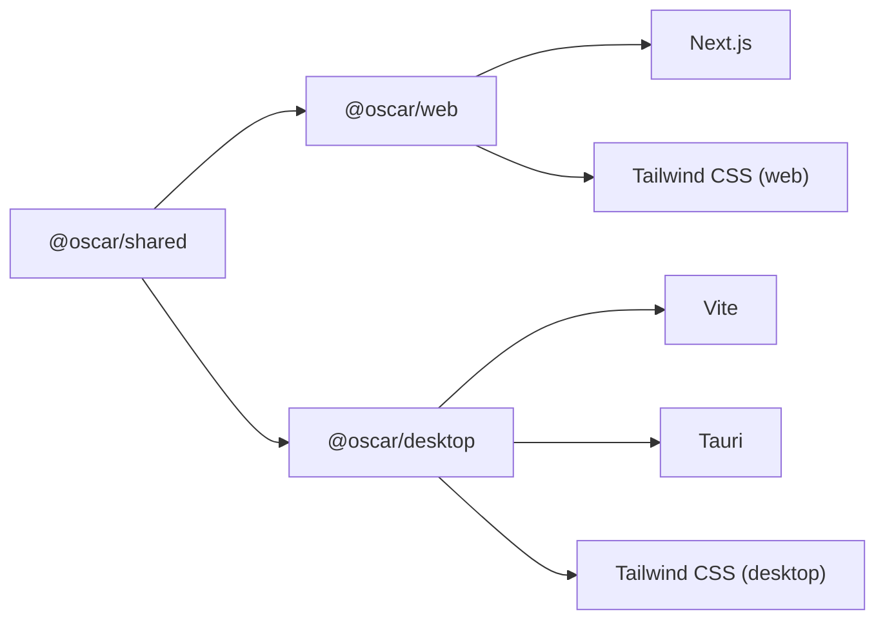

# Build System

<cite>
**Referenced Files in This Document**
- [README.md](file://README.md)
- [package.json](file://package.json)
- [pnpm-workspace.yaml](file://pnpm-workspace.yaml)
- [packages/web/package.json](file://packages/web/package.json)
- [packages/web/next.config.js](file://packages/web/next.config.js)
- [packages/web/tailwind.config.js](file://packages/web/tailwind.config.js)
- [packages/web/postcss.config.js](file://packages/web/postcss.config.js)
- [packages/desktop/package.json](file://packages/desktop/package.json)
- [packages/desktop/vite.config.ts](file://packages/desktop/vite.config.ts)
- [packages/desktop/tailwind.config.js](file://packages/desktop/tailwind.config.js)
- [packages/desktop/postcss.config.js](file://packages/desktop/postcss.config.js)
- [packages/shared/package.json](file://packages/shared/package.json)
- [packages/shared/src/index.ts](file://packages/shared/src/index.ts)
</cite>

## Table of Contents
1. [Introduction](#introduction)
2. [Project Structure](#project-structure)
3. [Core Components](#core-components)
4. [Architecture Overview](#architecture-overview)
5. [Detailed Component Analysis](#detailed-component-analysis)
6. [Dependency Analysis](#dependency-analysis)
7. [Performance Considerations](#performance-considerations)
8. [Troubleshooting Guide](#troubleshooting-guide)
9. [Conclusion](#conclusion)

## Introduction
This document explains the build system for the OScar monorepo, focusing on how the web and desktop applications are configured and built, how shared code is structured and consumed, and how the workspace is organized. It covers the toolchain, configuration files, and scripts used during development and production builds.

## Project Structure
The repository is a pnpm workspace with three packages:
- packages/web: Next.js web application
- packages/desktop: Tauri desktop application
- packages/shared: Shared TypeScript code and exports

The root package manager is pnpm, and the workspace includes all packages under packages/.

**Diagram sources**
- [package.json:1-11](file://package.json#L1-L11)
- [pnpm-workspace.yaml:1-3](file://pnpm-workspace.yaml#L1-L3)
- [packages/web/package.json:1-58](file://packages/web/package.json#L1-L58)
- [packages/desktop/package.json:1-44](file://packages/desktop/package.json#L1-L44)
- [packages/shared/package.json:1-19](file://packages/shared/package.json#L1-L19)

**Section sources**
- [README.md:1-51](file://README.md#L1-L51)
- [package.json:1-11](file://package.json#L1-L11)
- [pnpm-workspace.yaml:1-3](file://pnpm-workspace.yaml#L1-L3)

## Core Components
- Root workspace configuration defines development scripts and the package manager.
- Web application uses Next.js with custom webpack configuration for ONNX runtime and image optimization.
- Desktop application uses Vite with Tauri-specific settings and Tailwind CSS.
- Shared library exposes TypeScript entry points and peer dependencies.

Key responsibilities:
- Root scripts orchestrate per-package development commands.
- Web build integrates ONNX runtime externals and image remote patterns.
- Desktop build integrates React plugin, aliases, and Tauri development server options.
- Shared library centralizes types and constants for reuse.

**Section sources**
- [package.json:5-8](file://package.json#L5-L8)
- [packages/web/next.config.js:38-94](file://packages/web/next.config.js#L38-L94)
- [packages/web/package.json:11-44](file://packages/web/package.json#L11-L44)
- [packages/desktop/vite.config.ts:9-38](file://packages/desktop/vite.config.ts#L9-L38)
- [packages/desktop/package.json:6-11](file://packages/desktop/package.json#L6-L11)
- [packages/shared/package.json:7-11](file://packages/shared/package.json#L7-L11)

## Architecture Overview
The build system architecture connects the root workspace to package-specific configurations and shared code.

**Diagram sources**
- [package.json:1-11](file://package.json#L1-L11)
- [pnpm-workspace.yaml:1-3](file://pnpm-workspace.yaml#L1-L3)
- [packages/web/package.json:1-58](file://packages/web/package.json#L1-L58)
- [packages/web/next.config.js:1-98](file://packages/web/next.config.js#L1-L98)
- [packages/web/tailwind.config.js:1-106](file://packages/web/tailwind.config.js#L1-L106)
- [packages/web/postcss.config.js:1-8](file://packages/web/postcss.config.js#L1-L8)
- [packages/desktop/package.json:1-44](file://packages/desktop/package.json#L1-L44)
- [packages/desktop/vite.config.ts:1-39](file://packages/desktop/vite.config.ts#L1-L39)
- [packages/desktop/tailwind.config.js:1-90](file://packages/desktop/tailwind.config.js#L1-L90)
- [packages/desktop/postcss.config.js:1-7](file://packages/desktop/postcss.config.js#L1-L7)
- [packages/shared/package.json:1-19](file://packages/shared/package.json#L1-L19)
- [packages/shared/src/index.ts:1-6](file://packages/shared/src/index.ts#L1-L6)

## Detailed Component Analysis

### Web Application Build
The web application uses Next.js with:
- Custom webpack configuration to externalize ONNX runtime packages and adjust fallbacks for browser builds.
- Image optimization with remote patterns for specific hosts.
- Tailwind CSS and PostCSS configuration for styling.

**Diagram sources**
- [packages/web/next.config.js:38-94](file://packages/web/next.config.js#L38-L94)
- [packages/web/tailwind.config.js:1-106](file://packages/web/tailwind.config.js#L1-L106)
- [packages/web/postcss.config.js:1-8](file://packages/web/postcss.config.js#L1-L8)

**Section sources**
- [packages/web/package.json:5-10](file://packages/web/package.json#L5-L10)
- [packages/web/next.config.js:38-94](file://packages/web/next.config.js#L38-L94)
- [packages/web/tailwind.config.js:1-106](file://packages/web/tailwind.config.js#L1-L106)
- [packages/web/postcss.config.js:1-8](file://packages/web/postcss.config.js#L1-L8)

### Desktop Application Build
The desktop application uses Vite with:
- React plugin and path aliasing.
- Tauri-specific server options for development, including fixed ports and optional host-based HMR.
- Tailwind CSS and PostCSS configuration.

**Diagram sources**
- [packages/desktop/vite.config.ts:9-38](file://packages/desktop/vite.config.ts#L9-L38)
- [packages/desktop/package.json:6-11](file://packages/desktop/package.json#L6-L11)

**Section sources**
- [packages/desktop/package.json:6-11](file://packages/desktop/package.json#L6-L11)
- [packages/desktop/vite.config.ts:9-38](file://packages/desktop/vite.config.ts#L9-L38)
- [packages/desktop/tailwind.config.js:1-90](file://packages/desktop/tailwind.config.js#L1-L90)
- [packages/desktop/postcss.config.js:1-7](file://packages/desktop/postcss.config.js#L1-L7)

### Shared Library Build
The shared library:
- Exposes multiple entry points for types and constants.
- Defines a main entry pointing to the primary index.
- Declares peer dependencies for Supabase to avoid duplication.

**Diagram sources**
- [packages/shared/package.json:1-19](file://packages/shared/package.json#L1-L19)
- [packages/shared/src/index.ts:1-6](file://packages/shared/src/index.ts#L1-L6)

**Section sources**
- [packages/shared/package.json:5-11](file://packages/shared/package.json#L5-L11)
- [packages/shared/src/index.ts:1-6](file://packages/shared/src/index.ts#L1-L6)

## Dependency Analysis
The build system relies on pnpm workspaces to manage inter-package dependencies. The web and desktop packages depend on the shared package, and both apps also depend on their respective frameworks and tooling.

**Diagram sources**
- [packages/web/package.json:12](file://packages/web/package.json#L12)
- [packages/desktop/package.json:13](file://packages/desktop/package.json#L13)
- [packages/shared/package.json:8-10](file://packages/shared/package.json#L8-L10)

**Section sources**
- [packages/web/package.json:12](file://packages/web/package.json#L12)
- [packages/desktop/package.json:13](file://packages/desktop/package.json#L13)
- [packages/shared/package.json:8-11](file://packages/shared/package.json#L8-L11)

## Performance Considerations
- Web application externalization of ONNX runtime reduces bundle size and avoids bundling native modules in the browser.
- Tailwind CSS content scanning is scoped to relevant directories to minimize rebuild times.
- Vite’s Tauri development server uses fixed ports and selective watching to improve hot reload performance.

[No sources needed since this section provides general guidance]

## Troubleshooting Guide
Common issues and resolutions:
- ONNX runtime bundling errors in the browser: Ensure externalization is applied in the Next.js webpack configuration.
- Missing Tailwind classes or incorrect dark mode behavior: Verify content paths and theme extensions in Tailwind configuration.
- Vite HMR not working during Tauri development: Confirm the host environment variable and strict port settings in the Vite configuration.
- Shared package type errors: Ensure peer dependencies align across consuming packages.

**Section sources**
- [packages/web/next.config.js:38-94](file://packages/web/next.config.js#L38-L94)
- [packages/web/tailwind.config.js:4-106](file://packages/web/tailwind.config.js#L4-L106)
- [packages/desktop/vite.config.ts:22-37](file://packages/desktop/vite.config.ts#L22-L37)
- [packages/shared/package.json:15-17](file://packages/shared/package.json#L15-L17)

## Conclusion
The OScar build system leverages a pnpm workspace to coordinate a Next.js web app, a Tauri desktop app, and a shared TypeScript library. The web app’s webpack customization ensures compatibility with ONNX runtime in the browser, while the desktop app’s Vite configuration integrates seamlessly with Tauri. Tailwind CSS and PostCSS are configured per platform for consistent styling. This setup enables efficient development and reliable builds across platforms.