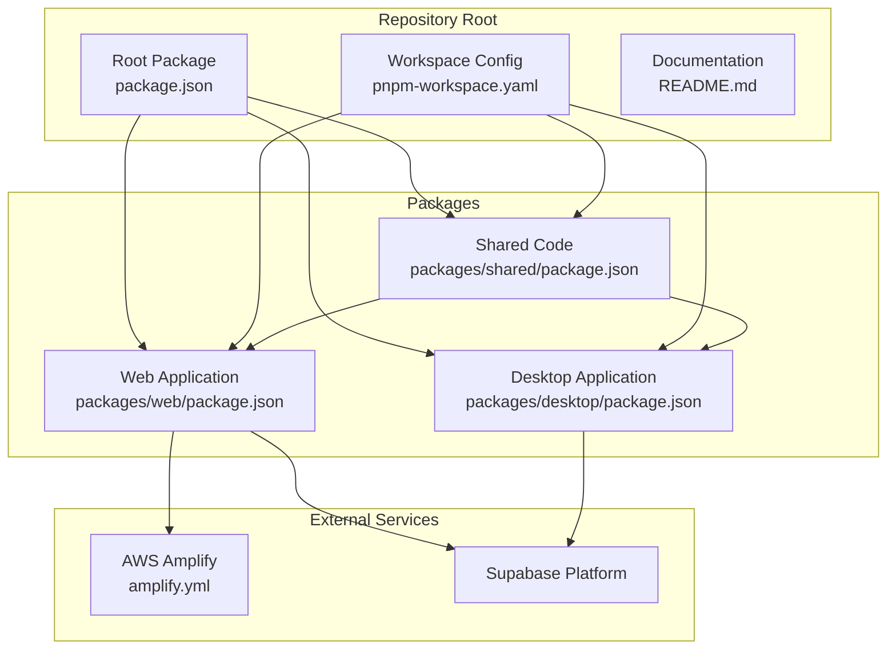
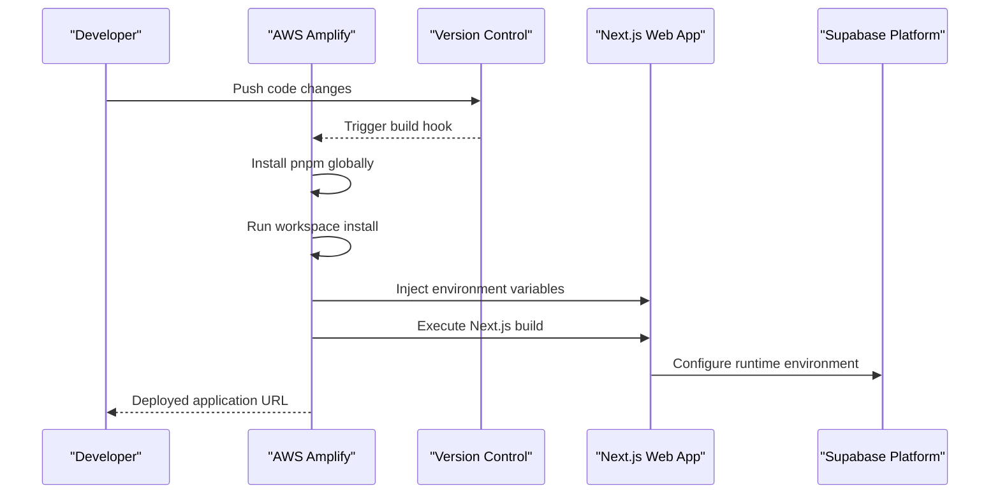
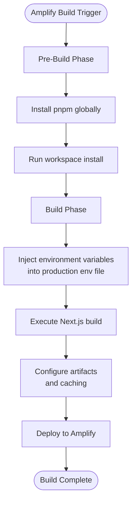
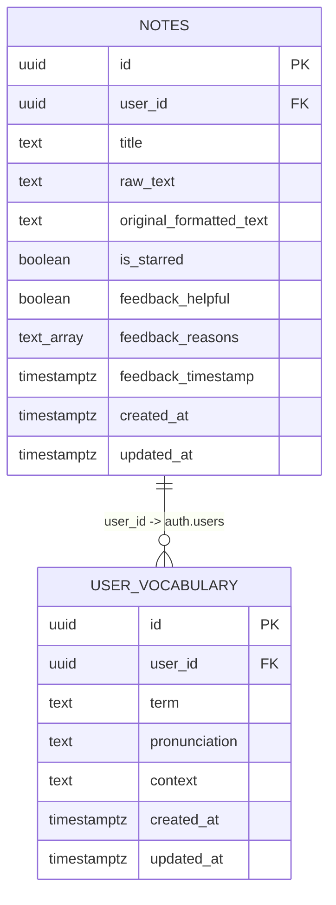
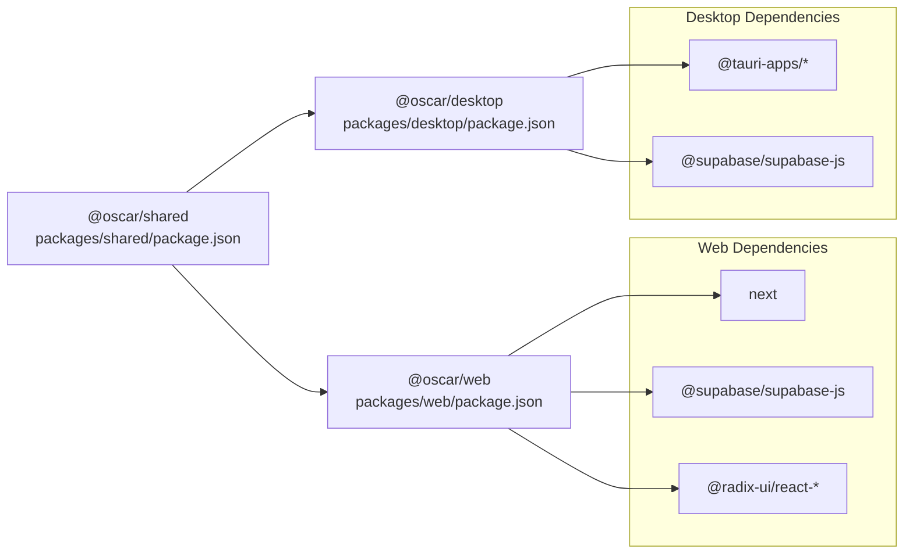
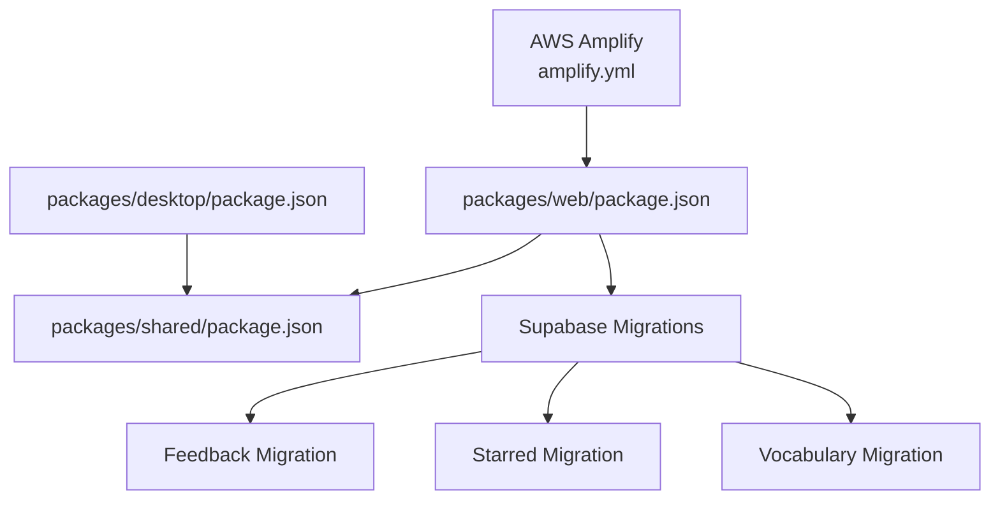

# Deployment Infrastructure

<cite>
**Referenced Files in This Document**
- [README.md](file://README.md)
- [amplify.yml](file://amplify.yml)
- [package.json](file://package.json)
- [pnpm-workspace.yaml](file://pnpm-workspace.yaml)
- [packages/web/package.json](file://packages/web/package.json)
- [packages/desktop/package.json](file://packages/desktop/package.json)
- [packages/shared/package.json](file://packages/shared/package.json)
- [supabase-migration-feedback.sql](file://supabase-migration-feedback.sql)
- [supabase-migration-starred.sql](file://supabase-migration-starred.sql)
- [supabase-migration-vocabulary.sql](file://supabase-migration-vocabulary.sql)
</cite>

## Table of Contents
1. [Introduction](#introduction)
2. [Project Structure](#project-structure)
3. [Core Components](#core-components)
4. [Architecture Overview](#architecture-overview)
5. [Detailed Component Analysis](#detailed-component-analysis)
6. [Dependency Analysis](#dependency-analysis)
7. [Performance Considerations](#performance-considerations)
8. [Troubleshooting Guide](#troubleshooting-guide)
9. [Conclusion](#conclusion)

## Introduction
This document describes the deployment infrastructure for the Oscar AI note-taking application. The project is a monorepo containing a Next.js web application, a Tauri desktop application, and shared TypeScript packages. The primary deployment target is the Next.js web application, configured for automated builds using AWS Amplify. Backend services leverage Supabase for authentication, real-time features, and database operations, with database migrations managed via SQL scripts.

## Project Structure
The repository follows a pnpm workspace layout with three main packages:
- packages/web: Next.js application serving the browser interface
- packages/desktop: Tauri desktop application for native desktop environments
- packages/shared: Shared TypeScript code and utilities used by both web and desktop

**Diagram sources**
- [package.json:1-11](file://package.json#L1-L11)
- [pnpm-workspace.yaml:1-3](file://pnpm-workspace.yaml#L1-L3)
- [packages/web/package.json:1-58](file://packages/web/package.json#L1-L58)
- [packages/desktop/package.json:1-44](file://packages/desktop/package.json#L1-L44)
- [packages/shared/package.json:1-19](file://packages/shared/package.json#L1-L19)
- [amplify.yml:1-45](file://amplify.yml#L1-L45)

**Section sources**
- [README.md:1-51](file://README.md#L1-L51)
- [package.json:1-11](file://package.json#L1-L11)
- [pnpm-workspace.yaml:1-3](file://pnpm-workspace.yaml#L1-L3)

## Core Components
The deployment infrastructure consists of:
- Build orchestration via AWS Amplify for the Next.js web application
- Monorepo management using pnpm workspace
- Supabase-backed backend with database migrations
- Environment variable injection during the build process

Key characteristics:
- The web application is built and deployed through Amplify, which installs pnpm globally, runs workspace installation, and executes the Next.js build command.
- Environment variables for Supabase, Razorpay, and DeepSeek are injected into the production environment during the Amplify build phase.
- The desktop application is packaged separately and does not rely on Amplify for deployment in this repository configuration.

**Section sources**
- [amplify.yml:1-45](file://amplify.yml#L1-L45)
- [package.json:5-8](file://package.json#L5-L8)
- [packages/web/package.json:11-44](file://packages/web/package.json#L11-L44)

## Architecture Overview
The deployment architecture integrates the Next.js web application with AWS Amplify and Supabase services. Amplify handles build automation, environment configuration, and artifact generation. Supabase provides authentication, database storage, and row-level security policies.

**Diagram sources**
- [amplify.yml:4-19](file://amplify.yml#L4-L19)
- [packages/web/package.json:5-10](file://packages/web/package.json#L5-L10)

## Detailed Component Analysis

### AWS Amplify Configuration
The Amplify pipeline defines build phases and environment variables for the web application:
- Pre-build phase installs pnpm globally and runs workspace installation
- Build phase injects environment variables into a production environment file and executes the Next.js build
- Artifacts specify the Next.js output directory and include all files
- Caching is configured for node_modules and Next.js cache directories
- Environment variables include Supabase, Razorpay, and DeepSeek configurations

**Diagram sources**
- [amplify.yml:6-27](file://amplify.yml#L6-L27)

**Section sources**
- [amplify.yml:1-45](file://amplify.yml#L1-L45)

### Supabase Database Migrations
The backend relies on Supabase for authentication, database storage, and row-level security. Three migration scripts define schema updates:
- Feedback migration adds columns for user feedback tracking and creates views for analytics
- Starred notes migration introduces a star/favorite flag with indexing and RLS policies
- Vocabulary migration establishes a user-specific vocabulary table with RLS policies

**Diagram sources**
- [supabase-migration-feedback.sql:5-32](file://supabase-migration-feedback.sql#L5-L32)
- [supabase-migration-starred.sql:4-11](file://supabase-migration-starred.sql#L4-L11)
- [supabase-migration-vocabulary.sql:4-15](file://supabase-migration-vocabulary.sql#L4-L15)

**Section sources**
- [supabase-migration-feedback.sql:1-85](file://supabase-migration-feedback.sql#L1-L85)
- [supabase-migration-starred.sql:1-23](file://supabase-migration-starred.sql#L1-L23)
- [supabase-migration-vocabulary.sql:1-38](file://supabase-migration-vocabulary.sql#L1-L38)

### Monorepo Dependencies
The workspace manages inter-package dependencies:
- packages/web depends on @oscar/shared and various UI libraries
- packages/desktop depends on @oscar/shared and Tauri plugins
- packages/shared exports TypeScript entry points and peer dependencies

**Diagram sources**
- [packages/web/package.json:11-44](file://packages/web/package.json#L11-L44)
- [packages/desktop/package.json:12-29](file://packages/desktop/package.json#L12-L29)
- [packages/shared/package.json:1-19](file://packages/shared/package.json#L1-L19)

**Section sources**
- [packages/web/package.json:1-58](file://packages/web/package.json#L1-L58)
- [packages/desktop/package.json:1-44](file://packages/desktop/package.json#L1-L44)
- [packages/shared/package.json:1-19](file://packages/shared/package.json#L1-L19)

## Dependency Analysis
The deployment pipeline exhibits the following dependency relationships:
- Amplify depends on the web application package configuration and environment variables
- The web application depends on shared packages and external libraries
- Supabase migrations define schema dependencies and RLS policies
- The desktop application is independent of Amplify but shares the shared package

**Diagram sources**
- [amplify.yml:1-45](file://amplify.yml#L1-L45)
- [packages/web/package.json:1-58](file://packages/web/package.json#L1-L58)
- [packages/desktop/package.json:1-44](file://packages/desktop/package.json#L1-L44)
- [packages/shared/package.json:1-19](file://packages/shared/package.json#L1-L19)
- [supabase-migration-feedback.sql:1-85](file://supabase-migration-feedback.sql#L1-L85)
- [supabase-migration-starred.sql:1-23](file://supabase-migration-starred.sql#L1-L23)
- [supabase-migration-vocabulary.sql:1-38](file://supabase-migration-vocabulary.sql#L1-L38)

**Section sources**
- [amplify.yml:1-45](file://amplify.yml#L1-L45)
- [packages/web/package.json:1-58](file://packages/web/package.json#L1-L58)
- [packages/desktop/package.json:1-44](file://packages/desktop/package.json#L1-L44)
- [packages/shared/package.json:1-19](file://packages/shared/package.json#L1-L19)

## Performance Considerations
- Build caching: Amplify caches node_modules and Next.js cache directories to reduce build times across deployments
- Environment variable injection: Variables are injected at build time to avoid runtime configuration overhead
- Workspace optimization: Using pnpm workspace minimizes duplicate installations and improves dependency resolution speed

## Troubleshooting Guide
Common deployment issues and resolutions:
- Build failures due to missing environment variables: Ensure all required environment variables are configured in the Amplify console or repository settings
- Dependency installation errors: Verify pnpm version compatibility and workspace configuration
- Supabase connectivity issues: Confirm Supabase service role key, public URL, and anonymous key are correctly set
- Database migration conflicts: Review migration scripts for conflicts and apply them sequentially in the Supabase SQL editor

**Section sources**
- [amplify.yml:12-19](file://amplify.yml#L12-L19)
- [package.json:9](file://package.json#L9)
- [packages/web/package.json:11-44](file://packages/web/package.json#L11-L44)

## Conclusion
The Oscar project employs a streamlined deployment infrastructure centered on AWS Amplify for the Next.js web application and Supabase for backend services. The pnpm workspace facilitates efficient development and deployment across multiple applications while maintaining shared code reuse. The documented configuration provides a clear blueprint for building, deploying, and operating the application in production environments.