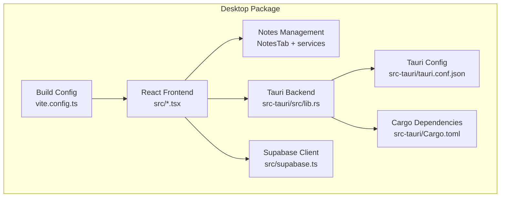
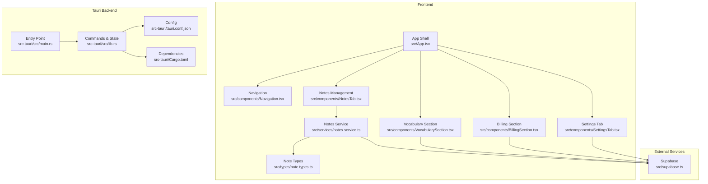
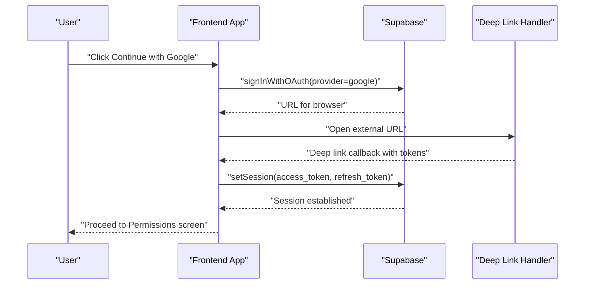
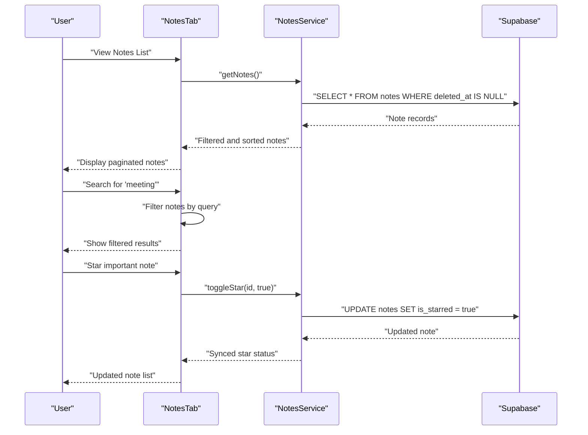
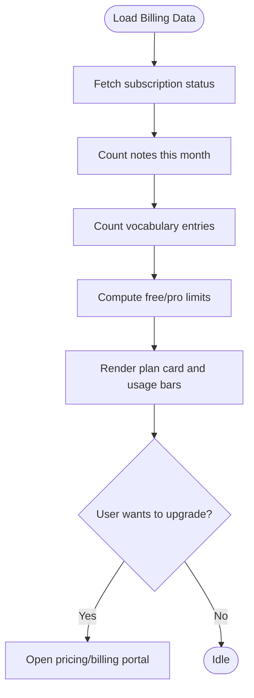
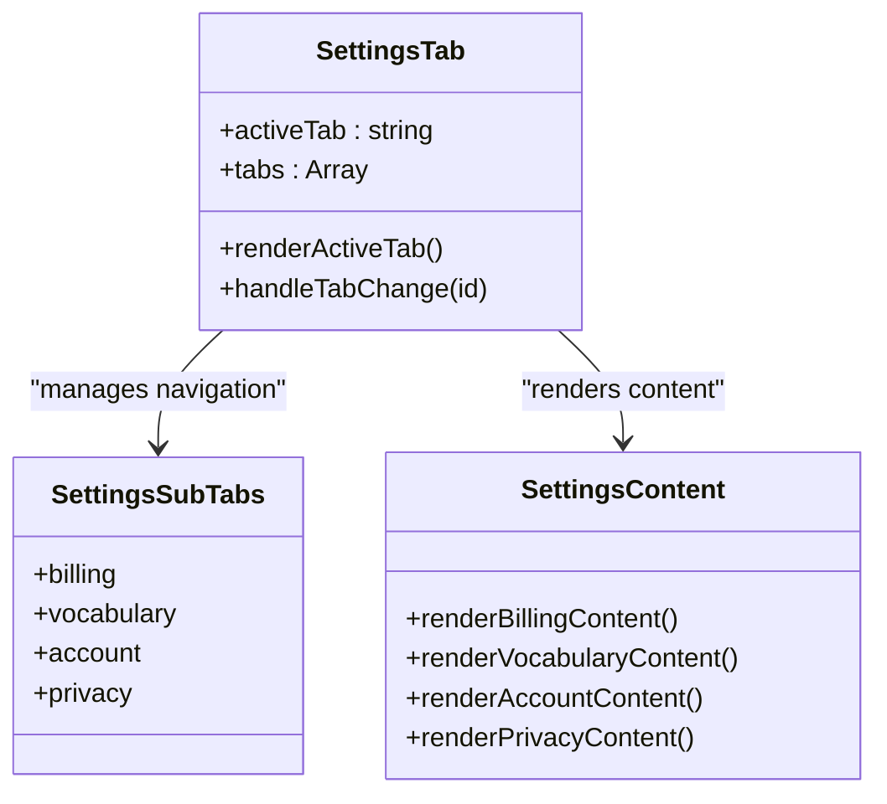
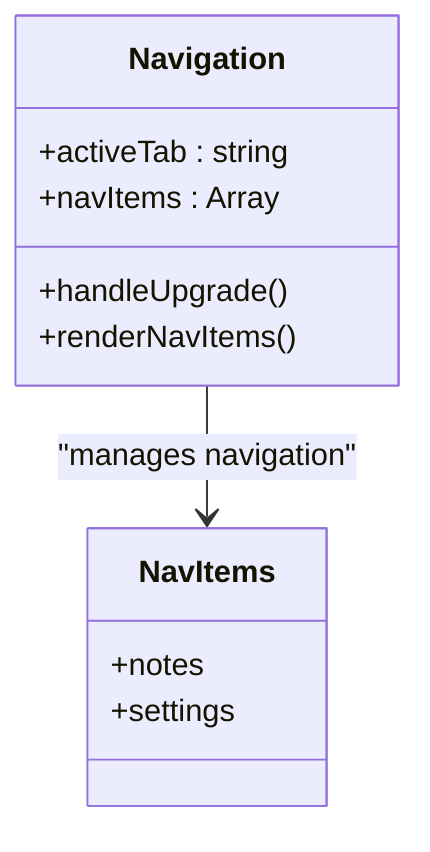
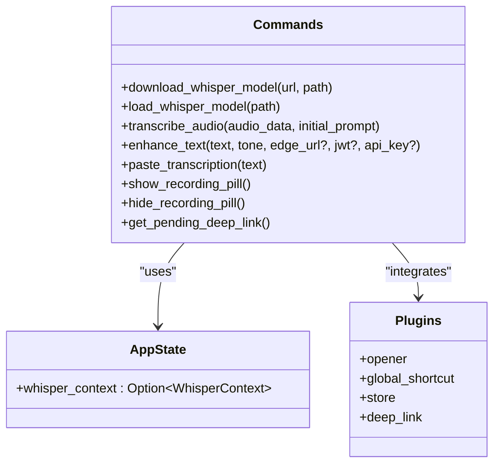
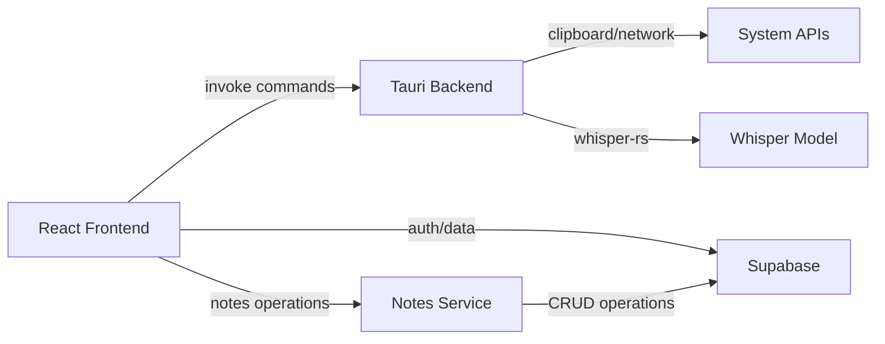

# Desktop Application

<cite>
**Referenced Files in This Document**
- [README.md](file://README.md)
- [package.json](file://package.json)
- [pnpm-workspace.yaml](file://pnpm-workspace.yaml)
- [packages/desktop/src/main.tsx](file://packages/desktop/src/main.tsx)
- [packages/desktop/src/App.tsx](file://packages/desktop/src/App.tsx)
- [packages/desktop/src/components/Navigation.tsx](file://packages/desktop/src/components/Navigation.tsx)
- [packages/desktop/src/components/NotesTab.tsx](file://packages/desktop/src/components/NotesTab.tsx)
- [packages/desktop/src/components/VocabularySection.tsx](file://packages/desktop/src/components/VocabularySection.tsx)
- [packages/desktop/src/components/BillingSection.tsx](file://packages/desktop/src/components/BillingSection.tsx)
- [packages/desktop/src/components/SettingsTab.tsx](file://packages/desktop/src/components/SettingsTab.tsx)
- [packages/desktop/src/services/notes.service.ts](file://packages/desktop/src/services/notes.service.ts)
- [packages/desktop/src/types/note.types.ts](file://packages/desktop/src/types/note.types.ts)
- [packages/desktop/src/supabase.ts](file://packages/desktop/src/supabase.ts)
- [packages/desktop/vite.config.ts](file://packages/desktop/vite.config.ts)
- [packages/desktop/src-tauri/tauri.conf.json](file://packages/desktop/src-tauri/tauri.conf.json)
- [packages/desktop/src-tauri/Cargo.toml](file://packages/desktop/src-tauri/Cargo.toml)
- [packages/desktop/src-tauri/src/main.rs](file://packages/desktop/src-tauri/src/main.rs)
- [packages/desktop/src-tauri/src/lib.rs](file://packages/desktop/src-tauri/src/lib.rs)
</cite>

## Update Summary
**Changes Made**
- Updated core architecture documentation to reflect major transformation from recording-focused to notes-focused desktop application
- Revised navigation structure showing 'notes' tab as default instead of 'record'
- Updated component analysis to emphasize notes management over transcription functionality
- Enhanced documentation for notes service architecture and database operations
- Updated routing and state management documentation to reflect new notes-centric workflow
- Revised troubleshooting guidance to focus on notes management and data operations

## Table of Contents
1. [Introduction](#introduction)
2. [Project Structure](#project-structure)
3. [Core Components](#core-components)
4. [Architecture Overview](#architecture-overview)
5. [Detailed Component Analysis](#detailed-component-analysis)
6. [Dependency Analysis](#dependency-analysis)
7. [Performance Considerations](#performance-considerations)
8. [Troubleshooting Guide](#troubleshooting-guide)
9. [Conclusion](#conclusion)

## Introduction
This document describes the Desktop Application built with Tauri and React. The application has undergone a major architectural transformation, shifting from a recording-focused voice-to-text transcription tool to a comprehensive notes management system. The desktop app now centers around organizing, searching, and managing voice-generated notes with advanced filtering, starring, and trash management capabilities. It maintains its transcription engine for creating notes but prioritizes notes organization and retrieval over active recording workflows.

**Updated** The application now defaults to the Notes tab as the primary interface, featuring sophisticated note management with search, filtering, sorting, and organizational tools. The Settings tab remains available for configuration, while the recording functionality is maintained but secondary to the notes management experience.

## Project Structure
The desktop package maintains its hybrid architecture while emphasizing notes management:
- Frontend (React + TypeScript): Notes interface, components, and styling with enhanced note management
- Tauri backend (Rust): Commands for model download/transcription, AI enhancement, clipboard paste, recording overlay, and global shortcuts
- Supabase integration: Authentication and data synchronization for user notes, vocabulary, and subscriptions
- Build configuration: Vite for dev/build and Tauri for bundling

**Diagram sources**
- [packages/desktop/src/main.tsx:1-11](file://packages/desktop/src/main.tsx#L1-L11)
- [packages/desktop/src/App.tsx:1-1270](file://packages/desktop/src/App.tsx#L1-L1270)
- [packages/desktop/src/components/NotesTab.tsx:1-416](file://packages/desktop/src/components/NotesTab.tsx#L1-L416)
- [packages/desktop/src/services/notes.service.ts:1-150](file://packages/desktop/src/services/notes.service.ts#L1-L150)
- [packages/desktop/vite.config.ts:1-39](file://packages/desktop/vite.config.ts#L1-L39)
- [packages/desktop/src-tauri/src/lib.rs:1-558](file://packages/desktop/src-tauri/src/lib.rs#L1-L558)
- [packages/desktop/src-tauri/tauri.conf.json:1-51](file://packages/desktop/src-tauri/tauri.conf.json#L1-L51)
- [packages/desktop/src-tauri/Cargo.toml:1-36](file://packages/desktop/src-tauri/Cargo.toml#L1-L36)
- [packages/desktop/src/supabase.ts:1-9](file://packages/desktop/src/supabase.ts#L1-L9)

**Section sources**
- [README.md:1-51](file://README.md#L1-L51)
- [pnpm-workspace.yaml:1-3](file://pnpm-workspace.yaml#L1-L3)
- [package.json:1-11](file://package.json#L1-L11)

## Core Components
- App shell and onboarding: authentication, permissions, and initial setup flows
- Navigation sidebar and tabbed views: Notes (primary), Vocabulary, Billing, Settings
- Notes tab: comprehensive note management with search, filtering, sorting, starring, and trash operations
- Vocabulary section: CRUD for custom words/phrases with free/pro limits
- Billing section: subscription status, usage stats, and upgrade prompts
- Settings tab: unified multi-section interface with lazy-loaded configuration areas
- Notes service: database operations for note creation, retrieval, updates, soft deletion, and restoration
- Supabase integration: authentication state, session handling, and data sync
- Tauri commands: model download, Whisper transcription, AI enhancement, clipboard paste, recording overlay, global shortcuts, and deep links

**Updated** The application now prioritizes notes management as the primary user experience, with the Notes tab serving as the default active tab. The navigation structure reflects this shift, focusing on organizational tools rather than active recording controls.

**Section sources**
- [packages/desktop/src/App.tsx:1154-1270](file://packages/desktop/src/App.tsx#L1154-L1270)
- [packages/desktop/src/components/Navigation.tsx:14-91](file://packages/desktop/src/components/Navigation.tsx#L14-L91)
- [packages/desktop/src/components/NotesTab.tsx:15-416](file://packages/desktop/src/components/NotesTab.tsx#L15-L416)
- [packages/desktop/src/components/VocabularySection.tsx:19-323](file://packages/desktop/src/components/VocabularySection.tsx#L19-L323)
- [packages/desktop/src/components/BillingSection.tsx:28-265](file://packages/desktop/src/components/BillingSection.tsx#L28-L265)
- [packages/desktop/src/components/SettingsTab.tsx:26-248](file://packages/desktop/src/components/SettingsTab.tsx#L26-L248)
- [packages/desktop/src/services/notes.service.ts:8-150](file://packages/desktop/src/services/notes.service.ts#L8-L150)
- [packages/desktop/src/supabase.ts:1-9](file://packages/desktop/src/supabase.ts#L1-L9)

## Architecture Overview
The desktop app maintains its hybrid architecture but with a fundamental shift in emphasis:
- React frontend handles UI, routing between onboarding and main app, and user interactions with notes as the primary focus
- Tauri backend exposes native commands for system-level tasks (clipboard, global shortcuts, window management) and AI/model operations
- Supabase provides authentication and data persistence for user notes, vocabulary, and subscriptions
- Vite manages the frontend dev/build pipeline; Tauri bundles the app for distribution

**Updated** The architecture now centers on notes management as the primary workflow, with transcription functionality supporting note creation rather than being the main focus. The Settings tab serves as a unified configuration hub, while the Notes tab provides comprehensive note organization tools.

**Diagram sources**
- [packages/desktop/src/App.tsx:1154-1270](file://packages/desktop/src/App.tsx#L1154-L1270)
- [packages/desktop/src/components/Navigation.tsx:14-91](file://packages/desktop/src/components/Navigation.tsx#L14-L91)
- [packages/desktop/src/components/NotesTab.tsx:15-416](file://packages/desktop/src/components/NotesTab.tsx#L15-L416)
- [packages/desktop/src/components/VocabularySection.tsx:19-323](file://packages/desktop/src/components/VocabularySection.tsx#L19-L323)
- [packages/desktop/src/components/BillingSection.tsx:28-265](file://packages/desktop/src/components/BillingSection.tsx#L28-L265)
- [packages/desktop/src/components/SettingsTab.tsx:26-248](file://packages/desktop/src/components/SettingsTab.tsx#L26-L248)
- [packages/desktop/src/services/notes.service.ts:8-150](file://packages/desktop/src/services/notes.service.ts#L8-L150)
- [packages/desktop/src/types/note.types.ts:19-83](file://packages/desktop/src/types/note.types.ts#L19-L83)
- [packages/desktop/src-tauri/src/lib.rs:1-558](file://packages/desktop/src-tauri/src/lib.rs#L1-L558)
- [packages/desktop/src-tauri/src/main.rs:1-7](file://packages/desktop/src-tauri/src/main.rs#L1-L7)
- [packages/desktop/src-tauri/tauri.conf.json:1-51](file://packages/desktop/src-tauri/tauri.conf.json#L1-L51)
- [packages/desktop/src-tauri/Cargo.toml:1-36](file://packages/desktop/src-tauri/Cargo.toml#L1-L36)
- [packages/desktop/src/supabase.ts:1-9](file://packages/desktop/src/supabase.ts#L1-L9)

## Detailed Component Analysis

### Authentication and Onboarding
The app guides users through three steps:
- Sign in with Google (OAuth) using Supabase
- Grant permissions for microphone and accessibility/global hotkey
- Download Whisper model and optionally configure an AI API key

**Diagram sources**
- [packages/desktop/src/App.tsx:203-374](file://packages/desktop/src/App.tsx#L203-L374)
- [packages/desktop/src-tauri/src/lib.rs:457-462](file://packages/desktop/src-tauri/src/lib.rs#L457-L462)

**Section sources**
- [packages/desktop/src/App.tsx:203-374](file://packages/desktop/src/App.tsx#L203-L374)
- [packages/desktop/src-tauri/src/lib.rs:457-462](file://packages/desktop/src-tauri/src/lib.rs#L457-L462)

### Notes Management System
The Notes tab provides comprehensive note organization and management capabilities:
- Search functionality across note titles and content
- Filtering by starred status and search queries
- Sorting by creation date, update date, or content length
- Pagination for large note collections
- Star/unstar operations for quick access
- Soft delete with trash management
- Detailed note view with creation timestamps

**Diagram sources**
- [packages/desktop/src/components/NotesTab.tsx:50-167](file://packages/desktop/src/components/NotesTab.tsx#L50-L167)
- [packages/desktop/src/services/notes.service.ts:27-107](file://packages/desktop/src/services/notes.service.ts#L27-L107)

**Section sources**
- [packages/desktop/src/components/NotesTab.tsx:15-416](file://packages/desktop/src/components/NotesTab.tsx#L15-L416)
- [packages/desktop/src/services/notes.service.ts:8-150](file://packages/desktop/src/services/notes.service.ts#L8-L150)
- [packages/desktop/src/types/note.types.ts:19-83](file://packages/desktop/src/types/note.types.ts#L19-L83)

### Personal Vocabulary Management
Users can add, edit, and delete vocabulary entries. Free users are limited; Pro users have higher limits. Data is stored in Supabase and synced when authenticated.

**Diagram sources**
- [packages/desktop/src/components/VocabularySection.tsx:56-168](file://packages/desktop/src/components/VocabularySection.tsx#L56-L168)

**Section sources**
- [packages/desktop/src/components/VocabularySection.tsx:19-323](file://packages/desktop/src/components/VocabularySection.tsx#L19-L323)

### Billing and Usage
The Billing section displays subscription status, monthly usage, and upgrade options. It queries Supabase for subscription and counts of notes and vocabulary entries.

**Diagram sources**
- [packages/desktop/src/components/BillingSection.tsx:45-117](file://packages/desktop/src/components/BillingSection.tsx#L45-L117)

**Section sources**
- [packages/desktop/src/components/BillingSection.tsx:28-265](file://packages/desktop/src/components/BillingSection.tsx#L28-L265)

### Unified Settings Interface and Multi-Section Architecture
The Settings tab now features a consolidated multi-section interface with unified navigation:

**Updated** The SettingsTab component implements a streamlined architecture with four main sections accessible through a unified sub-navigation system:
- Plans & Billing: subscription management and billing portal access
- Vocabulary: personal dictionary management
- Account: profile information and account actions
- Data & Privacy: data export, legal documents, and data clearing

**Diagram sources**
- [packages/desktop/src/components/SettingsTab.tsx:44-53](file://packages/desktop/src/components/SettingsTab.tsx#L44-L53)
- [packages/desktop/src/components/SettingsTab.tsx:79-243](file://packages/desktop/src/components/SettingsTab.tsx#L79-L243)

**Section sources**
- [packages/desktop/src/components/SettingsTab.tsx:26-248](file://packages/desktop/src/components/SettingsTab.tsx#L26-L248)

### Simplified Navigation System
The Navigation component has been streamlined to feature a simplified interface with consolidated functionality:

**Updated** The Navigation component now focuses on essential navigation items with a unified approach:
- Notes tab as the primary/default interface for note management
- Settings tab with integrated multi-section access
- Pro upgrade card for free users with streamlined upgrade flow

**Diagram sources**
- [packages/desktop/src/components/Navigation.tsx:20-31](file://packages/desktop/src/components/Navigation.tsx#L20-L31)
- [packages/desktop/src/components/Navigation.tsx:14-31](file://packages/desktop/src/components/Navigation.tsx#L14-L31)

**Section sources**
- [packages/desktop/src/components/Navigation.tsx:14-91](file://packages/desktop/src/components/Navigation.tsx#L14-L91)

### Tauri Backend Commands and State
The Rust backend exposes commands for:
- Model lifecycle: download, load, transcribe
- AI enhancement: proxy via Edge Function or direct DeepSeek API
- Clipboard operations: copy and simulate paste
- Global shortcuts: register Ctrl+Space for recording
- Recording overlay: show/hide a floating UI element
- Deep link handling: capture and emit callbacks

**Diagram sources**
- [packages/desktop/src-tauri/src/lib.rs:27-35](file://packages/desktop/src-tauri/src/lib.rs#L27-L35)
- [packages/desktop/src-tauri/src/lib.rs:46-127](file://packages/desktop/src-tauri/src/lib.rs#L46-L127)
- [packages/desktop/src-tauri/src/lib.rs:131-179](file://packages/desktop/src-tauri/src/lib.rs#L131-L179)
- [packages/desktop/src-tauri/src/lib.rs:210-350](file://packages/desktop/src-tauri/src/lib.rs#L210-L350)
- [packages/desktop/src-tauri/src/lib.rs:415-453](file://packages/desktop/src-tauri/src/lib.rs#L415-L453)
- [packages/desktop/src-tauri/src/lib.rs:457-462](file://packages/desktop/src-tauri/src/lib.rs#L457-L462)
- [packages/desktop/src-tauri/src/lib.rs:471-488](file://packages/desktop/src-tauri/src/lib.rs#L471-L488)

**Section sources**
- [packages/desktop/src-tauri/src/lib.rs:1-558](file://packages/desktop/src-tauri/src/lib.rs#L1-L558)

## Dependency Analysis
- Frontend depends on Tauri APIs for commands and Supabase for auth/data
- Tauri depends on system plugins and Rust crates for audio processing, networking, and clipboard operations
- Supabase provides authentication and relational data storage
- Notes service acts as the central data access layer for note operations

**Diagram sources**
- [packages/desktop/src-tauri/Cargo.toml:15-30](file://packages/desktop/src-tauri/Cargo.toml#L15-L30)
- [packages/desktop/src-tauri/src/lib.rs:1-13](file://packages/desktop/src-tauri/src/lib.rs#L1-L13)
- [packages/desktop/src/services/notes.service.ts:1-7](file://packages/desktop/src/services/notes.service.ts#L1-L7)
- [packages/desktop/src/supabase.ts:1-9](file://packages/desktop/src/supabase.ts#L1-L9)

**Section sources**
- [packages/desktop/src-tauri/Cargo.toml:1-36](file://packages/desktop/src-tauri/Cargo.toml#L1-L36)
- [packages/desktop/src-tauri/src/lib.rs:1-558](file://packages/desktop/src-tauri/src/lib.rs#L1-L558)
- [packages/desktop/src/services/notes.service.ts:1-150](file://packages/desktop/src/services/notes.service.ts#L1-L150)
- [packages/desktop/src/supabase.ts:1-9](file://packages/desktop/src/supabase.ts#L1-L9)

## Performance Considerations
- Model download streams progress updates to avoid UI blocking
- Whisper transcription runs synchronously in the backend; keep audio chunks reasonable to minimize latency
- AI enhancement requests are bounded by timeouts; consider retry logic for transient failures
- Clipboard operations are asynchronous per platform; ensure minimal delays before sending keystrokes
- Global shortcut registration avoids conflicts by using a modifier-only combination
- **Updated** Notes service implements efficient filtering and pagination to handle large note collections without performance degradation
- **Updated** Local state management optimizes note list updates and maintains responsive user interactions

## Troubleshooting Guide
Common issues and resolutions:
- Authentication timeout: the OAuth flow polls for session; ensure the redirect URL matches configuration and network connectivity is stable
- Hotkey not working: verify Accessibility permissions in system settings; the backend emits a warning when registration fails
- Model download stuck: check network connectivity and destination path permissions; progress events indicate bytes downloaded
- AI enhancement errors: confirm API key validity or Edge Function availability; inspect returned error messages
- Clipboard paste not inserting: ensure the target app is focused and platform-specific automation is supported
- **Updated** Notes loading failures: verify database connectivity and check console for Supabase errors; ensure proper authentication
- **Updated** Search not working: confirm that note content is indexed properly and search queries meet minimum length requirements
- **Updated** Star toggling issues: check database permissions and ensure user has access to modify note star status

**Section sources**
- [packages/desktop/src/App.tsx:208-244](file://packages/desktop/src/App.tsx#L208-L244)
- [packages/desktop/src-tauri/src/lib.rs:506-536](file://packages/desktop/src-tauri/src/lib.rs#L506-L536)
- [packages/desktop/src-tauri/src/lib.rs:46-112](file://packages/desktop/src-tauri/src/lib.rs#L46-L112)
- [packages/desktop/src-tauri/src/lib.rs:210-350](file://packages/desktop/src-tauri/src/lib.rs#L210-L350)
- [packages/desktop/src-tauri/src/lib.rs:415-453](file://packages/desktop/src-tauri/src/lib.rs#L415-L453)
- [packages/desktop/src/services/notes.service.ts:85-107](file://packages/desktop/src/services/notes.service.ts#L85-L107)

## Conclusion
The Desktop Application has evolved into a comprehensive notes management system built on a modern React UI with a robust Tauri backend. The major architectural transformation prioritizes notes organization and retrieval while maintaining transcription capabilities for note creation. The application emphasizes privacy by keeping processing local, offers optional AI enhancement, and integrates seamlessly with Supabase for authentication and data synchronization. The modular component design and clear separation of concerns make the codebase maintainable and extensible, with the notes service providing a solid foundation for future enhancements.

**Updated** The recent architectural shift demonstrates the application's commitment to becoming a premier notes management solution, with the Notes tab as the primary interface and comprehensive organizational tools. The simplified navigation and unified settings interface provide users with an intuitive experience for managing their voice-generated content, while the underlying transcription engine continues to support note creation workflows. This transformation positions the application as both a productivity tool and a platform for future note-centric features.