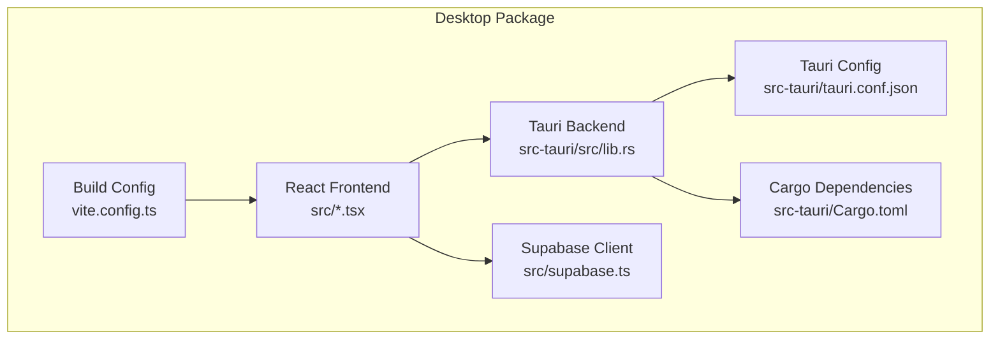
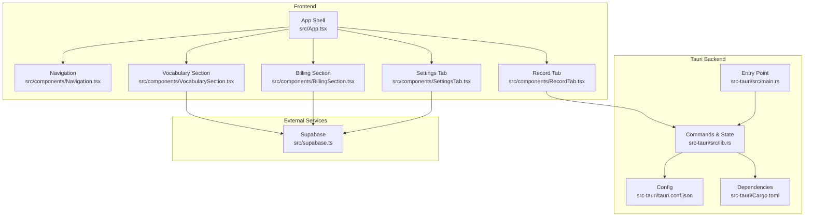
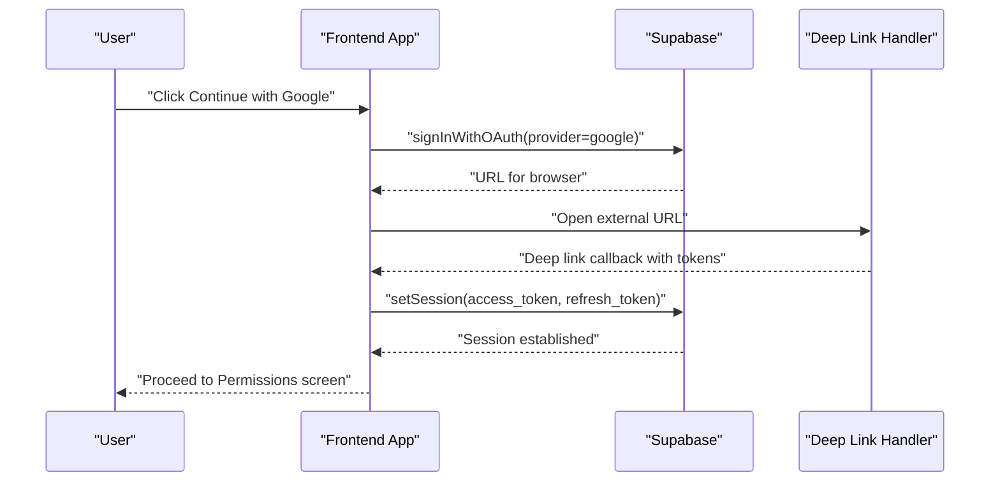
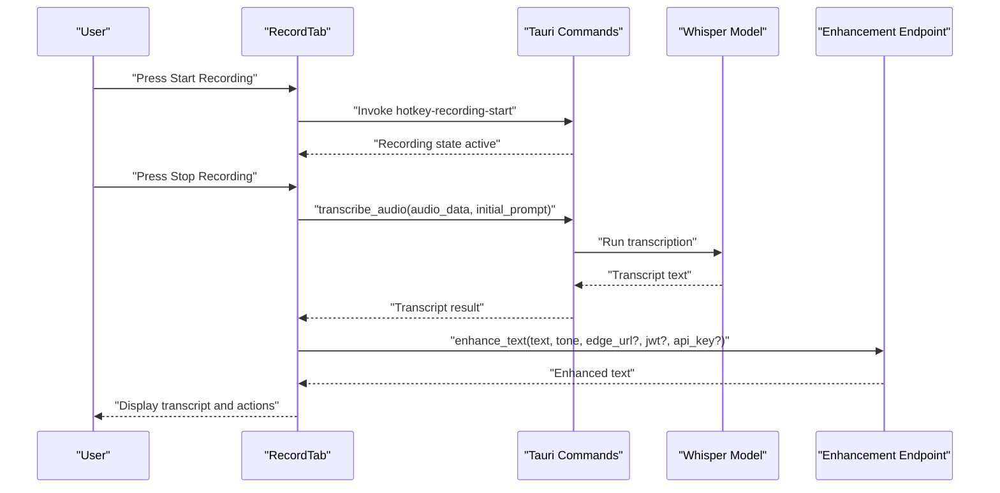
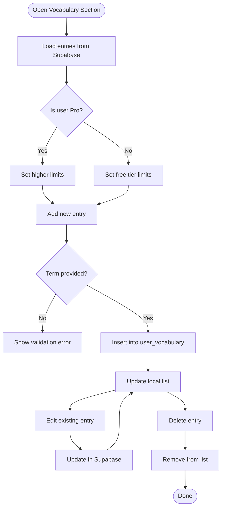
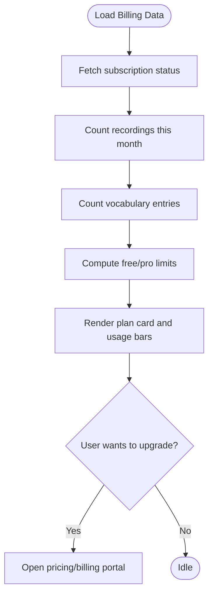
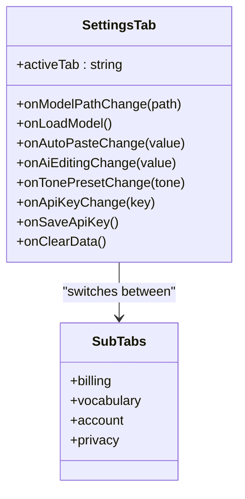
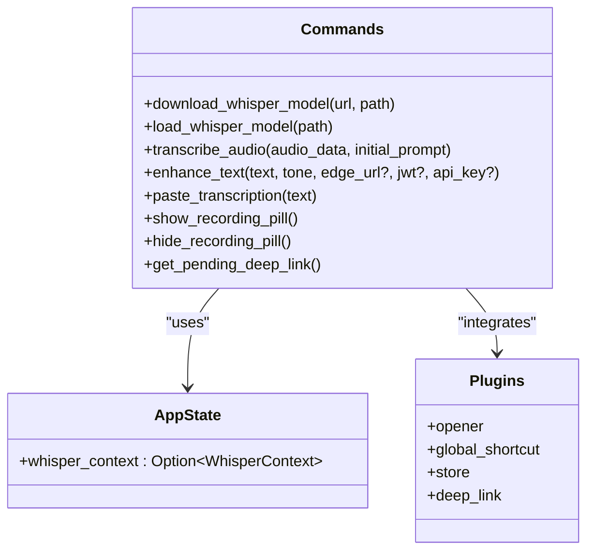
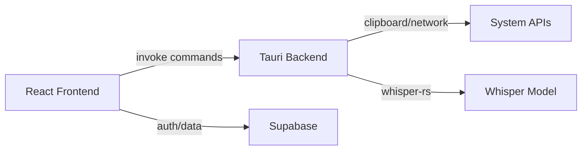

# Desktop Application

<cite>
**Referenced Files in This Document**
- [README.md](file://README.md)
- [package.json](file://package.json)
- [pnpm-workspace.yaml](file://pnpm-workspace.yaml)
- [packages/desktop/src/main.tsx](file://packages/desktop/src/main.tsx)
- [packages/desktop/src/App.tsx](file://packages/desktop/src/App.tsx)
- [packages/desktop/src/components/Navigation.tsx](file://packages/desktop/src/components/Navigation.tsx)
- [packages/desktop/src/components/RecordTab.tsx](file://packages/desktop/src/components/RecordTab.tsx)
- [packages/desktop/src/components/VocabularySection.tsx](file://packages/desktop/src/components/VocabularySection.tsx)
- [packages/desktop/src/components/BillingSection.tsx](file://packages/desktop/src/components/BillingSection.tsx)
- [packages/desktop/src/components/SettingsTab.tsx](file://packages/desktop/src/components/SettingsTab.tsx)
- [packages/desktop/src/supabase.ts](file://packages/desktop/src/supabase.ts)
- [packages/desktop/vite.config.ts](file://packages/desktop/vite.config.ts)
- [packages/desktop/src-tauri/tauri.conf.json](file://packages/desktop/src-tauri/tauri.conf.json)
- [packages/desktop/src-tauri/Cargo.toml](file://packages/desktop/src-tauri/Cargo.toml)
- [packages/desktop/src-tauri/src/main.rs](file://packages/desktop/src-tauri/src/main.rs)
- [packages/desktop/src-tauri/src/lib.rs](file://packages/desktop/src-tauri/src/lib.rs)
</cite>

## Table of Contents
1. [Introduction](#introduction)
2. [Project Structure](#project-structure)
3. [Core Components](#core-components)
4. [Architecture Overview](#architecture-overview)
5. [Detailed Component Analysis](#detailed-component-analysis)
6. [Dependency Analysis](#dependency-analysis)
7. [Performance Considerations](#performance-considerations)
8. [Troubleshooting Guide](#troubleshooting-guide)
9. [Conclusion](#conclusion)

## Introduction
This document describes the Desktop Application built with Tauri and React. It is part of a monorepo that also includes a Web application and shared code. The desktop app provides voice-to-text transcription, optional AI enhancement, a personal vocabulary database synchronized via Supabase, and subscription-based billing features. It supports global hotkeys for instant dictation and integrates with system clipboard for seamless text insertion.

## Project Structure
The desktop package is organized into:
- Frontend (React + TypeScript): UI screens, components, and styling
- Tauri backend (Rust): commands for model download/transcription, AI enhancement, clipboard paste, recording overlay, and global shortcuts
- Supabase integration: authentication and data synchronization
- Build configuration: Vite for dev/build and Tauri for bundling

**Diagram sources**
- [packages/desktop/src/main.tsx:1-11](file://packages/desktop/src/main.tsx#L1-L11)
- [packages/desktop/src/App.tsx:1-1285](file://packages/desktop/src/App.tsx#L1-L1285)
- [packages/desktop/vite.config.ts:1-39](file://packages/desktop/vite.config.ts#L1-L39)
- [packages/desktop/src-tauri/src/lib.rs:1-558](file://packages/desktop/src-tauri/src/lib.rs#L1-L558)
- [packages/desktop/src-tauri/tauri.conf.json:1-51](file://packages/desktop/src-tauri/tauri.conf.json#L1-L51)
- [packages/desktop/src-tauri/Cargo.toml:1-36](file://packages/desktop/src-tauri/Cargo.toml#L1-L36)
- [packages/desktop/src/supabase.ts:1-9](file://packages/desktop/src/supabase.ts#L1-L9)

**Section sources**
- [README.md:1-51](file://README.md#L1-L51)
- [pnpm-workspace.yaml:1-3](file://pnpm-workspace.yaml#L1-L3)
- [package.json:1-11](file://package.json#L1-L11)

## Core Components
- App shell and onboarding: authentication, permissions, and initial setup flows
- Navigation sidebar and tabbed views: Record, Vocabulary, Billing, Settings
- Recording tab: controls for recording, processing status, AI editing, and transcript actions
- Vocabulary section: CRUD for custom words/phrases with free/pro limits
- Billing section: subscription status, usage stats, and upgrade prompts
- Settings tab: subscription portal links, vocabulary management, profile info, privacy/data export, and data clearing
- Supabase integration: authentication state, session handling, and data sync
- Tauri commands: model download, Whisper transcription, AI enhancement, clipboard paste, recording overlay, global shortcuts, and deep links

**Section sources**
- [packages/desktop/src/App.tsx:1-1285](file://packages/desktop/src/App.tsx#L1-L1285)
- [packages/desktop/src/components/Navigation.tsx:1-62](file://packages/desktop/src/components/Navigation.tsx#L1-L62)
- [packages/desktop/src/components/RecordTab.tsx:1-177](file://packages/desktop/src/components/RecordTab.tsx#L1-L177)
- [packages/desktop/src/components/VocabularySection.tsx:1-323](file://packages/desktop/src/components/VocabularySection.tsx#L1-L323)
- [packages/desktop/src/components/BillingSection.tsx:1-265](file://packages/desktop/src/components/BillingSection.tsx#L1-L265)
- [packages/desktop/src/components/SettingsTab.tsx:1-236](file://packages/desktop/src/components/SettingsTab.tsx#L1-L236)
- [packages/desktop/src/supabase.ts:1-9](file://packages/desktop/src/supabase.ts#L1-L9)

## Architecture Overview
The desktop app uses a hybrid architecture:
- React frontend handles UI, routing between onboarding and main app, and user interactions
- Tauri backend exposes native commands for system-level tasks (clipboard, global shortcuts, window management) and AI/model operations
- Supabase provides authentication and data persistence for user vocabularies and subscriptions
- Vite manages the frontend dev/build pipeline; Tauri bundles the app for distribution

**Diagram sources**
- [packages/desktop/src/App.tsx:1-1285](file://packages/desktop/src/App.tsx#L1-L1285)
- [packages/desktop/src/components/Navigation.tsx:1-62](file://packages/desktop/src/components/Navigation.tsx#L1-L62)
- [packages/desktop/src/components/RecordTab.tsx:1-177](file://packages/desktop/src/components/RecordTab.tsx#L1-L177)
- [packages/desktop/src/components/VocabularySection.tsx:1-323](file://packages/desktop/src/components/VocabularySection.tsx#L1-L323)
- [packages/desktop/src/components/BillingSection.tsx:1-265](file://packages/desktop/src/components/BillingSection.tsx#L1-L265)
- [packages/desktop/src/components/SettingsTab.tsx:1-236](file://packages/desktop/src/components/SettingsTab.tsx#L1-L236)
- [packages/desktop/src-tauri/src/lib.rs:1-558](file://packages/desktop/src-tauri/src/lib.rs#L1-L558)
- [packages/desktop/src-tauri/src/main.rs:1-7](file://packages/desktop/src-tauri/src/main.rs#L1-L7)
- [packages/desktop/src-tauri/tauri.conf.json:1-51](file://packages/desktop/src-tauri/tauri.conf.json#L1-L51)
- [packages/desktop/src-tauri/Cargo.toml:1-36](file://packages/desktop/src-tauri/Cargo.toml#L1-L36)
- [packages/desktop/src/supabase.ts:1-9](file://packages/desktop/src/supabase.ts#L1-L9)

## Detailed Component Analysis

### Authentication and Onboarding
The app guides users through three steps:
- Sign in with Google (OAuth) using Supabase
- Grant permissions for microphone and accessibility/global hotkey
- Download Whisper model and optionally configure an AI API key

**Diagram sources**
- [packages/desktop/src/App.tsx:198-374](file://packages/desktop/src/App.tsx#L198-L374)
- [packages/desktop/src-tauri/src/lib.rs:457-462](file://packages/desktop/src-tauri/src/lib.rs#L457-L462)

**Section sources**
- [packages/desktop/src/App.tsx:198-374](file://packages/desktop/src/App.tsx#L198-L374)
- [packages/desktop/src-tauri/src/lib.rs:457-462](file://packages/desktop/src-tauri/src/lib.rs#L457-L462)

### Recording and Transcription Pipeline
The recording tab controls recording, processing status, and optional AI editing. The backend performs:
- Audio capture and buffering
- Whisper model transcription
- Optional AI enhancement via Supabase Edge Function or user-provided API key

**Diagram sources**
- [packages/desktop/src/components/RecordTab.tsx:1-177](file://packages/desktop/src/components/RecordTab.tsx#L1-L177)
- [packages/desktop/src-tauri/src/lib.rs:131-179](file://packages/desktop/src-tauri/src/lib.rs#L131-L179)
- [packages/desktop/src-tauri/src/lib.rs:210-350](file://packages/desktop/src-tauri/src/lib.rs#L210-L350)

**Section sources**
- [packages/desktop/src/components/RecordTab.tsx:1-177](file://packages/desktop/src/components/RecordTab.tsx#L1-L177)
- [packages/desktop/src-tauri/src/lib.rs:131-179](file://packages/desktop/src-tauri/src/lib.rs#L131-L179)
- [packages/desktop/src-tauri/src/lib.rs:210-350](file://packages/desktop/src-tauri/src/lib.rs#L210-L350)

### Personal Vocabulary Management
Users can add, edit, and delete vocabulary entries. Free users are limited; Pro users have higher limits. Data is stored in Supabase and synced when authenticated.

**Diagram sources**
- [packages/desktop/src/components/VocabularySection.tsx:1-323](file://packages/desktop/src/components/VocabularySection.tsx#L1-L323)

**Section sources**
- [packages/desktop/src/components/VocabularySection.tsx:1-323](file://packages/desktop/src/components/VocabularySection.tsx#L1-L323)

### Billing and Usage
The Billing section displays subscription status, monthly usage, and upgrade options. It queries Supabase for subscription and counts of recordings and vocabulary entries.

**Diagram sources**
- [packages/desktop/src/components/BillingSection.tsx:1-265](file://packages/desktop/src/components/BillingSection.tsx#L1-L265)

**Section sources**
- [packages/desktop/src/components/BillingSection.tsx:1-265](file://packages/desktop/src/components/BillingSection.tsx#L1-L265)

### Settings and Data Controls
The Settings tab organizes related configuration areas:
- Plans & Billing: links to external portals
- Vocabulary: links to external management
- Account: profile information and account deletion
- Data & Privacy: export requests and legal links; clear local data

**Diagram sources**
- [packages/desktop/src/components/SettingsTab.tsx:1-236](file://packages/desktop/src/components/SettingsTab.tsx#L1-L236)

**Section sources**
- [packages/desktop/src/components/SettingsTab.tsx:1-236](file://packages/desktop/src/components/SettingsTab.tsx#L1-L236)

### Tauri Backend Commands and State
The Rust backend exposes commands for:
- Model lifecycle: download, load, transcribe
- AI enhancement: proxy via Edge Function or direct DeepSeek API
- Clipboard operations: copy and simulate paste
- Global shortcuts: register Ctrl+Space for recording
- Recording overlay: show/hide a floating UI element
- Deep link handling: capture and emit callbacks

**Diagram sources**
- [packages/desktop/src-tauri/src/lib.rs:27-35](file://packages/desktop/src-tauri/src/lib.rs#L27-L35)
- [packages/desktop/src-tauri/src/lib.rs:46-127](file://packages/desktop/src-tauri/src/lib.rs#L46-L127)
- [packages/desktop/src-tauri/src/lib.rs:131-179](file://packages/desktop/src-tauri/src/lib.rs#L131-L179)
- [packages/desktop/src-tauri/src/lib.rs:210-350](file://packages/desktop/src-tauri/src/lib.rs#L210-L350)
- [packages/desktop/src-tauri/src/lib.rs:415-453](file://packages/desktop/src-tauri/src/lib.rs#L415-L453)
- [packages/desktop/src-tauri/src/lib.rs:457-462](file://packages/desktop/src-tauri/src/lib.rs#L457-L462)
- [packages/desktop/src-tauri/src/lib.rs:471-488](file://packages/desktop/src-tauri/src/lib.rs#L471-L488)

**Section sources**
- [packages/desktop/src-tauri/src/lib.rs:1-558](file://packages/desktop/src-tauri/src/lib.rs#L1-L558)

## Dependency Analysis
- Frontend depends on Tauri APIs for commands and Supabase for auth/data
- Tauri depends on system plugins and Rust crates for audio processing, networking, and clipboard operations
- Supabase provides authentication and relational data storage

**Diagram sources**
- [packages/desktop/src-tauri/Cargo.toml:15-30](file://packages/desktop/src-tauri/Cargo.toml#L15-L30)
- [packages/desktop/src-tauri/src/lib.rs:1-13](file://packages/desktop/src-tauri/src/lib.rs#L1-L13)
- [packages/desktop/src/supabase.ts:1-9](file://packages/desktop/src/supabase.ts#L1-L9)

**Section sources**
- [packages/desktop/src-tauri/Cargo.toml:1-36](file://packages/desktop/src-tauri/Cargo.toml#L1-L36)
- [packages/desktop/src-tauri/src/lib.rs:1-558](file://packages/desktop/src-tauri/src/lib.rs#L1-L558)
- [packages/desktop/src/supabase.ts:1-9](file://packages/desktop/src/supabase.ts#L1-L9)

## Performance Considerations
- Model download streams progress updates to avoid UI blocking
- Whisper transcription runs synchronously in the backend; keep audio chunks reasonable to minimize latency
- AI enhancement requests are bounded by timeouts; consider retry logic for transient failures
- Clipboard operations are asynchronous per platform; ensure minimal delays before sending keystrokes
- Global shortcut registration avoids conflicts by using a modifier-only combination

[No sources needed since this section provides general guidance]

## Troubleshooting Guide
Common issues and resolutions:
- Authentication timeout: the OAuth flow polls for session; ensure the redirect URL matches configuration and network connectivity is stable
- Hotkey not working: verify Accessibility permissions in system settings; the backend emits a warning when registration fails
- Model download stuck: check network connectivity and destination path permissions; progress events indicate bytes downloaded
- AI enhancement errors: confirm API key validity or Edge Function availability; inspect returned error messages
- Clipboard paste not inserting: ensure the target app is focused and platform-specific automation is supported

**Section sources**
- [packages/desktop/src/App.tsx:204-244](file://packages/desktop/src/App.tsx#L204-L244)
- [packages/desktop/src-tauri/src/lib.rs:506-536](file://packages/desktop/src-tauri/src/lib.rs#L506-L536)
- [packages/desktop/src-tauri/src/lib.rs:46-112](file://packages/desktop/src-tauri/src/lib.rs#L46-L112)
- [packages/desktop/src-tauri/src/lib.rs:210-350](file://packages/desktop/src-tauri/src/lib.rs#L210-L350)
- [packages/desktop/src-tauri/src/lib.rs:415-453](file://packages/desktop/src-tauri/src/lib.rs#L415-L453)

## Conclusion
The Desktop Application combines a modern React UI with a robust Tauri backend to deliver a powerful voice-to-text experience. It emphasizes privacy by keeping processing local, offers optional AI enhancement, and integrates seamlessly with Supabase for authentication and data. The modular component design and clear separation of concerns make the codebase maintainable and extensible.