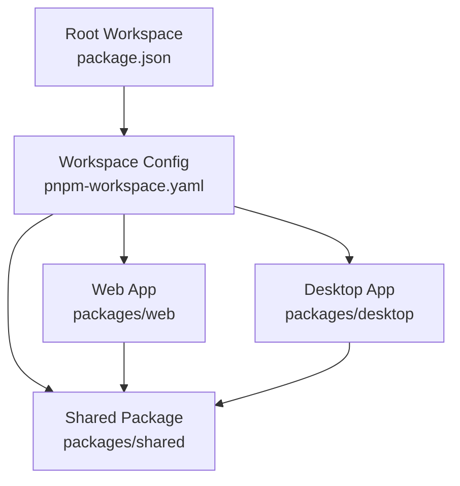
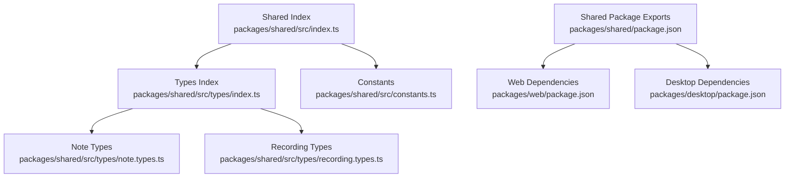
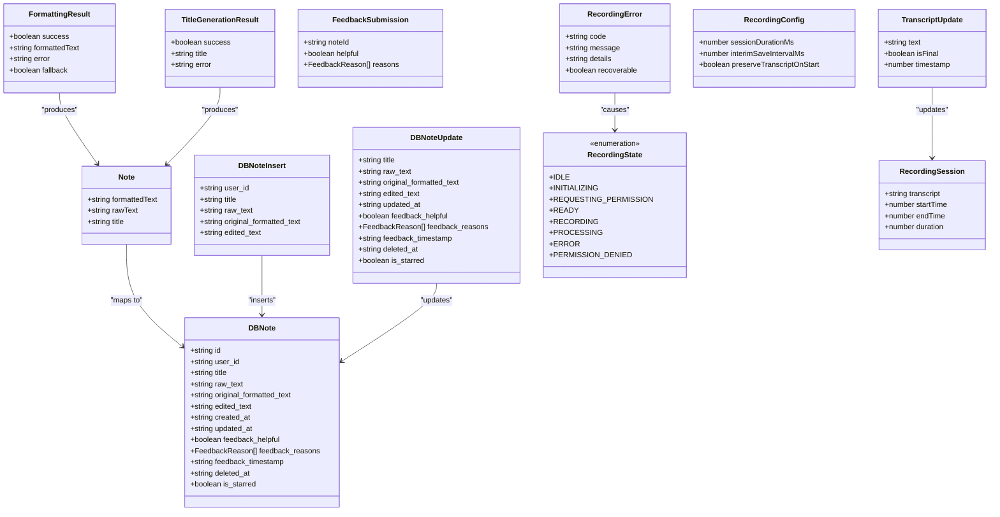
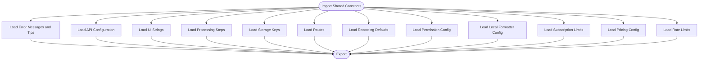
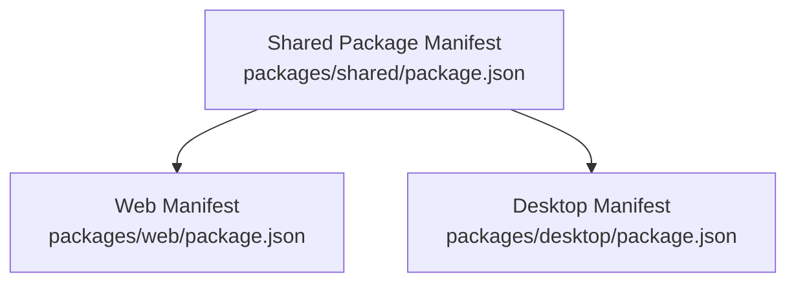

# Shared Codebase

<cite>
**Referenced Files in This Document**
- [README.md](file://README.md)
- [package.json](file://package.json)
- [pnpm-workspace.yaml](file://pnpm-workspace.yaml)
- [packages/shared/src/index.ts](file://packages/shared/src/index.ts)
- [packages/shared/src/constants.ts](file://packages/shared/src/constants.ts)
- [packages/shared/src/types/index.ts](file://packages/shared/src/types/index.ts)
- [packages/shared/src/types/note.types.ts](file://packages/shared/src/types/note.types.ts)
- [packages/shared/src/types/recording.types.ts](file://packages/shared/src/types/recording.types.ts)
- [packages/shared/package.json](file://packages/shared/package.json)
- [packages/web/package.json](file://packages/web/package.json)
- [packages/desktop/package.json](file://packages/desktop/package.json)
</cite>

## Table of Contents
1. [Introduction](#introduction)
2. [Project Structure](#project-structure)
3. [Core Components](#core-components)
4. [Architecture Overview](#architecture-overview)
5. [Detailed Component Analysis](#detailed-component-analysis)
6. [Dependency Analysis](#dependency-analysis)
7. [Performance Considerations](#performance-considerations)
8. [Troubleshooting Guide](#troubleshooting-guide)
9. [Conclusion](#conclusion)

## Introduction
This document describes the shared codebase that underpins the Oscar monorepo. The shared package centralizes cross-platform types, constants, and utilities used by both the web and desktop applications. It ensures consistency in behavior, configuration, and data modeling across platforms while enabling platform-specific implementations to coexist.

## Project Structure
The repository is organized as a monorepo with three top-level packages:
- packages/web: Next.js web application
- packages/desktop: Tauri desktop application
- packages/shared: Shared types, constants, and utilities

Development scripts at the root enable launching each app independently. The shared package is exported via TypeScript entry points and consumed by both web and desktop projects.

**Diagram sources**
- [package.json:1-11](file://package.json#L1-L11)
- [pnpm-workspace.yaml:1-3](file://pnpm-workspace.yaml#L1-L3)

**Section sources**
- [README.md:1-51](file://README.md#L1-L51)
- [package.json:1-11](file://package.json#L1-L11)
- [pnpm-workspace.yaml:1-3](file://pnpm-workspace.yaml#L1-L3)

## Core Components
The shared codebase consists of:
- Export surface: re-exports of types and constants for convenient imports
- Types: strongly typed interfaces and enums for notes and recording sessions
- Constants: centralized configuration for error messages, UI strings, API endpoints, processing steps, storage keys, routes, recording defaults, permissions, local formatting, subscriptions, pricing, currency, and rate limits

These components are designed to be imported by both the web and desktop applications to maintain parity in behavior and configuration.

**Section sources**
- [packages/shared/src/index.ts:1-6](file://packages/shared/src/index.ts#L1-L6)
- [packages/shared/src/types/index.ts:1-3](file://packages/shared/src/types/index.ts#L1-L3)
- [packages/shared/src/types/note.types.ts:1-83](file://packages/shared/src/types/note.types.ts#L1-L83)
- [packages/shared/src/types/recording.types.ts:1-39](file://packages/shared/src/types/recording.types.ts#L1-L39)
- [packages/shared/src/constants.ts:1-314](file://packages/shared/src/constants.ts#L1-L314)

## Architecture Overview
The shared package acts as a library consumed by the web and desktop applications. It exposes:
- A primary index that re-exports types and constants
- Named exports for types and constants to support selective imports

Both consuming applications depend on the shared package via workspace references, ensuring synchronized updates and consistent behavior across platforms.

**Diagram sources**
- [packages/shared/src/index.ts:1-6](file://packages/shared/src/index.ts#L1-L6)
- [packages/shared/src/types/index.ts:1-3](file://packages/shared/src/types/index.ts#L1-L3)
- [packages/shared/src/types/note.types.ts:1-83](file://packages/shared/src/types/note.types.ts#L1-L83)
- [packages/shared/src/types/recording.types.ts:1-39](file://packages/shared/src/types/recording.types.ts#L1-L39)
- [packages/shared/src/constants.ts:1-314](file://packages/shared/src/constants.ts#L1-L314)
- [packages/shared/package.json:7-11](file://packages/shared/package.json#L7-L11)
- [packages/web/package.json:11-44](file://packages/web/package.json#L11-L44)
- [packages/desktop/package.json:12-29](file://packages/desktop/package.json#L12-L29)

## Detailed Component Analysis

### Shared Types
The shared types module defines:
- Note-related interfaces for formatted text, raw text, and database-backed notes
- Feedback submission structures and soft-delete metadata
- Recording state machine, transcript updates, recording configuration, and error structures
- Results for formatting and title generation

These types unify data contracts across the web and desktop apps, reducing duplication and improving maintainability.

**Diagram sources**
- [packages/shared/src/types/note.types.ts:3-83](file://packages/shared/src/types/note.types.ts#L3-L83)
- [packages/shared/src/types/recording.types.ts:3-39](file://packages/shared/src/types/recording.types.ts#L3-L39)

**Section sources**
- [packages/shared/src/types/note.types.ts:1-83](file://packages/shared/src/types/note.types.ts#L1-L83)
- [packages/shared/src/types/recording.types.ts:1-39](file://packages/shared/src/types/recording.types.ts#L1-L39)

### Shared Constants
The shared constants module centralizes:
- Error messages and tips for browser/device issues, permissions, recording, processing, API failures, and storage errors
- API configuration including internal endpoints and external provider settings
- UI strings for branding, page titles, loading states, defaults, actions, sections, toasts, home page copy, recording instructions, and download filenames
- Processing steps for the UI
- Session storage keys
- Routes
- Recording configuration defaults
- Permission handling configuration
- Local formatter configuration for fallback text processing
- Subscription tier limits
- Pricing configuration (INR and USD)
- Rate limiting configuration for AI and payment endpoints

These constants ensure consistent messaging, behavior, and configuration across platforms.

**Diagram sources**
- [packages/shared/src/constants.ts:6-314](file://packages/shared/src/constants.ts#L6-L314)

**Section sources**
- [packages/shared/src/constants.ts:1-314](file://packages/shared/src/constants.ts#L1-L314)

### Shared Package Exports
The shared package defines its export surface to support:
- Primary index re-exporting types and constants
- Named exports for types and constants to enable selective imports

Consumers (web and desktop) rely on these exports to import shared types and constants consistently.

**Section sources**
- [packages/shared/src/index.ts:1-6](file://packages/shared/src/index.ts#L1-L6)
- [packages/shared/src/types/index.ts:1-3](file://packages/shared/src/types/index.ts#L1-L3)
- [packages/shared/package.json:7-11](file://packages/shared/package.json#L7-L11)

## Dependency Analysis
The shared package is consumed by both the web and desktop applications. The root workspace configuration and package manifests define:
- Workspace scoping for all packages
- Shared package exports for types and constants
- Consumer dependencies on the shared package via workspace protocol

**Diagram sources**
- [packages/shared/package.json:7-11](file://packages/shared/package.json#L7-L11)
- [packages/web/package.json:11-44](file://packages/web/package.json#L11-L44)
- [packages/desktop/package.json:12-29](file://packages/desktop/package.json#L12-L29)

**Section sources**
- [pnpm-workspace.yaml:1-3](file://pnpm-workspace.yaml#L1-L3)
- [packages/shared/package.json:1-19](file://packages/shared/package.json#L1-L19)
- [packages/web/package.json:1-58](file://packages/web/package.json#L1-L58)
- [packages/desktop/package.json:1-44](file://packages/desktop/package.json#L1-L44)

## Performance Considerations
- Centralized constants reduce duplication and minimize runtime branching by providing unified configuration for error handling, API endpoints, UI strings, and rate limits.
- Strongly typed interfaces improve developer productivity and reduce runtime errors, indirectly contributing to performance by catching issues earlier.
- Selective imports via named exports help keep bundle sizes lean in platform-specific apps.

## Troubleshooting Guide
Common areas to verify when encountering issues:
- Ensure the shared package is rebuilt after changes to types or constants.
- Confirm that consumers import from the shared package using the correct named or default exports.
- Validate that environment-specific configurations (e.g., API keys, endpoints) align with the shared constants where applicable.
- Check rate limit thresholds for AI and payment endpoints to avoid throttling.

**Section sources**
- [packages/shared/src/constants.ts:276-314](file://packages/shared/src/constants.ts#L276-L314)
- [packages/shared/package.json:7-11](file://packages/shared/package.json#L7-L11)

## Conclusion
The shared codebase provides a cohesive foundation for the Oscar monorepo by unifying types, constants, and utilities across the web and desktop applications. Its modular exports and centralized configuration promote consistency, maintainability, and scalability as the project evolves.