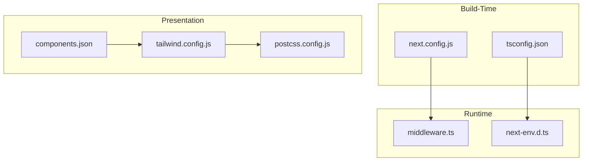
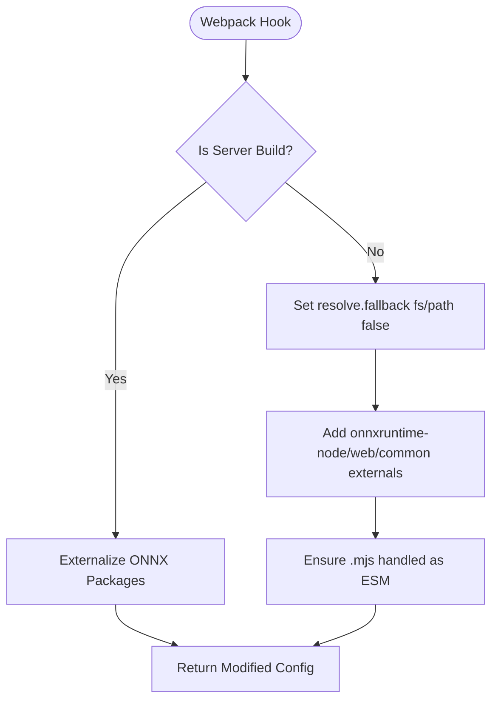
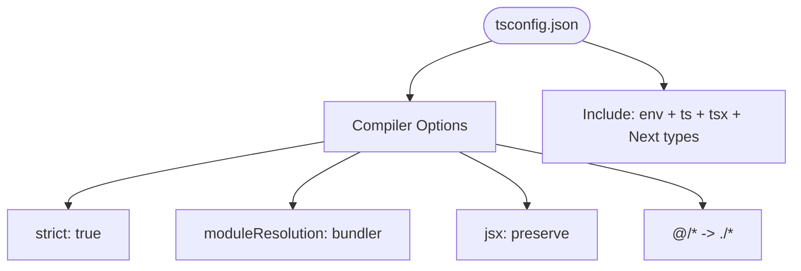
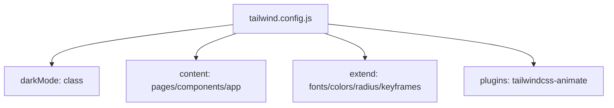
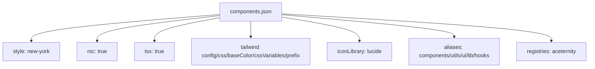
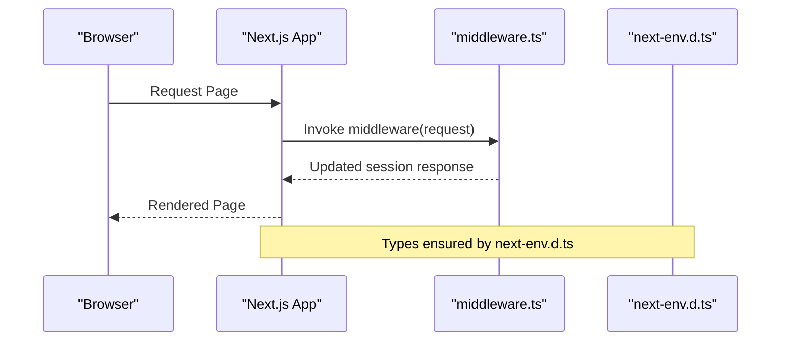
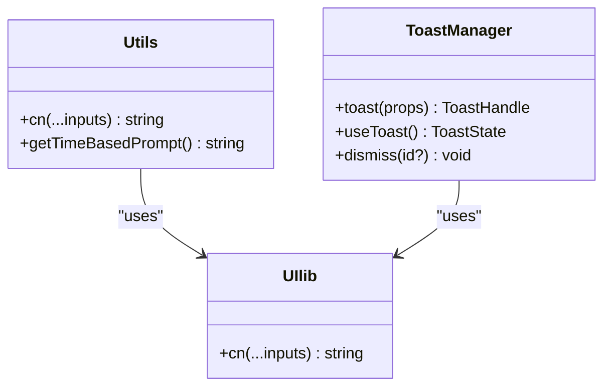
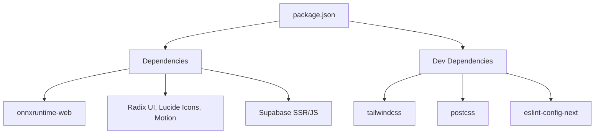

# Configuration & Customization

<cite>
**Referenced Files in This Document**
- [next.config.js](file://next.config.js)
- [tsconfig.json](file://tsconfig.json)
- [tailwind.config.js](file://tailwind.config.js)
- [postcss.config.js](file://postcss.config.js)
- [package.json](file://package.json)
- [components.json](file://components.json)
- [middleware.ts](file://middleware.ts)
- [next-env.d.ts](file://next-env.d.ts)
- [lib/constants.ts](file://lib/constants.ts)
- [lib/utils.ts](file://lib/utils.ts)
- [lib/prompts.ts](file://lib/prompts.ts)
- [components/ui/lib.ts](file://components/ui/lib.ts)
- [hooks/use-toast.ts](file://hooks/use-toast.ts)
</cite>

## Table of Contents
1. [Introduction](#introduction)
2. [Project Structure](#project-structure)
3. [Core Components](#core-components)
4. [Architecture Overview](#architecture-overview)
5. [Detailed Component Analysis](#detailed-component-analysis)
6. [Dependency Analysis](#dependency-analysis)
7. [Performance Considerations](#performance-considerations)
8. [Troubleshooting Guide](#troubleshooting-guide)
9. [Conclusion](#conclusion)
10. [Appendices](#appendices)

## Introduction
This document explains how to configure and customize OSCAR, focusing on build settings, environment configuration, and application customization. It covers Next.js configuration (including build optimization and image optimization), TypeScript configuration, Tailwind CSS setup, component library configuration, environment variable management, constant definitions, and utility function usage. It also provides examples for customizing appearance, behavior, and functionality, along with performance optimization, bundle analysis, deployment configuration, extension points, and best practices for managing configuration across development, staging, and production environments.

## Project Structure
OSCAR follows a Next.js App Router project layout with a clear separation of concerns:
- Next.js configuration resides in next.config.js.
- TypeScript configuration is centralized in tsconfig.json.
- Tailwind CSS is configured in tailwind.config.js with PostCSS in postcss.config.js.
- UI components and utilities live under components/ and lib/.
- Middleware manages session updates globally.
- Environment typing is declared in next-env.d.ts.
- Component library configuration is defined in components.json.

```mermaid
graph TB
A["next.config.js"] --> B["Webpack Config<br/>ONNX externalization"]
A --> C["Images Remote Patterns"]
D["tsconfig.json"] --> E["TypeScript Compiler Options"]
F["tailwind.config.js"] --> G["Tailwind Content Paths"]
F --> H["Theme Extensions"]
I["postcss.config.js"] --> J["Plugins: Tailwind + Autoprefixer"]
K["components.json"] --> L["UI Registry & Aliases"]
M["middleware.ts"] --> N["Session Update"]
O["next-env.d.ts"] --> P["Type Declarations"]
Q["lib/constants.ts"] --> R["App Constants"]
S["lib/utils.ts"] --> T["Utility Functions"]
U["lib/prompts.ts"] --> V["AI Prompts"]
W["hooks/use-toast.ts"] --> X["Toast Manager"]
```

**Diagram sources**
- [next.config.js](file://next.config.js#L1-L95)
- [tsconfig.json](file://tsconfig.json#L1-L29)
- [tailwind.config.js](file://tailwind.config.js#L1-L101)
- [postcss.config.js](file://postcss.config.js#L1-L8)
- [components.json](file://components.json#L1-L25)
- [middleware.ts](file://middleware.ts#L1-L21)
- [next-env.d.ts](file://next-env.d.ts#L1-L7)
- [lib/constants.ts](file://lib/constants.ts#L1-L314)
- [lib/utils.ts](file://lib/utils.ts#L1-L32)
- [lib/prompts.ts](file://lib/prompts.ts#L1-L458)
- [hooks/use-toast.ts](file://hooks/use-toast.ts#L1-L195)

**Section sources**
- [next.config.js](file://next.config.js#L1-L95)
- [tsconfig.json](file://tsconfig.json#L1-L29)
- [tailwind.config.js](file://tailwind.config.js#L1-L101)
- [postcss.config.js](file://postcss.config.js#L1-L8)
- [components.json](file://components.json#L1-L25)
- [middleware.ts](file://middleware.ts#L1-L21)
- [next-env.d.ts](file://next-env.d.ts#L1-L7)

## Core Components
- Next.js configuration: Build optimization, image remote patterns, and Webpack customization for ONNX/WASM multi-threading support.
- TypeScript configuration: Strict mode, module resolution, JSX preservation, and path aliases.
- Tailwind CSS: Dark mode, content scanning, theme extensions, and animation plugins.
- Component library: shadcn/ui configuration with aliases and registry.
- Utilities and constants: Centralized constants, prompt sanitization, and utility functions for class merging and time-based prompts.
- Middleware: Global session update for Supabase.
- Environment typing: Type declarations for Next.js types and generated routes.

**Section sources**
- [next.config.js](file://next.config.js#L1-L95)
- [tsconfig.json](file://tsconfig.json#L1-L29)
- [tailwind.config.js](file://tailwind.config.js#L1-L101)
- [components.json](file://components.json#L1-L25)
- [lib/constants.ts](file://lib/constants.ts#L1-L314)
- [lib/utils.ts](file://lib/utils.ts#L1-L32)
- [lib/prompts.ts](file://lib/prompts.ts#L1-L458)
- [middleware.ts](file://middleware.ts#L1-L21)
- [next-env.d.ts](file://next-env.d.ts#L1-L7)

## Architecture Overview
The configuration architecture ties together build-time, runtime, and presentation layers:
- Build-time: Next.js Webpack customization externalizes ONNX packages and adjusts fallbacks for client-side builds.
- Runtime: Middleware updates sessions; environment typing ensures type-safe runtime behavior.
- Presentation: Tailwind CSS and PostCSS define design tokens and animations; component library aliases streamline imports.

**Diagram sources**
- [next.config.js](file://next.config.js#L1-L95)
- [tsconfig.json](file://tsconfig.json#L1-L29)
- [middleware.ts](file://middleware.ts#L1-L21)
- [next-env.d.ts](file://next-env.d.ts#L1-L7)
- [tailwind.config.js](file://tailwind.config.js#L1-L101)
- [postcss.config.js](file://postcss.config.js#L1-L8)
- [components.json](file://components.json#L1-L25)

## Detailed Component Analysis

### Next.js Configuration
Key areas:
- Image optimization: Remote patterns for Unsplash and Google profile images.
- Webpack customization: Client-side fallbacks for fs/path; server-side externalization of ONNX packages; ESM handling for .mjs.
- Optional COOP/COEP headers are present as commented configuration.

**Diagram sources**
- [next.config.js](file://next.config.js#L35-L91)

**Section sources**
- [next.config.js](file://next.config.js#L1-L95)

### TypeScript Configuration
Highlights:
- Strict mode enabled with isolated modules and no emit.
- Bundler module resolution and JSX preserve for Next.js.
- Path alias @/* mapped to project root.
- Incremental builds enabled.

**Diagram sources**
- [tsconfig.json](file://tsconfig.json#L2-L26)

**Section sources**
- [tsconfig.json](file://tsconfig.json#L1-L29)
- [next-env.d.ts](file://next-env.d.ts#L1-L7)

### Tailwind CSS Setup
Highlights:
- Dark mode via class strategy.
- Content scanning across pages, components, and app directories.
- Theme extensions for fonts, semantic colors, border radius, and accordion animations.
- Plugin for animations.

**Diagram sources**
- [tailwind.config.js](file://tailwind.config.js#L1-L101)

**Section sources**
- [tailwind.config.js](file://tailwind.config.js#L1-L101)
- [postcss.config.js](file://postcss.config.js#L1-L8)

### Component Library Configuration
shadcn/ui configuration:
- Style variant, RSC, TSX.
- Tailwind config, CSS file, base color, CSS variables.
- Icon library set to lucide.
- Aliases for components, utils, UI, lib, hooks.
- Registry for aceternity.

**Diagram sources**
- [components.json](file://components.json#L1-L25)

**Section sources**
- [components.json](file://components.json#L1-L25)

### Environment Variable Management and Runtime Configuration
- Environment typing is declared for Next.js and generated routes.
- Middleware updates sessions globally for protected routes.
- Constants and prompts centralize configuration for API endpoints, UI strings, and rate limits.

**Diagram sources**
- [middleware.ts](file://middleware.ts#L1-L21)
- [next-env.d.ts](file://next-env.d.ts#L1-L7)

**Section sources**
- [next-env.d.ts](file://next-env.d.ts#L1-L7)
- [middleware.ts](file://middleware.ts#L1-L21)
- [lib/constants.ts](file://lib/constants.ts#L1-L314)
- [lib/prompts.ts](file://lib/prompts.ts#L1-L458)

### Utility Functions and Component Utilities
- Utility function for merging Tailwind classes.
- Time-based prompt generator for contextual UX.
- Toast manager for user notifications.

**Diagram sources**
- [lib/utils.ts](file://lib/utils.ts#L1-L32)
- [hooks/use-toast.ts](file://hooks/use-toast.ts#L1-L195)
- [components/ui/lib.ts](file://components/ui/lib.ts#L1-L7)

**Section sources**
- [lib/utils.ts](file://lib/utils.ts#L1-L32)
- [hooks/use-toast.ts](file://hooks/use-toast.ts#L1-L195)
- [components/ui/lib.ts](file://components/ui/lib.ts#L1-L7)

## Dependency Analysis
- Next.js dependencies include onnxruntime-web and related packages for speech processing.
- Tailwind CSS and PostCSS are configured for design system and autoprefixing.
- Package scripts define dev, build, start, and lint commands.

**Diagram sources**
- [package.json](file://package.json#L1-L53)

**Section sources**
- [package.json](file://package.json#L1-L53)

## Performance Considerations
- Webpack externalization of ONNX packages reduces client bundle size and avoids bundling WASM-heavy modules.
- Client-side resolve.fallback disables fs/path to avoid polyfills.
- Strict TypeScript settings and incremental builds improve DX and reduce type-check overhead.
- Tailwind content scanning should be scoped to minimize rebuilds.
- Middleware matcher excludes static assets and API routes to reduce unnecessary processing.

[No sources needed since this section provides general guidance]

## Troubleshooting Guide
Common issues and resolutions:
- ONNX/WASM multi-threading: Ensure client-side externalization and server-side externalization are both configured as in the Next.js config.
- Image loading: Verify remote patterns for Unsplash and Google profile images.
- Tailwind classes not applying: Confirm content paths and CSS variables in Tailwind config.
- Toast conflicts: Limit concurrent toasts and manage dismissal timers via the toast manager.
- Middleware session issues: Validate matcher exclusions and session update logic.

**Section sources**
- [next.config.js](file://next.config.js#L35-L91)
- [tailwind.config.js](file://tailwind.config.js#L4-L8)
- [hooks/use-toast.ts](file://hooks/use-toast.ts#L11-L195)
- [middleware.ts](file://middleware.ts#L8-L20)

## Conclusion
OSCAR’s configuration emphasizes a robust build pipeline, type-safe development, and a flexible design system. By leveraging Next.js Webpack customization, centralized constants and prompts, and a well-defined UI library setup, developers can efficiently customize appearance, behavior, and functionality while maintaining strong performance and maintainability across environments.

[No sources needed since this section summarizes without analyzing specific files]

## Appendices

### Customization Examples
- Appearance: Extend Tailwind theme colors, radii, and keyframes; toggle dark mode via class strategy.
- Behavior: Adjust rate limits and API configurations in constants; tune recording and processing steps.
- Functionality: Add new prompt templates and sanitization rules; integrate additional AI services by extending prompt builders.

**Section sources**
- [tailwind.config.js](file://tailwind.config.js#L9-L97)
- [lib/constants.ts](file://lib/constants.ts#L75-L314)
- [lib/prompts.ts](file://lib/prompts.ts#L101-L285)

### Extension Points
- Adding new UI components: Use shadcn/ui aliases and registry; import utilities via cn.
- Integrating additional services: Define endpoints and rate limits in constants; update prompts and sanitization as needed.
- Modifying existing functionality: Adjust middleware matcher and session update logic; update TypeScript paths and environment types.

**Section sources**
- [components.json](file://components.json#L14-L23)
- [lib/constants.ts](file://lib/constants.ts#L75-L314)
- [lib/prompts.ts](file://lib/prompts.ts#L101-L285)
- [middleware.ts](file://middleware.ts#L8-L20)
- [tsconfig.json](file://tsconfig.json#L21-L23)

### Best Practices for Multi-environment Configuration
- Keep environment variables secret and separate per environment; rely on Next.js runtime environment handling.
- Use constants for API endpoints and feature flags; gate behavior via environment checks.
- Maintain strict TypeScript settings in all environments; leverage incremental builds for faster CI.
- Scope Tailwind content to relevant directories; enable CSS variables for theme consistency.
- Externalize heavy dependencies (e.g., ONNX) in Next.js Webpack; validate server/client differences.

**Section sources**
- [lib/constants.ts](file://lib/constants.ts#L75-L314)
- [next.config.js](file://next.config.js#L35-L91)
- [tsconfig.json](file://tsconfig.json#L6-L15)
- [tailwind.config.js](file://tailwind.config.js#L4-L8)