# Content Management System

<cite>
**Referenced Files in This Document**
- [NoteEditor.tsx](file://components/results/NoteEditor.tsx)
- [NoteEditorSkeleton.tsx](file://components/results/NoteEditorSkeleton.tsx)
- [NoteActions.tsx](file://components/results/NoteActions.tsx)
- [NotesPage.tsx](file://app/notes/page.tsx)
- [NoteDetailPage.tsx](file://app/notes/[id]/page.tsx)
- [notes.service.ts](file://lib/services/notes.service.ts)
- [feedback.service.ts](file://lib/services/feedback.service.ts)
- [storage.service.ts](file://lib/services/storage.service.ts)
- [AuthContext.tsx](file://lib/contexts/AuthContext.tsx)
- [note.types.ts](file://lib/types/note.types.ts)
- [constants.ts](file://lib/constants.ts)
- [use-toast.ts](file://hooks/use-toast.ts)
- [useAIFormatting.ts](file://lib/hooks/useAIFormatting.ts)
- [useAIEmailFormatting.ts](file://lib/hooks/useAIEmailFormatting.ts)
- [utils.ts](file://lib/utils.ts)
- [TrashSheet.tsx](file://components/notes/TrashSheet.tsx)
- [supabase-migration-starred.sql](file://supabase-migration-starred.sql)
- [supabase-migration-feedback.sql](file://supabase-migration-feedback.sql)
</cite>

## Update Summary
**Changes Made**
- Added comprehensive trash functionality with soft deletion capabilities
- Introduced TrashSheet component for modal interface to manage deleted notes
- Enhanced star toggle feature for organizing important notes with filtering by starred status
- Updated database schema with deleted_at column and is_starred column
- Added restore and permanent delete operations to notes service
- Implemented trash counter and visual indicators

## Table of Contents
1. [Introduction](#introduction)
2. [Project Structure](#project-structure)
3. [Core Components](#core-components)
4. [Architecture Overview](#architecture-overview)
5. [Detailed Component Analysis](#detailed-component-analysis)
6. [Dependency Analysis](#dependency-analysis)
7. [Performance Considerations](#performance-considerations)
8. [Troubleshooting Guide](#troubleshooting-guide)
9. [Conclusion](#conclusion)
10. [Appendices](#appendices)

## Introduction
This document explains the content management system for note creation, editing, and organization. It covers:
- The note editor implementation and real-time editing capabilities
- Export functionality (copy and download)
- The note actions system (copy, download, star/unstar, delete)
- **Enhanced trash management system with soft deletion, restore, and permanent delete operations**
- **Star toggle feature for organizing important notes with filtering by starred status**
- Skeleton loading states and user feedback mechanisms
- Data persistence strategies and relationships with the AI processing system and user authentication
- Common issues such as data synchronization, offline storage, and performance optimization for large notes

The goal is to make the system understandable for beginners while providing sufficient technical depth for experienced developers working with the note management APIs.

## Project Structure
The note management system spans UI components, pages, services, and shared utilities:
- UI components: NoteEditor, NoteEditorSkeleton, NoteActions, **TrashSheet**
- Pages: Notes list and individual note detail
- Services: notes, feedback, storage
- Authentication: AuthContext
- Types and constants: note types, constants, utilities
- Hooks: AI formatting and toast notifications

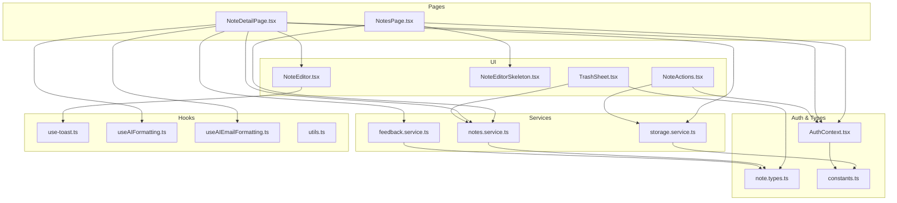

**Diagram sources**
- [NotesPage.tsx:34-491](file://app/notes/page.tsx#L34-L491)
- [NoteDetailPage.tsx:44-753](file://app/notes/[id]/page.tsx#L44-L753)
- [NoteEditor.tsx:40-405](file://components/results/NoteEditor.tsx#L40-L405)
- [NoteEditorSkeleton.tsx:9-63](file://components/results/NoteEditorSkeleton.tsx#L9-L63)
- [NoteActions.tsx:19-96](file://components/results/NoteActions.tsx#L19-L96)
- [TrashSheet.tsx:1-128](file://components/notes/TrashSheet.tsx#L1-L128)
- [notes.service.ts:16-184](file://lib/services/notes.service.ts#L16-L184)
- [feedback.service.ts:13-133](file://lib/services/feedback.service.ts#L13-L133)
- [storage.service.ts:13-161](file://lib/services/storage.service.ts#L13-L161)
- [AuthContext.tsx:24-97](file://lib/contexts/AuthContext.tsx#L24-L97)
- [note.types.ts:19-78](file://lib/types/note.types.ts#L19-L78)
- [constants.ts:175-181](file://lib/constants.ts#L175-L181)
- [use-toast.ts:174-195](file://hooks/use-toast.ts#L174-L195)
- [useAIFormatting.ts:7-77](file://lib/hooks/useAIFormatting.ts#L7-L77)
- [useAIEmailFormatting.ts:7-62](file://lib/hooks/useAIEmailFormatting.ts#L7-L62)
- [utils.ts:11-32](file://lib/utils.ts#L11-L32)

**Section sources**
- [NotesPage.tsx:34-491](file://app/notes/page.tsx#L34-L491)
- [NoteDetailPage.tsx:44-753](file://app/notes/[id]/page.tsx#L44-L753)
- [NoteEditor.tsx:40-405](file://components/results/NoteEditor.tsx#L40-L405)
- [NoteEditorSkeleton.tsx:9-63](file://components/results/NoteEditorSkeleton.tsx#L9-L63)
- [NoteActions.tsx:19-96](file://components/results/NoteActions.tsx#L19-L96)
- [TrashSheet.tsx:1-128](file://components/notes/TrashSheet.tsx#L1-L128)
- [notes.service.ts:16-184](file://lib/services/notes.service.ts#L16-L184)
- [feedback.service.ts:13-133](file://lib/services/feedback.service.ts#L13-L133)
- [storage.service.ts:13-161](file://lib/services/storage.service.ts#L13-L161)
- [AuthContext.tsx:24-97](file://lib/contexts/AuthContext.tsx#L24-L97)
- [note.types.ts:19-78](file://lib/types/note.types.ts#L19-L78)
- [constants.ts:175-181](file://lib/constants.ts#L175-L181)
- [use-toast.ts:174-195](file://hooks/use-toast.ts#L174-L195)
- [useAIFormatting.ts:7-77](file://lib/hooks/useAIFormatting.ts#L7-L77)
- [useAIEmailFormatting.ts:7-62](file://lib/hooks/useAIEmailFormatting.ts#L7-L62)
- [utils.ts:11-32](file://lib/utils.ts#L11-L32)

## Core Components
- NoteEditor: Renders the note content, supports editing modes, copy/download/share, and toggles raw transcript visibility. Provides feedback widget integration.
- NoteEditorSkeleton: Layout skeleton mirroring the editor for loading states.
- NotesPage: Lists notes with filtering, sorting, starring, deleting, pagination, and **trash management**.
- NoteDetailPage: Loads a single note, manages editing state, copy/download/share, feedback, and raw transcript toggle. Integrates AI formatting modes.
- **TrashSheet: Modal interface for managing deleted notes with restore and permanent delete operations.**
- Notes Service: CRUD operations for notes via Supabase, including **soft deletion, restore, and permanent delete**.
- Feedback Service: Stores and aggregates feedback for AI formatting quality.
- Storage Service: Session storage helpers for temporary note data during recording.
- AuthContext: Provides user/session state and authentication methods.
- Types and Constants: Define DBNote shape, feedback reasons, storage keys, routes, and UI strings.
- Hooks: use-toast for notifications, useAIFormatting/useAIEmailFormatting for AI-driven formatting.

**Section sources**
- [NoteEditor.tsx:40-405](file://components/results/NoteEditor.tsx#L40-L405)
- [NoteEditorSkeleton.tsx:9-63](file://components/results/NoteEditorSkeleton.tsx#L9-L63)
- [NotesPage.tsx:34-491](file://app/notes/page.tsx#L34-L491)
- [NoteDetailPage.tsx:44-753](file://app/notes/[id]/page.tsx#L44-L753)
- [TrashSheet.tsx:1-128](file://components/notes/TrashSheet.tsx#L1-L128)
- [notes.service.ts:16-184](file://lib/services/notes.service.ts#L16-L184)
- [feedback.service.ts:13-133](file://lib/services/feedback.service.ts#L13-L133)
- [storage.service.ts:13-161](file://lib/services/storage.service.ts#L13-L161)
- [AuthContext.tsx:24-97](file://lib/contexts/AuthContext.tsx#L24-L97)
- [note.types.ts:19-78](file://lib/types/note.types.ts#L19-L78)
- [constants.ts:175-181](file://lib/constants.ts#L175-L181)
- [use-toast.ts:174-195](file://hooks/use-toast.ts#L174-L195)
- [useAIFormatting.ts:7-77](file://lib/hooks/useAIFormatting.ts#L7-L77)
- [useAIEmailFormatting.ts:7-62](file://lib/hooks/useAIEmailFormatting.ts#L7-L62)

## Architecture Overview
The system follows a layered architecture:
- UI Layer: Next.js client components and pages
- Service Layer: Typed Supabase wrappers for notes and feedback
- Persistence Layer: Supabase database and browser session storage
- Authentication: Supabase Auth via AuthContext
- AI Integration: Hooks that call AI endpoints through aiService (via constants and services)

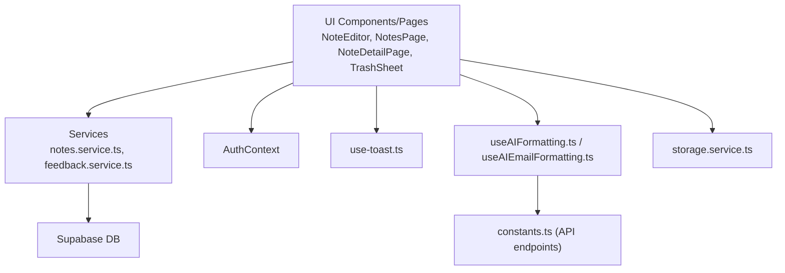

**Diagram sources**
- [NoteEditor.tsx:40-405](file://components/results/NoteEditor.tsx#L40-L405)
- [NotesPage.tsx:34-491](file://app/notes/page.tsx#L34-L491)
- [NoteDetailPage.tsx:44-753](file://app/notes/[id]/page.tsx#L44-L753)
- [TrashSheet.tsx:1-128](file://components/notes/TrashSheet.tsx#L1-L128)
- [notes.service.ts:16-184](file://lib/services/notes.service.ts#L16-L184)
- [feedback.service.ts:13-133](file://lib/services/feedback.service.ts#L13-L133)
- [AuthContext.tsx:24-97](file://lib/contexts/AuthContext.tsx#L24-L97)
- [use-toast.ts:174-195](file://hooks/use-toast.ts#L174-L195)
- [useAIFormatting.ts:7-77](file://lib/hooks/useAIFormatting.ts#L7-L77)
- [useAIEmailFormatting.ts:7-62](file://lib/hooks/useAIEmailFormatting.ts#L7-L62)
- [constants.ts:75-98](file://lib/constants.ts#L75-L98)
- [storage.service.ts:13-161](file://lib/services/storage.service.ts#L13-L161)

## Detailed Component Analysis

### Note Editor Implementation and Real-Time Editing
- Real-time editing:
  - The editor supports two modes: read-only and editable.
  - When editing, a textarea binds to the current note text, enabling live edits.
  - Saving persists changes via the notes service and updates local state.
- Copy and Download:
  - Copy writes the current note text to the clipboard and triggers a toast notification.
  - Download creates a Blob and initiates a file download with a sanitized filename derived from the note title.
- Share:
  - A modal presents multiple sharing destinations (WhatsApp, Gmail, default email client, Web Share API).
  - The active content depends on editing mode and Gmail formatting mode.
- Raw Transcript Toggle:
  - Uses animation transitions to reveal or hide the raw transcript below the editor.
- Feedback Integration:
  - A feedback widget is embedded to capture user sentiment and reasons for AI formatting quality.

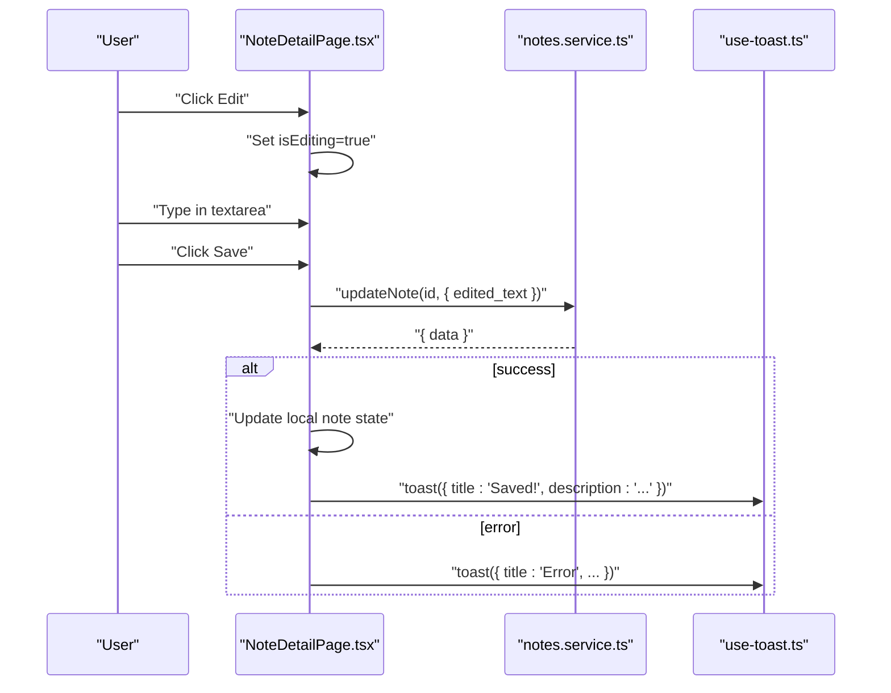

**Diagram sources**
- [NoteDetailPage.tsx:107-130](file://app/notes/[id]/page.tsx#L107-L130)
- [notes.service.ts:65-78](file://lib/services/notes.service.ts#L65-L78)
- [use-toast.ts:145-172](file://hooks/use-toast.ts#L145-L172)

**Section sources**
- [NoteEditor.tsx:184-195](file://components/results/NoteEditor.tsx#L184-L195)
- [NoteDetailPage.tsx:107-130](file://app/notes/[id]/page.tsx#L107-L130)
- [NoteDetailPage.tsx:132-153](file://app/notes/[id]/page.tsx#L132-L153)
- [NoteDetailPage.tsx:516-668](file://app/notes/[id]/page.tsx#L516-L668)
- [NoteDetailPage.tsx:681-747](file://app/notes/[id]/page.tsx#L681-L747)

### Export Functionality (Copy, Download)
- Copy:
  - Copies either edited or original formatted text to clipboard.
  - Triggers a toast notification confirming the action.
- Download:
  - Creates a Blob from the selected text and initiates a browser-triggered download with a filename derived from the note title.

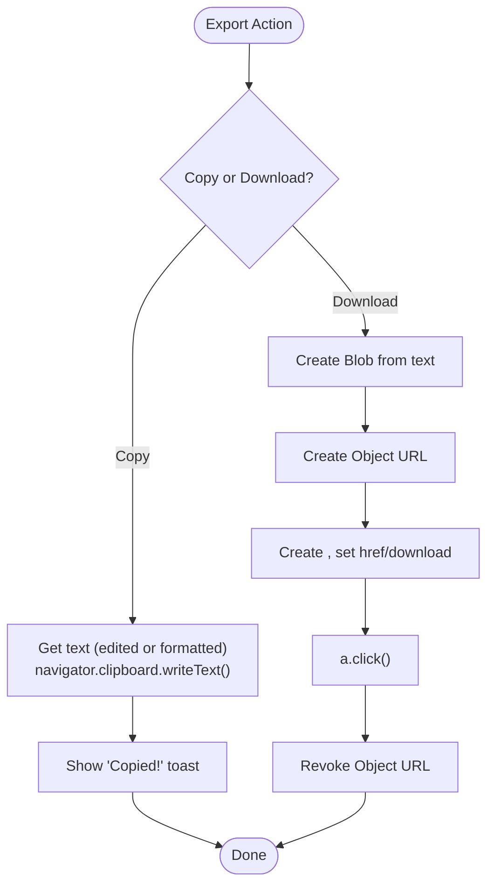

**Diagram sources**
- [NoteDetailPage.tsx:132-153](file://app/notes/[id]/page.tsx#L132-L153)
- [use-toast.ts:145-172](file://hooks/use-toast.ts#L145-L172)

**Section sources**
- [NoteDetailPage.tsx:132-153](file://app/notes/[id]/page.tsx#L132-L153)
- [use-toast.ts:145-172](file://hooks/use-toast.ts#L145-L172)

### Enhanced Trash Management System
**Updated** Added comprehensive trash functionality with soft deletion, restore, and permanent delete operations.

- Soft Deletion:
  - The delete operation sets deleted_at timestamp instead of permanently removing records.
  - Notes with deleted_at != null are excluded from regular note listings.
- Trash Interface:
  - TrashSheet component provides a slide-out modal showing all deleted notes.
  - Displays note previews, deletion dates, and provides restore/delete actions.
- Restore Operations:
  - Restore clears the deleted_at field and refreshes the note list.
  - Optimistically updates the UI and syncs with server state.
- Permanent Deletion:
  - Hard deletes notes from the database with user confirmation.
  - Removes notes from both trash list and main notes list.
- Trash Counter:
  - Visual indicator shows number of deleted notes with bounce animation.
  - Automatically updates when notes are deleted or restored.

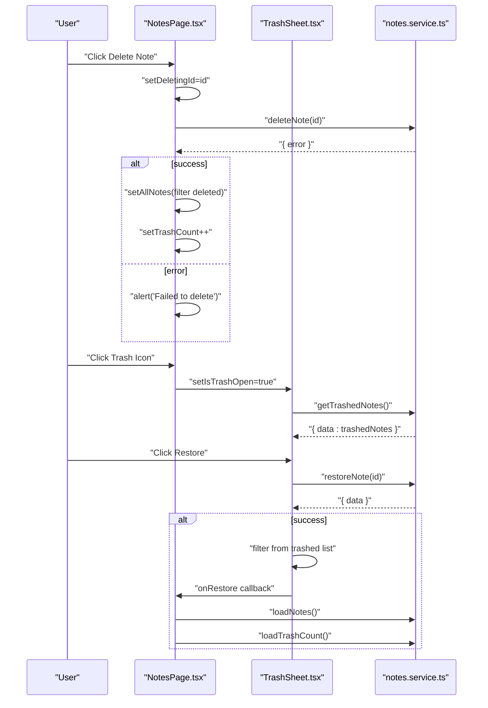

**Diagram sources**
- [NotesPage.tsx:146-165](file://app/notes/page.tsx#L146-L165)
- [TrashSheet.tsx:34-75](file://components/notes/TrashSheet.tsx#L34-L75)
- [notes.service.ts:82-93](file://lib/services/notes.service.ts#L82-L93)
- [notes.service.ts:158-173](file://lib/services/notes.service.ts#L158-L173)

**Section sources**
- [NotesPage.tsx:146-165](file://app/notes/page.tsx#L146-L165)
- [NotesPage.tsx:377-396](file://app/notes/page.tsx#L377-L396)
- [TrashSheet.tsx:22-75](file://components/notes/TrashSheet.tsx#L22-L75)
- [notes.service.ts:82-93](file://lib/services/notes.service.ts#L82-L93)
- [notes.service.ts:141-156](file://lib/services/notes.service.ts#L141-L156)
- [notes.service.ts:158-183](file://lib/services/notes.service.ts#L158-L183)

### Star Toggle Feature and Organization
**Updated** Added star toggle functionality for organizing important notes with filtering by starred status.

- Star Toggle:
  - Optimistically toggles the is_starred state in the UI.
  - Calls the notes service to persist the change; reverts on error.
  - Syncs with actual database value after successful update.
- Starred Filtering:
  - Toggle button filters notes to show only starred items.
  - Visual indicator shows active state with cyan styling.
  - Works in combination with other filters (search, sort).
- Database Schema:
  - Added is_starred boolean column with default false.
  - Created partial index for efficient starred note filtering.
  - Requires RLS policy for update operations.

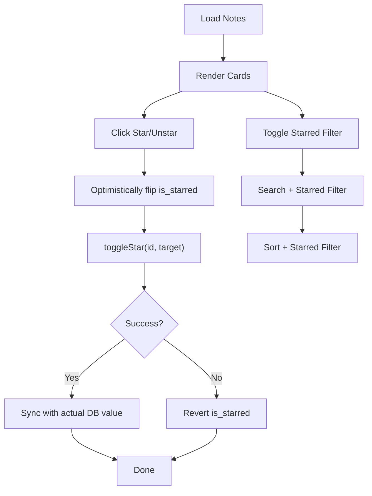

**Diagram sources**
- [NotesPage.tsx:167-188](file://app/notes/page.tsx#L167-L188)
- [notes.service.ts:95-121](file://lib/services/notes.service.ts#L95-L121)
- [supabase-migration-starred.sql:1-23](file://supabase-migration-starred.sql#L1-L23)

**Section sources**
- [NotesPage.tsx:167-188](file://app/notes/page.tsx#L167-L188)
- [NotesPage.tsx:356-370](file://app/notes/page.tsx#L356-L370)
- [notes.service.ts:95-121](file://lib/services/notes.service.ts#L95-L121)
- [supabase-migration-starred.sql:1-23](file://supabase-migration-starred.sql#L1-L23)

### Skeleton Loading States and User Feedback
- Skeleton:
  - NoteEditorSkeleton mirrors the editor's layout with animated placeholders for title, actions, content lines, and mobile buttons.
- Feedback:
  - FeedbackWidget is integrated into the editor to collect helpfulness and reasons.
  - Submission updates the note with feedback fields and timestamps.

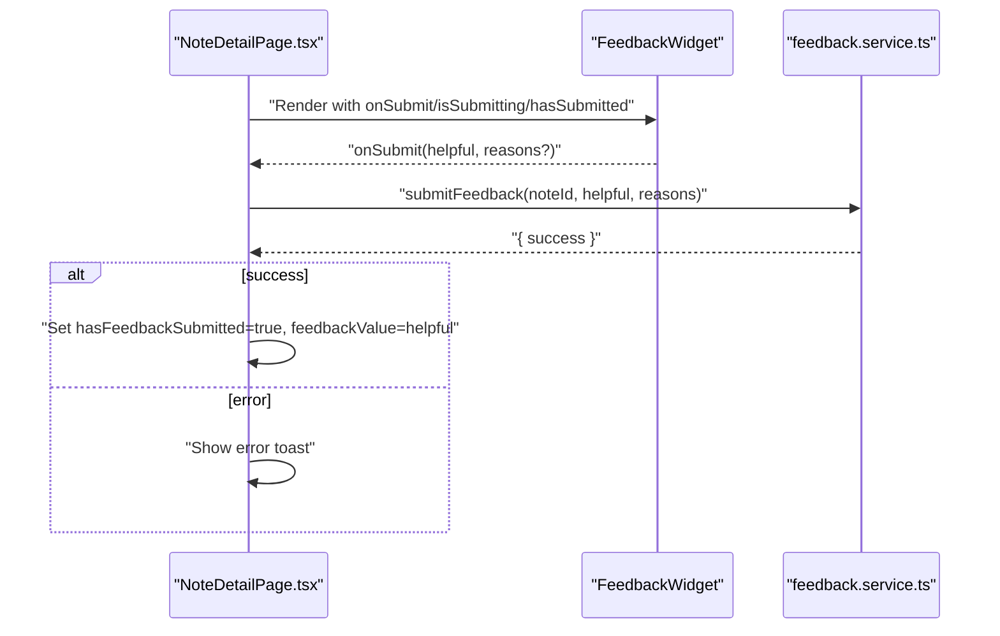

**Diagram sources**
- [NoteDetailPage.tsx:165-200](file://app/notes/[id]/page.tsx#L165-L200)
- [feedback.service.ts:17-39](file://lib/services/feedback.service.ts#L17-L39)

**Section sources**
- [NoteEditorSkeleton.tsx:9-63](file://components/results/NoteEditorSkeleton.tsx#L9-L63)
- [NoteDetailPage.tsx:165-200](file://app/notes/[id]/page.tsx#L165-L200)
- [feedback.service.ts:17-39](file://lib/services/feedback.service.ts#L17-L39)

### Data Structures and State Management
- DBNote:
  - Fields include identifiers, ownership (user_id), raw and formatted texts, edited text, timestamps, feedback metadata, **soft delete metadata (deleted_at)**, and **starred flag (is_starred)**.
- DBNoteUpdate/DBNoteInsert:
  - Used for mutations and creation, including feedback, star toggling, and **soft delete metadata**.
- State in pages:
  - NotesPage maintains lists, filters, pagination, optimistic UI updates, **trash count**, and **starred filtering**.
  - NoteDetailPage manages editing state, AI formatting modes, share subject, and feedback state.

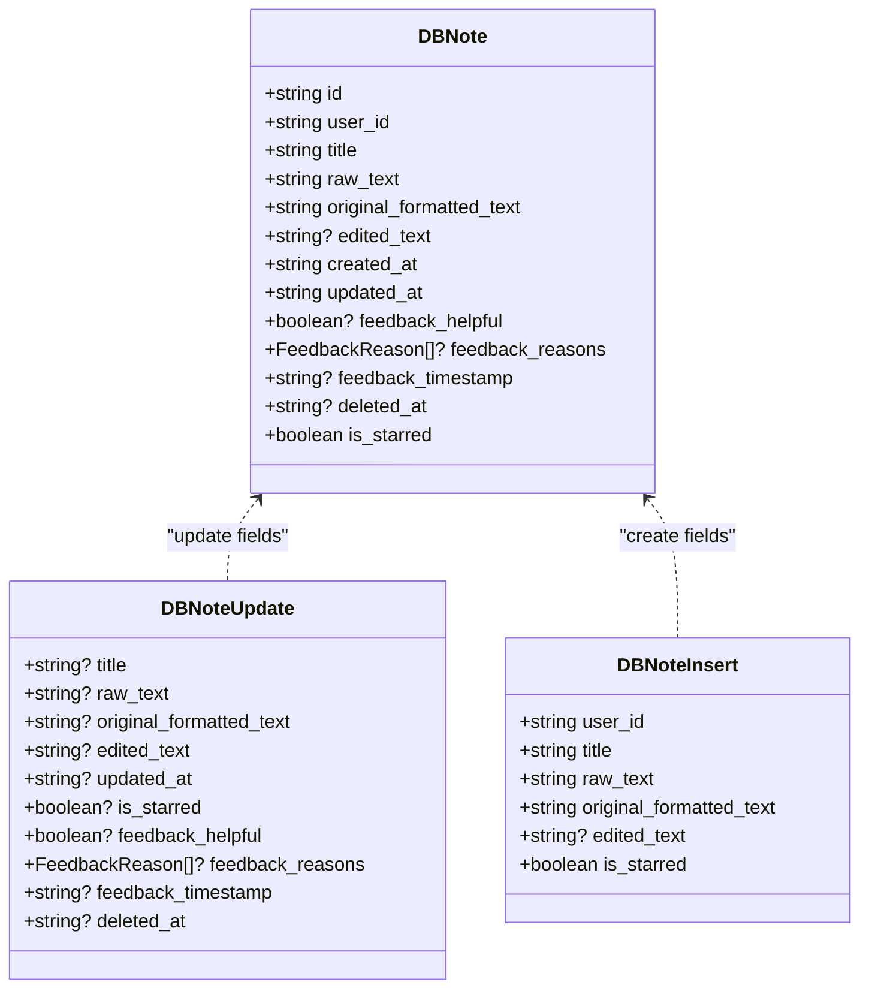

**Diagram sources**
- [note.types.ts:19-61](file://lib/types/note.types.ts#L19-L61)

**Section sources**
- [note.types.ts:19-61](file://lib/types/note.types.ts#L19-L61)
- [NotesPage.tsx:34-491](file://app/notes/page.tsx#L34-L491)
- [NoteDetailPage.tsx:44-753](file://app/notes/[id]/page.tsx#L44-L753)

### Relationships with AI Processing System
- AI Formatting Modes:
  - Simple mode displays formatted text; Gmail mode formats text for email composition.
  - useAIEmailFormatting integrates with AI endpoints to produce a structured email body.
- AI Endpoint Configuration:
  - API endpoints and model configuration are centralized in constants.
- Cancellation and AbortController:
  - Hooks support cancellation to prevent stale results when switching modes rapidly.

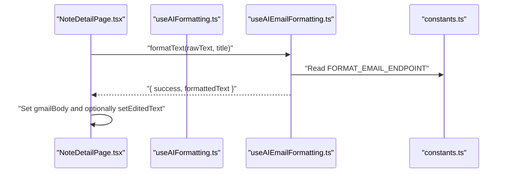

**Diagram sources**
- [NoteDetailPage.tsx:254-278](file://app/notes/[id]/page.tsx#L254-L278)
- [useAIEmailFormatting.ts:21-49](file://lib/hooks/useAIEmailFormatting.ts#L21-L49)
- [constants.ts:77-80](file://lib/constants.ts#L77-L80)

**Section sources**
- [NoteDetailPage.tsx:64-67](file://app/notes/[id]/page.tsx#L64-L67)
- [useAIEmailFormatting.ts:7-62](file://lib/hooks/useAIEmailFormatting.ts#L7-L62)
- [constants.ts:75-98](file://lib/constants.ts#L75-L98)

### Authentication and Ownership
- AuthContext:
  - Provides user/session state and auth callbacks.
- Ownership Check:
  - The note detail page verifies that the loaded note belongs to the current user before rendering.

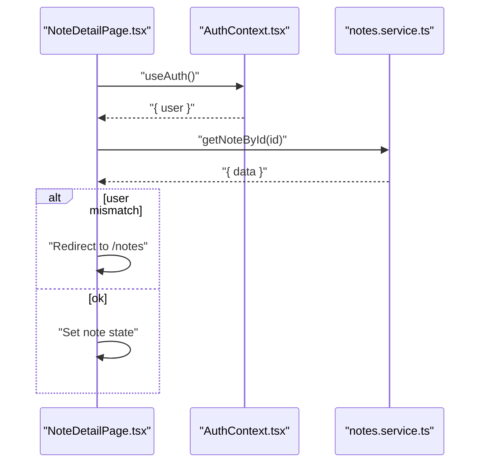

**Diagram sources**
- [NoteDetailPage.tsx:51-105](file://app/notes/[id]/page.tsx#L51-L105)
- [AuthContext.tsx:24-97](file://lib/contexts/AuthContext.tsx#L24-L97)

**Section sources**
- [AuthContext.tsx:24-97](file://lib/contexts/AuthContext.tsx#L24-L97)
- [NoteDetailPage.tsx:51-105](file://app/notes/[id]/page.tsx#L51-L105)

### Offline Storage and Session Data
- Session Storage:
  - storage.service.ts persists formatted/raw text and title during recording sessions.
  - Provides helpers to clear, update, and retrieve note fragments.
- Integration:
  - NoteActions uses storageService to clear current note and navigate to recording after deletion.

**Section sources**
- [storage.service.ts:13-161](file://lib/services/storage.service.ts#L13-L161)
- [NoteActions.tsx:34-46](file://components/results/NoteActions.tsx#L34-L46)

## Dependency Analysis
- UI depends on services for data operations and on hooks for AI and notifications.
- Services depend on Supabase client and typed note interfaces.
- Authentication context is consumed by pages and actions requiring user ownership checks.
- Constants centralize API endpoints and UI strings used across components.
- **TrashSheet depends on notes.service.ts for trash operations and note.types.ts for data structures.**

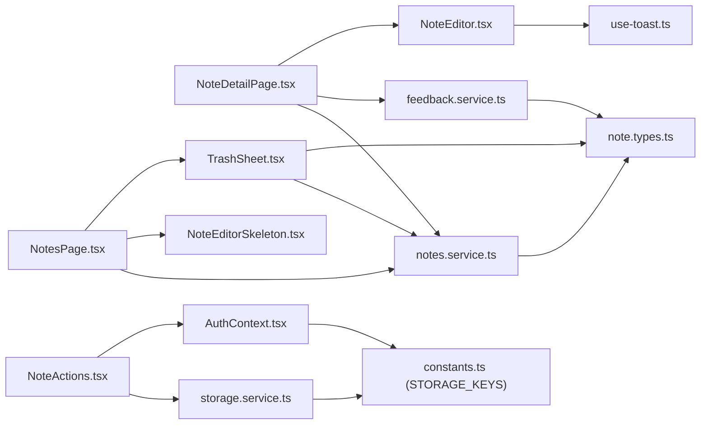

**Diagram sources**
- [NoteEditor.tsx:40-405](file://components/results/NoteEditor.tsx#L40-L405)
- [NoteDetailPage.tsx:44-753](file://app/notes/[id]/page.tsx#L44-L753)
- [NotesPage.tsx:34-491](file://app/notes/page.tsx#L34-L491)
- [NoteEditorSkeleton.tsx:9-63](file://components/results/NoteEditorSkeleton.tsx#L9-L63)
- [NoteActions.tsx:19-96](file://components/results/NoteActions.tsx#L19-L96)
- [TrashSheet.tsx:1-128](file://components/notes/TrashSheet.tsx#L1-L128)
- [notes.service.ts:16-184](file://lib/services/notes.service.ts#L16-L184)
- [feedback.service.ts:13-133](file://lib/services/feedback.service.ts#L13-L133)
- [storage.service.ts:13-161](file://lib/services/storage.service.ts#L13-L161)
- [AuthContext.tsx:24-97](file://lib/contexts/AuthContext.tsx#L24-L97)
- [note.types.ts:19-78](file://lib/types/note.types.ts#L19-L78)
- [constants.ts:175-181](file://lib/constants.ts#L175-L181)

**Section sources**
- [NoteEditor.tsx:40-405](file://components/results/NoteEditor.tsx#L40-L405)
- [NotesPage.tsx:34-491](file://app/notes/page.tsx#L34-L491)
- [NoteDetailPage.tsx:44-753](file://app/notes/[id]/page.tsx#L44-L753)
- [NoteActions.tsx:19-96](file://components/results/NoteActions.tsx#L19-L96)
- [TrashSheet.tsx:1-128](file://components/notes/TrashSheet.tsx#L1-L128)
- [notes.service.ts:16-184](file://lib/services/notes.service.ts#L16-L184)
- [feedback.service.ts:13-133](file://lib/services/feedback.service.ts#L13-L133)
- [storage.service.ts:13-161](file://lib/services/storage.service.ts#L13-L161)
- [AuthContext.tsx:24-97](file://lib/contexts/AuthContext.tsx#L24-L97)
- [note.types.ts:19-78](file://lib/types/note.types.ts#L19-L78)
- [constants.ts:175-181](file://lib/constants.ts#L175-L181)

## Performance Considerations
- Large notes:
  - Prefer rendering only visible portions; avoid unnecessary reflows by using controlled textarea and minimal state updates.
  - Debounce or throttle frequent updates if integrating autosave.
- Rendering:
  - Memoize filtered and paginated lists to reduce re-renders.
  - Use virtualization for very long lists if needed.
- Network:
  - Batch updates where possible; the notes service already adds an updated_at timestamp on updates.
- AI formatting:
  - Cancel ongoing requests when switching modes to prevent redundant work.
- UI responsiveness:
  - Keep skeletons lightweight; avoid heavy animations during frequent state changes.
- **Trash operations:**
  - Use optimistic updates for restore/delete operations to improve perceived performance.
  - Implement proper error handling and rollback for failed operations.
- **Starred filtering:**
  - Leverage database indexes for efficient starred note filtering.
  - Cache filtered results to avoid recomputation on rapid filter toggling.

## Troubleshooting Guide
- Data synchronization:
  - Star toggling uses optimistic updates; ensure to revert on failure and surface user-facing errors.
  - **Trash operations:**
    - Soft deletion relies on deleted_at column; ensure database migration has been applied.
    - Restore operations require proper error handling for edge cases.
- Offline storage:
  - Session storage is cleared on record-again or after deletion; verify availability in browser contexts.
- Feedback submission:
  - Validate note ownership and presence before submitting feedback; handle network errors gracefully.
- Toast notifications:
  - Limit concurrent toasts and ensure dismissal timers are cleaned up.
- **Database schema issues:**
  - Ensure is_starred column exists for star toggle functionality.
  - Verify deleted_at column exists for trash operations.
  - Check RLS policies are properly configured for update operations.

**Section sources**
- [NotesPage.tsx:146-188](file://app/notes/page.tsx#L146-L188)
- [NoteDetailPage.tsx:165-200](file://app/notes/[id]/page.tsx#L165-L200)
- [storage.service.ts:96-105](file://lib/services/storage.service.ts#L96-L105)
- [use-toast.ts:174-195](file://hooks/use-toast.ts#L174-L195)
- [supabase-migration-starred.sql:1-23](file://supabase-migration-starred.sql#L1-L23)

## Conclusion
The content management system provides a robust foundation for note creation, editing, and organization. It balances user experience with performance and reliability through:
- Clear separation of concerns across UI, services, and authentication
- Real-time editing with optimistic updates and safe persistence
- Comprehensive export and sharing options
- AI-driven formatting with cancellation and fallback awareness
- Thoughtful loading states and user feedback mechanisms
- **Enhanced trash management with soft deletion, restore, and permanent delete operations**
- **Star toggle feature for organizing important notes with filtering capabilities**

## Appendices

### Data Model Diagram
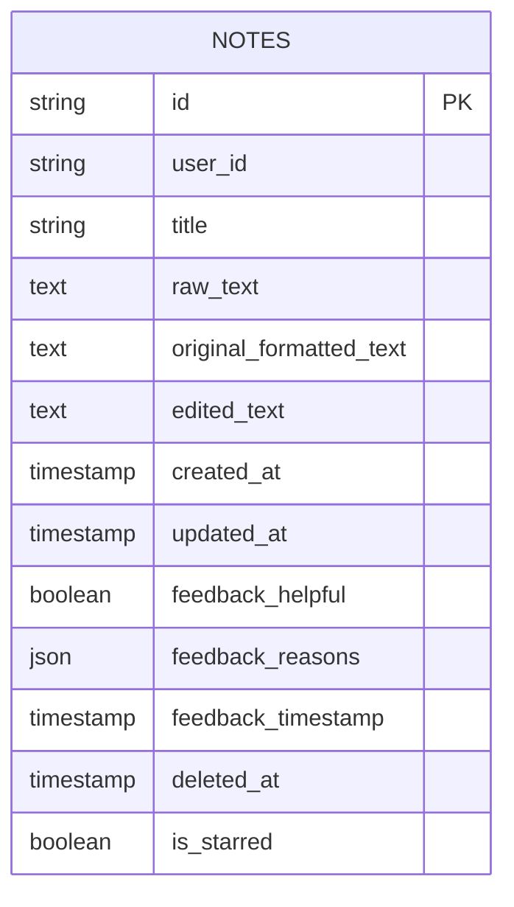

**Diagram sources**
- [note.types.ts:19-36](file://lib/types/note.types.ts#L19-L36)

### Database Migration Summary
**Updated** Added schema changes for trash and star functionality.

- **Starred Notes Migration:**
  - Added is_starred BOOLEAN NOT NULL DEFAULT false
  - Created partial index idx_notes_is_starred for efficient filtering
  - Added RLS policy for update operations
- **Trash Functionality Migration:**
  - Extended existing notes table with soft deletion support
  - No separate migration file provided - leverages existing table structure
- **Feedback System Migration:**
  - Added feedback_helpful, feedback_reasons, feedback_timestamp columns
  - Created indexes for performance optimization

**Section sources**
- [supabase-migration-starred.sql:1-23](file://supabase-migration-starred.sql#L1-L23)
- [supabase-migration-feedback.sql:1-85](file://supabase-migration-feedback.sql#L1-L85)

### Example Paths for Reference
- Note editor props and actions: [NoteEditor.tsx:13-65](file://components/results/NoteEditor.tsx#L13-L65)
- Note detail page state and save/edit: [NoteDetailPage.tsx:54-130](file://app/notes/[id]/page.tsx#L54-L130)
- Notes list filtering and pagination: [NotesPage.tsx:61-114](file://app/notes/page.tsx#L61-L114)
- **Trash sheet component and operations: [TrashSheet.tsx:1-128](file://components/notes/TrashSheet.tsx#L1-L128)**
- Notes service CRUD operations: [notes.service.ts:16-184](file://lib/services/notes.service.ts#L16-L184)
- **Trash management operations: [notes.service.ts:141-183](file://lib/services/notes.service.ts#L141-L183)**
- Feedback submission and stats: [feedback.service.ts:13-133](file://lib/services/feedback.service.ts#L13-L133)
- Session storage helpers: [storage.service.ts:13-161](file://lib/services/storage.service.ts#L13-L161)
- Authentication context: [AuthContext.tsx:24-97](file://lib/contexts/AuthContext.tsx#L24-L97)
- Toast hook: [use-toast.ts:174-195](file://hooks/use-toast.ts#L174-L195)
- AI formatting hooks: [useAIFormatting.ts:7-77](file://lib/hooks/useAIFormatting.ts#L7-L77), [useAIEmailFormatting.ts:7-62](file://lib/hooks/useAIEmailFormatting.ts#L7-L62)
- UI strings and storage keys: [constants.ts:103-152](file://lib/constants.ts#L103-L152), [constants.ts:175-181](file://lib/constants.ts#L175-L181)
- Time-based prompt: [utils.ts:11-32](file://lib/utils.ts#L11-L32)
- **Star toggle functionality: [NotesPage.tsx:167-188](file://app/notes/page.tsx#L167-L188)**
- **Starred filtering: [NotesPage.tsx:356-370](file://app/notes/page.tsx#L356-L370)**