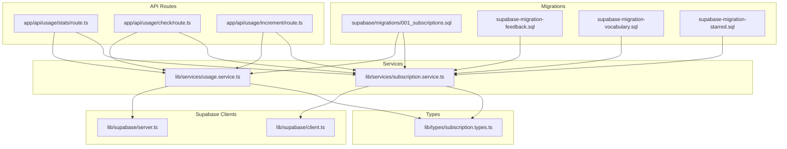
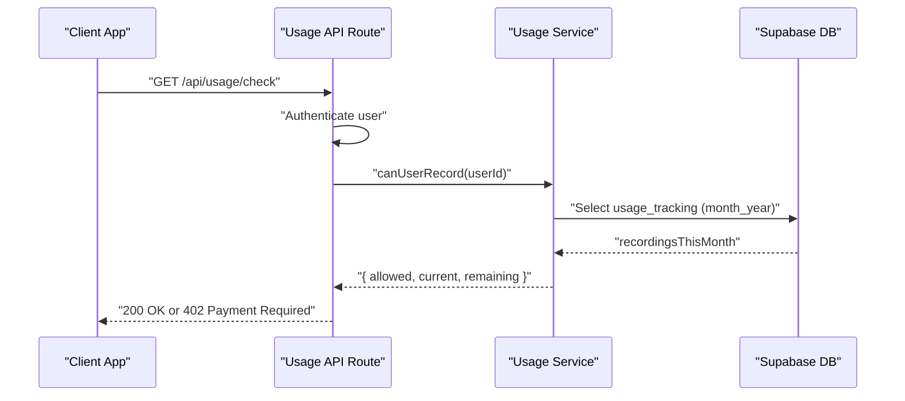
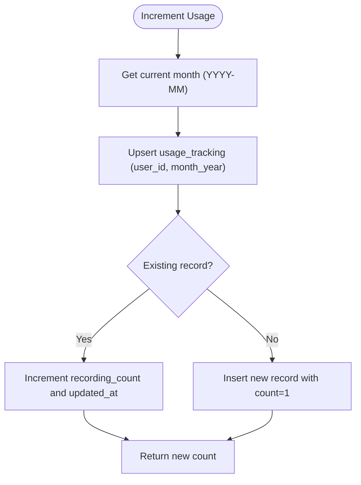
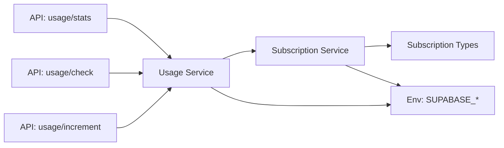

# Database Schema & Migrations

<cite>
**Referenced Files in This Document**
- [001_subscriptions.sql](file://supabase/migrations/001_subscriptions.sql)
- [supabase-migration-feedback.sql](file://supabase-migration-feedback.sql)
- [supabase-migration-starred.sql](file://supabase-migration-starred.sql)
- [supabase-migration-vocabulary.sql](file://supabase-migration-vocabulary.sql)
- [client.ts](file://lib/supabase/client.ts)
- [server.ts](file://lib/supabase/server.ts)
- [subscription.types.ts](file://lib/types/subscription.types.ts)
- [subscription.service.ts](file://lib/services/subscription.service.ts)
- [usage.service.ts](file://lib/services/usage.service.ts)
- [route.ts (usage/stats)](file://app/api/usage/stats/route.ts)
- [route.ts (usage/check)](file://app/api/usage/check/route.ts)
- [route.ts (usage/increment)](file://app/api/usage/increment/route.ts)
- [constants.ts](file://lib/constants.ts)
</cite>

## Table of Contents
1. [Introduction](#introduction)
2. [Project Structure](#project-structure)
3. [Core Components](#core-components)
4. [Architecture Overview](#architecture-overview)
5. [Detailed Component Analysis](#detailed-component-analysis)
6. [Dependency Analysis](#dependency-analysis)
7. [Performance Considerations](#performance-considerations)
8. [Troubleshooting Guide](#troubleshooting-guide)
9. [Conclusion](#conclusion)
10. [Appendices](#appendices)

## Introduction
This document describes OSCAR’s database schema and migrations focused on Supabase integration. It covers the subscription, usage tracking, webhook events, and notes-related enhancements for feedback and starring. It documents table structures, fields, data types, primary/foreign keys, indexes, constraints, row-level security (RLS) policies, validation/business rules, data lifecycle, access patterns, caching considerations, retention/archival rules, security and privacy controls, and migration management procedures.

## Project Structure
The database schema is primarily defined in SQL migration files under the Supabase directory. TypeScript services and API routes orchestrate Supabase interactions and enforce business rules.



**Diagram sources**
- [001_subscriptions.sql](file://supabase/migrations/001_subscriptions.sql#L1-L206)
- [supabase-migration-feedback.sql](file://supabase-migration-feedback.sql#L1-L85)
- [supabase-migration-vocabulary.sql](file://supabase-migration-vocabulary.sql#L1-L38)
- [supabase-migration-starred.sql](file://supabase-migration-starred.sql#L1-L12)
- [subscription.service.ts](file://lib/services/subscription.service.ts#L1-L280)
- [usage.service.ts](file://lib/services/usage.service.ts#L1-L222)
- [route.ts (usage/stats)](file://app/api/usage/stats/route.ts#L1-L65)
- [route.ts (usage/check)](file://app/api/usage/check/route.ts#L1-L66)
- [route.ts (usage/increment)](file://app/api/usage/increment/route.ts#L1-L70)
- [subscription.types.ts](file://lib/types/subscription.types.ts#L1-L305)
- [client.ts](file://lib/supabase/client.ts#L1-L34)
- [server.ts](file://lib/supabase/server.ts#L1-L29)

**Section sources**
- [001_subscriptions.sql](file://supabase/migrations/001_subscriptions.sql#L1-L206)
- [supabase-migration-feedback.sql](file://supabase-migration-feedback.sql#L1-L85)
- [supabase-migration-vocabulary.sql](file://supabase-migration-vocabulary.sql#L1-L38)
- [supabase-migration-starred.sql](file://supabase-migration-starred.sql#L1-L12)
- [subscription.service.ts](file://lib/services/subscription.service.ts#L1-L280)
- [usage.service.ts](file://lib/services/usage.service.ts#L1-L222)
- [route.ts (usage/stats)](file://app/api/usage/stats/route.ts#L1-L65)
- [route.ts (usage/check)](file://app/api/usage/check/route.ts#L1-L66)
- [route.ts (usage/increment)](file://app/api/usage/increment/route.ts#L1-L70)
- [subscription.types.ts](file://lib/types/subscription.types.ts#L1-L305)
- [client.ts](file://lib/supabase/client.ts#L1-L34)
- [server.ts](file://lib/supabase/server.ts#L1-L29)

## Core Components
- Subscriptions table: stores user subscription records linked to Razorpay, with tier, billing cycle, status, and period timestamps.
- Usage tracking table: tracks monthly recording counts per user.
- Webhook events table: stores processed Razorpay webhook events for idempotency.
- Notes table enhancements: feedback columns (helpful flag, reasons array, timestamp) and a starred flag with supporting indexes and views.
- User vocabulary table: stores custom vocabulary entries per user with RLS.

**Section sources**
- [001_subscriptions.sql](file://supabase/migrations/001_subscriptions.sql#L9-L22)
- [001_subscriptions.sql](file://supabase/migrations/001_subscriptions.sql#L58-L66)
- [001_subscriptions.sql](file://supabase/migrations/001_subscriptions.sql#L98-L107)
- [supabase-migration-feedback.sql](file://supabase-migration-feedback.sql#L5-L15)
- [supabase-migration-starred.sql](file://supabase-migration-starred.sql#L4-L5)
- [supabase-migration-vocabulary.sql](file://supabase-migration-vocabulary.sql#L4-L15)

## Architecture Overview
The system integrates Supabase for authentication, real-time, and database capabilities. Services encapsulate database operations and enforce business rules. API routes authenticate users and delegate to services. Functions and triggers maintain audit fields and support usage increments.



**Diagram sources**
- [route.ts (usage/check)](file://app/api/usage/check/route.ts#L1-L66)
- [usage.service.ts](file://lib/services/usage.service.ts#L117-L137)

**Section sources**
- [route.ts (usage/check)](file://app/api/usage/check/route.ts#L1-L66)
- [usage.service.ts](file://lib/services/usage.service.ts#L1-L222)

## Detailed Component Analysis

### Subscriptions Table
- Purpose: Track user subscription lifecycle tied to Razorpay.
- Key fields:
  - id: UUID primary key.
  - user_id: UUID unique foreign key to auth.users.
  - razorpay_*: identifiers and plan metadata.
  - tier: enum-like text with default and check constraint.
  - billing_cycle: optional enum-like text.
  - status: enum-like text with default and extensive check constraint.
  - period timestamps: Timestamptz for billing cycles.
  - created_at/updated_at: Timestamptz with triggers to auto-update.
- Indexes: user_id, razorpay_subscription_id, status, tier.
- RLS: Enabled; policies allow users to view own subscription and service role to update.
- Triggers: Auto-update updated_at on insert/update.

```mermaid
erDiagram
SUBSCRIPTIONS {
uuid id PK
uuid user_id UK FK
text razorpay_customer_id
text razorpay_subscription_id UK
text razorpay_plan_id
text tier
text billing_cycle
text status
timestamptz current_period_start
timestamptz current_period_end
timestamptz created_at
timestamptz updated_at
}
WEBHOOK_EVENTS {
uuid id PK
text razorpay_event_id UK
text event_type
boolean processed
jsonb payload
text error_message
timestamptz created_at
timestamptz processed_at
}
USAGE_TRACKING {
uuid id PK
uuid user_id FK
text month_year
integer recording_count
timestamptz created_at
timestamptz updated_at
}
USERS ||--o{ SUBSCRIPTIONS : "auth.users(id)"
USERS ||--o{ USAGE_TRACKING : "auth.users(id)"
```

**Diagram sources**
- [001_subscriptions.sql](file://supabase/migrations/001_subscriptions.sql#L9-L22)
- [001_subscriptions.sql](file://supabase/migrations/001_subscriptions.sql#L58-L66)
- [001_subscriptions.sql](file://supabase/migrations/001_subscriptions.sql#L98-L107)

**Section sources**
- [001_subscriptions.sql](file://supabase/migrations/001_subscriptions.sql#L9-L22)
- [001_subscriptions.sql](file://supabase/migrations/001_subscriptions.sql#L24-L28)
- [001_subscriptions.sql](file://supabase/migrations/001_subscriptions.sql#L30-L52)
- [001_subscriptions.sql](file://supabase/migrations/001_subscriptions.sql#L173-L192)

### Usage Tracking Table
- Purpose: Monthly recording usage per user.
- Key fields:
  - user_id: UUID foreign key to auth.users.
  - month_year: text in YYYY-MM; unique with user_id.
  - recording_count: integer with non-negative check.
  - created_at/updated_at: Timestamptz with trigger.
- Indexes: composite (user_id, month_year), month_year.
- RLS: Enabled; users can read own usage; service role can insert/update.



**Diagram sources**
- [001_subscriptions.sql](file://supabase/migrations/001_subscriptions.sql#L135-L154)
- [usage.service.ts](file://lib/services/usage.service.ts#L71-L103)

**Section sources**
- [001_subscriptions.sql](file://supabase/migrations/001_subscriptions.sql#L58-L66)
- [001_subscriptions.sql](file://supabase/migrations/001_subscriptions.sql#L68-L91)
- [001_subscriptions.sql](file://supabase/migrations/001_subscriptions.sql#L135-L154)
- [usage.service.ts](file://lib/services/usage.service.ts#L71-L103)

### Webhook Events Table
- Purpose: Idempotent processing of Razorpay webhooks.
- Key fields:
  - razorpay_event_id: unique text.
  - event_type: text.
  - processed: boolean with default.
  - payload: JSONB.
  - timestamps: created_at, processed_at.
- Indexes: razorpay_event_id, processed, created_at.
- RLS: Enabled; only service role can manage.

**Section sources**
- [001_subscriptions.sql](file://supabase/migrations/001_subscriptions.sql#L98-L107)
- [001_subscriptions.sql](file://supabase/migrations/001_subscriptions.sql#L109-L121)

### Notes Feedback and Starred Enhancements
- Feedback columns added to notes:
  - feedback_helpful: boolean nullable.
  - feedback_reasons: text array nullable.
  - feedback_timestamp: timestamptz nullable.
- Indexes: selective on feedback_helpful and feedback_timestamp descending.
- Views: feedback_stats and recent_negative_feedback for analytics.
- Starred flag:
  - is_starred: boolean not null default false.
  - partial index on true values.

**Section sources**
- [supabase-migration-feedback.sql](file://supabase-migration-feedback.sql#L5-L15)
- [supabase-migration-feedback.sql](file://supabase-migration-feedback.sql#L17-L25)
- [supabase-migration-feedback.sql](file://supabase-migration-feedback.sql#L34-L63)
- [supabase-migration-feedback.sql](file://supabase-migration-feedback.sql#L68-L82)
- [supabase-migration-starred.sql](file://supabase-migration-starred.sql#L4-L5)
- [supabase-migration-starred.sql](file://supabase-migration-starred.sql#L7-L8)

### User Vocabulary Table
- Purpose: Custom vocabulary per user for improved recognition.
- Fields: user_id (FK), term, pronunciation, context, timestamps.
- Constraints: unique(user_id, term); RLS policies for CRUD operations.

**Section sources**
- [supabase-migration-vocabulary.sql](file://supabase-migration-vocabulary.sql#L4-L15)
- [supabase-migration-vocabulary.sql](file://supabase-migration-vocabulary.sql#L17-L18)
- [supabase-migration-vocabulary.sql](file://supabase-migration-vocabulary.sql#L20-L38)

### Data Validation Rules and Business Rules
- Subscription tier and status constrained via check constraints.
- Usage count constrained to non-negative values.
- Monthly usage enforced via service logic and DB function.
- Tier limits: FREE_MONTHLY_RECORDINGS and FREE_MAX_NOTES from constants.
- Pro tier grants unlimited usage; free tier enforces quotas.

**Section sources**
- [001_subscriptions.sql](file://supabase/migrations/001_subscriptions.sql#L15-L17)
- [001_subscriptions.sql](file://supabase/migrations/001_subscriptions.sql#L62)
- [constants.ts](file://lib/constants.ts#L243-L247)
- [usage.service.ts](file://lib/services/usage.service.ts#L117-L137)

### Data Lifecycle Management
- Timestamps: created_at/updated_at maintained via triggers.
- Subscription lifecycle: get-or-create free tier, downgrade on expiry.
- Usage lifecycle: monthly reset via month_year partitioning concept.

**Section sources**
- [001_subscriptions.sql](file://supabase/migrations/001_subscriptions.sql#L173-L192)
- [subscription.service.ts](file://lib/services/subscription.service.ts#L65-L123)

### Access Patterns, Caching, and Performance
- Access patterns:
  - Authenticated reads via RLS; service role bypasses RLS for administrative tasks.
  - Usage checks and increments via API routes.
- Caching:
  - No explicit application-level caching is present in the reviewed files.
- Performance considerations:
  - Indexes on foreign keys and frequently filtered columns.
  - Partial indexes for feedback and starred flags.
  - Triggers avoid redundant updates.

**Section sources**
- [001_subscriptions.sql](file://supabase/migrations/001_subscriptions.sql#L24-L28)
- [001_subscriptions.sql](file://supabase/migrations/001_subscriptions.sql#L68-L70)
- [001_subscriptions.sql](file://supabase/migrations/001_subscriptions.sql#L109-L112)
- [supabase-migration-feedback.sql](file://supabase-migration-feedback.sql#L17-L25)
- [supabase-migration-starred.sql](file://supabase-migration-starred.sql#L7-L8)
- [subscription.service.ts](file://lib/services/subscription.service.ts#L13-L27)
- [usage.service.ts](file://lib/services/usage.service.ts#L13-L27)

### Data Retention, Archival, and Migration Paths
- Retention:
  - No explicit TTL or archival policies observed in the reviewed files.
- Migration paths:
  - Migrations are additive; new columns/views/functions are introduced without destructive changes.
  - Subscription functions and triggers preserve historical data while enabling operational features.
- Version compatibility:
  - Migrations target Supabase Postgres; no breaking schema changes identified.

**Section sources**
- [001_subscriptions.sql](file://supabase/migrations/001_subscriptions.sql#L127-L133)
- [001_subscriptions.sql](file://supabase/migrations/001_subscriptions.sql#L135-L154)
- [supabase-migration-feedback.sql](file://supabase-migration-feedback.sql#L1-L33)
- [supabase-migration-vocabulary.sql](file://supabase-migration-vocabulary.sql#L1-L38)

### Data Security and Privacy Controls
- Row-level security enabled on subscriptions, usage_tracking, webhook_events, and user_vocabulary.
- Policies:
  - Subscriptions: users can view own; service role can update.
  - Usage tracking: users can view own; service role can insert/update.
  - Webhook events: only service role can manage.
  - User vocabulary: users can CRUD own entries.
- Supabase clients:
  - Browser client uses anonymous key; server client uses session cookies.
  - Admin/service role client used for operations requiring RLS bypass.

**Section sources**
- [001_subscriptions.sql](file://supabase/migrations/001_subscriptions.sql#L30-L52)
- [001_subscriptions.sql](file://supabase/migrations/001_subscriptions.sql#L72-L91)
- [001_subscriptions.sql](file://supabase/migrations/001_subscriptions.sql#L114-L121)
- [001_subscriptions.sql](file://supabase/migrations/001_subscriptions.sql#L20-L31)
- [supabase-migration-vocabulary.sql](file://supabase-migration-vocabulary.sql#L20-L38)
- [client.ts](file://lib/supabase/client.ts#L1-L34)
- [server.ts](file://lib/supabase/server.ts#L1-L29)

## Dependency Analysis
- Services depend on Supabase client libraries and environment variables for admin/service role access.
- API routes depend on services for business logic and on Supabase server client for authentication.
- Types define contracts for subscription, usage, and webhook entities.



**Diagram sources**
- [route.ts (usage/stats)](file://app/api/usage/stats/route.ts#L1-L65)
- [route.ts (usage/check)](file://app/api/usage/check/route.ts#L1-L66)
- [route.ts (usage/increment)](file://app/api/usage/increment/route.ts#L1-L70)
- [usage.service.ts](file://lib/services/usage.service.ts#L1-L222)
- [subscription.service.ts](file://lib/services/subscription.service.ts#L1-L280)
- [subscription.types.ts](file://lib/types/subscription.types.ts#L1-L305)

**Section sources**
- [route.ts (usage/stats)](file://app/api/usage/stats/route.ts#L1-L65)
- [route.ts (usage/check)](file://app/api/usage/check/route.ts#L1-L66)
- [route.ts (usage/increment)](file://app/api/usage/increment/route.ts#L1-L70)
- [usage.service.ts](file://lib/services/usage.service.ts#L1-L222)
- [subscription.service.ts](file://lib/services/subscription.service.ts#L1-L280)
- [subscription.types.ts](file://lib/types/subscription.types.ts#L1-L305)

## Performance Considerations
- Index coverage for frequent filters (user_id, status, tier, month_year).
- Partial indexes reduce index size and improve selectivity for feedback and starred notes.
- Triggers minimize application-side timestamp management overhead.
- Service role client avoids unnecessary auth checks for administrative operations.

[No sources needed since this section provides general guidance]

## Troubleshooting Guide
- Unauthorized access: Ensure user is authenticated; verify auth.getUser() succeeds.
- Missing service role key: Admin client requires NEXT_PUBLIC_SUPABASE_URL and SUPABASE_SERVICE_ROLE_KEY.
- Usage not incrementing: Confirm month_year matches current period; verify upsert logic and triggers.
- Webhook idempotency: Check razorpay_event_id uniqueness and processed flag.

**Section sources**
- [route.ts (usage/stats)](file://app/api/usage/stats/route.ts#L14-L25)
- [route.ts (usage/check)](file://app/api/usage/check/route.ts#L18-L29)
- [route.ts (usage/increment)](file://app/api/usage/increment/route.ts#L18-L29)
- [usage.service.ts](file://lib/services/usage.service.ts#L13-L27)
- [001_subscriptions.sql](file://supabase/migrations/001_subscriptions.sql#L109-L121)

## Conclusion
OSCAR’s database schema leverages Supabase RLS, indexes, and functions to support a secure, scalable subscription and usage model. Migrations are additive, preserving data while extending functionality. Business rules are enforced at both the DB level (constraints/policies) and application level (services/APIs). The design supports future growth with clear separation of concerns and documented access patterns.

[No sources needed since this section summarizes without analyzing specific files]

## Appendices

### Sample Data
- Subscriptions: One record per user with tier and status reflecting Razorpay state.
- Usage tracking: One record per user-month with incremental counts.
- Webhook events: One record per processed event with processed flag.
- Notes: Records with optional feedback_helpful, feedback_reasons, feedback_timestamp; optional is_starred.

[No sources needed since this section provides general guidance]