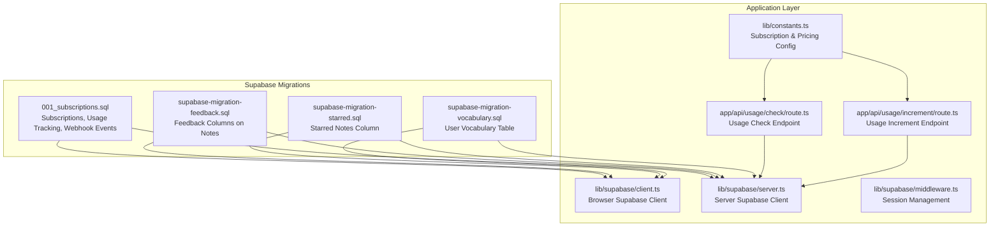
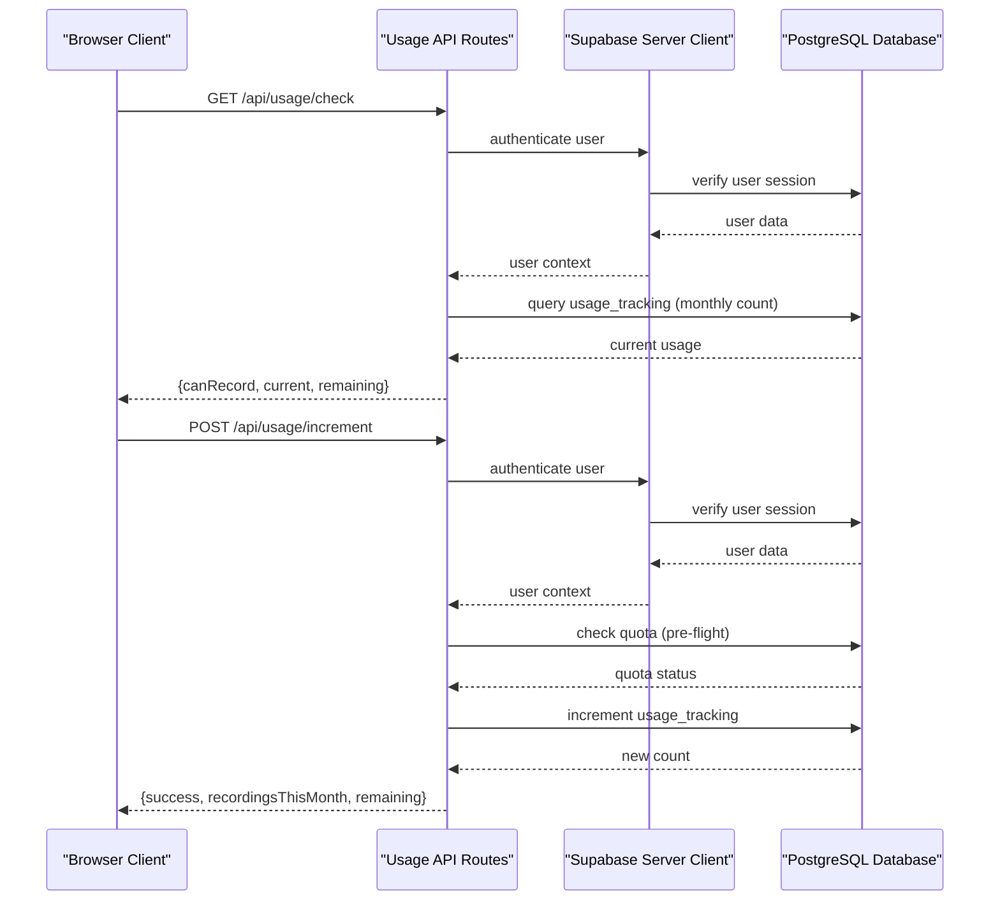
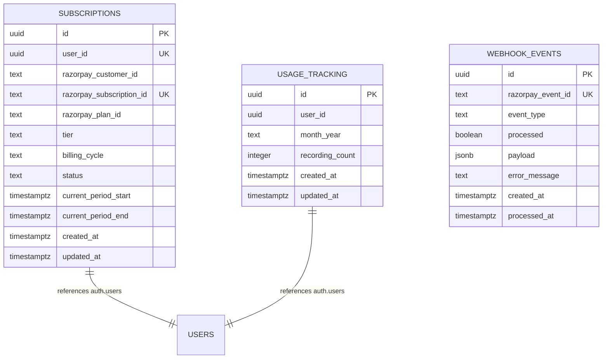
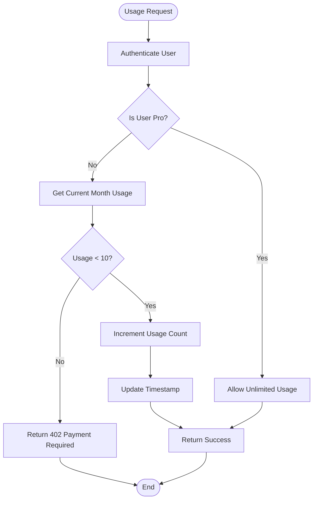
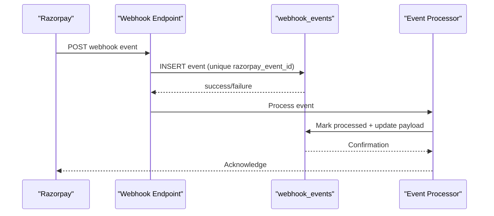
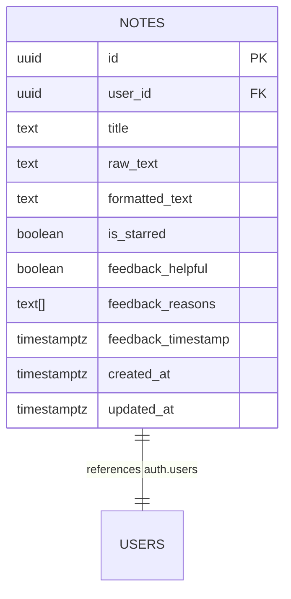
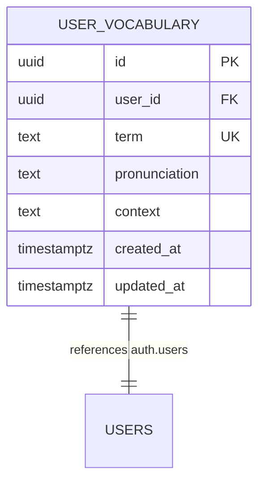
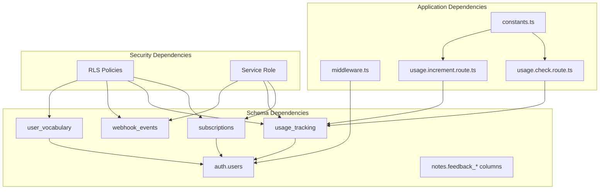

# Database Schema Enhancements

<cite>
**Referenced Files in This Document**
- [001_subscriptions.sql](file://supabase/migrations/001_subscriptions.sql)
- [supabase-migration-feedback.sql](file://supabase-migration-feedback.sql)
- [supabase-migration-starred.sql](file://supabase-migration-starred.sql)
- [supabase-migration-vocabulary.sql](file://supabase-migration-vocabulary.sql)
- [client.ts](file://lib/supabase/client.ts)
- [server.ts](file://lib/supabase/server.ts)
- [middleware.ts](file://lib/supabase/middleware.ts)
- [constants.ts](file://lib/constants.ts)
- [route.ts](file://app/api/usage/check/route.ts)
- [route.ts](file://app/api/usage/increment/route.ts)
</cite>

## Table of Contents
1. [Introduction](#introduction)
2. [Project Structure](#project-structure)
3. [Core Components](#core-components)
4. [Architecture Overview](#architecture-overview)
5. [Detailed Component Analysis](#detailed-component-analysis)
6. [Dependency Analysis](#dependency-analysis)
7. [Performance Considerations](#performance-considerations)
8. [Troubleshooting Guide](#troubleshooting-guide)
9. [Conclusion](#conclusion)

## Introduction
This document details the database schema enhancements implemented for the OSCAR AI Notes application. The enhancements focus on three primary areas: subscription and payment tracking via Razorpay integration, usage-based quota enforcement with monthly recording limits, and user feedback collection for AI formatting quality. Additionally, the schema includes support for user vocabulary customization and note organization through starring functionality. These changes establish a robust foundation for monetization, usage governance, and product improvement through user insights.

## Project Structure
The database schema enhancements are organized across dedicated migration files and integrated with the Next.js application through Supabase client libraries and API routes. The structure supports secure, row-level security policies and efficient indexing for common queries.

**Diagram sources**
- [001_subscriptions.sql](file://supabase/migrations/001_subscriptions.sql#L1-L206)
- [supabase-migration-feedback.sql](file://supabase-migration-feedback.sql#L1-L85)
- [supabase-migration-starred.sql](file://supabase-migration-starred.sql#L1-L12)
- [supabase-migration-vocabulary.sql](file://supabase-migration-vocabulary.sql#L1-L38)
- [client.ts](file://lib/supabase/client.ts#L1-L34)
- [server.ts](file://lib/supabase/server.ts#L1-L29)
- [middleware.ts](file://lib/supabase/middleware.ts#L1-L66)
- [route.ts](file://app/api/usage/check/route.ts#L1-L66)
- [route.ts](file://app/api/usage/increment/route.ts#L1-L70)
- [constants.ts](file://lib/constants.ts#L240-L247)

**Section sources**
- [001_subscriptions.sql](file://supabase/migrations/001_subscriptions.sql#L1-L206)
- [supabase-migration-feedback.sql](file://supabase-migration-feedback.sql#L1-L85)
- [supabase-migration-starred.sql](file://supabase-migration-starred.sql#L1-L12)
- [supabase-migration-vocabulary.sql](file://supabase-migration-vocabulary.sql#L1-L38)
- [client.ts](file://lib/supabase/client.ts#L1-L34)
- [server.ts](file://lib/supabase/server.ts#L1-L29)
- [middleware.ts](file://lib/supabase/middleware.ts#L1-L66)
- [constants.ts](file://lib/constants.ts#L240-L247)
- [route.ts](file://app/api/usage/check/route.ts#L1-L66)
- [route.ts](file://app/api/usage/increment/route.ts#L1-L70)

## Core Components
The schema enhancements introduce four major components:

1. **Subscription System**: Manages user tiers, billing cycles, and Razorpay integration with row-level security and service-role updates.
2. **Usage Tracking**: Enforces monthly recording quotas per user with automatic timestamp updates and helper functions.
3. **Webhook Event Logging**: Provides idempotent processing of Razorpay events with service-role access controls.
4. **Notes Enhancement**: Adds feedback collection and starring capabilities for improved user engagement and analytics.

**Section sources**
- [001_subscriptions.sql](file://supabase/migrations/001_subscriptions.sql#L9-L22)
- [001_subscriptions.sql](file://supabase/migrations/001_subscriptions.sql#L58-L66)
- [001_subscriptions.sql](file://supabase/migrations/001_subscriptions.sql#L98-L107)
- [supabase-migration-feedback.sql](file://supabase-migration-feedback.sql#L5-L15)
- [supabase-migration-starred.sql](file://supabase-migration-starred.sql#L4-L5)

## Architecture Overview
The database architecture integrates tightly with the Next.js application through Supabase clients configured for both browser and server environments. Middleware enforces session-based access control, while API routes handle usage checks and increments with pre-flight quota validation.

**Diagram sources**
- [route.ts](file://app/api/usage/check/route.ts#L18-L57)
- [route.ts](file://app/api/usage/increment/route.ts#L18-L61)
- [server.ts](file://lib/supabase/server.ts#L4-L28)
- [001_subscriptions.sql](file://supabase/migrations/001_subscriptions.sql#L136-L154)

**Section sources**
- [route.ts](file://app/api/usage/check/route.ts#L1-L66)
- [route.ts](file://app/api/usage/increment/route.ts#L1-L70)
- [server.ts](file://lib/supabase/server.ts#L1-L29)
- [middleware.ts](file://lib/supabase/middleware.ts#L36-L53)

## Detailed Component Analysis

### Subscription System Schema
The subscription system establishes a comprehensive payment and tier management framework with strict access controls and automated timestamp updates.

**Diagram sources**
- [001_subscriptions.sql](file://supabase/migrations/001_subscriptions.sql#L9-L22)
- [001_subscriptions.sql](file://supabase/migrations/001_subscriptions.sql#L58-L66)
- [001_subscriptions.sql](file://supabase/migrations/001_subscriptions.sql#L98-L107)

Key implementation characteristics:
- **Row Level Security**: All tables enable RLS with granular policies
- **Service Role Access**: Critical operations restricted to service_role
- **Automated Timestamps**: Triggers update `updated_at` on modifications
- **Index Coverage**: Strategic indexes on foreign keys and frequently queried columns

**Section sources**
- [001_subscriptions.sql](file://supabase/migrations/001_subscriptions.sql#L30-L51)
- [001_subscriptions.sql](file://supabase/migrations/001_subscriptions.sql#L182-L191)

### Usage Tracking and Quota Enforcement
The usage tracking system implements a sophisticated monthly quota mechanism with pre-flight validation and dynamic limit enforcement based on subscription tiers.

**Diagram sources**
- [route.ts](file://app/api/usage/check/route.ts#L32-L50)
- [route.ts](file://app/api/usage/increment/route.ts#L33-L48)
- [constants.ts](file://lib/constants.ts#L243-L244)

Implementation highlights:
- **Pre-flight Validation**: API routes check quotas before processing
- **Dynamic Limits**: Free tier limited to 10 recordings/month, Pro unlimited
- **Helper Functions**: SQL functions encapsulate usage calculations
- **Partial Indexing**: Optimized queries for current month comparisons

**Section sources**
- [route.ts](file://app/api/usage/check/route.ts#L1-L66)
- [route.ts](file://app/api/usage/increment/route.ts#L1-L70)
- [constants.ts](file://lib/constants.ts#L243-L244)
- [001_subscriptions.sql](file://supabase/migrations/001_subscriptions.sql#L136-L154)

### Webhook Event Processing
The webhook events table provides idempotent processing infrastructure for Razorpay callbacks with comprehensive logging and error tracking.

**Diagram sources**
- [001_subscriptions.sql](file://supabase/migrations/001_subscriptions.sql#L98-L121)

Security and reliability features:
- **Unique Constraints**: Prevents duplicate event processing
- **Service Role Only**: Restricts access to trusted backend processes
- **Payload Storage**: Full event data retention for debugging
- **Error Tracking**: Dedicated fields for failure diagnostics

**Section sources**
- [001_subscriptions.sql](file://supabase/migrations/001_subscriptions.sql#L114-L121)

### Notes Enhancement: Feedback and Starring
The notes table enhancements introduce user feedback collection and organizational capabilities through targeted schema additions.

**Diagram sources**
- [supabase-migration-feedback.sql](file://supabase-migration-feedback.sql#L5-L15)
- [supabase-migration-starred.sql](file://supabase-migration-starred.sql#L4-L5)

Advanced features:
- **Feedback Analytics Views**: Dedicated views for reporting and insights
- **Selective Indexing**: Partial indexes optimize filtered queries
- **Contextual Reason Tags**: Structured feedback categorization
- **Starred Organization**: Quick access to favorite notes

**Section sources**
- [supabase-migration-feedback.sql](file://supabase-migration-feedback.sql#L35-L85)
- [supabase-migration-starred.sql](file://supabase-migration-starred.sql#L7-L8)

### User Vocabulary Management
The user vocabulary table enables personalized AI recognition through custom term management with comprehensive access controls.

**Diagram sources**
- [supabase-migration-vocabulary.sql](file://supabase-migration-vocabulary.sql#L5-L15)

Implementation details:
- **Unique Constraints**: Prevents duplicate terms per user
- **RLS Policies**: Strict ownership-based access control
- **Optional Metadata**: Pronunciation and context hints for better recognition
- **Efficient Queries**: Index on user_id for fast lookups

**Section sources**
- [supabase-migration-vocabulary.sql](file://supabase-migration-vocabulary.sql#L17-L38)

## Dependency Analysis
The schema enhancements create a cohesive ecosystem with clear dependency relationships and access patterns.

**Diagram sources**
- [001_subscriptions.sql](file://supabase/migrations/001_subscriptions.sql#L11-L11)
- [supabase-migration-vocabulary.sql](file://supabase-migration-vocabulary.sql#L7-L7)
- [middleware.ts](file://lib/supabase/middleware.ts#L32-L34)
- [route.ts](file://app/api/usage/check/route.ts#L32-L34)
- [route.ts](file://app/api/usage/increment/route.ts#L33-L34)
- [constants.ts](file://lib/constants.ts#L243-L244)

Key dependency characteristics:
- **Foreign Key Integrity**: All referencing tables maintain referential consistency
- **RLS Enforcement**: Security policies cascade across dependent tables
- **Service Role Pattern**: Backend-only access for sensitive operations
- **Configuration Consistency**: Shared constants drive quota enforcement logic

**Section sources**
- [001_subscriptions.sql](file://supabase/migrations/001_subscriptions.sql#L30-L51)
- [supabase-migration-vocabulary.sql](file://supabase-migration-vocabulary.sql#L20-L38)
- [middleware.ts](file://lib/supabase/middleware.ts#L36-L53)
- [constants.ts](file://lib/constants.ts#L243-L244)

## Performance Considerations
The schema enhancements incorporate several performance optimization strategies:

- **Strategic Indexing**: Composite indexes on `(user_id, month_year)` and selective indexes on boolean flags
- **Partial Indexes**: Filtered indexes reduce index size and improve query performance
- **Trigger-Based Updates**: Automated timestamp updates eliminate application-level overhead
- **Helper Functions**: SQL functions encapsulate complex logic and enable efficient caching
- **RLS Optimization**: Policies leverage indexes for fast user isolation

## Troubleshooting Guide
Common issues and resolutions:

**Authentication Failures**
- Verify Supabase client initialization in both browser and server contexts
- Check environment variables for Supabase URL and anonymous key
- Ensure middleware properly manages session cookies

**Quota Enforcement Issues**
- Confirm subscription tier alignment with usage limits
- Verify monthly calculation logic matches expected calendar periods
- Check for proper error handling in API routes

**Webhook Processing Problems**
- Monitor unique constraint violations on `razorpay_event_id`
- Review service role configuration for webhook endpoints
- Validate payload parsing and error logging mechanisms

**Section sources**
- [client.ts](file://lib/supabase/client.ts#L18-L24)
- [server.ts](file://lib/supabase/server.ts#L7-L27)
- [middleware.ts](file://lib/supabase/middleware.ts#L4-L34)
- [route.ts](file://app/api/usage/check/route.ts#L27-L29)

## Conclusion
The database schema enhancements provide a comprehensive foundation for OSCAR's monetization strategy, usage governance, and user engagement features. The implementation balances security through row-level policies, performance through strategic indexing, and extensibility through modular design. These enhancements position the application for scalable growth while maintaining robust data integrity and user privacy.