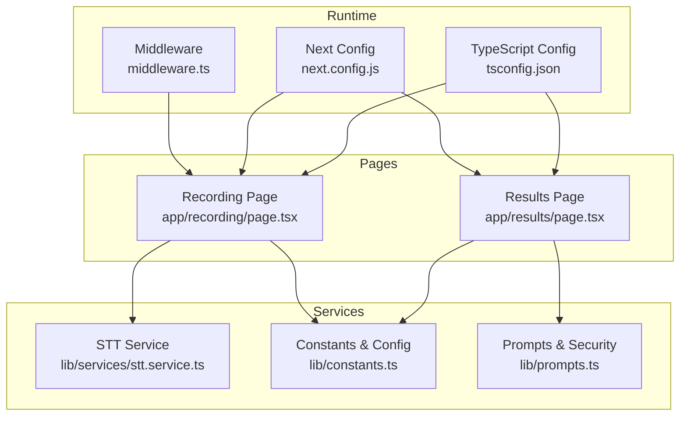
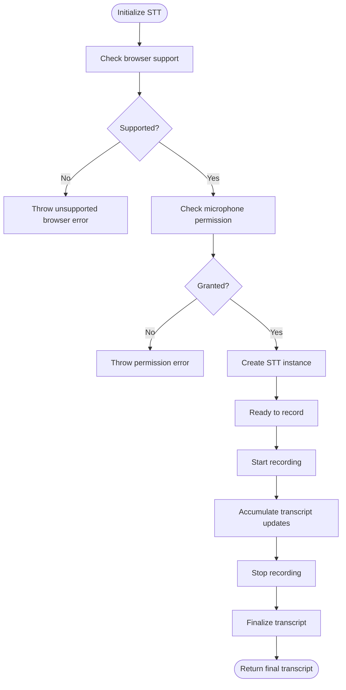
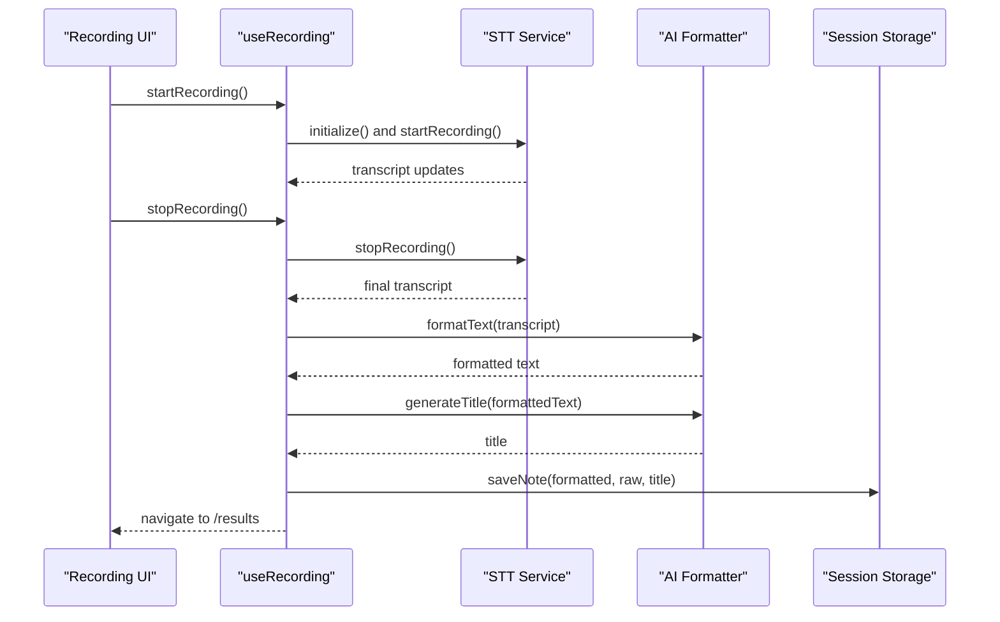
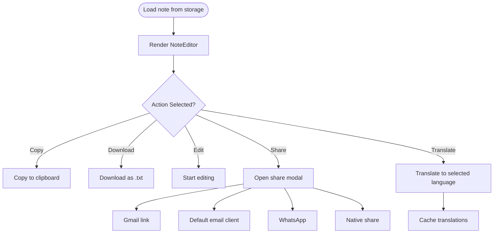
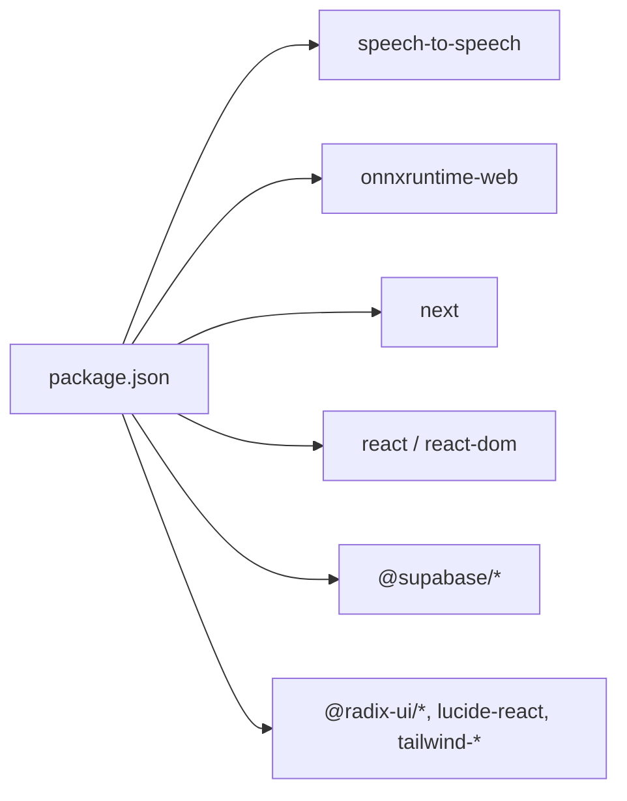

# Getting Started

<cite>
**Referenced Files in This Document**
- [package.json](file://package.json)
- [README.md](file://README.md)
- [next.config.js](file://next.config.js)
- [tsconfig.json](file://tsconfig.json)
- [app/recording/page.tsx](file://app/recording/page.tsx)
- [app/results/page.tsx](file://app/results/page.tsx)
- [lib/constants.ts](file://lib/constants.ts)
- [lib/services/stt.service.ts](file://lib/services/stt.service.ts)
- [lib/prompts.ts](file://lib/prompts.ts)
- [middleware.ts](file://middleware.ts)
</cite>

## Table of Contents
1. [Introduction](#introduction)
2. [Project Structure](#project-structure)
3. [Core Components](#core-components)
4. [Architecture Overview](#architecture-overview)
5. [Detailed Component Analysis](#detailed-component-analysis)
6. [Dependency Analysis](#dependency-analysis)
7. [Performance Considerations](#performance-considerations)
8. [Troubleshooting Guide](#troubleshooting-guide)
9. [Conclusion](#conclusion)
10. [Appendices](#appendices)

## Introduction
Welcome to OSCAR, the AI-powered voice-to-text application. This guide helps you quickly install, configure, and use OSCAR for the first time. You will learn the prerequisites, environment setup, how audio is captured and processed, and how AI formats your notes. Practical steps walk you from starting the development server to completing your first voice recording and reviewing the formatted results.

## Project Structure
OSCAR is a Next.js application organized into pages, components, and libraries for services, hooks, and configuration. The most relevant areas for onboarding are:
- Pages: recording and results flows
- Services: speech-to-text (STT), AI formatting, translation, and storage
- Constants and prompts: configuration, endpoints, UI strings, and AI prompts
- Middleware and configuration: session management and build settings

**Diagram sources**
- [app/recording/page.tsx](file://app/recording/page.tsx#L1-L549)
- [app/results/page.tsx](file://app/results/page.tsx#L1-L647)
- [lib/services/stt.service.ts](file://lib/services/stt.service.ts#L1-L259)
- [lib/constants.ts](file://lib/constants.ts#L1-L314)
- [lib/prompts.ts](file://lib/prompts.ts#L1-L458)
- [middleware.ts](file://middleware.ts#L1-L21)
- [next.config.js](file://next.config.js#L1-L95)
- [tsconfig.json](file://tsconfig.json#L1-L29)

**Section sources**
- [README.md](file://README.md#L49-L66)
- [package.json](file://package.json#L1-L53)

## Core Components
- Prerequisites
  - Node.js 18+ installed
  - The stt-tts-lib package file located at the project root
- Installation
  - Install dependencies using your package manager
  - Ensure the stt-tts-lib package is present in the project root
  - Start the development server
  - Open http://localhost:3000 in your browser
- First-time usage
  - Click “Start Recording”
  - Speak naturally
  - Click “Stop Recording”
  - Review formatted notes and actions (copy, download, edit, share)
- Environment variables
  - Create a .env.local file in the project root with your Deepseek API key
  - The app uses this key to generate AI-formatted notes and titles via Deepseek

**Section sources**
- [README.md](file://README.md#L13-L32)
- [README.md](file://README.md#L74-L81)

## Architecture Overview
The recording and results workflow integrates browser-based audio capture, local processing, and AI services. The recording page orchestrates the lifecycle, while the results page displays and lets you act on the formatted output.

```mermaid
sequenceDiagram
participant User as "User"
participant RecPage as "Recording Page<br/>app/recording/page.tsx"
participant STT as "STT Service<br/>lib/services/stt.service.ts"
participant AI as "AI Services<br/>lib/prompts.ts"
participant Const as "Constants<br/>lib/constants.ts"
participant ResPage as "Results Page<br/>app/results/page.tsx"
User->>RecPage : Click "Start Recording"
RecPage->>STT : initialize() and startRecording()
STT-->>RecPage : Real-time transcript updates
User->>RecPage : Click "Stop Recording"
RecPage->>STT : stopRecording()
STT-->>RecPage : Final transcript
RecPage->>AI : formatText(transcript)
AI-->>RecPage : Formatted text (with fallback)
RecPage->>AI : generateTitle(formattedText)
AI-->>RecPage : Title
RecPage->>Const : Save to session storage
RecPage-->>User : Navigate to Results Page
User->>ResPage : View formatted note and actions
```

**Diagram sources**
- [app/recording/page.tsx](file://app/recording/page.tsx#L136-L403)
- [lib/services/stt.service.ts](file://lib/services/stt.service.ts#L23-L140)
- [lib/prompts.ts](file://lib/prompts.ts#L101-L284)
- [lib/constants.ts](file://lib/constants.ts#L75-L98)
- [app/results/page.tsx](file://app/results/page.tsx#L33-L344)

## Detailed Component Analysis

### Audio-to-Text Integration (STT Service)
- Initialization
  - The STT service checks browser support and microphone permissions before creating the STT instance.
  - It sets up callbacks for real-time transcript updates and words tracking.
- Recording lifecycle
  - Start recording with optional seed transcript for continuation.
  - Stop recording and compute the final transcript with a small delay to finalize processing.
- iOS Safari handling
  - Implements a preemptive restart strategy to prevent session cutoff on iOS Safari.
- Error handling
  - Throws descriptive errors for unsupported browsers, missing permissions, initialization failures, and recording errors.

**Diagram sources**
- [lib/services/stt.service.ts](file://lib/services/stt.service.ts#L23-L140)

**Section sources**
- [lib/services/stt.service.ts](file://lib/services/stt.service.ts#L1-L259)

### Recording Page Workflow
- Pre-flight checks
  - For authenticated users, verifies monthly recording limits via a server-side API route before allowing recording.
- Processing simulation
  - Shows a multi-step progress screen while converting audio to text and formatting with AI.
- Error handling
  - Displays actionable toasts for permission issues, short recordings, and processing failures.
- Saving and navigation
  - Persists formatted notes and titles to session storage and navigates to the results page upon completion.

**Diagram sources**
- [app/recording/page.tsx](file://app/recording/page.tsx#L136-L403)
- [lib/services/stt.service.ts](file://lib/services/stt.service.ts#L74-L140)
- [lib/prompts.ts](file://lib/prompts.ts#L101-L284)

**Section sources**
- [app/recording/page.tsx](file://app/recording/page.tsx#L136-L403)

### Results Page and Actions
- Displays formatted note, raw transcript, and title
- Provides actions: copy to clipboard, download as text, edit, share (Gmail, default email client, WhatsApp, native share)
- Supports language switching (original, English, Hindi) with translation caching and cancellation
- Allows email-mode formatting for Gmail-ready bodies

**Diagram sources**
- [app/results/page.tsx](file://app/results/page.tsx#L33-L344)
- [lib/prompts.ts](file://lib/prompts.ts#L235-L284)

**Section sources**
- [app/results/page.tsx](file://app/results/page.tsx#L33-L344)

### AI Prompts and Safety
- System prompts define strict roles for formatting, title generation, translation, and email formatting.
- Input sanitization and validation help prevent prompt injection.
- Delimited XML-style tags protect user input passed to AI services.

**Section sources**
- [lib/prompts.ts](file://lib/prompts.ts#L101-L284)
- [lib/prompts.ts](file://lib/prompts.ts#L5-L85)

### Environment Variables and Configuration
- Environment variables
  - Create a .env.local file in the project root with your Deepseek API key.
- Next.js configuration
  - Webpack externals exclude onnxruntime-node and map onnxruntime-web/common to global variables.
  - Images remote patterns allow specific hosts.
- TypeScript configuration
  - Strict compiler options and module resolution tailored for the project.

**Section sources**
- [README.md](file://README.md#L74-L81)
- [next.config.js](file://next.config.js#L34-L91)
- [tsconfig.json](file://tsconfig.json#L2-L26)

## Dependency Analysis
- Runtime dependencies
  - speech-to-speech: Provides the audio-to-text engine used by the STT service.
  - onnxruntime-web: Enables ONNX runtime for web environments; configured via webpack externals.
  - next, react, react-dom: Framework and rendering stack.
  - @supabase/*: Authentication and SSR utilities.
  - Tailwind-based UI primitives and icons.
- Dev dependencies
  - TypeScript, ESLint, PostCSS, Tailwind CSS for development tooling.

**Diagram sources**
- [package.json](file://package.json#L11-L39)

**Section sources**
- [package.json](file://package.json#L11-L51)

## Performance Considerations
- WebAssembly and SharedArrayBuffer
  - The Next.js configuration externalizes onnxruntime packages and maps web/common to global variables to support WASM multi-threading.
- Minification and module handling
  - Module rules ensure ESM handling for certain packages to improve minification and runtime performance.
- Recording session tuning
  - Session duration and interim save intervals are configurable to balance responsiveness and accuracy.

**Section sources**
- [next.config.js](file://next.config.js#L34-L91)
- [lib/constants.ts](file://lib/constants.ts#L199-L208)

## Troubleshooting Guide
- Browser compatibility
  - Speech recognition requires supported browsers. On iOS, use Safari; otherwise use Chrome, Safari, or Edge.
- Microphone permissions
  - Allow microphone access when prompted. If denied, retry from the permission error modal.
- Recording too short or no speech detected
  - Record for at least a few seconds. The system validates minimum recording time and warns accordingly.
- Network or API errors
  - Ensure your Deepseek API key is set in .env.local. If the API is unreachable or returns an error, the system falls back to local formatting.
- CORS and runtime errors
  - Confirm environment variables are loaded and API routes are reachable. For production, prefer server-side API routes to avoid exposing secrets to the client.

**Section sources**
- [lib/constants.ts](file://lib/constants.ts#L6-L60)
- [README.md](file://README.md#L74-L81)
- [app/recording/page.tsx](file://app/recording/page.tsx#L244-L271)

## Conclusion
You are now ready to use OSCAR. Start the development server, allow microphone access, record your voice, and review the AI-formatted results. For production, secure your API keys and consider server-side API routes. If you encounter issues, consult the troubleshooting section and leverage the built-in error messages and toasts to diagnose problems.

## Appendices

### Step-by-Step First-Time Setup
- Prerequisites
  - Install Node.js 18+
  - Place the stt-tts-lib package file in the project root
- Install dependencies
  - Use your package manager to install dependencies
- Start the development server
  - Run the development command
  - Open http://localhost:3000
- Configure environment variables
  - Create .env.local with your Deepseek API key
- Record your first note
  - Click “Start Recording,” speak naturally, click “Stop Recording,” and review the formatted results
- Actions
  - Copy, download, edit, or share your note from the results page

**Section sources**
- [README.md](file://README.md#L18-L32)
- [README.md](file://README.md#L74-L81)
- [app/recording/page.tsx](file://app/recording/page.tsx#L136-L403)
- [app/results/page.tsx](file://app/results/page.tsx#L100-L161)