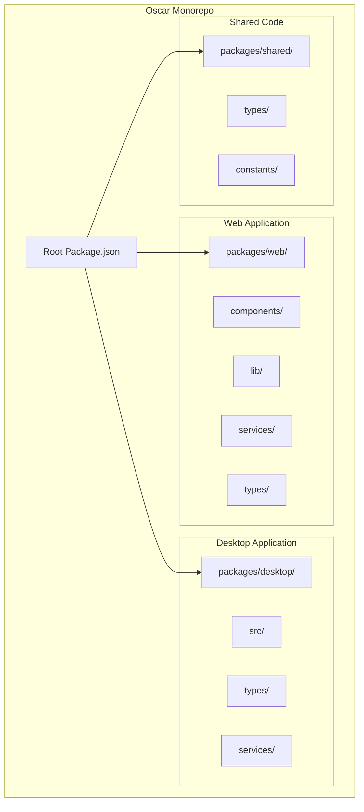
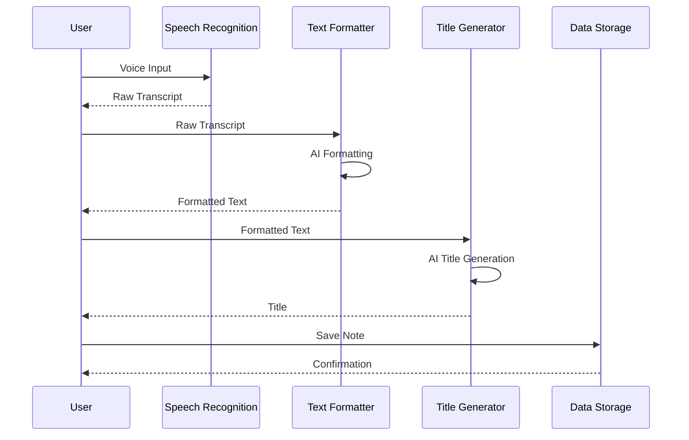
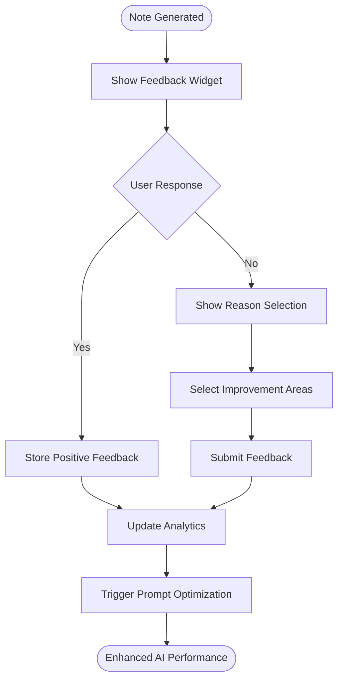
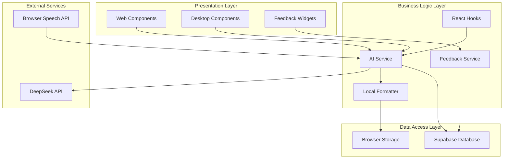
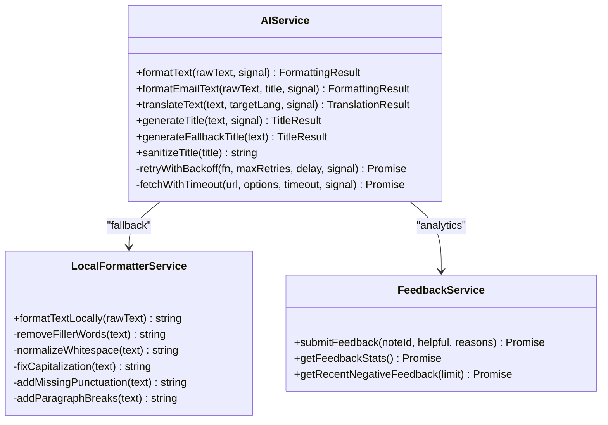
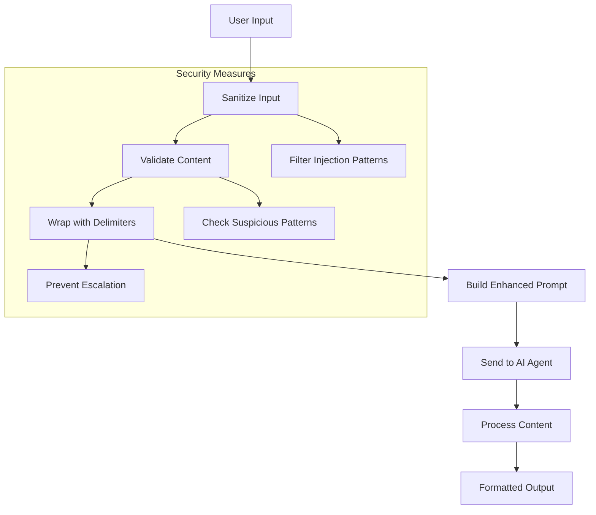
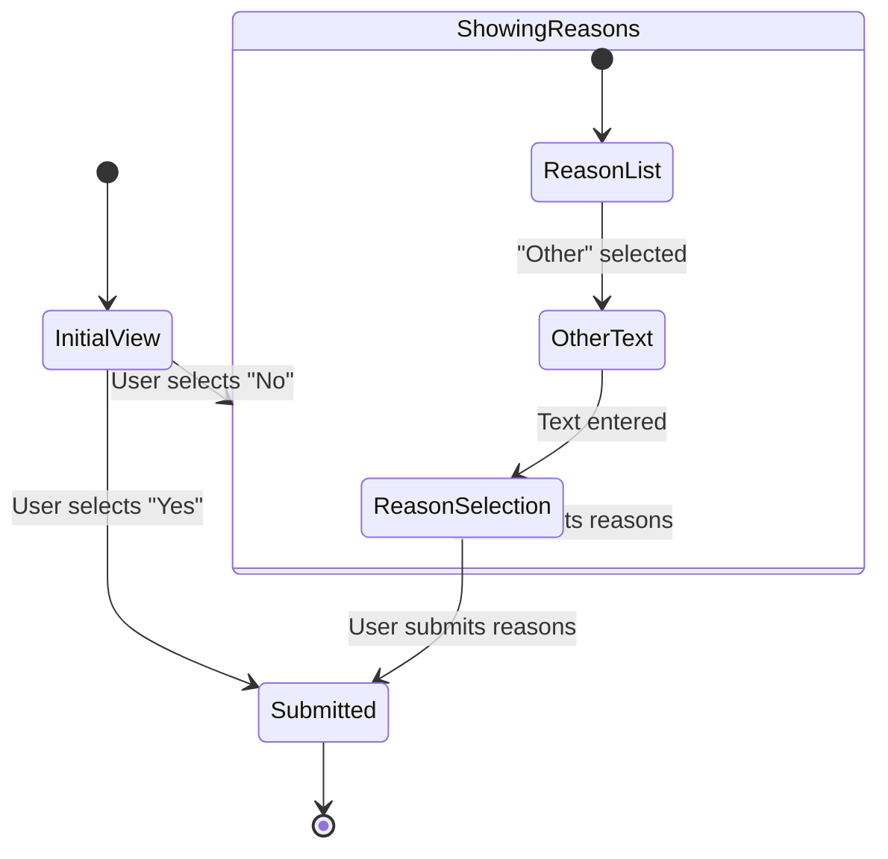
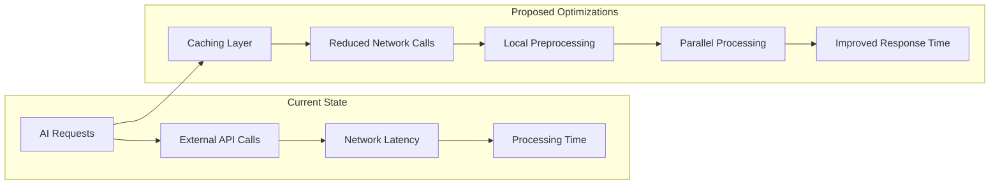

# Notes Application Enhancements

<cite>
**Referenced Files in This Document**
- [README.md](file://README.md)
- [DESIGN.md](file://DESIGN.md)
- [Agents.md](file://Agents.md)
- [package.json](file://package.json)
- [pnpm-workspace.yaml](file://pnpm-workspace.yaml)
- [packages/web/lib/services/ai.service.ts](file://packages/web/lib/services/ai.service.ts)
- [packages/web/lib/prompts.ts](file://packages/web/lib/prompts.ts)
- [packages/web/lib/constants.ts](file://packages/web/lib/constants.ts)
- [packages/web/lib/types/note.types.ts](file://packages/web/lib/types/note.types.ts)
- [packages/web/lib/types/api.types.ts](file://packages/web/lib/types/api.types.ts)
- [packages/web/components/results/FeedbackWidget.tsx](file://packages/web/components/results/FeedbackWidget.tsx)
- [packages/web/lib/services/feedback.service.ts](file://packages/web/lib/services/feedback.service.ts)
- [packages/web/lib/hooks/useAIFormatting.ts](file://packages/web/lib/hooks/useAIFormatting.ts)
- [packages/web/lib/services/localFormatter.service.ts](file://packages/web/lib/services/localFormatter.service.ts)
</cite>

## Table of Contents
1. [Introduction](#introduction)
2. [Project Structure](#project-structure)
3. [Core Components](#core-components)
4. [Architecture Overview](#architecture-overview)
5. [Detailed Component Analysis](#detailed-component-analysis)
6. [Enhancement Proposals](#enhancement-proposals)
7. [Performance Considerations](#performance-considerations)
8. [Troubleshooting Guide](#troubleshooting-guide)
9. [Conclusion](#conclusion)

## Introduction

The Oscar AI Note Taking App is a sophisticated voice-to-text application that transforms spoken words into polished, formatted notes using advanced AI agents. This monorepo structure supports both web and desktop platforms while maintaining shared components and services. The application leverages DeepSeek AI models to provide intelligent text formatting and title generation capabilities, with comprehensive fallback mechanisms and user feedback systems.

The platform offers both free-tier accessibility through local AI processing and premium-tier hosted solutions, making voice note-taking available to everyone while providing monetization opportunities for users requiring cloud-based processing.

## Project Structure

The Oscar project follows a modern monorepo architecture with three primary packages:

**Diagram sources**
- [package.json:1-11](file://package.json#L1-L11)
- [pnpm-workspace.yaml:1-3](file://pnpm-workspace.yaml#L1-L3)

The web application serves as the primary interface, implementing Next.js with TypeScript, while the desktop application utilizes Tauri for cross-platform native functionality. The shared package provides common types and constants used across both platforms.

**Section sources**
- [README.md:1-51](file://README.md#L1-L51)
- [package.json:1-11](file://package.json#L1-L11)
- [pnpm-workspace.yaml:1-3](file://pnpm-workspace.yaml#L1-L3)

## Core Components

### AI Agent System

The heart of Oscar's functionality lies in its dual AI agent architecture that processes voice recordings through intelligent formatting and title generation:

**Diagram sources**
- [packages/web/lib/services/ai.service.ts:126-479](file://packages/web/lib/services/ai.service.ts#L126-L479)
- [packages/web/lib/prompts.ts:101-285](file://packages/web/lib/prompts.ts#L101-L285)

The AI system implements robust error handling with graceful fallback mechanisms, ensuring reliable operation even when AI services are unavailable.

### Feedback Collection System

Oscar incorporates a comprehensive user feedback mechanism that drives continuous improvement of AI prompt quality:

**Diagram sources**
- [packages/web/components/results/FeedbackWidget.tsx:18-205](file://packages/web/components/results/FeedbackWidget.tsx#L18-L205)
- [packages/web/lib/services/feedback.service.ts:13-133](file://packages/web/lib/services/feedback.service.ts#L13-L133)

**Section sources**
- [Agents.md:1-349](file://Agents.md#L1-L349)
- [packages/web/lib/services/ai.service.ts:126-479](file://packages/web/lib/services/ai.service.ts#L126-L479)
- [packages/web/lib/prompts.ts:101-458](file://packages/web/lib/prompts.ts#L101-L458)

## Architecture Overview

The Oscar application employs a layered architecture with clear separation of concerns:

**Diagram sources**
- [packages/web/lib/services/ai.service.ts:126-479](file://packages/web/lib/services/ai.service.ts#L126-L479)
- [packages/web/lib/services/feedback.service.ts:9-133](file://packages/web/lib/services/feedback.service.ts#L9-L133)
- [packages/web/lib/services/localFormatter.service.ts:9-166](file://packages/web/lib/services/localFormatter.service.ts#L9-L166)

The architecture emphasizes scalability, maintainability, and user experience through comprehensive error handling and graceful degradation.

**Section sources**
- [DESIGN.md:1-411](file://DESIGN.md#L1-L411)
- [packages/web/lib/constants.ts:75-98](file://packages/web/lib/constants.ts#L75-L98)

## Detailed Component Analysis

### AI Service Implementation

The AI service provides a comprehensive interface for interacting with DeepSeek AI agents, implementing sophisticated retry logic and error handling:

**Diagram sources**
- [packages/web/lib/services/ai.service.ts:126-479](file://packages/web/lib/services/ai.service.ts#L126-L479)
- [packages/web/lib/services/localFormatter.service.ts:9-166](file://packages/web/lib/services/localFormatter.service.ts#L9-L166)
- [packages/web/lib/services/feedback.service.ts:13-133](file://packages/web/lib/services/feedback.service.ts#L13-L133)

The service implements exponential backoff retry logic, timeout handling, and comprehensive error management to ensure reliable operation.

**Section sources**
- [packages/web/lib/services/ai.service.ts:126-479](file://packages/web/lib/services/ai.service.ts#L126-L479)
- [packages/web/lib/services/localFormatter.service.ts:9-166](file://packages/web/lib/services/localFormatter.service.ts#L9-L166)

### Prompt Engineering System

The application employs sophisticated prompt engineering techniques to guide AI behavior and prevent prompt injection attacks:

**Diagram sources**
- [packages/web/lib/prompts.ts:10-85](file://packages/web/lib/prompts.ts#L10-L85)
- [packages/web/lib/prompts.ts:304-336](file://packages/web/lib/prompts.ts#L304-L336)

The prompt system includes comprehensive input sanitization, pattern validation, and XML-style delimiter wrapping to prevent prompt injection attacks while maintaining AI effectiveness.

**Section sources**
- [packages/web/lib/prompts.ts:101-458](file://packages/web/lib/prompts.ts#L101-L458)

### Feedback Widget Component

The feedback widget provides an intuitive interface for users to evaluate AI formatting quality:

**Diagram sources**
- [packages/web/components/results/FeedbackWidget.tsx:27-205](file://packages/web/components/results/FeedbackWidget.tsx#L27-L205)

The component implements smooth animations, responsive design, and comprehensive state management for optimal user experience.

**Section sources**
- [packages/web/components/results/FeedbackWidget.tsx:18-205](file://packages/web/components/results/FeedbackWidget.tsx#L18-L205)

## Enhancement Proposals

### Advanced AI Capabilities

Several enhancement opportunities exist to further improve the application's functionality:

1. **Multi-Language Support**: Extend AI agents to handle multiple languages with context-aware translation
2. **Custom Formatting Styles**: Allow users to define personalized formatting preferences
3. **Streaming Responses**: Implement real-time AI processing for immediate feedback
4. **Sentiment Analysis**: Add emotional tone detection and analysis capabilities
5. **Summary Generation**: Provide automatic note summarization features

### Performance Optimizations

**Diagram sources**
- [packages/web/lib/services/ai.service.ts:17-21](file://packages/web/lib/services/ai.service.ts#L17-L21)

### User Experience Improvements

1. **Enhanced Voice Controls**: Implement voice command recognition for hands-free operation
2. **Real-time Collaboration**: Enable multiple users to collaborate on notes simultaneously
3. **Advanced Search**: Implement semantic search capabilities for note discovery
4. **Offline Mode**: Enhance local processing capabilities for offline operation
5. **Accessibility Features**: Expand accessibility support for users with disabilities

## Performance Considerations

The application implements several performance optimization strategies:

- **Retry Logic**: Exponential backoff with configurable retry attempts
- **Timeout Management**: Comprehensive timeout handling with user feedback
- **Cancellation Support**: AbortController integration for request cancellation
- **Caching Strategies**: Strategic caching of frequently accessed data
- **Lazy Loading**: Component lazy loading for improved initial load times

**Section sources**
- [packages/web/lib/services/ai.service.ts:17-124](file://packages/web/lib/services/ai.service.ts#L17-L124)
- [packages/web/lib/hooks/useAIFormatting.ts:7-77](file://packages/web/lib/hooks/useAIFormatting.ts#L7-L77)

## Troubleshooting Guide

### Common Issues and Solutions

**API Key Configuration**
- Verify DEEPSEEK_API_KEY environment variable is set correctly
- Check API quota limits and billing status
- Validate API endpoint accessibility

**Network Connectivity**
- Test network connectivity to DeepSeek API endpoints
- Verify firewall and proxy configurations
- Check for DNS resolution issues

**Audio Processing**
- Verify microphone permissions and availability
- Test browser compatibility for speech recognition
- Check audio input device functionality

**Error Handling**
- Review console logs for detailed error messages
- Implement comprehensive error reporting
- Monitor API response codes and error patterns

**Section sources**
- [packages/web/lib/constants.ts:6-60](file://packages/web/lib/constants.ts#L6-L60)
- [packages/web/lib/services/ai.service.ts:195-224](file://packages/web/lib/services/ai.service.ts#L195-L224)

## Conclusion

The Oscar AI Note Taking App represents a sophisticated solution for voice-to-text processing, combining advanced AI capabilities with user-friendly design principles. The comprehensive architecture ensures reliability through graceful fallback mechanisms, while the feedback-driven development process continuously improves AI performance.

The monorepo structure enables efficient development across web and desktop platforms while maintaining code consistency and shared functionality. The emphasis on accessibility, security, and user experience positions Oscar as a leading solution in the AI-powered note-taking space.

Future enhancements in multi-language support, streaming capabilities, and collaborative features will further expand the application's utility while maintaining the high standards established in the current implementation.