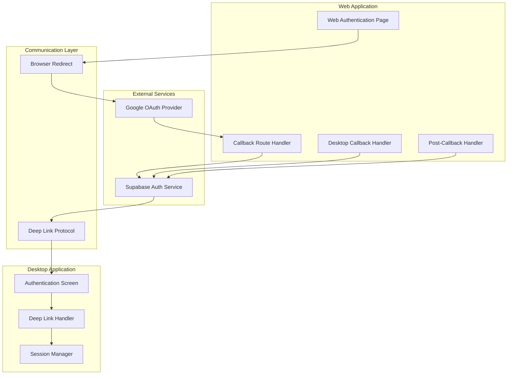
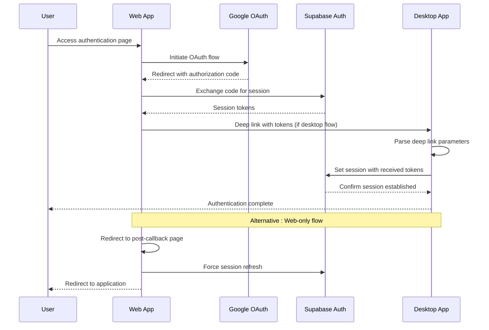
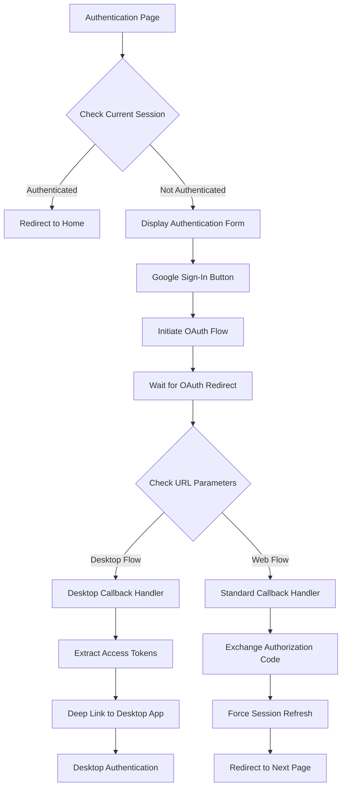
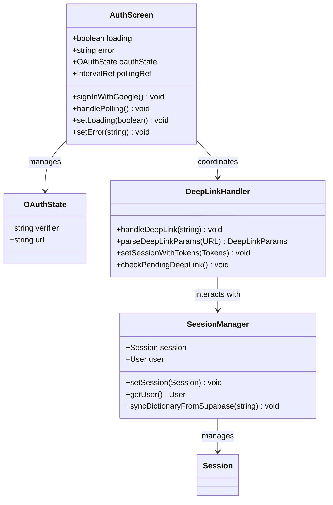
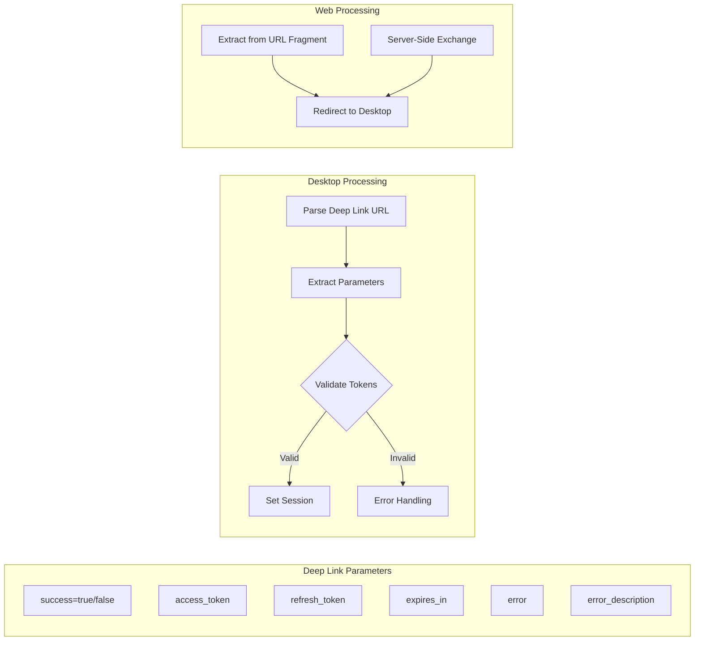
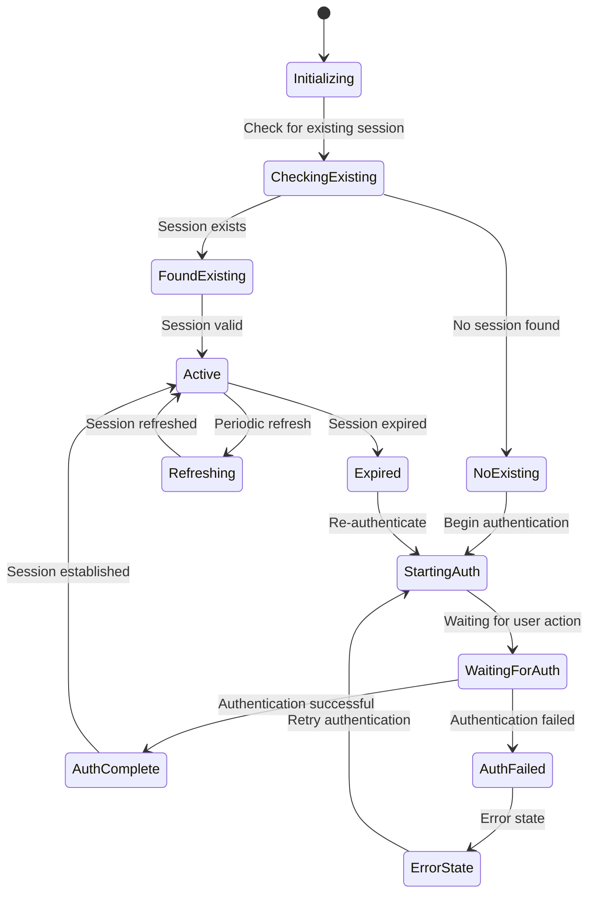
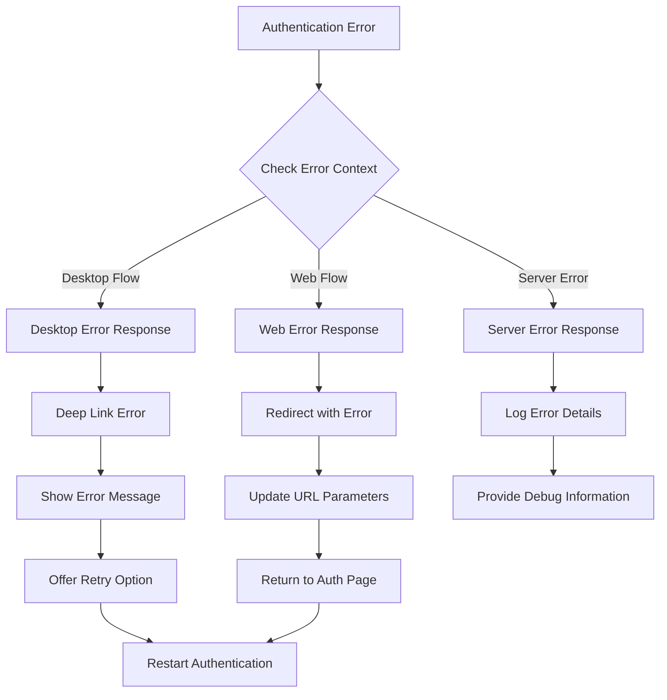

# Old Authentication Flow

<cite>
**Referenced Files in This Document**
- [route.ts](file://packages/web/app/auth/callback/route.ts)
- [page.tsx](file://packages/web/app/auth/desktop-callback/page.tsx)
- [page.tsx](file://packages/web/app/auth/page.tsx)
- [page.tsx](file://packages/web/app/auth/post-callback/page.tsx)
- [App.tsx](file://packages/desktop/src/App.tsx)
</cite>

## Table of Contents
1. [Introduction](#introduction)
2. [System Architecture](#system-architecture)
3. [Authentication Flow Overview](#authentication-flow-overview)
4. [Web Application Authentication](#web-application-authentication)
5. [Desktop Application Authentication](#desktop-application-authentication)
6. [Deep Link Communication](#deep-link-communication)
7. [Session Management](#session-management)
8. [Error Handling](#error-handling)
9. [Security Considerations](#security-considerations)
10. [Troubleshooting Guide](#troubleshooting-guide)
11. [Conclusion](#conclusion)

## Introduction

The Old Authentication Flow describes the legacy authentication system used by the OSCAR AI voice note-taking application. This system implements a hybrid approach combining traditional web OAuth with deep linking capabilities for seamless desktop application integration. The authentication flow supports both web browser-based authentication and desktop application authentication through Google OAuth providers.

The system utilizes Supabase Auth for session management and implements a sophisticated deep linking mechanism that allows the web application to communicate authentication results back to the desktop application seamlessly. This architecture enables users to authenticate through either interface while maintaining consistent session state across both platforms.

## System Architecture

The authentication system follows a distributed architecture with clear separation of concerns between web and desktop components:

**Diagram sources**
- [route.ts:1-40](file://packages/web/app/auth/callback/route.ts#L1-L40)
- [page.tsx:1-63](file://packages/web/app/auth/desktop-callback/page.tsx#L1-L63)
- [page.tsx:1-64](file://packages/web/app/auth/post-callback/page.tsx#L1-L64)
- [App.tsx:198-397](file://packages/desktop/src/App.tsx#L198-L397)

## Authentication Flow Overview

The authentication process follows a multi-stage flow designed to handle both web and desktop authentication scenarios:

**Diagram sources**
- [route.ts:4-39](file://packages/web/app/auth/callback/route.ts#L4-L39)
- [page.tsx:10-44](file://packages/web/app/auth/desktop-callback/page.tsx#L10-L44)
- [App.tsx:751-830](file://packages/desktop/src/App.tsx#L751-L830)

## Web Application Authentication

The web application implements a comprehensive authentication system with multiple entry points and fallback mechanisms:

### Authentication Entry Point

The authentication process begins at the main authentication page, which serves as the central hub for all authentication activities:

**Diagram sources**
- [page.tsx:149-172](file://packages/web/app/auth/page.tsx#L149-L172)
- [page.tsx:7-44](file://packages/web/app/auth/desktop-callback/page.tsx#L7-L44)

### Callback Route Processing

The callback route handles the OAuth response and manages the session establishment process:

**Section sources**
- [route.ts:4-39](file://packages/web/app/auth/callback/route.ts#L4-L39)

The callback route performs several critical functions:
1. Extracts authorization code from URL parameters
2. Determines if the flow originated from the desktop application
3. Exchanges the authorization code for session tokens
4. Handles both web and desktop authentication scenarios
5. Manages error conditions and redirects

### Post-Authentication Processing

The post-callback handler ensures session consistency across browser tabs and windows:

**Section sources**
- [page.tsx:8-46](file://packages/web/app/auth/post-callback/page.tsx#L8-L46)

The post-callback process includes:
1. Reading the current session state
2. Forcing session refresh to handle cookie changes
3. Redirecting to the intended destination
4. Handling authentication failures gracefully

## Desktop Application Authentication

The desktop application implements a sophisticated authentication system that handles OAuth flows independently while maintaining synchronization with the web application:

### Authentication Screen Implementation

The desktop authentication screen provides a user-friendly interface for initiating and managing the authentication process:

**Diagram sources**
- [App.tsx:198-397](file://packages/desktop/src/App.tsx#L198-L397)
- [App.tsx:749-948](file://packages/desktop/src/App.tsx#L749-L948)

### OAuth Flow Management

The desktop application implements a polling-based approach to detect successful authentication completion:

**Section sources**
- [App.tsx:204-244](file://packages/desktop/src/App.tsx#L204-L244)

Key features of the desktop authentication flow:
1. Initiates OAuth with Google provider
2. Opens external browser for authentication
3. Implements 1-second polling interval to check session status
4. Provides 5-minute timeout for authentication completion
5. Handles error conditions gracefully

### Session Synchronization

The desktop application maintains session state through multiple mechanisms:

**Section sources**
- [App.tsx:728-747](file://packages/desktop/src/App.tsx#L728-L747)
- [App.tsx:749-830](file://packages/desktop/src/App.tsx#L749-L830)

Session management includes:
1. Real-time auth state monitoring
2. Automatic dictionary synchronization
3. Persistent session storage
4. Graceful error recovery

## Deep Link Communication

The deep linking system provides seamless communication between the web and desktop applications during authentication:

### Deep Link Protocol

**Diagram sources**
- [page.tsx:10-44](file://packages/web/app/auth/desktop-callback/page.tsx#L10-L44)
- [App.tsx:751-830](file://packages/desktop/src/App.tsx#L751-L830)

### Parameter Extraction and Validation

The deep link system handles multiple parameter extraction scenarios:

**Section sources**
- [page.tsx:10-44](file://packages/web/app/auth/desktop-callback/page.tsx#L10-L44)
- [App.tsx:757-770](file://packages/desktop/src/App.tsx#L757-L770)

Parameter handling includes:
1. URL parameter parsing
2. Fragment parameter extraction (tokens from OAuth)
3. Error parameter validation
4. Fallback parameter handling for backward compatibility

## Session Management

The authentication system implements robust session management across both web and desktop environments:

### Session Lifecycle

### Cross-Platform Session Synchronization

The system ensures consistent session state across platforms through multiple mechanisms:

**Section sources**
- [page.tsx:14-46](file://packages/web/app/auth/post-callback/page.tsx#L14-L46)
- [App.tsx:738-747](file://packages/desktop/src/App.tsx#L738-L747)

Cross-platform synchronization features:
1. Real-time auth state change notifications
2. Automatic session refresh mechanisms
3. Dictionary synchronization on user login
4. Persistent session storage across app restarts

## Error Handling

The authentication system implements comprehensive error handling across all components:

### Error Scenarios and Responses

### Error Recovery Mechanisms

The system provides multiple recovery pathways for different error conditions:

**Section sources**
- [App.tsx:227-235](file://packages/desktop/src/App.tsx#L227-L235)
- [route.ts:32-35](file://packages/web/app/auth/callback/route.ts#L32-L35)

Error handling includes:
1. 5-minute timeout for desktop authentication
2. Graceful error messages for users
3. Automatic retry mechanisms
4. Fallback authentication methods

## Security Considerations

The authentication system implements several security measures to protect user credentials and session data:

### Token Security

The system handles authentication tokens securely through multiple channels:

1. **Deep Link Token Transmission**: Tokens are transmitted via secure deep links with proper URL encoding
2. **Session Storage**: Tokens are stored in Supabase-managed session storage
3. **Token Expiration**: Proper handling of token expiration and refresh cycles
4. **Cross-Site Request Forgery Protection**: Implementation of CSRF protection measures

### Authentication Flow Security

Security measures implemented in the authentication flow:
1. **Authorization Code Verification**: Proper verification of authorization codes
2. **Provider Verification**: Secure verification with Google OAuth provider
3. **Session Validation**: Regular session validation and refresh
4. **Error Handling Security**: Secure error handling without exposing sensitive information

## Troubleshooting Guide

Common authentication issues and their solutions:

### Desktop Authentication Issues

**Problem**: Desktop app shows timeout error
- **Solution**: Verify internet connectivity and browser installation
- **Prevention**: Implement proper timeout handling and user feedback

**Problem**: Deep link not working between web and desktop
- **Solution**: Check deep link protocol implementation and URL scheme registration
- **Prevention**: Test deep link functionality during development

### Web Authentication Issues

**Problem**: Session not persisting across browser tabs
- **Solution**: Implement post-callback session refresh mechanism
- **Prevention**: Use post-callback handler for session synchronization

**Problem**: OAuth redirect loop
- **Solution**: Verify redirect URI configuration and URL parameter handling
- **Prevention**: Implement proper URL parameter validation

### General Troubleshooting Steps

1. **Clear browser cache and cookies**
2. **Verify network connectivity**
3. **Check OAuth provider status**
4. **Review authentication logs**
5. **Test with incognito/private browsing mode**

**Section sources**
- [App.tsx:227-235](file://packages/desktop/src/App.tsx#L227-L235)
- [page.tsx:14-46](file://packages/web/app/auth/post-callback/page.tsx#L14-L46)

## Conclusion

The Old Authentication Flow represents a sophisticated authentication system that successfully bridges web and desktop authentication experiences. The system's strength lies in its comprehensive error handling, cross-platform session synchronization, and seamless deep link communication.

Key achievements of the authentication system include:
- Seamless integration between web and desktop platforms
- Robust error handling and recovery mechanisms
- Comprehensive session management across multiple contexts
- Secure token handling and transmission
- User-friendly authentication experience

The system provides a solid foundation for the OSCAR application's authentication needs while maintaining flexibility for future enhancements and modernization efforts.