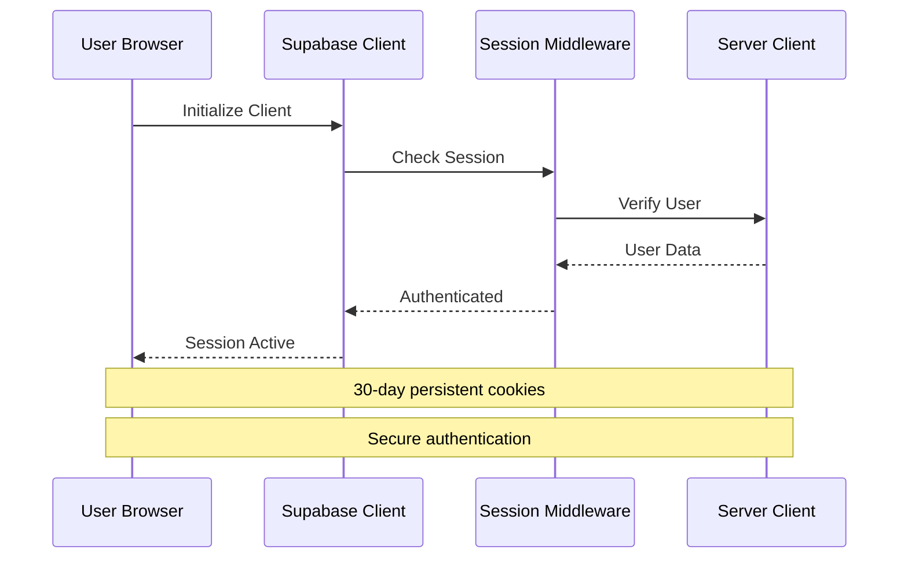

# Privacy Policy

<cite>
**Referenced Files in This Document**
- [packages/web/app/privacy/page.tsx](file://packages/web/app/privacy/page.tsx)
- [packages/web/components/settings/DataPrivacySection.tsx](file://packages/web/components/settings/DataPrivacySection.tsx)
- [packages/web/lib/supabase/client.ts](file://packages/web/lib/supabase/client.ts)
- [packages/web/lib/supabase/server.ts](file://packages/web/lib/supabase/server.ts)
- [packages/web/lib/supabase/middleware.ts](file://packages/web/lib/supabase/middleware.ts)
- [packages/web/app/terms/page.tsx](file://packages/web/app/terms/page.tsx)
- [packages/web/app/refund-policy/page.tsx](file://packages/web/app/refund-policy/page.tsx)
- [packages/web/app/api/deepseek/format/route.ts](file://packages/web/app/api/deepseek/format/route.ts)
- [packages/web/app/api/deepseek/title/route.ts](file://packages/web/app/api/deepseek/title/route.ts)
- [packages/web/lib/services/ai.service.ts](file://packages/web/lib/services/ai.service.ts)
- [packages/web/lib/prompts.ts](file://packages/web/lib/prompts.ts)
- [packages/web/lib/constants.ts](file://packages/web/lib/constants.ts)
- [packages/web/lib/types/note.types.ts](file://packages/web/lib/types/note.types.ts)
- [packages/web/lib/services/feedback.service.ts](file://packages/web/lib/services/feedback.service.ts)
- [packages/web/components/results/FeedbackWidget.tsx](file://packages/web/components/results/FeedbackWidget.tsx)
- [packages/desktop/src/App.tsx](file://packages/desktop/src/App.tsx)
</cite>

## Table of Contents
1. [Introduction](#introduction)
2. [Information We Collect](#information-we-collect)
3. [Third-Party Services](#third-party-services)
4. [Use of Information](#use-of-information)
5. [Data Retention, Deletion, and Export](#data-retention-deletion-and-export)
6. [Security Measures](#security-measures)
7. [Children's Privacy](#childrens-privacy)
8. [Cookies and Storage](#cookies-and-storage)
9. [User Rights and Controls](#user-rights-and-controls)
10. [AI Processing and Data Handling](#ai-processing-and-data-handling)
11. [Legal Compliance](#legal-compliance)
12. [Contact Information](#contact-information)

## Introduction

This Privacy Policy explains what information is collected, how it is used, and with whom it is shared when you use OSCAR, an AI-powered voice note-taking application. The policy covers both the web application and desktop application, detailing how user data is handled across all platforms.

**Section sources**
- [packages/web/app/privacy/page.tsx:13-15](file://packages/web/app/privacy/page.tsx#L13-L15)

## Information We Collect

### Personal Information
When you register with OSCAR, we only collect a valid email address. If you sign in via Google or another OAuth provider, we may receive your name and profile picture as shared by that provider. We request only the minimum permissions necessary for account creation and authentication.

### Voice and Content Data
When you record a voice note, your audio is processed in real-time to generate a text transcription. OSCAR does not permanently store your audio recordings on our servers. The audio is discarded immediately after transcription completion. Only the resulting transcribed and formatted text is saved to your account.

### Payment Information
OSCAR does not directly collect payment information. Payments are processed through Razorpay (www.razorpay.com). As a result of this integration, some billing details such as your payment method type, billing address, and transaction amount may be visible to OSCAR through Razorpay's tools. Your full card details are never stored on our servers.

### Usage Data
OSCAR collects basic usage data including recording count, duration, and feature interactions. This helps us understand how the product is being used and improve it over time.

**Section sources**
- [packages/web/app/privacy/page.tsx:27-38](file://packages/web/app/privacy/page.tsx#L27-L38)
- [packages/web/app/privacy/page.tsx:45-56](file://packages/web/app/privacy/page.tsx#L45-L56)

## Third-Party Services

### DeepSeek AI Processing
For processing your voice recordings and formatting the resulting text, OSCAR uses APIs provided by DeepSeek. As a result, your transcribed text is transmitted to DeepSeek's servers during processing. DeepSeek is operated by a China-based company. Your data is not used to train their models. Further information can be found on the DeepSeek website. By using OSCAR, you consent to this transfer.

### Supabase Infrastructure
For authentication, database, and file storage, OSCAR uses Supabase (www.supabase.com). Your account data and notes are stored on Supabase's servers, which encrypt data at rest.

### Razorpay Payment Processing
For payment processing and subscription management, OSCAR uses Razorpay (www.razorpay.com). Their privacy policy governs how they handle your billing information.

**Section sources**
- [packages/web/app/privacy/page.tsx:71-73](file://packages/web/app/privacy/page.tsx#L71-L73)
- [packages/web/app/privacy/page.tsx:80-83](file://packages/web/app/privacy/page.tsx#L80-L83)
- [packages/web/app/privacy/page.tsx:89-91](file://packages/web/app/privacy/page.tsx#L89-L91)

## Use of Information

The information collected is used solely to provide you with the services you have subscribed to on OSCAR and to continually improve your experience. We do not sell your personal data to third parties. We do not display advertisements. If we send you any non-essential communications, you may opt out at any time.

**Section sources**
- [packages/web/app/privacy/page.tsx:109-111](file://packages/web/app/privacy/page.tsx#L109-L111)

## Data Retention, Deletion, and Export

All notes created by you and stored on our servers will be retained for as long as your account remains active. Audio from your recordings is automatically discarded from our servers immediately after transcription — we do not retain your audio files.

All content you create on OSCAR is private and not visible to other users. However, data stored on our servers is accessible to OSCAR's operators for the purposes of support and service maintenance.

If you would like to export your notes and data, you can do so from the settings page of your account. If you would like to delete your account and associated data, you can do so from your account settings.

**Section sources**
- [packages/web/app/privacy/page.tsx:120-135](file://packages/web/app/privacy/page.tsx#L120-L135)

## Security Measures

We implement appropriate technical and organizational measures to protect your data, including encryption at rest, secure authentication, and restricted access controls. In the event of a data breach that materially affects your personal information, we will notify you promptly. No method of transmission over the Internet is 100% secure, but we take your data seriously and work continuously to safeguard it.

**Section sources**
- [packages/web/app/privacy/page.tsx:142-144](file://packages/web/app/privacy/page.tsx#L142-L144)

## Children's Privacy

Our service is not intended for children under 13. We do not knowingly collect data from children under 13.

**Section sources**
- [packages/web/app/privacy/page.tsx:151-153](file://packages/web/app/privacy/page.tsx#L151-L153)

## Cookies and Storage

OSCAR sets cookies for authentication purposes and to enable essential platform functionality — specifically a session ID cookie, a session signature cookie to prevent tampering, and a cookie to identify the current logged-in user. OSCAR also uses browser local storage to save your app preferences.

**Section sources**
- [packages/web/app/privacy/page.tsx:98-100](file://packages/web/app/privacy/page.tsx#L98-L100)

## User Rights and Controls

### Data Export and Clear All Data
From the settings page, you can export all your personal data including notes, transcriptions, vocabulary entries, account information, and usage history. You can also clear all your data while keeping your account active.

### Analytics Preferences
You can manage your analytics preferences to help us improve OSCAR by sharing anonymous usage data.

### Legal Documents Access
You can review our Privacy Policy, Terms of Service, and Refund Policy directly from the settings page.

**Section sources**
- [packages/web/components/settings/DataPrivacySection.tsx:78-96](file://packages/web/components/settings/DataPrivacySection.tsx#L78-L96)
- [packages/web/components/settings/DataPrivacySection.tsx:110-124](file://packages/web/components/settings/DataPrivacySection.tsx#L110-L124)
- [packages/web/components/settings/DataPrivacySection.tsx:138-166](file://packages/web/components/settings/DataPrivacySection.tsx#L138-L166)

## AI Processing and Data Handling

### Voice Processing Pipeline
The AI processing pipeline follows a specific flow designed to minimize data retention:

1. **Voice Recording**: User speaks into microphone
2. **Speech-to-Text**: Browser API or stt-tts-lib converts audio to text
3. **AI Formatting**: Raw transcript sent to formatting agent
4. **AI Title Generation**: Formatted text sent to title agent
5. **Storage**: Results saved to sessionStorage and Supabase
6. **Display**: User can view, edit, copy, or download
7. **Feedback Collection**: User provides quality feedback on AI formatting

### Data Minimization in AI Processing
- Audio files are discarded immediately after transcription
- Only formatted text is stored on servers
- AI processing occurs through external APIs (DeepSeek)
- No permanent audio retention on OSCAR servers

### Feedback Collection System
The feedback system collects user signals on AI formatting quality to enable continuous improvement. Each note stores feedback_helpful, feedback_reasons, and feedback_timestamp data for analysis and improvement.

**Section sources**
- [packages/web/app/privacy/page.tsx:120-122](file://packages/web/app/privacy/page.tsx#L120-L122)
- [packages/web/app/privacy/page.tsx:187-186](file://packages/web/app/privacy/page.tsx#L187-L186)
- [packages/web/lib/types/note.types.ts:210-216](file://packages/web/lib/types/note.types.ts#L210-L216)

## Legal Compliance

### Terms of Service
By using OSCAR, you agree to our Terms of Service, which govern acceptable use, content ownership, and account termination procedures.

### Refund Policy
We offer a 7-day money-back guarantee for new subscribers, technical issue refunds, and billing error corrections. Refunds are processed through Razorpay according to established timelines.

### Governing Law
These Terms are governed by the laws of India, with disputes resolved in Indian courts.

**Section sources**
- [packages/web/app/terms/page.tsx:13-19](file://packages/web/app/terms/page.tsx#L13-L19)
- [packages/web/app/refund-policy/page.tsx:18-28](file://packages/web/app/refund-policy/page.tsx#L18-L28)

## Contact Information

If you have questions about this Privacy Policy, please contact us through the settings page or at the contact information provided in our application.

**Section sources**
- [packages/web/app/privacy/page.tsx:160-162](file://packages/web/app/privacy/page.tsx#L160-L162)

## Data Flow Architecture

```mermaid
flowchart TD
A[User Audio Recording] --> B[Browser Speech Processing]
B --> C[Real-time Transcription]
C --> D[AI Formatting Agent<br/>(DeepSeek API)]
D --> E[AI Title Generation<br/>(DeepSeek API)]
E --> F[Local Storage<br/>(sessionStorage)]
E --> G[Supabase Storage<br/>(Notes Database)]
H[User Settings] --> I[Data Export Request]
H --> J[Clear All Data Request]
I --> K[Export Processing]
J --> L[Data Deletion]
M[Supabase Authentication] --> N[User Session Management]
N --> O[Protected Routes]
subgraph "External Services"
P[DeepSeek API]
Q[Razorpay]
R[Supabase]
end
D --> P
E --> P
Q --> G
R --> G
```

**Diagram sources**
- [packages/web/app/privacy/page.tsx:177-186](file://packages/web/app/privacy/page.tsx#L177-L186)
- [packages/web/lib/supabase/client.ts:12-25](file://packages/web/lib/supabase/client.ts#L12-L25)
- [packages/web/lib/supabase/server.ts:4-36](file://packages/web/lib/supabase/server.ts#L4-L36)

## Authentication and Session Management



**Diagram sources**
- [packages/web/lib/supabase/client.ts:12-25](file://packages/web/lib/supabase/client.ts#L12-L25)
- [packages/web/lib/supabase/server.ts:4-36](file://packages/web/lib/supabase/server.ts#L4-L36)
- [packages/web/lib/supabase/middleware.ts:4-53](file://packages/web/lib/supabase/middleware.ts#L4-L53)