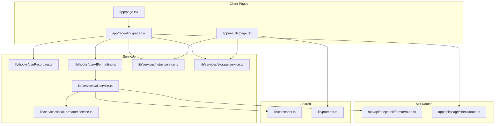
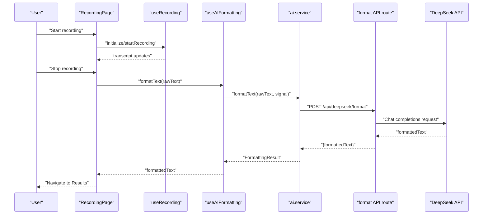
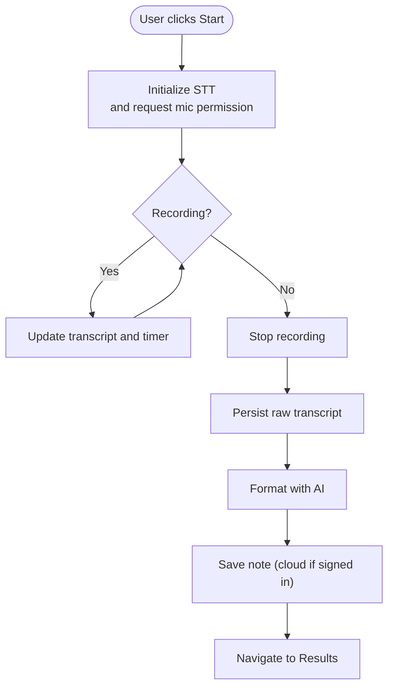
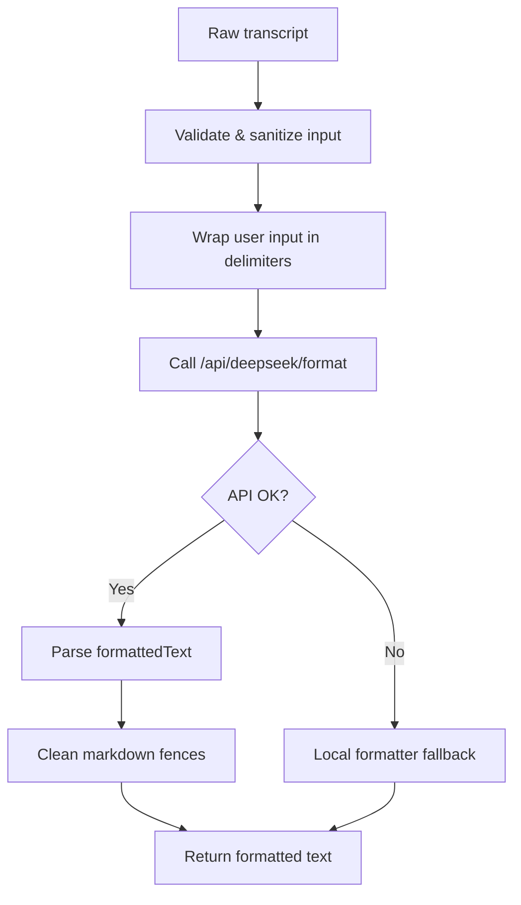
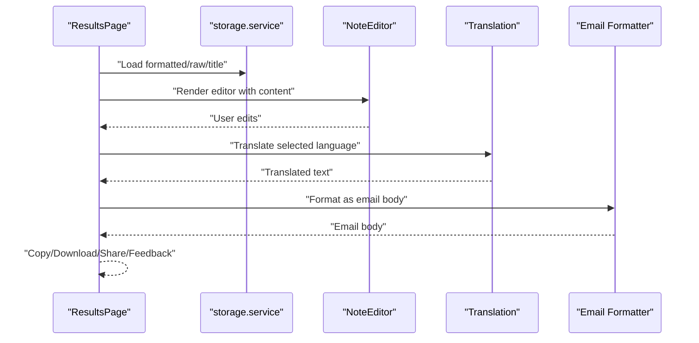
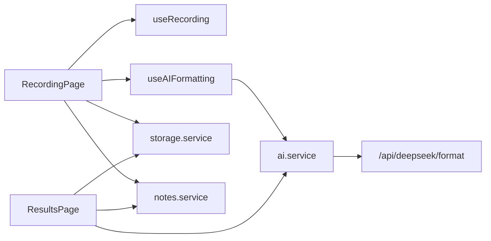

# Project Overview

<cite>
**Referenced Files in This Document**
- [README.md](file://README.md)
- [package.json](file://package.json)
- [app/page.tsx](file://app/page.tsx)
- [app/recording/page.tsx](file://app/recording/page.tsx)
- [app/results/page.tsx](file://app/results/page.tsx)
- [lib/constants.ts](file://lib/constants.ts)
- [lib/prompts.ts](file://lib/prompts.ts)
- [lib/hooks/useRecording.ts](file://lib/hooks/useRecording.ts)
- [lib/hooks/useAIFormatting.ts](file://lib/hooks/useAIFormatting.ts)
- [lib/services/ai.service.ts](file://lib/services/ai.service.ts)
- [lib/services/notes.service.ts](file://lib/services/notes.service.ts)
- [lib/services/storage.service.ts](file://lib/services/storage.service.ts)
- [lib/services/localFormatter.service.ts](file://lib/services/localFormatter.service.ts)
- [app/api/deepseek/format/route.ts](file://app/api/deepseek/format/route.ts)
- [app/api/usage/check/route.ts](file://app/api/usage/check/route.ts)
</cite>

## Table of Contents
1. [Introduction](#introduction)
2. [Project Structure](#project-structure)
3. [Core Components](#core-components)
4. [Architecture Overview](#architecture-overview)
5. [Detailed Component Analysis](#detailed-component-analysis)
6. [Dependency Analysis](#dependency-analysis)
7. [Performance Considerations](#performance-considerations)
8. [Troubleshooting Guide](#troubleshooting-guide)
9. [Conclusion](#conclusion)

## Introduction
OSCAR is an AI-powered voice-to-text application that turns spoken words into clean, formatted text with minimal effort. Users simply speak naturally; OSCAR captures the audio, converts it to text, and then uses AI to remove filler words, fix grammar, and structure the content into readable paragraphs. The result is instantly ready for copying, editing, or downloading—without manual cleanup.

Key value propositions:
- Speak freely without worrying about formatting
- AI cleans and structures your ideas automatically
- Ready-to-use output for notes, emails, and collaboration
- Privacy-first: sensitive logic runs server-side behind API routes
- Personalization: custom vocabulary improves recognition accuracy

Target audience:
- Professionals who want to capture meeting notes, ideas, and brainstorms quickly
- Students and creators who need fast transcription and editing
- Anyone tired of typing out their thoughts and preferring voice-first workflows

Primary use cases:
- Transcribing meetings and lectures
- Capturing creative ideas and outlines
- Generating email drafts and summaries
- Building research notes and study materials

## Project Structure
OSCAR follows a Next.js 15 app directory structure with a clear separation of client pages, server API routes, reusable services, and UI components. The app emphasizes a smooth user journey from voice input to formatted output, with robust error handling, usage checks, and optional paid upgrades.

**Diagram sources**
- [app/page.tsx](file://app/page.tsx#L51-L507)
- [app/recording/page.tsx](file://app/recording/page.tsx#L26-L534)
- [app/results/page.tsx](file://app/results/page.tsx#L33-L647)
- [lib/hooks/useRecording.ts](file://lib/hooks/useRecording.ts#L9-L191)
- [lib/hooks/useAIFormatting.ts](file://lib/hooks/useAIFormatting.ts#L7-L76)
- [lib/services/ai.service.ts](file://lib/services/ai.service.ts#L126-L479)
- [lib/services/notes.service.ts](file://lib/services/notes.service.ts#L16-L117)
- [lib/services/storage.service.ts](file://lib/services/storage.service.ts#L13-L160)
- [lib/services/localFormatter.service.ts](file://lib/services/localFormatter.service.ts#L9-L165)
- [app/api/deepseek/format/route.ts](file://app/api/deepseek/format/route.ts#L39-L180)
- [app/api/usage/check/route.ts](file://app/api/usage/check/route.ts#L18-L65)
- [lib/constants.ts](file://lib/constants.ts#L75-L98)
- [lib/prompts.ts](file://lib/prompts.ts#L101-L285)

**Section sources**
- [README.md](file://README.md#L49-L66)
- [package.json](file://package.json#L1-L53)

## Core Components
- Voice recording and real-time transcript capture via a client hook that manages browser permissions, recording state, and timing.
- AI-powered text formatting using DeepSeek, with intelligent fallback to a local formatter when the AI is unavailable.
- Server-side API routes that securely handle AI requests, enforce rate limits, and protect secrets.
- Persistent storage for session-based notes and usage tracking, with optional cloud persistence via Supabase.
- Rich results page with editing, translation, email formatting, sharing, and feedback collection.

Practical user journey example:
1. User lands on the homepage and clicks “Start Recording.”
2. The app requests microphone permissions and initializes speech-to-text.
3. User speaks; the app displays a live timer and interim transcript.
4. User stops recording; the app persists the raw transcript and begins AI formatting.
5. The app generates a title, saves the note (locally and optionally to the cloud), and navigates to the results page.
6. User can edit, copy, download, translate, or share the note.

**Section sources**
- [app/recording/page.tsx](file://app/recording/page.tsx#L136-L403)
- [lib/hooks/useRecording.ts](file://lib/hooks/useRecording.ts#L9-L191)
- [lib/hooks/useAIFormatting.ts](file://lib/hooks/useAIFormatting.ts#L7-L76)
- [lib/services/ai.service.ts](file://lib/services/ai.service.ts#L126-L224)
- [app/results/page.tsx](file://app/results/page.tsx#L33-L647)

## Architecture Overview
OSCAR’s architecture balances simplicity and safety:
- Client-side pages orchestrate the user flow and manage UI state.
- Client hooks encapsulate browser APIs and AI formatting requests with cancellation support.
- Server-side API routes centralize AI calls, enforce rate limits, and inject user-specific context (e.g., custom vocabulary).
- Services abstract storage, Supabase interactions, and local formatting logic.
- Shared constants and prompts define behavior, endpoints, and safety rules.

**Diagram sources**
- [app/recording/page.tsx](file://app/recording/page.tsx#L193-L403)
- [lib/hooks/useRecording.ts](file://lib/hooks/useRecording.ts#L117-L157)
- [lib/hooks/useAIFormatting.ts](file://lib/hooks/useAIFormatting.ts#L23-L58)
- [lib/services/ai.service.ts](file://lib/services/ai.service.ts#L134-L224)
- [app/api/deepseek/format/route.ts](file://app/api/deepseek/format/route.ts#L120-L169)

## Detailed Component Analysis

### Voice Recording Workflow
The recording workflow is designed to be resilient and user-friendly:
- Initializes speech-to-text, requests microphone permissions, and tracks recording time.
- Supports continuing a note by persisting the raw transcript and seeding the next recording.
- Handles permission denials gracefully with retry logic and user guidance.
- Integrates usage checks to prevent free-tier users from exceeding quotas.

**Diagram sources**
- [lib/hooks/useRecording.ts](file://lib/hooks/useRecording.ts#L20-L157)
- [app/recording/page.tsx](file://app/recording/page.tsx#L85-L180)
- [lib/services/storage.service.ts](file://lib/services/storage.service.ts#L17-L91)
- [lib/services/notes.service.ts](file://lib/services/notes.service.ts#L20-L31)

**Section sources**
- [lib/hooks/useRecording.ts](file://lib/hooks/useRecording.ts#L9-L191)
- [app/recording/page.tsx](file://app/recording/page.tsx#L26-L180)
- [lib/services/storage.service.ts](file://lib/services/storage.service.ts#L13-L160)
- [app/api/usage/check/route.ts](file://app/api/usage/check/route.ts#L18-L65)

### AI Text Formatting and Safety
OSCAR uses a layered approach to formatting:
- Primary: DeepSeek chat completions with a strict system prompt and user input wrapping to prevent prompt injection.
- Fallback: A conservative local formatter that removes filler words, normalizes whitespace, fixes capitalization, adds punctuation, and inserts paragraph breaks.
- Cancellation: All formatting requests are cancellable to prevent wasted resources and maintain responsiveness.
- Rate limiting: Server-side enforcement protects costs and abuse.

**Diagram sources**
- [lib/prompts.ts](file://lib/prompts.ts#L34-L96)
- [app/api/deepseek/format/route.ts](file://app/api/deepseek/format/route.ts#L104-L169)
- [lib/services/ai.service.ts](file://lib/services/ai.service.ts#L134-L224)
- [lib/services/localFormatter.service.ts](file://lib/services/localFormatter.service.ts#L15-L38)

**Section sources**
- [lib/prompts.ts](file://lib/prompts.ts#L101-L285)
- [app/api/deepseek/format/route.ts](file://app/api/deepseek/format/route.ts#L39-L180)
- [lib/services/ai.service.ts](file://lib/services/ai.service.ts#L126-L224)
- [lib/services/localFormatter.service.ts](file://lib/services/localFormatter.service.ts#L9-L165)

### Results Page and Post-Processing
After formatting, the results page offers:
- Editing capabilities with real-time preview
- Translation into English or Hindi with caching and cancellation
- Email body formatting tailored for Gmail
- Sharing via multiple channels (Gmail, default client, WhatsApp, native share)
- Feedback collection to improve AI formatting over time

**Diagram sources**
- [app/results/page.tsx](file://app/results/page.tsx#L33-L647)
- [lib/services/storage.service.ts](file://lib/services/storage.service.ts#L38-L61)
- [lib/services/ai.service.ts](file://lib/services/ai.service.ts#L312-L364)
- [lib/services/ai.service.ts](file://lib/services/ai.service.ts#L232-L307)

**Section sources**
- [app/results/page.tsx](file://app/results/page.tsx#L33-L647)
- [lib/services/ai.service.ts](file://lib/services/ai.service.ts#L312-L364)

### Technology Stack Overview
- Frontend framework: Next.js 15 (app directory)
- UI primitives: Radix UI, Tailwind CSS
- Speech-to-text: Browser MediaRecorder API (via a dedicated service hook)
- AI integration: DeepSeek chat completions for formatting, title generation, translation, and email formatting
- Backend API: Next.js API routes with server-side secret management
- Persistence: Supabase for user notes and subscriptions; sessionStorage for ephemeral notes
- Payments: Razorpay integration for subscription management
- Security: Input validation, prompt injection safeguards, rate limiting, and server-side API routing

**Section sources**
- [package.json](file://package.json#L11-L39)
- [lib/constants.ts](file://lib/constants.ts#L75-L98)
- [app/api/deepseek/format/route.ts](file://app/api/deepseek/format/route.ts#L75-L82)
- [lib/prompts.ts](file://lib/prompts.ts#L34-L96)

## Dependency Analysis
OSCAR’s module relationships emphasize clear separation of concerns:
- Pages depend on hooks and services for state and logic.
- Hooks encapsulate browser APIs and formatting lifecycle.
- Services abstract AI, storage, and Supabase interactions.
- API routes centralize AI calls and enforce policies.

**Diagram sources**
- [app/recording/page.tsx](file://app/recording/page.tsx#L26-L534)
- [app/results/page.tsx](file://app/results/page.tsx#L33-L647)
- [lib/hooks/useRecording.ts](file://lib/hooks/useRecording.ts#L9-L191)
- [lib/hooks/useAIFormatting.ts](file://lib/hooks/useAIFormatting.ts#L7-L76)
- [lib/services/ai.service.ts](file://lib/services/ai.service.ts#L126-L479)
- [lib/services/storage.service.ts](file://lib/services/storage.service.ts#L13-L160)
- [lib/services/notes.service.ts](file://lib/services/notes.service.ts#L16-L117)
- [app/api/deepseek/format/route.ts](file://app/api/deepseek/format/route.ts#L39-L180)

**Section sources**
- [lib/constants.ts](file://lib/constants.ts#L75-L98)
- [lib/prompts.ts](file://lib/prompts.ts#L101-L285)

## Performance Considerations
- Cancellation: Formatting requests are cancellable to avoid wasted compute and to keep the UI responsive.
- Retries with exponential backoff: Robustness against transient failures in AI services.
- Timeout guards: Prevent hanging requests and ensure timely feedback.
- Rate limiting: Protects server resources and controls costs.
- Local fallback: Ensures usability even when AI is unavailable.
- Translation caching: Reduces redundant network calls for repeated translations.

[No sources needed since this section provides general guidance]

## Troubleshooting Guide
Common issues and resolutions:
- Microphone permission denied: The app guides users to enable permissions and retries initialization. After several failed attempts, users are prompted to manually enable permissions in their browser settings.
- No speech detected or too short: The app detects silence or very short recordings and suggests tips for better audio capture.
- AI formatting failure: The app falls back to a local formatter and notifies the user. Users can still edit and save their note.
- Network/API errors: The app surfaces actionable messages and suggests retrying later.
- Usage limit reached: Free users are prevented from exceeding monthly recording quotas; they can upgrade to Pro for unlimited recordings.

**Section sources**
- [lib/constants.ts](file://lib/constants.ts#L6-L60)
- [lib/hooks/useRecording.ts](file://lib/hooks/useRecording.ts#L44-L51)
- [app/recording/page.tsx](file://app/recording/page.tsx#L244-L271)
- [lib/services/ai.service.ts](file://lib/services/ai.service.ts#L195-L224)
- [app/api/usage/check/route.ts](file://app/api/usage/check/route.ts#L36-L50)

## Conclusion
OSCAR delivers a frictionless voice-to-text experience powered by AI, with strong emphasis on privacy, reliability, and user control. The architecture cleanly separates client UX from secure server-side AI processing, while offering flexible editing, translation, and sharing capabilities. Whether you’re capturing quick ideas or preparing professional notes, OSCAR lets you speak naturally and get polished text instantly.