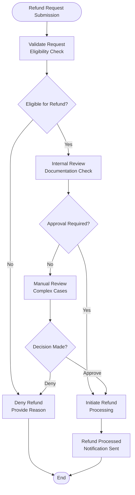

# Refund Policy

<cite>
**Referenced Files in This Document**
- [refund-policy/page.tsx](file://packages/web/app/refund-policy/page.tsx)
- [settings/page.tsx](file://packages/web/app/settings/page.tsx)
- [BillingSection.tsx](file://packages/web/components/settings/BillingSection.tsx)
- [CancelSubscriptionModal.tsx](file://packages/web/components/settings/CancelSubscriptionModal.tsx)
- [razorpay.service.ts](file://packages/web/lib/services/razorpay.service.ts)
- [route.ts](file://packages/web/app/api/razorpay/webhook/route.ts)
- [constants.ts](file://packages/web/lib/constants.ts)
- [README.md](file://README.md)
</cite>

## Table of Contents
1. [Introduction](#introduction)
2. [Policy Overview](#policy-overview)
3. [Eligibility Criteria](#eligibility-criteria)
4. [Refund Request Process](#refund-request-process)
5. [Refund Processing Timeline](#refund-processing-timeline)
6. [Payment Method Details](#payment-method-details)
7. [Customer Support Integration](#customer-support-integration)
8. [Technical Implementation](#technical-implementation)
9. [Compliance and Legal Considerations](#compliance-and-legal-considerations)
10. [Best Practices](#best-practices)

## Introduction

The OSCAR refund policy governs the terms under which users can receive refunds for their Pro subscription purchases. This comprehensive policy ensures transparency in refund procedures while protecting both customers and the service provider's interests. The policy covers various scenarios including money-back guarantees, technical issues, billing errors, and cancellation procedures.

## Policy Overview

OSCAR operates on a tiered subscription model with distinct refund policies for different user scenarios. The primary focus is on providing customers with confidence in their subscription decisions while maintaining fair business practices.

### Key Policy Elements

The refund policy encompasses several critical areas:

- **Money-back guarantee period**: 7-day window for new subscribers
- **Technical issue compensation**: Prorated refunds for service disruptions
- **Billing error resolution**: Immediate correction of payment mistakes
- **Cancellation procedures**: Clear guidelines for subscription termination
- **Processing timelines**: Standardized refund processing periods

**Section sources**
- [refund-policy/page.tsx:17-80](file://packages/web/app/refund-policy/page.tsx#L17-L80)

## Eligibility Criteria

### New Subscriber Money-Back Guarantee

The 7-day money-back guarantee applies exclusively to new subscribers who sign up for OSCAR Pro for the first time. This provision recognizes that customers need time to evaluate the service before committing financially.

**Eligibility Requirements:**
- First-time subscription to OSCAR Pro
- Request submitted within 7 calendar days of purchase
- Change of mind must be documented through proper channels

### Technical Issue Compensation

Customers experiencing significant technical problems may qualify for prorated refunds when service disruptions exceed predetermined thresholds.

**Technical Issue Scenarios:**
- Extended service outages exceeding 48 consecutive hours
- Critical feature failures preventing service usage
- AI processing failures caused by system issues

### Billing Error Resolution

Payment discrepancies are addressed immediately upon verification, regardless of the timeframe since purchase.

**Billing Error Categories:**
- Duplicate charges for the same billing period
- Amount discrepancies compared to checkout display
- Processing errors in payment gateway transactions

**Section sources**
- [refund-policy/page.tsx:18-44](file://packages/web/app/refund-policy/page.tsx#L18-L44)

## Refund Request Process

### Initiation Methods

Customers can initiate refund requests through multiple channels to ensure accessibility and convenience.

**Available Request Methods:**
1. **In-application portal**: Settings → Billing → Request Refund
2. **Direct support contact**: Email and live chat support
3. **Web-based form**: Dedicated refund request interface

### Documentation Requirements

Each refund request requires specific documentation to facilitate efficient processing and compliance verification.

**Required Information:**
- Proof of purchase (receipt/invoice)
- Reason for refund request
- Supporting evidence (screenshots/logs)
- Contact information for follow-up communication

### Review and Approval Workflow

The refund approval process follows a structured workflow designed to ensure fairness and accuracy.

**Diagram sources**
- [refund-policy/page.tsx:22-27](file://packages/web/app/refund-policy/page.tsx#L22-L27)
- [BillingSection.tsx:58-90](file://packages/web/components/settings/BillingSection.tsx#L58-L90)

## Refund Processing Timeline

### Standard Processing Schedule

The refund processing timeline follows industry-standard business day calculations to accommodate banking and financial institution processing schedules.

**Timeline Breakdown:**
- **Review Period**: 2 business days for initial assessment
- **Processing Window**: 5-7 business days for refund execution
- **Bank Clearance**: Additional 3-5 business days for fund availability

### Accelerated Processing

Certain scenarios qualify for expedited processing, particularly billing errors and verified technical issues.

**Accelerated Timeline:**
- **Immediate verification**: Same-day processing for billing errors
- **Priority review**: Expedited 1-2 business day processing for technical issues
- **Escalation procedures**: 3-5 business day resolution for complex cases

### Factors Affecting Processing Time

Several external factors can influence refund processing duration beyond the company's control.

**External Dependencies:**
- Bank processing delays
- Payment gateway settlement cycles
- Currency conversion processing
- Regulatory compliance reviews

**Section sources**
- [refund-policy/page.tsx:22-27](file://packages/web/app/refund-policy/page.tsx#L22-L27)

## Payment Method Details

### Original Payment Method Requirement

Refunds are processed exclusively to the original payment method used for the initial transaction, ensuring financial accountability and security.

**Payment Method Restrictions:**
- Refunds cannot be transferred to alternative payment accounts
- Cross-account refunds are prohibited for security reasons
- Multi-payment transactions require individual method processing

### Currency and Exchange Rate Handling

Refund processing maintains currency parity with the original transaction, with explicit exclusion of exchange rate fluctuation coverage.

**Currency Processing:**
- **Indian Rupees (INR)**: Standard processing for domestic transactions
- **US Dollars (USD)**: Applicable for international transactions
- **Exchange rate neutrality**: No compensation for currency fluctuations
- **Conversion limitations**: Standard rates apply without premium handling

### Payment Gateway Integration

The refund system integrates seamlessly with the established payment infrastructure to ensure secure and reliable processing.

**Gateway Specifications:**
- **Processor**: Razorpay payment gateway integration
- **Security protocols**: PCI DSS compliant processing
- **Transaction tracking**: End-to-end payment lifecycle monitoring
- **Audit trails**: Comprehensive transaction history maintenance

**Section sources**
- [refund-policy/page.tsx:77-79](file://packages/web/app/refund-policy/page.tsx#L77-L79)

## Customer Support Integration

### Support Channel Coordination

The refund policy integrates with comprehensive customer support systems to provide seamless assistance throughout the refund process.

**Support Integration Points:**
- **Pre-submission consultation**: Support guidance for eligibility determination
- **Documentation assistance**: Help with required evidence collection
- **Progress tracking**: Real-time status updates during processing
- **Resolution escalation**: Advanced support for complex cases

### Communication Protocols

Structured communication protocols ensure consistent and professional customer interaction throughout refund procedures.

**Communication Standards:**
- **Response time commitments**: 72-hour initial acknowledgment
- **Resolution targets**: Standard 15-20 business day completion
- **Follow-up procedures**: Automated progress notifications
- **Escalation pathways**: Hierarchical support structure

### Quality Assurance Measures

Quality assurance protocols maintain high standards of customer service while processing refunds efficiently.

**Quality Metrics:**
- **First-call resolution**: Target achievement rate
- **Customer satisfaction scores**: Continuous improvement tracking
- **Processing accuracy**: Error minimization protocols
- **Compliance adherence**: Regulatory and policy compliance monitoring

**Section sources**
- [refund-policy/page.tsx:84-86](file://packages/web/app/refund-policy/page.tsx#L84-L86)

## Technical Implementation

### Backend Infrastructure

The refund system leverages robust backend infrastructure designed for scalability, security, and reliability in financial transaction processing.

**Infrastructure Components:**
- **Payment gateway integration**: Razorpay API connectivity
- **Security protocols**: End-to-end encryption and authentication
- **Audit logging**: Comprehensive transaction and user activity tracking
- **Rate limiting**: Protection against abuse and system overload

### Frontend User Interface

The user interface provides intuitive access to refund functionality while maintaining security and compliance requirements.

**Interface Features:**
- **Eligibility calculator**: Real-time refund eligibility assessment
- **Document upload**: Secure file submission capabilities
- **Progress monitoring**: Live status updates and notifications
- **Support integration**: Direct access to customer service

### Security Measures

Comprehensive security measures protect sensitive financial data and maintain regulatory compliance throughout the refund process.

**Security Protocols:**
- **Data encryption**: AES-256 encryption for sensitive information
- **Access controls**: Role-based permissions and authentication
- **Audit trails**: Complete transaction and user action logging
- **Compliance frameworks**: GDPR, PCI DSS, and financial regulations adherence

**Section sources**
- [razorpay.service.ts:68-120](file://packages/web/lib/services/razorpay.service.ts#L68-L120)
- [route.ts:42-70](file://packages/web/app/api/razorpay/webhook/route.ts#L42-L70)

## Compliance and Legal Considerations

### Regulatory Compliance

The refund policy adheres to applicable laws and regulations governing digital services and financial transactions across operating jurisdictions.

**Compliance Areas:**
- **Consumer protection laws**: Fair billing and refund practices
- **Financial regulations**: Payment processing and data protection
- **Digital service agreements**: Terms of service and user contracts
- **Tax obligations**: Applicable tax considerations for refunds

### Legal Framework

The policy operates within a comprehensive legal framework that protects both customer rights and business interests.

**Legal Protections:**
- **Contractual obligations**: Clear terms and conditions
- **Dispute resolution**: Established procedures for conflict resolution
- **Evidence preservation**: Documentation retention for legal proceedings
- **Regulatory reporting**: Applicable disclosures and reporting requirements

### Risk Management

Comprehensive risk management strategies address potential fraud, abuse, and operational challenges in the refund process.

**Risk Mitigation:**
- **Fraud detection**: Advanced algorithms for suspicious activity identification
- **Abuse prevention**: Rate limiting and behavioral analysis systems
- **Operational resilience**: Backup systems and disaster recovery procedures
- **Continuous monitoring**: Real-time threat detection and response capabilities

**Section sources**
- [refund-policy/page.tsx:70-72](file://packages/web/app/refund-policy/page.tsx#L70-L72)

## Best Practices

### Customer Education

Educating customers about refund procedures and eligibility criteria helps reduce disputes and improves overall satisfaction.

**Educational Initiatives:**
- **Clear policy communication**: Transparent disclosure of terms and conditions
- **Proactive notification**: Automatic alerts for policy changes and updates
- **Support resources**: Comprehensive FAQ and help documentation
- **Feedback mechanisms**: Continuous improvement based on customer input

### Operational Excellence

Maintaining high standards of operational excellence ensures efficient refund processing and customer satisfaction.

**Operational Standards:**
- **Performance metrics**: Regular monitoring of processing times and accuracy
- **Quality assurance**: Continuous testing and validation of refund systems
- **Staff training**: Comprehensive education on policy implementation
- **Process optimization**: Regular review and improvement of refund procedures

### Continuous Improvement

Regular evaluation and enhancement of refund procedures ensures alignment with customer needs and regulatory requirements.

**Improvement Strategies:**
- **Customer feedback analysis**: Systematic review of satisfaction surveys and complaints
- **Industry benchmarking**: Comparison with best practices in the digital services sector
- **Technology advancement**: Adoption of emerging technologies for improved efficiency
- **Regulatory adaptation**: Proactive adjustment to changing legal and regulatory environments

**Section sources**
- [README.md:38-51](file://README.md#L38-L51)