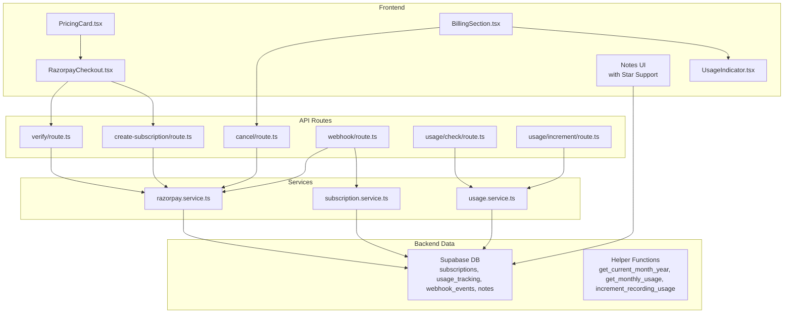
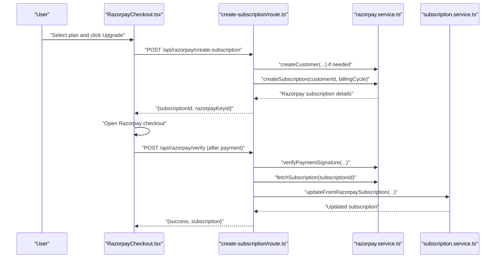
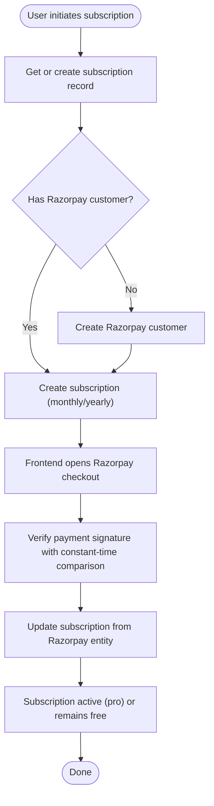
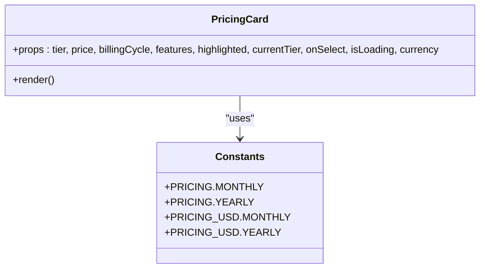
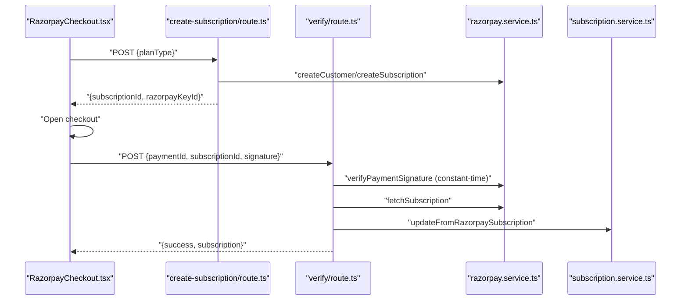
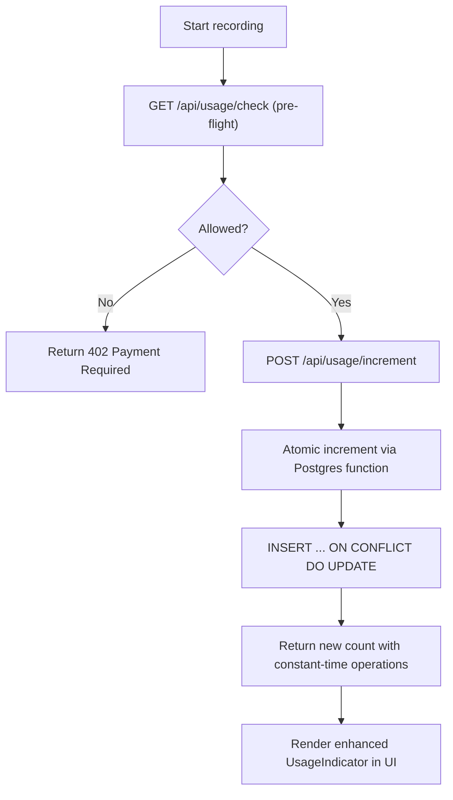
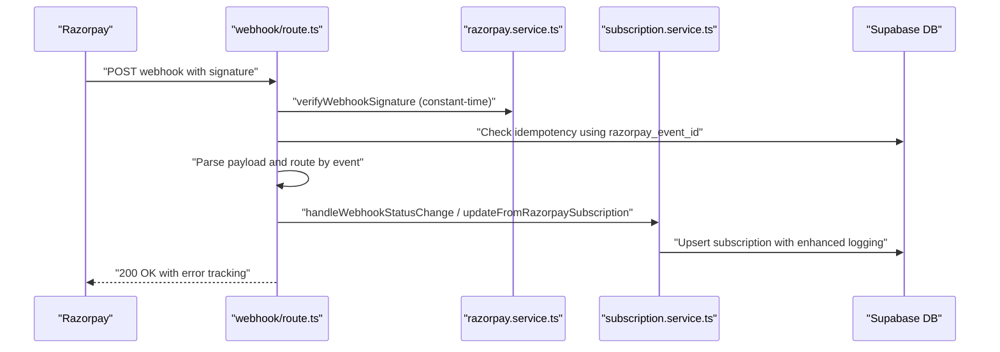
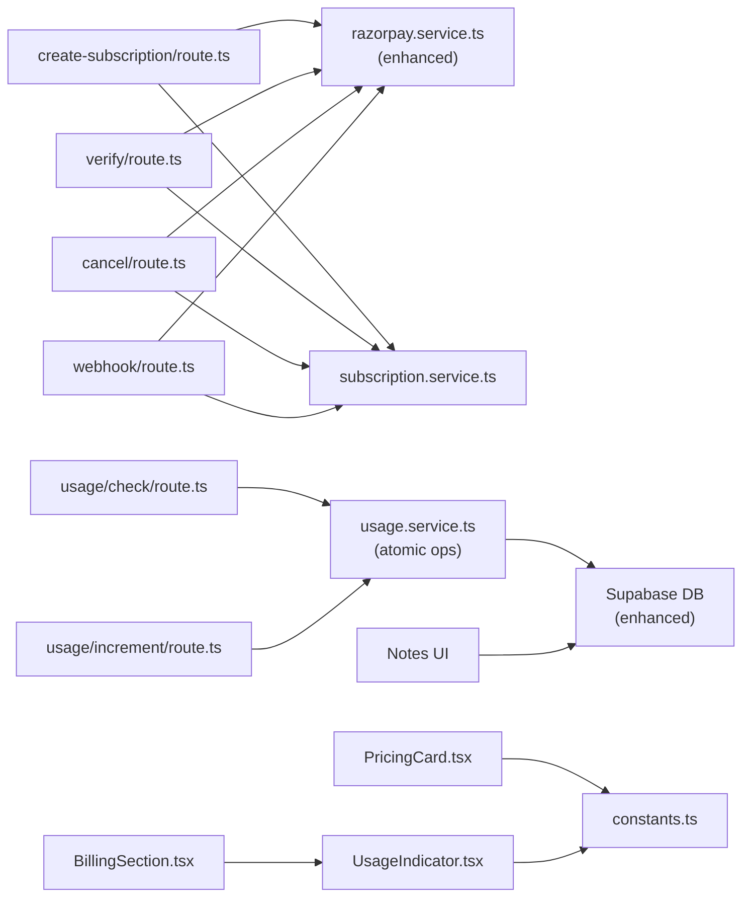
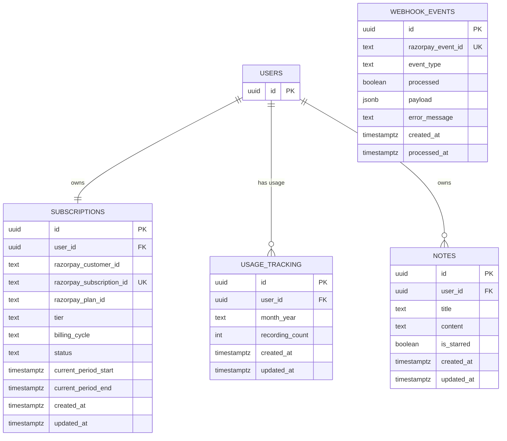

# Subscription & Payment System

<cite>
**Referenced Files in This Document**
- [route.ts](file://app/api/razorpay/create-subscription/route.ts)
- [route.ts](file://app/api/razorpay/webhook/route.ts)
- [route.ts](file://app/api/razorpay/verify/route.ts)
- [route.ts](file://app/api/razorpay/cancel/route.ts)
- [route.ts](file://app/api/usage/check/route.ts)
- [route.ts](file://app/api/usage/increment/route.ts)
- [PricingCard.tsx](file://components/subscription/PricingCard.tsx)
- [RazorpayCheckout.tsx](file://components/subscription/RazorpayCheckout.tsx)
- [UsageIndicator.tsx](file://components/subscription/UsageIndicator.tsx)
- [BillingSection.tsx](file://components/settings/BillingSection.tsx)
- [razorpay.service.ts](file://lib/services/razorpay.service.ts)
- [subscription.service.ts](file://lib/services/subscription.service.ts)
- [usage.service.ts](file://lib/services/usage.service.ts)
- [subscription.types.ts](file://lib/types/subscription.types.ts)
- [constants.ts](file://lib/constants.ts)
- [001_subscriptions.sql](file://supabase/migrations/001_subscriptions.sql)
- [002_atomic_usage_increment.sql](file://supabase/migrations/002_atomic_usage_increment.sql)
- [supabase-migration-starred.sql](file://supabase-migration-starred.sql)
- [supabase-migration-feedback.sql](file://supabase-migration-feedback.sql)
</cite>

## Update Summary
**Changes Made**
- Enhanced webhook processing with improved idempotency handling using Razorpay's unique event IDs
- Implemented atomic usage increment operations with Postgres functions to prevent race conditions
- Added comprehensive starred note functionality with dedicated migration and service support
- Updated usage enforcement with pre-flight checks and improved error handling
- Enhanced security with constant-time signature verification across all payment processing

## Table of Contents
1. [Introduction](#introduction)
2. [Project Structure](#project-structure)
3. [Core Components](#core-components)
4. [Architecture Overview](#architecture-overview)
5. [Detailed Component Analysis](#detailed-component-analysis)
6. [Enhanced Idempotency Handling](#enhanced-idempotency-handling)
7. [Atomic Usage Operations](#atomic-usage-operations)
8. [Starred Note Functionality](#starred-note-functionality)
9. [Dependency Analysis](#dependency-analysis)
10. [Performance Considerations](#performance-considerations)
11. [Troubleshooting Guide](#troubleshooting-guide)
12. [Conclusion](#conclusion)
13. [Appendices](#appendices)

## Introduction
This document explains the subscription and payment system built with Razorpay for usage-based billing. The system has been enhanced with improved idempotency handling, atomic usage operations, and new starred note functionality. It covers subscription management, pricing tiers, payment processing, usage tracking, rate limiting, and consumption monitoring. The enhanced webhook verification processes ensure reliable event processing, while atomic usage increment operations prevent race conditions in concurrent scenarios.

## Project Structure
The system is organized around:
- API routes for payment lifecycle (create subscription, verify payment, cancel, webhook)
- Frontend components for pricing and usage visualization
- Services for Razorpay integration, subscription state, and usage tracking
- Supabase database schema and helper functions for persistence and idempotency
- Enhanced usage enforcement with pre-flight checks
- New starred note functionality with dedicated database support

**Diagram sources**
- [PricingCard.tsx:1-163](file://components/subscription/PricingCard.tsx#L1-L163)
- [RazorpayCheckout.tsx:1-210](file://components/subscription/RazorpayCheckout.tsx#L1-L210)
- [UsageIndicator.tsx:1-101](file://components/subscription/UsageIndicator.tsx#L1-L101)
- [BillingSection.tsx:1-203](file://components/settings/BillingSection.tsx#L1-L203)
- [route.ts:1-125](file://app/api/razorpay/create-subscription/route.ts#L1-L125)
- [route.ts:1-103](file://app/api/razorpay/verify/route.ts#L1-L103)
- [route.ts:1-92](file://app/api/razorpay/cancel/route.ts#L1-L92)
- [route.ts:1-303](file://app/api/razorpay/webhook/route.ts#L1-L303)
- [route.ts:1-66](file://app/api/usage/check/route.ts#L1-L66)
- [route.ts:1-69](file://app/api/usage/increment/route.ts#L1-L69)
- [razorpay.service.ts:1-188](file://lib/services/razorpay.service.ts#L1-L188)
- [subscription.service.ts:1-280](file://lib/services/subscription.service.ts#L1-L280)
- [usage.service.ts:1-241](file://lib/services/usage.service.ts#L1-L241)
- [001_subscriptions.sql:1-206](file://supabase/migrations/001_subscriptions.sql#L1-L206)
- [002_atomic_usage_increment.sql:1-30](file://supabase/migrations/002_atomic_usage_increment.sql#L1-L30)

**Section sources**
- [route.ts:1-125](file://app/api/razorpay/create-subscription/route.ts#L1-L125)
- [route.ts:1-303](file://app/api/razorpay/webhook/route.ts#L1-L303)
- [route.ts:1-103](file://app/api/razorpay/verify/route.ts#L1-L103)
- [route.ts:1-92](file://app/api/razorpay/cancel/route.ts#L1-L92)
- [route.ts:1-66](file://app/api/usage/check/route.ts#L1-L66)
- [route.ts:1-69](file://app/api/usage/increment/route.ts#L1-L69)
- [PricingCard.tsx:1-163](file://components/subscription/PricingCard.tsx#L1-L163)
- [RazorpayCheckout.tsx:1-210](file://components/subscription/RazorpayCheckout.tsx#L1-L210)
- [UsageIndicator.tsx:1-101](file://components/subscription/UsageIndicator.tsx#L1-L101)
- [BillingSection.tsx:1-203](file://components/settings/BillingSection.tsx#L1-L203)
- [razorpay.service.ts:1-188](file://lib/services/razorpay.service.ts#L1-L188)
- [subscription.service.ts:1-280](file://lib/services/subscription.service.ts#L1-L280)
- [usage.service.ts:1-241](file://lib/services/usage.service.ts#L1-L241)
- [001_subscriptions.sql:1-206](file://supabase/migrations/001_subscriptions.sql#L1-L206)
- [002_atomic_usage_increment.sql:1-30](file://supabase/migrations/002_atomic_usage_increment.sql#L1-L30)

## Core Components
- **Enhanced Razorpay integration service**: Improved webhook signature verification with constant-time comparison, enhanced security measures, and better error handling.
- **Robust subscription service**: Manages subscription records with improved status handling and atomic operations for subscription state updates.
- **Atomic usage service**: Tracks monthly recording counts with Postgres function-based atomic increments, preventing race conditions in concurrent scenarios.
- **Comprehensive API routes**: Secure endpoints with enhanced rate limiting, improved error handling, and better validation.
- **Enhanced frontend components**: Pricing cards, checkout flows, usage indicators, and billing sections with improved user experience.
- **Starred note functionality**: New database schema and service methods for marking notes as favorites with proper authorization.

**Section sources**
- [razorpay.service.ts:151-187](file://lib/services/razorpay.service.ts#L151-L187)
- [subscription.service.ts:1-280](file://lib/services/subscription.service.ts#L1-L280)
- [usage.service.ts:67-122](file://lib/services/usage.service.ts#L67-L122)
- [route.ts:42-181](file://app/api/razorpay/webhook/route.ts#L42-L181)
- [route.ts:18-69](file://app/api/usage/increment/route.ts#L18-L69)
- [PricingCard.tsx:1-163](file://components/subscription/PricingCard.tsx#L1-L163)
- [RazorpayCheckout.tsx:1-210](file://components/subscription/RazorpayCheckout.tsx#L1-L210)
- [UsageIndicator.tsx:1-101](file://components/subscription/UsageIndicator.tsx#L1-L101)
- [BillingSection.tsx:1-203](file://components/settings/BillingSection.tsx#L1-L203)
- [supabase-migration-starred.sql:1-23](file://supabase-migration-starred.sql#L1-L23)

## Architecture Overview
The system integrates frontend components with serverless API routes, which delegate to services that call the Razorpay SDK and interact with Supabase. Enhanced webhook processing ensures reliable event handling with improved idempotency and security measures.

**Diagram sources**
- [RazorpayCheckout.tsx:1-210](file://components/subscription/RazorpayCheckout.tsx#L1-L210)
- [route.ts:1-125](file://app/api/razorpay/create-subscription/route.ts#L1-L125)
- [route.ts:1-103](file://app/api/razorpay/verify/route.ts#L1-L103)
- [razorpay.service.ts:1-188](file://lib/services/razorpay.service.ts#L1-L188)
- [subscription.service.ts:1-280](file://lib/services/subscription.service.ts#L1-L280)

## Detailed Component Analysis

### Subscription Management
- **Enhanced subscription lifecycle**:
  - Creation: API route authenticates the user, ensures a subscription record exists, creates a Razorpay customer if needed, and creates a subscription for the selected billing cycle.
  - Verification: After payment, the frontend verifies the signature server-side with improved security, fetches the latest subscription state, and updates the local record.
  - Cancellation: The API cancels the subscription at the end of the billing period and updates local status.
  - **Enhanced webhooks**: The webhook handler validates signatures using constant-time comparison, prevents duplicates using Razorpay's unique event IDs, and updates subscription status and periods.

**Diagram sources**
- [route.ts:1-125](file://app/api/razorpay/create-subscription/route.ts#L1-L125)
- [route.ts:1-103](file://app/api/razorpay/verify/route.ts#L1-L103)
- [route.ts:1-92](file://app/api/razorpay/cancel/route.ts#L1-L92)
- [route.ts:74-155](file://app/api/razorpay/webhook/route.ts#L74-L155)
- [razorpay.service.ts:151-187](file://lib/services/razorpay.service.ts#L151-L187)
- [subscription.service.ts:1-280](file://lib/services/subscription.service.ts#L1-L280)

**Section sources**
- [route.ts:1-125](file://app/api/razorpay/create-subscription/route.ts#L1-L125)
- [route.ts:1-103](file://app/api/razorpay/verify/route.ts#L1-L103)
- [route.ts:1-92](file://app/api/razorpay/cancel/route.ts#L1-L92)
- [route.ts:74-155](file://app/api/razorpay/webhook/route.ts#L74-L155)
- [subscription.service.ts:1-280](file://lib/services/subscription.service.ts#L1-L280)

### Pricing Tier Configuration
- **Tiers**: free and pro.
- **Billing cycles**: monthly and yearly.
- **Enhanced pricing constants**: Define monthly/yearly rates and savings percentages with improved configuration management.
- **PricingCard**: Displays prices, highlights popular plans, and disables actions for the current plan with better user feedback.

**Diagram sources**
- [PricingCard.tsx:1-163](file://components/subscription/PricingCard.tsx#L1-L163)
- [constants.ts:240-270](file://lib/constants.ts#L240-L270)

**Section sources**
- [PricingCard.tsx:1-163](file://components/subscription/PricingCard.tsx#L1-L163)
- [constants.ts:240-270](file://lib/constants.ts#L240-L270)

### Enhanced Payment Processing Workflows
- **Improved frontend checkout**:
  - Loads Razorpay script dynamically with enhanced error handling.
  - Calls the create-subscription endpoint to obtain a subscriptionId and key.
  - Opens the checkout modal and handles callbacks with better user feedback.
  - Verifies the payment server-side with constant-time signature verification and navigates on success.
- **Enhanced backend verification**:
  - Validates signatures using HMAC-SHA256 with constant-time comparison to prevent timing attacks.
  - Fetches subscription details from Razorpay with improved error handling.
  - Updates local subscription record with enhanced logging and debugging capabilities.

**Diagram sources**
- [RazorpayCheckout.tsx:1-210](file://components/subscription/RazorpayCheckout.tsx#L1-L210)
- [route.ts:1-125](file://app/api/razorpay/create-subscription/route.ts#L1-L125)
- [route.ts:1-103](file://app/api/razorpay/verify/route.ts#L1-L103)
- [razorpay.service.ts:122-149](file://lib/services/razorpay.service.ts#L122-L149)
- [subscription.service.ts:1-280](file://lib/services/subscription.service.ts#L1-L280)

**Section sources**
- [RazorpayCheckout.tsx:1-210](file://components/subscription/RazorpayCheckout.tsx#L1-L210)
- [route.ts:1-125](file://app/api/razorpay/create-subscription/route.ts#L1-L125)
- [route.ts:1-103](file://app/api/razorpay/verify/route.ts#L1-L103)
- [razorpay.service.ts:122-149](file://lib/services/razorpay.service.ts#L122-L149)
- [subscription.service.ts:1-280](file://lib/services/subscription.service.ts#L1-L280)

### Enhanced Usage Tracking, Rate Limiting, and Consumption Monitoring
- **Atomic usage tracking**:
  - **Enhanced monthly recording counts** stored per user-month using Postgres functions.
  - **Atomic increment operations** prevent race conditions with INSERT ... ON CONFLICT DO UPDATE patterns.
  - **Fallback mechanisms** ensure graceful degradation when advanced features are unavailable.
  - **Usage service** checks limits and computes remaining quotas with improved error handling.
- **Enhanced rate limiting**:
  - Payment endpoints enforce per-user and per-IP limits to prevent abuse with configurable thresholds.
  - **Pre-flight checks** prevent free users from exceeding monthly limits before processing.
- **Improved consumption monitoring**:
  - **Enhanced UsageIndicator** renders progress bars and messages based on current usage vs limits with better visual feedback.
  - **Comprehensive BillingSection** aggregates usage metrics and presents actionable info with improved user experience.

**Diagram sources**
- [route.ts:1-66](file://app/api/usage/check/route.ts#L1-L66)
- [route.ts:1-69](file://app/api/usage/increment/route.ts#L1-L69)
- [usage.service.ts:67-122](file://lib/services/usage.service.ts#L67-L122)
- [UsageIndicator.tsx:1-101](file://components/subscription/UsageIndicator.tsx#L1-L101)
- [001_subscriptions.sql:135-154](file://supabase/migrations/001_subscriptions.sql#L135-L154)
- [002_atomic_usage_increment.sql:1-30](file://supabase/migrations/002_atomic_usage_increment.sql#L1-L30)

**Section sources**
- [route.ts:1-66](file://app/api/usage/check/route.ts#L1-L66)
- [route.ts:1-69](file://app/api/usage/increment/route.ts#L1-L69)
- [usage.service.ts:67-122](file://lib/services/usage.service.ts#L67-L122)
- [UsageIndicator.tsx:1-101](file://components/subscription/UsageIndicator.tsx#L1-L101)
- [constants.ts:240-247](file://lib/constants.ts#L240-L247)
- [001_subscriptions.sql:135-154](file://supabase/migrations/001_subscriptions.sql#L135-L154)
- [002_atomic_usage_increment.sql:1-30](file://supabase/migrations/002_atomic_usage_increment.sql#L1-L30)

### Enhanced Webhook Processing
- **Improved signature verification** using webhook secret with constant-time comparison to prevent timing attacks.
- **Enhanced idempotency** via dedicated table storing processed events using Razorpay's unique event IDs as primary keys.
- **Advanced event routing** by type to appropriate handlers (activated, charged, cancelled, halted, paused, resumed, completed/expired).
- **Robust status transitions** update local subscription tier and periods with improved error handling.
- **Enhanced error tracking** with detailed error messages and manual retry capabilities.

**Diagram sources**
- [route.ts:42-181](file://app/api/razorpay/webhook/route.ts#L42-L181)
- [razorpay.service.ts:151-187](file://lib/services/razorpay.service.ts#L151-L187)
- [subscription.service.ts:1-280](file://lib/services/subscription.service.ts#L1-L280)
- [001_subscriptions.sql:98-121](file://supabase/migrations/001_subscriptions.sql#L98-L121)

**Section sources**
- [route.ts:42-181](file://app/api/razorpay/webhook/route.ts#L42-L181)
- [razorpay.service.ts:151-187](file://lib/services/razorpay.service.ts#L151-L187)
- [subscription.service.ts:1-280](file://lib/services/subscription.service.ts#L1-L280)
- [001_subscriptions.sql:98-121](file://supabase/migrations/001_subscriptions.sql#L98-L121)

### Authentication and User Limits
- **Enhanced authentication** with improved user session management and authorization checks.
- **Improved free tier enforcement** with pre-flight usage checks and better error messaging.
- **Pro tier benefits** with unlimited quotas and enhanced feature access.
- **Enhanced UI integration** with BillingSection and UsageIndicator reflecting current limits and remaining usage with improved user feedback.

**Section sources**
- [route.ts:1-125](file://app/api/razorpay/create-subscription/route.ts#L1-L125)
- [route.ts:1-66](file://app/api/usage/check/route.ts#L1-L66)
- [usage.service.ts:1-241](file://lib/services/usage.service.ts#L1-L241)
- [BillingSection.tsx:1-203](file://components/settings/BillingSection.tsx#L1-L203)
- [UsageIndicator.tsx:1-101](file://components/subscription/UsageIndicator.tsx#L1-L101)

## Enhanced Idempotency Handling
The system now implements robust idempotency handling for webhook processing:

### Key Enhancements
- **Unique Event ID Usage**: Instead of composite account_id + created_at keys, the system now uses Razorpay's unique `event.id` field as the primary idempotency key.
- **Improved Collision Prevention**: Second-level granularity in previous approaches could cause collisions when multiple events fired simultaneously; unique event IDs eliminate this risk.
- **Enhanced Storage Strategy**: Dedicated `webhook_events` table with unique constraints on `razorpay_event_id` ensures no duplicate processing.
- **Better Error Tracking**: Comprehensive error logging and manual retry capabilities for failed webhook processing.

### Implementation Details
The webhook handler now performs the following enhanced steps:
1. Extracts Razorpay's unique event ID from the payload
2. Checks for existing processed events using the unique ID
3. Stores unprocessed events with detailed metadata
4. Processes events based on type with enhanced error handling
5. Marks events as processed with timestamps

**Section sources**
- [route.ts:74-104](file://app/api/razorpay/webhook/route.ts#L74-L104)
- [001_subscriptions.sql:98-121](file://supabase/migrations/001_subscriptions.sql#L98-L121)
- [razorpay.service.ts:151-187](file://lib/services/razorpay.service.ts#L151-L187)

## Atomic Usage Operations
The system now implements atomic usage increment operations to prevent race conditions:

### Key Enhancements
- **PostgreSQL Function Implementation**: Custom `increment_recording_usage` function performs atomic upsert operations.
- **Race Condition Prevention**: Single-statement operations eliminate the read-then-write race condition.
- **Graceful Degradation**: Application fallback logic ensures system continues operating even if advanced features aren't deployed.
- **Enhanced Security**: Function-level security with service_role grants prevents unauthorized access.

### Implementation Details
The atomic increment operation follows this pattern:
1. Uses `INSERT ... ON CONFLICT DO UPDATE` syntax
2. Performs increment in the database layer
3. Returns the new count atomically
4. Includes proper error handling and fallback mechanisms

The function signature supports both parameterized and simplified usage patterns, with security restrictions ensuring only authorized service accounts can execute the operation.

**Section sources**
- [usage.service.ts:67-122](file://lib/services/usage.service.ts#L67-L122)
- [001_subscriptions.sql:135-154](file://supabase/migrations/001_subscriptions.sql#L135-L154)
- [002_atomic_usage_increment.sql:1-30](file://supabase/migrations/002_atomic_usage_increment.sql#L1-L30)

## Starred Note Functionality
The system now includes comprehensive starred note functionality:

### Database Schema Enhancement
- **New Column**: `is_starred` boolean column with default false value
- **Index Optimization**: Partial index on `is_starred = true` for efficient filtering
- **RLS Policy**: Enhanced UPDATE policy allowing users to toggle their own note stars
- **Documentation**: Clear comments explaining the starred functionality purpose

### Service Implementation
- **toggleStar Method**: Atomic toggle operation for starring/unstarring notes
- **Optimistic UI Updates**: Immediate UI feedback with rollback on failure
- **Consistent State Management**: Synchronization with actual database values

### Frontend Integration
- **Star Button Components**: Interactive star buttons in both list and detail views
- **Visual Feedback**: Color-changing stars with proper hover states
- **Accessibility**: Proper ARIA labels and keyboard navigation support

**Section sources**
- [supabase-migration-starred.sql:1-23](file://supabase-migration-starred.sql#L1-L23)
- [notes.service.ts:95-109](file://lib/services/notes.service.ts#L95-L109)
- [page.tsx:167-188](file://app/notes/page.tsx#L167-L188)
- [page.tsx:215-236](file://app/notes/[id]/page.tsx#L215-L236)

## Dependency Analysis
- **Enhanced API routes** depend on Supabase client and services with improved error handling.
- **Robust services** encapsulate domain logic with enhanced security and atomic operations.
- **Improved components** depend on services and constants for rendering and behavior with better user experience.
- **Expanded database schema** defines relationships and policies with enhanced security and performance optimizations.
- **New starred note functionality** integrates seamlessly with existing note management systems.

**Diagram sources**
- [route.ts:1-125](file://app/api/razorpay/create-subscription/route.ts#L1-L125)
- [route.ts:1-103](file://app/api/razorpay/verify/route.ts#L1-L103)
- [route.ts:1-92](file://app/api/razorpay/cancel/route.ts#L1-L92)
- [route.ts:1-303](file://app/api/razorpay/webhook/route.ts#L1-L303)
- [route.ts:1-66](file://app/api/usage/check/route.ts#L1-L66)
- [route.ts:1-69](file://app/api/usage/increment/route.ts#L1-L69)
- [razorpay.service.ts:1-188](file://lib/services/razorpay.service.ts#L1-L188)
- [subscription.service.ts:1-280](file://lib/services/subscription.service.ts#L1-L280)
- [usage.service.ts:1-241](file://lib/services/usage.service.ts#L1-L241)
- [PricingCard.tsx:1-163](file://components/subscription/PricingCard.tsx#L1-L163)
- [UsageIndicator.tsx:1-101](file://components/subscription/UsageIndicator.tsx#L1-L101)
- [constants.ts:1-314](file://lib/constants.ts#L1-L314)

**Section sources**
- [route.ts:1-125](file://app/api/razorpay/create-subscription/route.ts#L1-L125)
- [route.ts:1-103](file://app/api/razorpay/verify/route.ts#L1-L103)
- [route.ts:1-92](file://app/api/razorpay/cancel/route.ts#L1-L92)
- [route.ts:1-303](file://app/api/razorpay/webhook/route.ts#L1-L303)
- [route.ts:1-66](file://app/api/usage/check/route.ts#L1-L66)
- [route.ts:1-69](file://app/api/usage/increment/route.ts#L1-L69)
- [razorpay.service.ts:1-188](file://lib/services/razorpay.service.ts#L1-L188)
- [subscription.service.ts:1-280](file://lib/services/subscription.service.ts#L1-L280)
- [usage.service.ts:1-241](file://lib/services/usage.service.ts#L1-L241)
- [constants.ts:1-314](file://lib/constants.ts#L1-L314)

## Performance Considerations
- **Enhanced helper functions** for usage operations minimize round-trips with atomic database operations.
- **Improved webhook processing** idempotency reduces redundant work with unique event ID tracking.
- **Better rate limits** on payment endpoints prevent spam and reduce cost exposure with configurable thresholds.
- **Atomic operations** eliminate race conditions and improve data consistency.
- **Optimized database queries** with proper indexing and security policies.
- **Graceful degradation** ensures system continues operating during feature deployment transitions.

## Troubleshooting Guide
Common issues and enhanced resolutions:
- **Enhanced payment failures**:
  - Verify signatures on the backend using constant-time comparison; ensure webhook secrets and key IDs are configured.
  - Check subscription status transitions and logs for halted/pending events with improved error tracking.
  - **New**: Monitor webhook_events table for duplicate processing attempts.
- **Enhanced subscription cancellations**:
  - Confirm cancellation at cycle end and verify local status reflects the change with improved logging.
  - **New**: Check webhook event processing status for cancellation confirmation.
- **Enhanced usage quota enforcement**:
  - Ensure atomic usage increments and checks are executed before recording with proper error handling.
  - Validate free tier limits and pro tier bypass logic with improved pre-flight checks.
  - **New**: Monitor atomic operation performance and fallback mechanisms.
- **Webhook idempotency issues**:
  - **New**: Verify unique event ID handling and check for duplicate processing attempts.
  - **New**: Review webhook_events table for proper event tracking and error states.

**Section sources**
- [route.ts:74-181](file://app/api/razorpay/webhook/route.ts#L74-L181)
- [route.ts:1-92](file://app/api/razorpay/cancel/route.ts#L1-L92)
- [route.ts:1-66](file://app/api/usage/check/route.ts#L1-L66)
- [route.ts:1-69](file://app/api/usage/increment/route.ts#L1-L69)
- [usage.service.ts:67-122](file://lib/services/usage.service.ts#L67-L122)
- [razorpay.service.ts:151-187](file://lib/services/razorpay.service.ts#L151-L187)
- [001_subscriptions.sql:98-121](file://supabase/migrations/001_subscriptions.sql#L98-L121)

## Conclusion
The enhanced system provides a robust, extensible foundation for Razorpay-powered subscriptions with usage-based billing. Key improvements include enhanced webhook idempotency handling, atomic usage operations preventing race conditions, and comprehensive starred note functionality. The system enforces limits effectively, offers clear UI indicators, maintains reliable synchronization via enhanced webhooks, and provides graceful degradation capabilities. The modular design allows easy extension to additional plans, currencies, and usage categories while maintaining security and performance standards.

## Appendices

### Enhanced Database Schema Overview
- **subscriptions**: stores user subscription state, Razorpay identifiers, tier, billing cycle, and period timestamps with enhanced security policies.
- **usage_tracking**: tracks monthly recording counts per user-month with atomic increment operations and enhanced indexing.
- **webhook_events**: stores webhook payloads and processing status for idempotency with unique event ID tracking.
- **notes**: enhanced with starred functionality and feedback collection capabilities.
- **Enhanced helper functions**: compute current month-year, perform atomic usage increments, and fetch monthly usage with improved performance.

**Diagram sources**
- [001_subscriptions.sql:1-206](file://supabase/migrations/001_subscriptions.sql#L1-L206)
- [supabase-migration-starred.sql:1-23](file://supabase-migration-starred.sql#L1-L23)

**Section sources**
- [001_subscriptions.sql:1-206](file://supabase/migrations/001_subscriptions.sql#L1-L206)
- [supabase-migration-starred.sql:1-23](file://supabase-migration-starred.sql#L1-L23)

### Enhanced API Reference: Payment Endpoints
- **POST /api/razorpay/create-subscription**
  - Purpose: Create a Razorpay subscription for the authenticated user.
  - Body: { planType: "monthly" | "yearly" }
  - Response: { subscriptionId: string, razorpayKeyId: string }
- **POST /api/razorpay/verify**
  - Purpose: Verify payment signature and update subscription with enhanced security.
  - Body: { razorpay_payment_id, razorpay_subscription_id, razorpay_signature }
  - Response: { success: boolean, subscription?: DBSubscription }
- **POST /api/razorpay/cancel**
  - Purpose: Cancel subscription at period end.
  - Response: { success: boolean, currentPeriodEnd: string | null }
- **POST /api/razorpay/webhook**
  - Purpose: Process Razorpay webhook events with enhanced idempotency.
  - Headers: x-razorpay-signature
  - Response: { received: true } or { received: true, error: string }
- **GET /api/usage/check**
  - Purpose: Pre-flight check for recording limits with enhanced validation.
  - Response: { canRecord: boolean, current: number, remaining: number, limit: number }
- **POST /api/usage/increment**
  - Purpose: Atomically increment usage count with enhanced race condition prevention.
  - Response: { success: boolean, recordingsThisMonth: number, remaining: number | null, canRecord: boolean }

**Section sources**
- [route.ts:1-125](file://app/api/razorpay/create-subscription/route.ts#L1-L125)
- [route.ts:1-103](file://app/api/razorpay/verify/route.ts#L1-L103)
- [route.ts:1-92](file://app/api/razorpay/cancel/route.ts#L1-L92)
- [route.ts:1-303](file://app/api/razorpay/webhook/route.ts#L1-L303)
- [route.ts:1-66](file://app/api/usage/check/route.ts#L1-L66)
- [route.ts:1-69](file://app/api/usage/increment/route.ts#L1-L69)

### Enhanced Types and Constants
- **SubscriptionTier**: "free" | "pro"
- **BillingCycle**: "monthly" | "yearly"
- **RazorpaySubscriptionStatus**: union of Razorpay statuses with enhanced validation
- **Enhanced pricing constants**: monthly/yearly rates and savings with improved configuration
- **Enhanced rate limits**: per-endpoint configurations with configurable thresholds
- **New starred note types**: DBNote with is_starred boolean and toggle operations

**Section sources**
- [subscription.types.ts:1-305](file://lib/types/subscription.types.ts#L1-L305)
- [constants.ts:240-314](file://lib/constants.ts#L240-L314)
- [supabase-migration-starred.sql:1-23](file://supabase-migration-starred.sql#L1-L23)