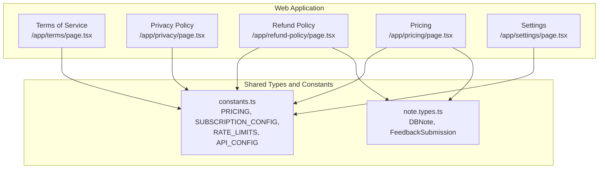
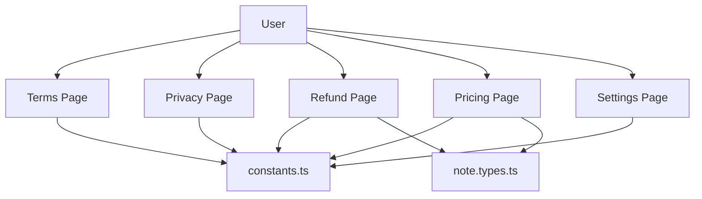
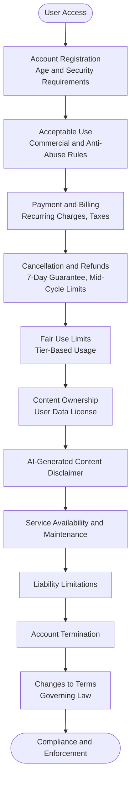
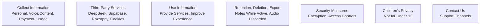
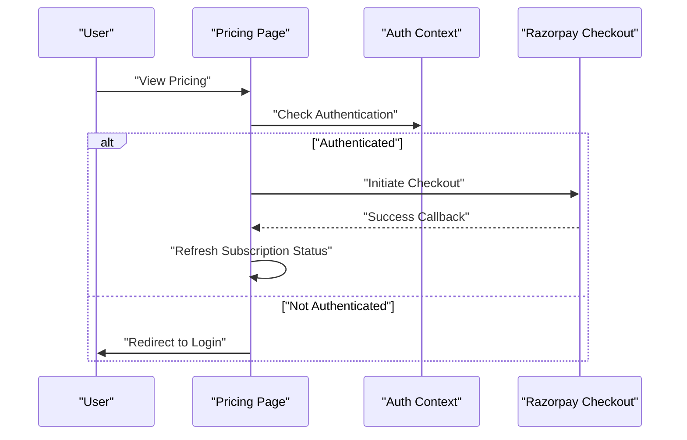
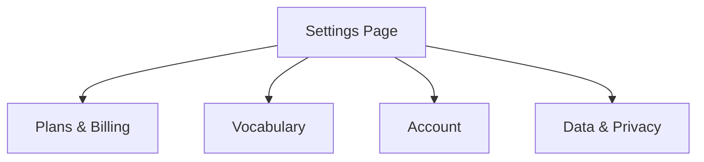
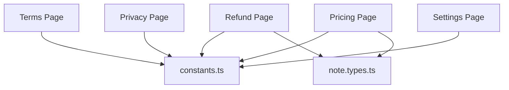

# Terms Of Service

<cite>
**Referenced Files in This Document**
- [packages/web/app/terms/page.tsx](file://packages/web/app/terms/page.tsx)
- [packages/web/app/privacy/page.tsx](file://packages/web/app/privacy/page.tsx)
- [packages/web/app/refund-policy/page.tsx](file://packages/web/app/refund-policy/page.tsx)
- [packages/web/app/pricing/page.tsx](file://packages/web/app/pricing/page.tsx)
- [packages/web/app/settings/page.tsx](file://packages/web/app/settings/page.tsx)
- [packages/shared/src/constants.ts](file://packages/shared/src/constants.ts)
- [packages/shared/src/types/note.types.ts](file://packages/shared/src/types/note.types.ts)
- [README.md](file://README.md)
</cite>

## Table of Contents
1. [Introduction](#introduction)
2. [Project Structure](#project-structure)
3. [Core Components](#core-components)
4. [Architecture Overview](#architecture-overview)
5. [Detailed Component Analysis](#detailed-component-analysis)
6. [Dependency Analysis](#dependency-analysis)
7. [Performance Considerations](#performance-considerations)
8. [Troubleshooting Guide](#troubleshooting-guide)
9. [Conclusion](#conclusion)

## Introduction
This document consolidates the legal and operational policies that govern the use of the OSCAR AI voice note-taking application. It covers the Terms of Service, Privacy Policy, Refund Policy, and related account and billing policies. These policies define how users interact with the Service, how their data is handled, and what recourse is available for billing and account-related matters.

## Project Structure
The policies are implemented as standalone pages within the Next.js web application. They are organized under dedicated routes for easy access and compliance with legal requirements.

**Diagram sources**
- [packages/web/app/terms/page.tsx](file://packages/web/app/terms/page.tsx)
- [packages/web/app/privacy/page.tsx](file://packages/web/app/privacy/page.tsx)
- [packages/web/app/refund-policy/page.tsx](file://packages/web/app/refund-policy/page.tsx)
- [packages/web/app/pricing/page.tsx](file://packages/web/app/pricing/page.tsx)
- [packages/web/app/settings/page.tsx](file://packages/web/app/settings/page.tsx)
- [packages/shared/src/constants.ts](file://packages/shared/src/constants.ts)
- [packages/shared/src/types/note.types.ts](file://packages/shared/src/types/note.types.ts)

**Section sources**
- [README.md](file://README.md)
- [packages/web/app/terms/page.tsx](file://packages/web/app/terms/page.tsx)
- [packages/web/app/privacy/page.tsx](file://packages/web/app/privacy/page.tsx)
- [packages/web/app/refund-policy/page.tsx](file://packages/web/app/refund-policy/page.tsx)
- [packages/web/app/pricing/page.tsx](file://packages/web/app/pricing/page.tsx)
- [packages/web/app/settings/page.tsx](file://packages/web/app/settings/page.tsx)
- [packages/shared/src/constants.ts](file://packages/shared/src/constants.ts)
- [packages/shared/src/types/note.types.ts](file://packages/shared/src/types/note.types.ts)

## Core Components
- Terms of Service: Establishes the legal framework for using OSCAR, including account requirements, acceptable use, intellectual property, AI-generated content, service availability, liability, termination, changes, and governing law.
- Privacy Policy: Details what information is collected, how it is used, with whom it is shared, and how users can access, export, or delete their data.
- Refund Policy: Outlines eligibility, timing, and process for refunds, including the 7-day money-back guarantee, technical issues, billing errors, and cancellation terms.
- Pricing and Billing: Defines tiers, pricing, billing cycles, and subscription management features available in the application.
- Settings: Provides access to account management, subscription status, and data privacy controls.

**Section sources**
- [packages/web/app/terms/page.tsx](file://packages/web/app/terms/page.tsx)
- [packages/web/app/privacy/page.tsx](file://packages/web/app/privacy/page.tsx)
- [packages/web/app/refund-policy/page.tsx](file://packages/web/app/refund-policy/page.tsx)
- [packages/web/app/pricing/page.tsx](file://packages/web/app/pricing/page.tsx)
- [packages/web/app/settings/page.tsx](file://packages/web/app/settings/page.tsx)

## Architecture Overview
The policies are implemented as static pages within the Next.js application. They rely on shared constants and types for pricing, subscription configuration, and note data structures. The settings page integrates with subscription and authentication contexts to present relevant controls and information.

**Diagram sources**
- [packages/web/app/terms/page.tsx](file://packages/web/app/terms/page.tsx)
- [packages/web/app/privacy/page.tsx](file://packages/web/app/privacy/page.tsx)
- [packages/web/app/refund-policy/page.tsx](file://packages/web/app/refund-policy/page.tsx)
- [packages/web/app/pricing/page.tsx](file://packages/web/app/pricing/page.tsx)
- [packages/web/app/settings/page.tsx](file://packages/web/app/settings/page.tsx)
- [packages/shared/src/constants.ts](file://packages/shared/src/constants.ts)
- [packages/shared/src/types/note.types.ts](file://packages/shared/src/types/note.types.ts)

## Detailed Component Analysis

### Terms of Service
The Terms of Service establish the legal relationship between OSCAR and its users. Key areas covered:
- Account registration and security, age requirements, and parental consent where applicable.
- Payment and billing, including recurring billing, tax obligations, and billing cycle start dates.
- Cancellation and refunds, including the 7-day money-back guarantee and mid-cycle cancellation limitations.
- Fair use and commercial use restrictions, with enforcement based on subscription tier.
- Ownership of user content and the limited license granted to OSCAR for processing and display.
- Acceptable use prohibitions, including anti-abuse and anti-fraud clauses.
- Intellectual property protections for OSCAR’s software and features.
- AI-generated content disclaimer and user responsibility for verification.
- Service availability, maintenance, and limitations of liability.
- Account termination scenarios and procedures.
- Changes to terms and governing law jurisdiction.

**Diagram sources**
- [packages/web/app/terms/page.tsx](file://packages/web/app/terms/page.tsx)

**Section sources**
- [packages/web/app/terms/page.tsx](file://packages/web/app/terms/page.tsx)

### Privacy Policy
The Privacy Policy explains data handling practices:
- Information collected: minimal personal data (email, name/profile picture via OAuth), voice and content data (audio processed and discarded; text stored), payment information (processed via Razorpay), and usage data.
- Third-party services: DeepSeek (AI processing), Supabase (authentication, database, storage), Razorpay (payment processing), and cookies/local storage for authentication and preferences.
- Use of information: to provide services, improve user experience, and not for selling personal data or advertising.
- Data retention, deletion, and export: notes retained while account is active; audio discarded after transcription; users can export or delete data via settings.
- Security: technical and organizational measures; breach notification in case of material impact.
- Children’s privacy: not intended for users under 13.
- Contact: support channels via settings or application contact information.

**Diagram sources**
- [packages/web/app/privacy/page.tsx](file://packages/web/app/privacy/page.tsx)

**Section sources**
- [packages/web/app/privacy/page.tsx](file://packages/web/app/privacy/page.tsx)

### Refund Policy
The Refund Policy defines refund eligibility and process:
- 7-day money-back guarantee for new subscribers.
- Prorated refunds for extended technical issues causing significant downtime or critical failures.
- Immediate refunds for billing errors upon verification.
- Cancellations outside the 7-day window do not qualify for refunds; mid-cycle cancellations are not prorated.
- Refunds are processed to the original payment method via Razorpay and in the original currency.
- Chargebacks are discouraged and may lead to account suspension.

**Diagram sources**
- [packages/web/app/refund-policy/page.tsx](file://packages/web/app/refund-policy/page.tsx)

**Section sources**
- [packages/web/app/refund-policy/page.tsx](file://packages/web/app/refund-policy/page.tsx)

### Pricing and Billing
Pricing and billing policies are presented on the pricing page:
- Tiers: Free and Pro plans with feature comparisons.
- Pricing: Monthly and yearly billing cycles with savings for yearly plans.
- Currency: Display options between INR and USD.
- Subscription management: Cancel anytime; continue using until end of billing period; downgrades do not trigger refunds.
- Usage limits: Free tier includes monthly recording and note caps; Pro tier offers unlimited usage.

**Diagram sources**
- [packages/web/app/pricing/page.tsx](file://packages/web/app/pricing/page.tsx)

**Section sources**
- [packages/web/app/pricing/page.tsx](file://packages/web/app/pricing/page.tsx)
- [packages/shared/src/constants.ts](file://packages/shared/src/constants.ts)

### Settings and Account Management
The settings page centralizes account and subscription controls:
- Sections: Plans & Billing, Vocabulary, Account, Data & Privacy.
- Integration with subscription context to display status, billing cycle, limits, and actions.
- Access to privacy controls and data export/delete functions.

**Diagram sources**
- [packages/web/app/settings/page.tsx](file://packages/web/app/settings/page.tsx)

**Section sources**
- [packages/web/app/settings/page.tsx](file://packages/web/app/settings/page.tsx)

## Dependency Analysis
The policies depend on shared constants and types for pricing, subscription configuration, and note data structures. These dependencies ensure consistency across the application and policy pages.

**Diagram sources**
- [packages/shared/src/constants.ts](file://packages/shared/src/constants.ts)
- [packages/shared/src/types/note.types.ts](file://packages/shared/src/types/note.types.ts)
- [packages/web/app/terms/page.tsx](file://packages/web/app/terms/page.tsx)
- [packages/web/app/privacy/page.tsx](file://packages/web/app/privacy/page.tsx)
- [packages/web/app/refund-policy/page.tsx](file://packages/web/app/refund-policy/page.tsx)
- [packages/web/app/pricing/page.tsx](file://packages/web/app/pricing/page.tsx)
- [packages/web/app/settings/page.tsx](file://packages/web/app/settings/page.tsx)

**Section sources**
- [packages/shared/src/constants.ts](file://packages/shared/src/constants.ts)
- [packages/shared/src/types/note.types.ts](file://packages/shared/src/types/note.types.ts)
- [packages/web/app/terms/page.tsx](file://packages/web/app/terms/page.tsx)
- [packages/web/app/privacy/page.tsx](file://packages/web/app/privacy/page.tsx)
- [packages/web/app/refund-policy/page.tsx](file://packages/web/app/refund-policy/page.tsx)
- [packages/web/app/pricing/page.tsx](file://packages/web/app/pricing/page.tsx)
- [packages/web/app/settings/page.tsx](file://packages/web/app/settings/page.tsx)

## Performance Considerations
- Policy pages are static and lightweight, minimizing server load.
- Shared constants reduce duplication and improve maintainability.
- Client-side routing ensures quick navigation between policy pages without server requests.

## Troubleshooting Guide
Common issues and resolutions:
- Authentication barriers: Ensure you are logged in to access subscription and billing features.
- Pricing discrepancies: Confirm selected currency and billing cycle; verify savings calculations.
- Refund eligibility: Confirm new subscriber status, timeframe, and issue category (technical issues, billing errors).
- Data access: Use settings to export or delete data if needed.
- Contact support: Use in-app contact options for assistance with policies or account issues.

**Section sources**
- [packages/web/app/settings/page.tsx](file://packages/web/app/settings/page.tsx)
- [packages/web/app/pricing/page.tsx](file://packages/web/app/pricing/page.tsx)
- [packages/web/app/refund-policy/page.tsx](file://packages/web/app/refund-policy/page.tsx)
- [packages/web/app/privacy/page.tsx](file://packages/web/app/privacy/page.tsx)

## Conclusion
The OSCAR Terms of Service, Privacy Policy, and Refund Policy collectively define the legal and operational framework for using the application. They emphasize transparency, user control, and fair treatment, while aligning with the application’s commitment to accessibility and privacy. The pricing and settings pages complement these policies by providing clear pathways for subscription management and data control.