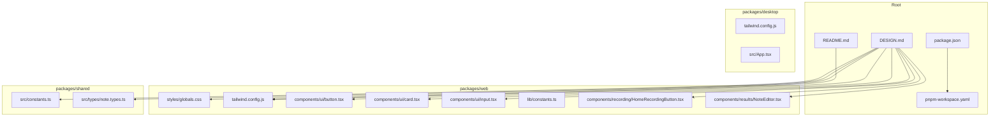
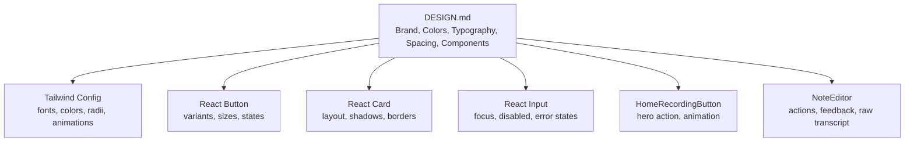
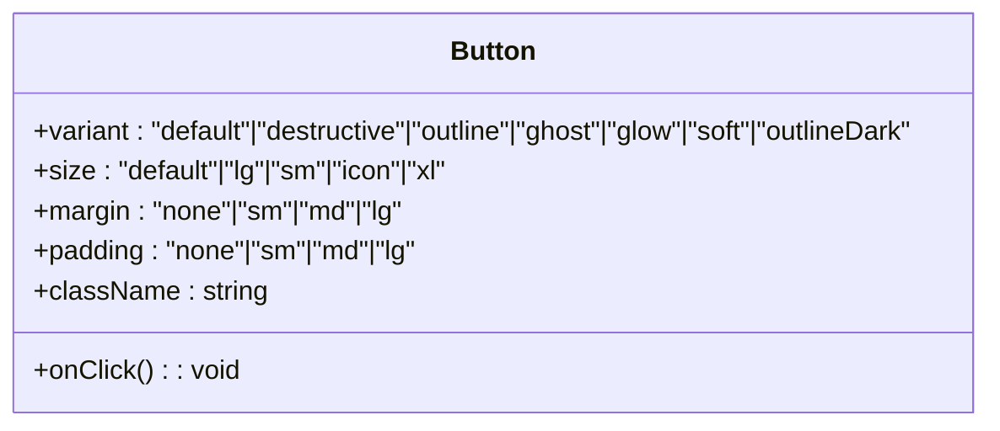
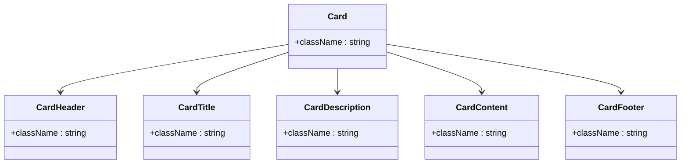
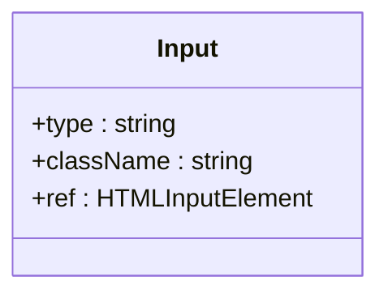
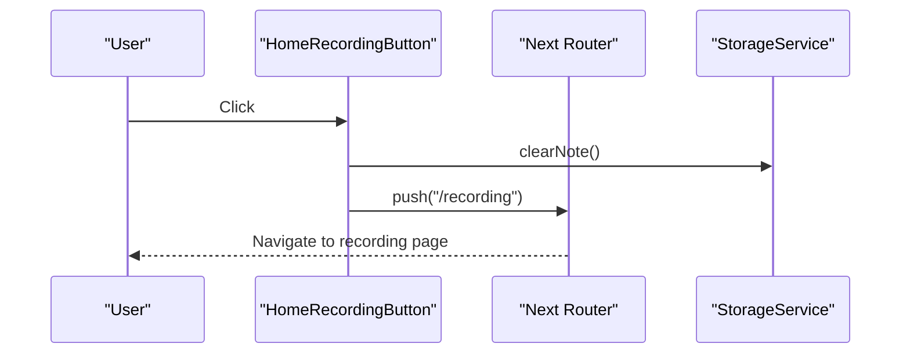
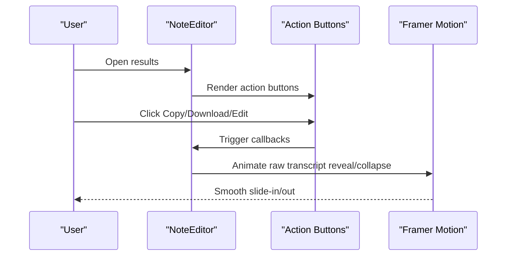
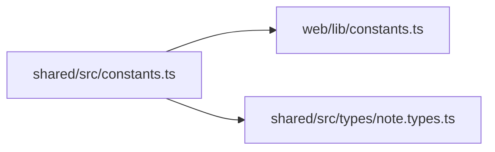
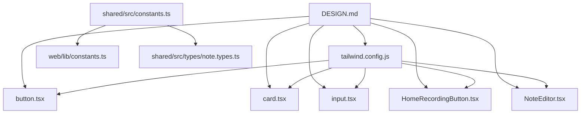

# Design System

<cite>
**Referenced Files in This Document**
- [DESIGN.md](file://DESIGN.md)
- [README.md](file://README.md)
- [package.json](file://package.json)
- [pnpm-workspace.yaml](file://pnpm-workspace.yaml)
- [packages/web/styles/globals.css](file://packages/web/styles/globals.css)
- [packages/web/components/ui/button.tsx](file://packages/web/components/ui/button.tsx)
- [packages/web/components/ui/card.tsx](file://packages/web/components/ui/card.tsx)
- [packages/web/components/ui/input.tsx](file://packages/web/components/ui/input.tsx)
- [packages/web/tailwind.config.js](file://packages/web/tailwind.config.js)
- [packages/web/lib/constants.ts](file://packages/web/lib/constants.ts)
- [packages/web/components/recording/HomeRecordingButton.tsx](file://packages/web/components/recording/HomeRecordingButton.tsx)
- [packages/web/components/results/NoteEditor.tsx](file://packages/web/components/results/NoteEditor.tsx)
- [packages/shared/src/constants.ts](file://packages/shared/src/constants.ts)
- [packages/shared/src/types/note.types.ts](file://packages/shared/src/types/note.types.ts)
</cite>

## Table of Contents
1. [Introduction](#introduction)
2. [Project Structure](#project-structure)
3. [Core Components](#core-components)
4. [Architecture Overview](#architecture-overview)
5. [Detailed Component Analysis](#detailed-component-analysis)
6. [Dependency Analysis](#dependency-analysis)
7. [Performance Considerations](#performance-considerations)
8. [Troubleshooting Guide](#troubleshooting-guide)
9. [Conclusion](#conclusion)

## Introduction
This document describes the Design System for Oscar, an AI-powered voice note-taking application. It consolidates brand identity, color palette, typography, spacing, components, animations, and dark mode implementation as defined in the design specification. It also maps these design decisions to the current codebase across the web, desktop, and shared packages, highlighting how the system is implemented and where improvements can be made.

## Project Structure
Oscar is a monorepo organized into three primary packages:
- packages/web: Next.js web application implementing the design system in React components and Tailwind CSS.
- packages/desktop: Tauri desktop application with its own UI components and styling.
- packages/shared: Shared types, constants, and utilities used across platforms.

**Diagram sources**
- [package.json:1-11](file://package.json#L1-L11)
- [pnpm-workspace.yaml:1-3](file://pnpm-workspace.yaml#L1-L3)
- [README.md:1-51](file://README.md#L1-L51)
- [DESIGN.md:1-411](file://DESIGN.md#L1-L411)
- [packages/web/styles/globals.css:1-13](file://packages/web/styles/globals.css#L1-L13)
- [packages/web/tailwind.config.js:1-106](file://packages/web/tailwind.config.js#L1-L106)
- [packages/web/components/ui/button.tsx:1-76](file://packages/web/components/ui/button.tsx#L1-L76)
- [packages/web/components/ui/card.tsx:1-77](file://packages/web/components/ui/card.tsx#L1-L77)
- [packages/web/components/ui/input.tsx:1-23](file://packages/web/components/ui/input.tsx#L1-L23)
- [packages/web/lib/constants.ts:1-314](file://packages/web/lib/constants.ts#L1-L314)
- [packages/web/components/recording/HomeRecordingButton.tsx:1-46](file://packages/web/components/recording/HomeRecordingButton.tsx#L1-L46)
- [packages/web/components/results/NoteEditor.tsx:1-405](file://packages/web/components/results/NoteEditor.tsx#L1-L405)
- [packages/shared/src/constants.ts:1-314](file://packages/shared/src/constants.ts#L1-L314)
- [packages/shared/src/types/note.types.ts:1-83](file://packages/shared/src/types/note.types.ts#L1-L83)

**Section sources**
- [README.md:1-51](file://README.md#L1-L51)
- [package.json:1-11](file://package.json#L1-L11)
- [pnpm-workspace.yaml:1-3](file://pnpm-workspace.yaml#L1-L3)

## Core Components
This section maps the design system’s core components to the codebase, focusing on how brand identity, colors, typography, spacing, and UI primitives are implemented.

- Brand Overview and Identity
  - The design system defines Oscar’s mission, tagline, and identity centered around a warm, human, editorial aesthetic with a strong cyan accent. These principles guide component styling and interactions.
  - Implementation anchors in the code include:
    - Tailwind configuration extending custom colors and fonts aligned with the design spec.
    - Component variants that reflect the brand’s emphasis on approachability and motion.

- Color Palette
  - Primary cyan variants (400–700) and neutral backgrounds (Cream, Warm White, Charcoal, Slate) are defined in the design spec.
  - The web Tailwind configuration maps these to HSL-based semantic tokens and custom cyan shades, enabling consistent theming across components.

- Typography
  - Headlines use Figtree (with Inter as fallback), body/UI use Inter, mono/code uses JetBrains Mono, and caption uses Inter.
  - The design specifies type scales and line heights; Tailwind’s font family extension aligns with these choices.

- Spacing System
  - Base unit of 4px with tokens for xs, sm, md, lg, xl, 2xl, 3xl.
  - The design emphasizes generous whitespace and editorial layout principles.

- UI Components
  - Buttons: Variants include default, destructive, outline, ghost, glow, soft, and outlineDark. Sizes and paddings are standardized.
  - Cards: Rounded corners, borders, shadows, and consistent padding.
  - Inputs: Standardized height, borders, focus rings, and padding.
  - Recording Button: Hero component with pulsing animation and large shadow.
  - Navigation and Tags/Labels: Defined in the design spec with implementation-ready tokens.

- Animations & Motion
  - Transitions and microinteractions are defined; the web app leverages motion libraries for hover effects and modal-like behaviors.

- Dark Mode
  - Implemented via CSS custom properties and a dark class on the root element, with semantic tokens mapped in Tailwind.

- Component States
  - Button and input states (default, hover, active, disabled, focus, error) are documented and reflected in component variants and styling.

- Accessibility
  - WCAG 2.1 AA requirements, focus-visible outlines, minimum contrast ratios, keyboard navigation, and screen reader labels are specified.

**Section sources**
- [DESIGN.md:7-411](file://DESIGN.md#L7-L411)
- [packages/web/tailwind.config.js:1-106](file://packages/web/tailwind.config.js#L1-L106)
- [packages/web/components/ui/button.tsx:1-76](file://packages/web/components/ui/button.tsx#L1-L76)
- [packages/web/components/ui/card.tsx:1-77](file://packages/web/components/ui/card.tsx#L1-L77)
- [packages/web/components/ui/input.tsx:1-23](file://packages/web/components/ui/input.tsx#L1-L23)
- [packages/web/components/recording/HomeRecordingButton.tsx:1-46](file://packages/web/components/recording/HomeRecordingButton.tsx#L1-L46)
- [packages/web/components/results/NoteEditor.tsx:1-405](file://packages/web/components/results/NoteEditor.tsx#L1-L405)

## Architecture Overview
The design system is implemented through a combination of:
- Design specification (DESIGN.md) defining brand, colors, typography, spacing, components, and accessibility.
- Tailwind CSS configuration extending fonts, colors, and radius tokens.
- React components that apply design tokens consistently.
- Shared constants and types ensuring alignment across packages.

**Diagram sources**
- [DESIGN.md:1-411](file://DESIGN.md#L1-L411)
- [packages/web/tailwind.config.js:1-106](file://packages/web/tailwind.config.js#L1-L106)
- [packages/web/components/ui/button.tsx:1-76](file://packages/web/components/ui/button.tsx#L1-L76)
- [packages/web/components/ui/card.tsx:1-77](file://packages/web/components/ui/card.tsx#L1-L77)
- [packages/web/components/ui/input.tsx:1-23](file://packages/web/components/ui/input.tsx#L1-L23)
- [packages/web/components/recording/HomeRecordingButton.tsx:1-46](file://packages/web/components/recording/HomeRecordingButton.tsx#L1-L46)
- [packages/web/components/results/NoteEditor.tsx:1-405](file://packages/web/components/results/NoteEditor.tsx#L1-L405)

## Detailed Component Analysis

### Button Component
The Button component encapsulates the design system’s button variants and sizing, applying focus-visible outlines and semantic color tokens.

**Diagram sources**
- [packages/web/components/ui/button.tsx:51-76](file://packages/web/components/ui/button.tsx#L51-L76)

**Section sources**
- [packages/web/components/ui/button.tsx:1-76](file://packages/web/components/ui/button.tsx#L1-L76)
- [DESIGN.md:99-114](file://DESIGN.md#L99-L114)

### Card Component
The Card component provides a reusable container with consistent borders, shadows, and spacing, aligning with the design’s editorial and functional SaaS principles.

**Diagram sources**
- [packages/web/components/ui/card.tsx:5-77](file://packages/web/components/ui/card.tsx#L5-L77)

**Section sources**
- [packages/web/components/ui/card.tsx:1-77](file://packages/web/components/ui/card.tsx#L1-L77)
- [DESIGN.md:115-124](file://DESIGN.md#L115-L124)

### Input Field Component
The Input component standardizes height, borders, focus behavior, and disabled/error states, reflecting the design’s emphasis on clarity and usability.

**Diagram sources**
- [packages/web/components/ui/input.tsx:5-23](file://packages/web/components/ui/input.tsx#L5-L23)

**Section sources**
- [packages/web/components/ui/input.tsx:1-23](file://packages/web/components/ui/input.tsx#L1-L23)
- [DESIGN.md:125-133](file://DESIGN.md#L125-L133)

### Home Recording Button (Hero Component)
The HomeRecordingButton serves as the primary call-to-action, integrating motion effects and routing to the recording page.

**Diagram sources**
- [packages/web/components/recording/HomeRecordingButton.tsx:10-46](file://packages/web/components/recording/HomeRecordingButton.tsx#L10-L46)

**Section sources**
- [packages/web/components/recording/HomeRecordingButton.tsx:1-46](file://packages/web/components/recording/HomeRecordingButton.tsx#L1-L46)
- [DESIGN.md:134-142](file://DESIGN.md#L134-L142)

### Note Editor (Results Page)
The NoteEditor integrates actions (copy, download, share, edit/save), feedback widgets, and raw transcript visibility with motion-driven transitions.

**Diagram sources**
- [packages/web/components/results/NoteEditor.tsx:40-405](file://packages/web/components/results/NoteEditor.tsx#L40-L405)

**Section sources**
- [packages/web/components/results/NoteEditor.tsx:1-405](file://packages/web/components/results/NoteEditor.tsx#L1-L405)
- [DESIGN.md:134-157](file://DESIGN.md#L134-L157)

### Constants and Types Alignment
Shared constants and types ensure consistent behavior across packages, including error messages, API endpoints, UI strings, and note-related types.

**Diagram sources**
- [packages/shared/src/constants.ts:1-314](file://packages/shared/src/constants.ts#L1-L314)
- [packages/web/lib/constants.ts:1-314](file://packages/web/lib/constants.ts#L1-L314)
- [packages/shared/src/types/note.types.ts:1-83](file://packages/shared/src/types/note.types.ts#L1-L83)

**Section sources**
- [packages/shared/src/constants.ts:1-314](file://packages/shared/src/constants.ts#L1-L314)
- [packages/web/lib/constants.ts:1-314](file://packages/web/lib/constants.ts#L1-L314)
- [packages/shared/src/types/note.types.ts:1-83](file://packages/shared/src/types/note.types.ts#L1-L83)

## Dependency Analysis
The design system’s implementation depends on:
- Tailwind configuration for fonts, colors, and animations.
- React components that consume design tokens and variants.
- Shared constants and types to maintain consistency across packages.

**Diagram sources**
- [DESIGN.md:1-411](file://DESIGN.md#L1-L411)
- [packages/web/tailwind.config.js:1-106](file://packages/web/tailwind.config.js#L1-L106)
- [packages/web/components/ui/button.tsx:1-76](file://packages/web/components/ui/button.tsx#L1-L76)
- [packages/web/components/ui/card.tsx:1-77](file://packages/web/components/ui/card.tsx#L1-L77)
- [packages/web/components/ui/input.tsx:1-23](file://packages/web/components/ui/input.tsx#L1-L23)
- [packages/web/components/recording/HomeRecordingButton.tsx:1-46](file://packages/web/components/recording/HomeRecordingButton.tsx#L1-L46)
- [packages/web/components/results/NoteEditor.tsx:1-405](file://packages/web/components/results/NoteEditor.tsx#L1-L405)
- [packages/shared/src/constants.ts:1-314](file://packages/shared/src/constants.ts#L1-L314)
- [packages/shared/src/types/note.types.ts:1-83](file://packages/shared/src/types/note.types.ts#L1-L83)

**Section sources**
- [DESIGN.md:1-411](file://DESIGN.md#L1-L411)
- [packages/web/tailwind.config.js:1-106](file://packages/web/tailwind.config.js#L1-L106)
- [packages/web/components/ui/button.tsx:1-76](file://packages/web/components/ui/button.tsx#L1-L76)
- [packages/web/components/ui/card.tsx:1-77](file://packages/web/components/ui/card.tsx#L1-L77)
- [packages/web/components/ui/input.tsx:1-23](file://packages/web/components/ui/input.tsx#L1-L23)
- [packages/web/components/recording/HomeRecordingButton.tsx:1-46](file://packages/web/components/recording/HomeRecordingButton.tsx#L1-L46)
- [packages/web/components/results/NoteEditor.tsx:1-405](file://packages/web/components/results/NoteEditor.tsx#L1-L405)
- [packages/shared/src/constants.ts:1-314](file://packages/shared/src/constants.ts#L1-L314)
- [packages/shared/src/types/note.types.ts:1-83](file://packages/shared/src/types/note.types.ts#L1-L83)

## Performance Considerations
- Prefer CSS custom properties for theming to minimize reflows and improve runtime switching between light/dark modes.
- Use component variants judiciously to avoid excessive CSS bloat; consolidate similar variants where possible.
- Leverage motion libraries for lightweight animations; ensure animations are hardware-accelerated and scoped to necessary elements.
- Keep Tailwind purging enabled to remove unused styles and reduce bundle size.

## Troubleshooting Guide
Common issues and resolutions grounded in the design system and codebase:

- Button states not matching design specs
  - Verify variant and size props are applied correctly and focus-visible outlines are present.
  - Reference the design’s button states and component implementation.

- Input focus or error states inconsistent
  - Ensure focus ring classes and error border classes are applied according to the design’s input states.

- Dark mode not toggling properly
  - Confirm the dark class is toggled on the root element and CSS custom properties are defined for semantic tokens.

- Hero recording button not animating
  - Check motion library usage and ensure the component is rendered outside restricted routes.

- Shared constants mismatch across packages
  - Align shared constants and types to prevent discrepancies in API endpoints, UI strings, and error messages.

**Section sources**
- [DESIGN.md:328-347](file://DESIGN.md#L328-L347)
- [DESIGN.md:306-324](file://DESIGN.md#L306-L324)
- [DESIGN.md:134-142](file://DESIGN.md#L134-L142)
- [packages/shared/src/constants.ts:1-314](file://packages/shared/src/constants.ts#L1-L314)
- [packages/web/lib/constants.ts:1-314](file://packages/web/lib/constants.ts#L1-L314)

## Conclusion
Oscar’s Design System is a cohesive blend of brand identity, color, typography, spacing, and component behavior. The web package demonstrates strong alignment with the design spec through Tailwind configuration, component variants, and motion-driven interactions. The shared package ensures consistency across platforms. Future enhancements should focus on expanding component coverage, refining animations, and maintaining strict adherence to accessibility guidelines.