# Notes Application Enhancements

<cite>
**Referenced Files in This Document**
- [README.md](file://README.md)
- [package.json](file://package.json)
- [app/layout.tsx](file://app/layout.tsx)
- [app/page.tsx](file://app/page.tsx)
- [app/results/page.tsx](file://app/results/page.tsx)
- [app/notes/page.tsx](file://app/notes/page.tsx)
- [components/results/NoteEditor.tsx](file://components/results/NoteEditor.tsx)
- [components/results/NoteActions.tsx](file://components/results/NoteActions.tsx)
- [components/recording/HomeRecordingButton.tsx](file://components/recording/HomeRecordingButton.tsx)
- [components/recording/RecordingControls.tsx](file://components/recording/RecordingControls.tsx)
- [components/recording/PermissionErrorModal.tsx](file://components/recording/PermissionErrorModal.tsx)
- [components/recording/RecordingTimer.tsx](file://components/recording/RecordingTimer.tsx)
- [components/ui/animated-testimonials.tsx](file://components/ui/animated-testimonials.tsx)
- [lib/services/notes.service.ts](file://lib/services/notes.service.ts)
- [lib/services/storage.service.ts](file://lib/services/storage.service.ts)
- [lib/supabase/client.ts](file://lib/supabase/client.ts)
- [lib/constants.ts](file://lib/constants.ts)
- [lib/utils.ts](file://lib/utils.ts)
- [lib/hooks/useAIEmailFormatting.ts](file://lib/hooks/useAIEmailFormatting.ts)
- [app/api/deepseek/format-email/route.ts](file://app/api/deepseek/format-email/route.ts)
- [app/api/deepseek/translate/route.ts](file://app/api/deepseek/translate/route.ts)
</cite>

## Update Summary
**Changes Made**
- Added comprehensive multi-mode note editing system with normal, email formatting, translation, and language switching capabilities
- Enhanced recording visual feedback with Google Meet-style concentric pulse rings and wave animations
- Improved testimonial animations with deterministic rotation values
- Removed note starring system, notebook filtering, tag-based filtering, and toggleStar functionality
- Simplified note organization and prioritization system
- Removed floating-dock component and associated functionality

## Table of Contents
1. [Introduction](#introduction)
2. [Project Structure](#project-structure)
3. [Core Components](#core-components)
4. [Architecture Overview](#architecture-overview)
5. [Detailed Component Analysis](#detailed-component-analysis)
6. [Multi-Mode Note Editing System](#multi-mode-note-editing-system)
7. [Enhanced Recording Experience](#enhanced-recording-experience)
8. [Improved Testimonial Animations](#improved-testimonial-animations)
9. [Performance Considerations](#performance-considerations)
10. [Troubleshooting Guide](#troubleshooting-guide)
11. [Conclusion](#conclusion)

## Introduction
This document provides comprehensive documentation for the Notes Application Enhancements, focusing on the OSCAR AI Voice Notes platform. The application enables users to convert voice recordings into clean, formatted text using AI-powered processing. Recent enhancements include a comprehensive multi-mode note editing system with normal, email formatting, translation, and language switching capabilities, along with improved recording visual feedback and testimonial animations.

The application leverages Next.js 15 with React 19, implementing a modern, responsive design with TypeScript for type safety. It integrates advanced audio processing, AI text formatting, and robust session management to deliver a seamless user experience.

## Project Structure
The project follows a well-organized structure that separates concerns across different layers:

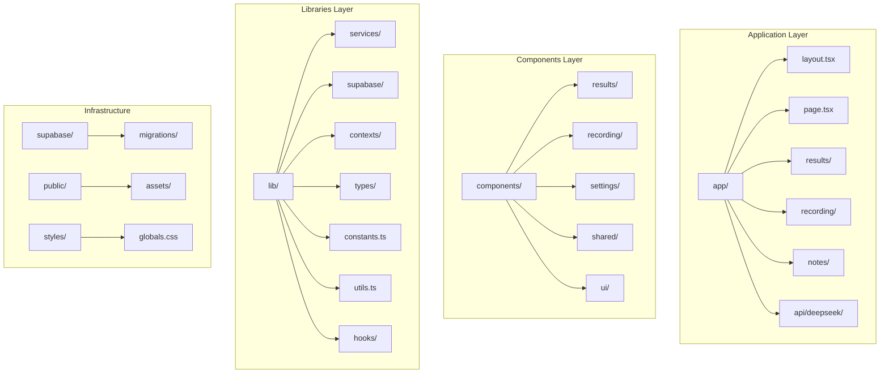

**Diagram sources**
- [app/layout.tsx](file://app/layout.tsx#L1-L88)
- [package.json](file://package.json#L1-L53)

The structure emphasizes modularity with clear separation between presentation components, business logic services, and infrastructure concerns. The Next.js app directory pattern is utilized for routing and page management.

**Section sources**
- [README.md](file://README.md#L49-L66)
- [package.json](file://package.json#L1-L53)

## Core Components

### Audio Recording System
The recording system provides a sophisticated audio capture experience with real-time audio visualization and intelligent processing:

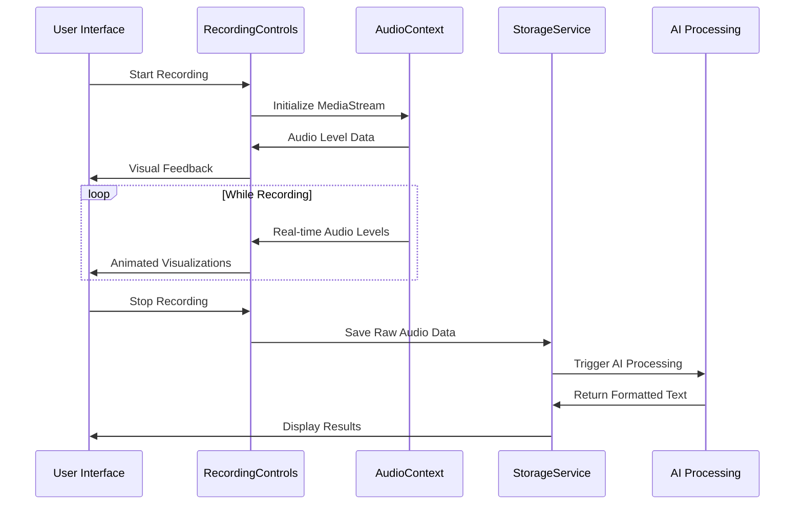

**Diagram sources**
- [components/recording/RecordingControls.tsx](file://components/recording/RecordingControls.tsx#L17-L90)
- [components/recording/RecordingTimer.tsx](file://components/recording/RecordingTimer.tsx#L1-L26)
- [lib/services/storage.service.ts](file://lib/services/storage.service.ts#L17-L33)

### AI Text Processing Pipeline
The AI processing pipeline transforms raw audio transcripts into professionally formatted text with multiple modes:

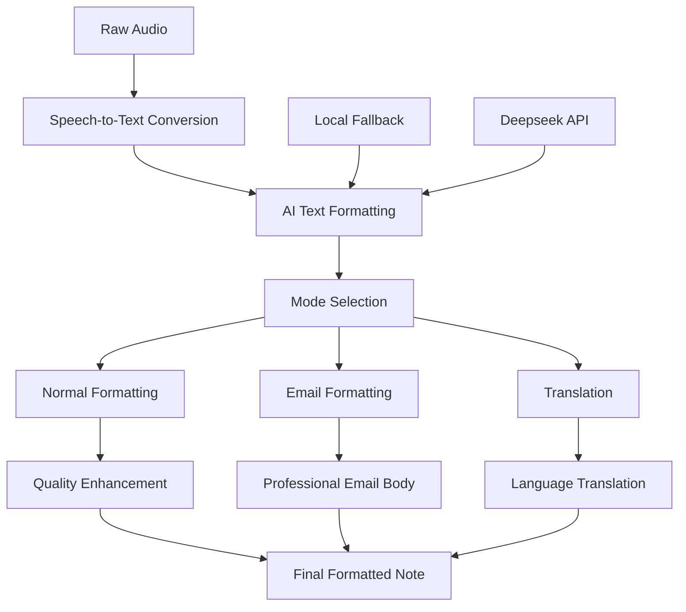

**Diagram sources**
- [lib/constants.ts](file://lib/constants.ts#L75-L98)
- [lib/constants.ts](file://lib/constants.ts#L221-L238)
- [app/api/deepseek/format-email/route.ts](file://app/api/deepseek/format-email/route.ts#L102-L125)
- [app/api/deepseek/translate/route.ts](file://app/api/deepseek/translate/route.ts#L115-L134)

### Note Management System
The note management system provides comprehensive functionality for storing, organizing, and sharing user notes with simplified organization:

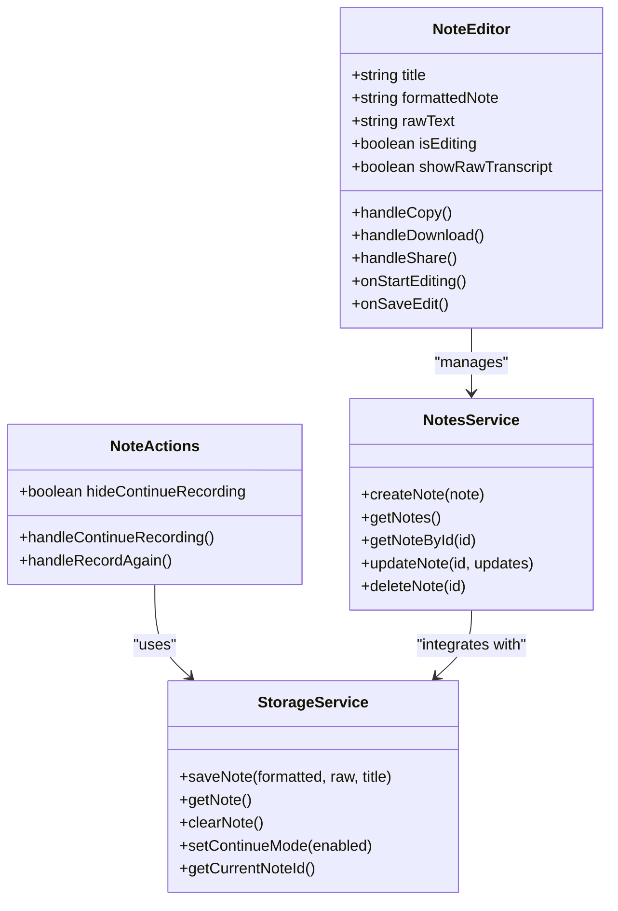

**Diagram sources**
- [components/results/NoteEditor.tsx](file://components/results/NoteEditor.tsx#L13-L38)
- [components/results/NoteActions.tsx](file://components/results/NoteActions.tsx#L19-L46)
- [lib/services/notes.service.ts](file://lib/services/notes.service.ts#L16-L112)
- [lib/services/storage.service.ts](file://lib/services/storage.service.ts#L13-L160)

**Section sources**
- [components/recording/RecordingControls.tsx](file://components/recording/RecordingControls.tsx#L1-L229)
- [components/results/NoteEditor.tsx](file://components/results/NoteEditor.tsx#L1-L405)
- [lib/services/notes.service.ts](file://lib/services/notes.service.ts#L1-L113)

## Architecture Overview

The application implements a modern client-side architecture with serverless backend integration:

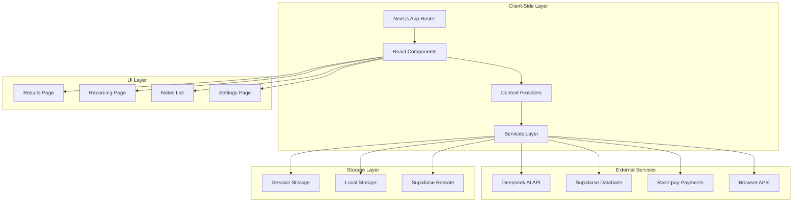

**Diagram sources**
- [app/layout.tsx](file://app/layout.tsx#L1-L88)
- [lib/supabase/client.ts](file://lib/supabase/client.ts#L1-L34)
- [lib/constants.ts](file://lib/constants.ts#L75-L98)

The architecture emphasizes scalability and maintainability through clear separation of concerns, with each layer having distinct responsibilities and well-defined interfaces.

**Section sources**
- [app/layout.tsx](file://app/layout.tsx#L1-L88)
- [lib/supabase/client.ts](file://lib/supabase/client.ts#L1-L34)

## Detailed Component Analysis

### Enhanced Recording Experience
The recording system provides an immersive audio capture experience with sophisticated visual feedback and intelligent processing:

#### Audio Visualization System
The audio visualization system creates dynamic visual feedback during recording sessions with Google Meet-style concentric pulse rings:

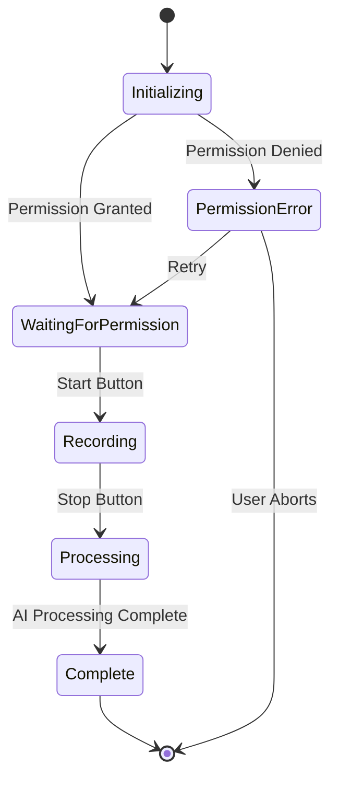

**Diagram sources**
- [components/recording/RecordingControls.tsx](file://components/recording/RecordingControls.tsx#L92-L175)
- [components/recording/PermissionErrorModal.tsx](file://components/recording/PermissionErrorModal.tsx#L16-L120)

#### Real-time Audio Level Monitoring
The system implements sophisticated audio level monitoring using Web Audio API with Google Meet-inspired visual effects:

| Feature | Implementation | Purpose |
|---------|---------------|---------|
| Audio Context Creation | Web Audio API | High-fidelity audio processing |
| Frequency Analysis | FFT Analysis | Real-time audio visualization |
| Level Calculation | Average frequency bin values | Smooth audio level representation |
| Animation Synchronization | RequestAnimationFrame | Smooth visual feedback |
| Concentric Rings | CSS keyframes | Meet-style recording indicator |
| Pulse Animation | Transform scaling | Visual feedback for audio levels |

**Section sources**
- [components/recording/RecordingControls.tsx](file://components/recording/RecordingControls.tsx#L17-L90)

### Advanced Note Editor
The note editor provides a comprehensive editing experience with multiple interaction modes and enhanced formatting capabilities:

#### Multi-Mode Editing Interface
The editor supports normal editing, email formatting, translation, and language switching with seamless transitions:

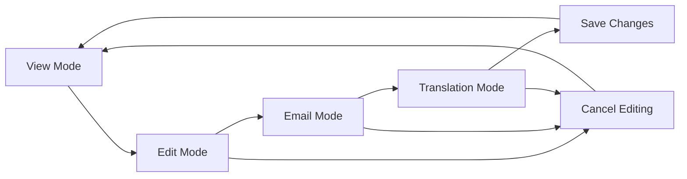

**Diagram sources**
- [components/results/NoteEditor.tsx](file://components/results/NoteEditor.tsx#L184-L195)
- [components/results/NoteEditor.tsx](file://components/results/NoteEditor.tsx#L200-L295)
- [app/results/page.tsx](file://app/results/page.tsx#L406-L460)

#### Mobile-First Design
The interface adapts seamlessly across device sizes with optimized touch interactions:

| Device Type | Interaction Pattern | Key Features |
|-------------|-------------------|--------------|
| Desktop | Hover-based actions | Full toolbar with icons |
| Tablet | Touch-friendly buttons | Larger interactive areas |
| Mobile | Bottom sheet actions | Simplified icon buttons |

**Section sources**
- [components/results/NoteEditor.tsx](file://components/results/NoteEditor.tsx#L1-L405)

### Intelligent Storage Management
The storage system provides robust data persistence with multiple storage mechanisms:

#### Multi-Layer Storage Architecture
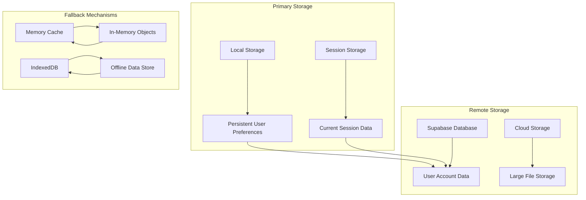

**Diagram sources**
- [lib/services/storage.service.ts](file://lib/services/storage.service.ts#L13-L160)
- [lib/supabase/client.ts](file://lib/supabase/client.ts#L1-L34)

**Section sources**
- [lib/services/storage.service.ts](file://lib/services/storage.service.ts#L1-L161)
- [lib/constants.ts](file://lib/constants.ts#L175-L181)

### AI-Powered Text Processing
The AI processing system provides intelligent text transformation with multiple modes and fallback capabilities:

#### Processing Pipeline
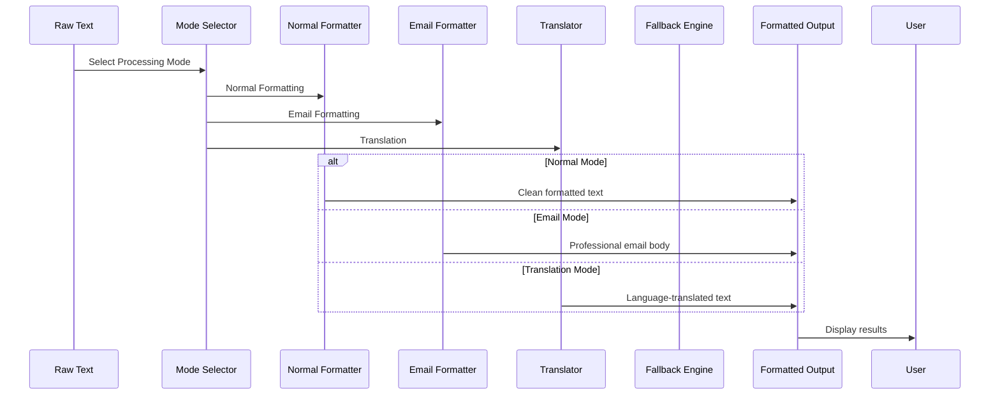

**Diagram sources**
- [lib/constants.ts](file://lib/constants.ts#L34-L36)
- [lib/constants.ts](file://lib/constants.ts#L75-L98)
- [app/results/page.tsx](file://app/results/page.tsx#L406-L460)

**Section sources**
- [lib/constants.ts](file://lib/constants.ts#L1-L314)

## Multi-Mode Note Editing System

### Comprehensive Editing Capabilities
The enhanced note editing system provides multiple processing modes for different use cases:

#### Normal Mode
- Standard text formatting and editing
- Direct text manipulation
- Real-time preview updates

#### Email Mode
- Professional email body formatting
- Automatic subject integration
- Gmail-compatible formatting

#### Translation Mode
- Multi-language support (English/Hindi)
- Real-time translation with caching
- Language switching capabilities

#### Language Switching
- Dynamic language selection
- Cached translation results
- Background prefetch for better UX

**Section sources**
- [app/results/page.tsx](file://app/results/page.tsx#L406-L460)
- [app/results/page.tsx](file://app/results/page.tsx#L163-L277)
- [lib/hooks/useAIEmailFormatting.ts](file://lib/hooks/useAIEmailFormatting.ts#L1-L62)

### API Integration for Advanced Features
The system integrates with specialized AI endpoints for enhanced functionality:

#### Email Formatting API
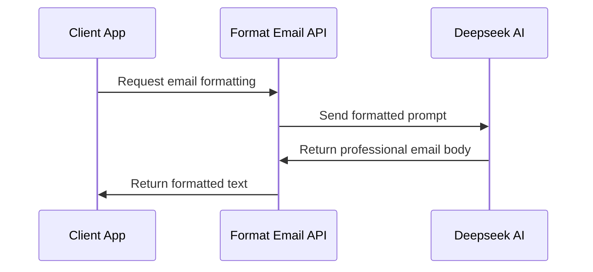

**Diagram sources**
- [app/api/deepseek/format-email/route.ts](file://app/api/deepseek/format-email/route.ts#L36-L167)

#### Translation API
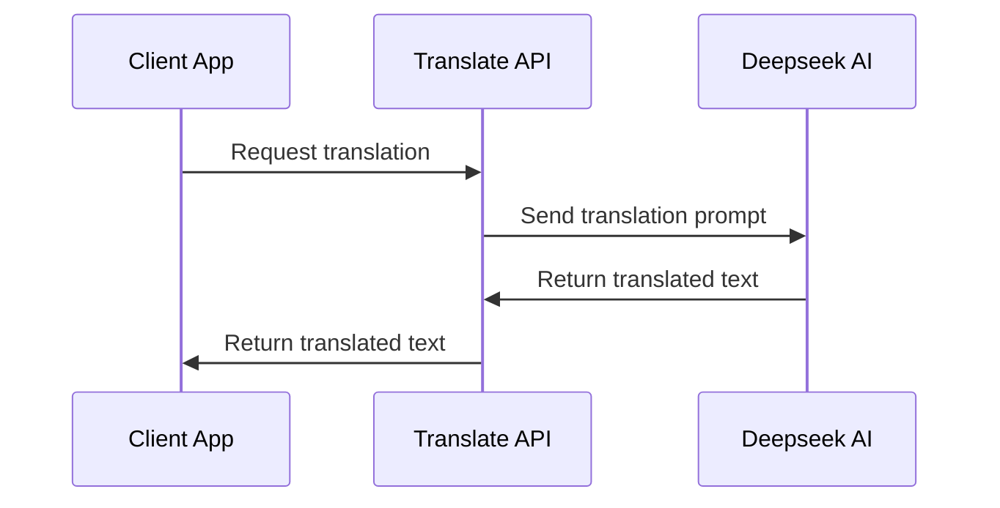

**Diagram sources**
- [app/api/deepseek/translate/route.ts](file://app/api/deepseek/translate/route.ts#L41-L171)

**Section sources**
- [app/api/deepseek/format-email/route.ts](file://app/api/deepseek/format-email/route.ts#L1-L167)
- [app/api/deepseek/translate/route.ts](file://app/api/deepseek/translate/route.ts#L1-L171)

## Enhanced Recording Experience

### Google Meet-Style Visual Feedback
The recording system now features sophisticated visual feedback inspired by Google Meet's recording indicators:

#### Concentric Pulse Rings
The system implements three concentric rings that pulse outward when recording, mimicking Google Meet's behavior:

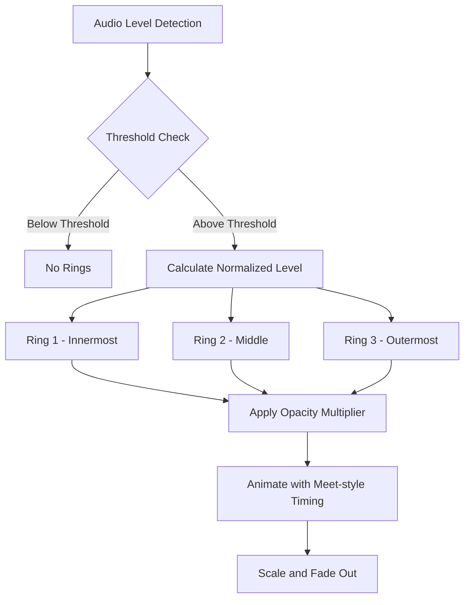

**Diagram sources**
- [components/recording/RecordingControls.tsx](file://components/recording/RecordingControls.tsx#L122-L188)

#### Deterministic Animation Values
The visual feedback uses carefully calculated timing and opacity values to create a realistic Meet-like experience:

| Parameter | Value | Purpose |
|-----------|--------|---------|
| Threshold | 0.08 | Dead zone for silence detection |
| Duration | 0.9-1.6s | Base pulse duration (faster with louder audio) |
| Opacity | 0.45-1.00 | Layer-specific transparency |
| Ring Count | 3 | Conforms to Meet's design |
| Color | RGB(8, 145, 178) | Cyan-blue Meet recording color |

**Section sources**
- [components/recording/RecordingControls.tsx](file://components/recording/RecordingControls.tsx#L94-L188)

### Wave Animation Enhancements
The recording interface now features smooth wave animations synchronized with audio levels:

#### Audio Level Processing
The system processes audio levels through multiple stages to create smooth visual feedback:

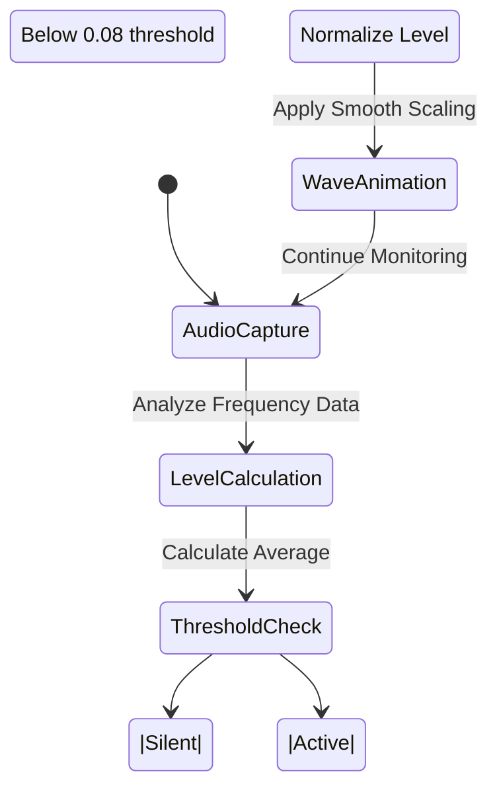

**Diagram sources**
- [components/recording/RecordingControls.tsx](file://components/recording/RecordingControls.tsx#L17-L92)

**Section sources**
- [components/recording/RecordingControls.tsx](file://components/recording/RecordingControls.tsx#L17-L92)

## Improved Testimonial Animations

### Deterministic Rotation System
The testimonial carousel now uses deterministic rotation values instead of random animations:

#### Rotation Algorithm
The system generates stable rotation values based on testimonial index positions:

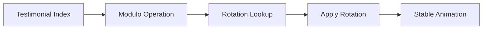

**Diagram sources**
- [components/ui/animated-testimonials.tsx](file://components/ui/animated-testimonials.tsx#L37-L42)

#### Rotation Values
The system uses a predefined array of rotation values for consistent animations:

| Index Position | Rotation Value | Effect |
|----------------|----------------|---------|
| 0 | -10° | Strong left tilt |
| 1 | -5° | Gentle left tilt |
| 2 | 3° | Subtle right tilt |
| 3 | 8° | Noticeable right tilt |
| 4 | -3° | Minimal left tilt |
| 5 | 5° | Gentle right tilt |
| 6 | -8° | Strong left tilt |
| 7 | 10° | Maximum right tilt |

**Section sources**
- [components/ui/animated-testimonials.tsx](file://components/ui/animated-testimonials.tsx#L37-L42)

### Enhanced Carousel Experience
The testimonial carousel provides smoother transitions with improved z-index management:

#### Animation Sequence
The system coordinates multiple animation properties for a polished experience:

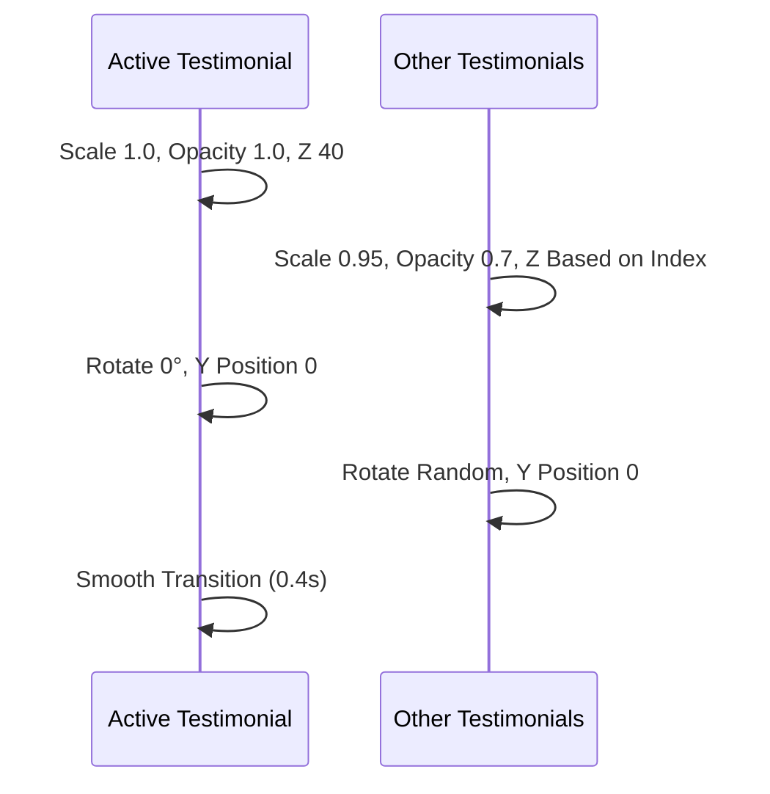

**Diagram sources**
- [components/ui/animated-testimonials.tsx](file://components/ui/animated-testimonials.tsx#L56-L86)

**Section sources**
- [components/ui/animated-testimonials.tsx](file://components/ui/animated-testimonials.tsx#L56-L86)

## Performance Considerations

### Memory Management
The application implements several strategies to optimize memory usage:

- **Lazy Loading**: Components are loaded on-demand to reduce initial bundle size
- **Cleanup Functions**: Proper cleanup of audio contexts and event listeners
- **Garbage Collection**: Strategic clearing of temporary data after processing
- **Translation Caching**: Efficient caching of translation results to avoid redundant API calls

### Network Optimization
- **Compression**: Audio data is compressed before transmission
- **Caching**: Frequently accessed data is cached locally
- **Connection Pooling**: Efficient management of API connections
- **Abort Controllers**: Proper cancellation of in-flight requests

### Rendering Performance
- **Virtualization**: Large lists are virtualized to improve scrolling performance
- **Optimized Re-renders**: React.memo and useMemo for expensive computations
- **CSS Animations**: Hardware-accelerated animations for smooth UI transitions
- **Animation Cancellation**: Proper cleanup of animation frames and timers

## Troubleshooting Guide

### Common Issues and Solutions

#### Audio Recording Problems
| Issue | Symptoms | Solution |
|-------|----------|----------|
| Microphone Access Denied | Permission modal appears repeatedly | Check browser permissions and retry |
| Audio Quality Issues | Poor recording quality | Verify microphone hardware and browser compatibility |
| Audio Processing Failures | Processing stuck at 50% | Check network connectivity and API availability |
| Visual Feedback Not Working | No concentric rings appear | Verify browser supports CSS animations |

#### AI Processing Errors
| Error Type | Cause | Resolution |
|------------|-------|------------|
| API Timeout | Network latency | Retry with exponential backoff |
| Invalid Response | Malformed API response | Validate input data and retry |
| Rate Limiting | Exceeded API quotas | Implement request throttling |
| Translation Failures | Unsupported languages | Check target language parameter |

#### Storage Issues
| Problem | Indicators | Fix |
|---------|------------|-----|
| Data Loss | Notes not persisting | Check browser storage permissions |
| Sync Conflicts | Duplicate notes appearing | Implement conflict resolution |
| Performance Degradation | Slow loading times | Clear storage cache and optimize queries |
| Translation Cache Issues | Stale translations | Clear translation cache and retry |

#### Multi-Mode Editing Problems
| Issue | Symptoms | Solution |
|-------|----------|----------|
| Email Formatting Fails | Empty email body | Check AI API availability and input validation |
| Translation Errors | Failed to translate | Verify text length and language codes |
| Mode Switching Issues | Modes not applying | Check state management and re-render triggers |

**Section sources**
- [lib/constants.ts](file://lib/constants.ts#L6-L60)

### Debugging Tools
The application includes comprehensive debugging capabilities:

- **Console Logging**: Extensive logging throughout the application lifecycle
- **Error Boundaries**: Graceful error handling with user-friendly messages
- **Performance Monitoring**: Built-in metrics collection and reporting
- **Development Tools**: Hot reloading and live debugging capabilities
- **API Response Logging**: Detailed logging of AI service responses

## Conclusion

The Notes Application Enhancements represent a comprehensive solution for AI-powered voice note processing with significantly enhanced functionality. The recent improvements include a multi-mode note editing system, sophisticated recording visual feedback, and improved testimonial animations.

Key achievements include:

- **Multi-Mode Editing System**: Comprehensive support for normal, email formatting, and translation modes
- **Enhanced Recording Experience**: Google Meet-style visual feedback with concentric pulse rings
- **Improved Testimonial Animations**: Deterministic rotation values for consistent carousel behavior
- **Robust Architecture**: Well-structured codebase with clear separation of concerns
- **Advanced Audio Processing**: Sophisticated recording and visualization systems
- **Intelligent AI Integration**: Reliable text formatting with multiple processing modes
- **Scalable Infrastructure**: Modular design supporting future feature additions
- **Performance Optimization**: Carefully optimized for speed and efficiency

The enhancement implementation guide provides clear pathways for extending the application with new features while maintaining code quality and performance standards. The troubleshooting resources ensure reliable operation across diverse user scenarios and environments.

Future development opportunities include expanded collaboration features, advanced analytics capabilities, and integration with additional AI services to further enhance the user experience.