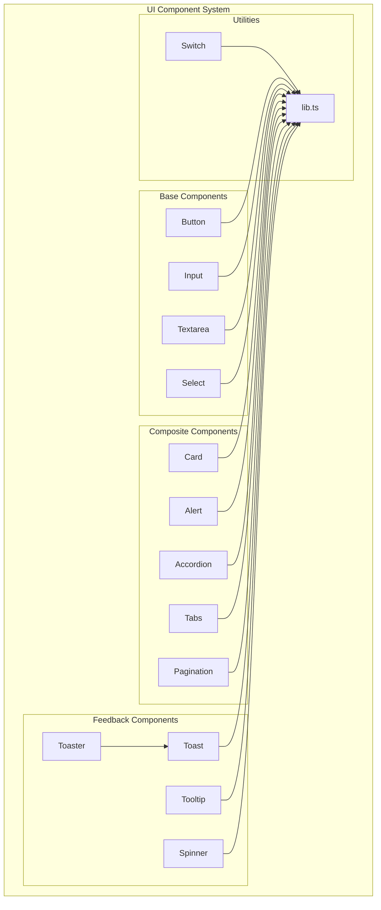
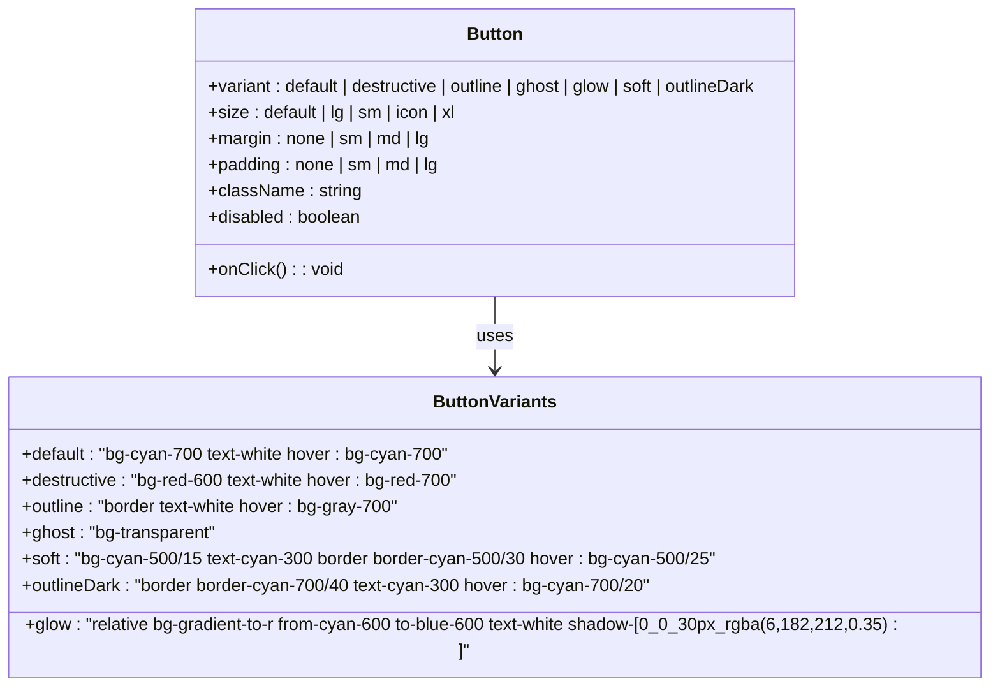
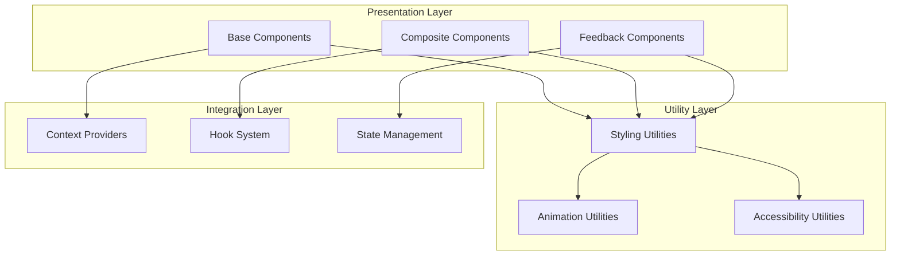
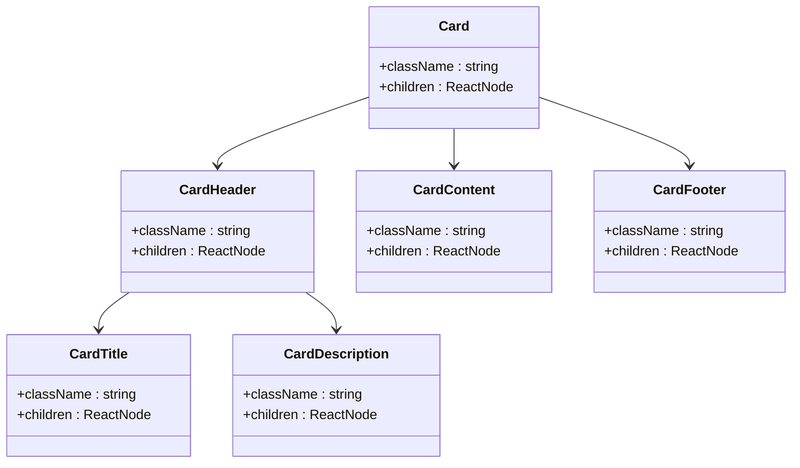
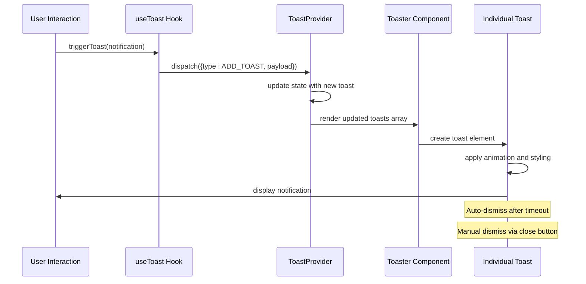
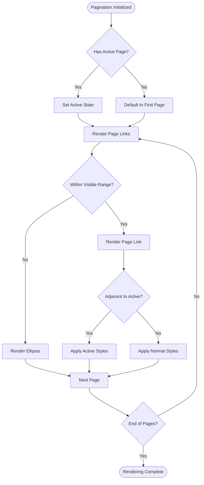
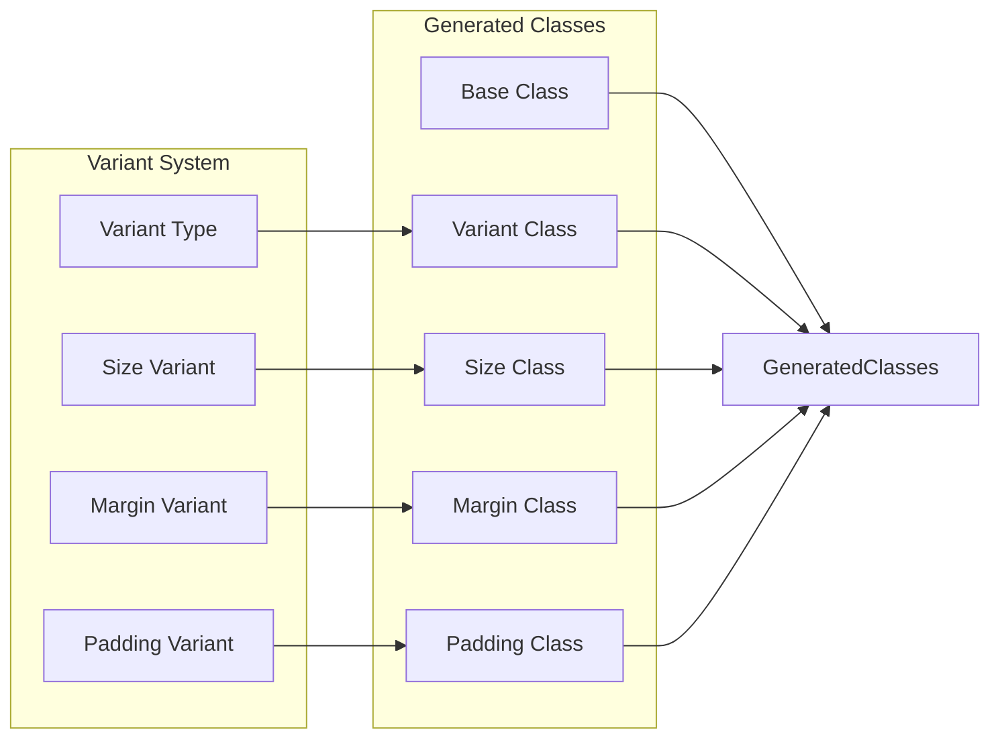
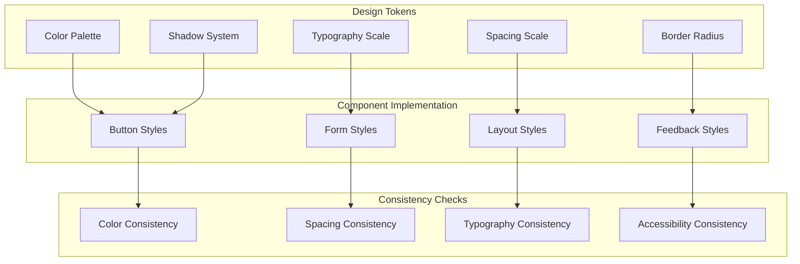

# UI Component Enhancements

<cite>
**Referenced Files in This Document**
- [button.tsx](file://components/ui/button.tsx)
- [input.tsx](file://components/ui/input.tsx)
- [card.tsx](file://components/ui/card.tsx)
- [select.tsx](file://components/ui/select.tsx)
- [textarea.tsx](file://components/ui/textarea.tsx)
- [lib.ts](file://components/ui/lib.ts)
- [spinner.tsx](file://components/ui/spinner.tsx)
- [toast.tsx](file://components/ui/toast.tsx)
- [toaster.tsx](file://components/ui/toaster.tsx)
- [tooltip.tsx](file://components/ui/tooltip.tsx)
- [accordion.tsx](file://components/ui/accordion.tsx)
- [alert.tsx](file://components/ui/alert.tsx)
- [pagination.tsx](file://components/ui/pagination.tsx)
- [tabs.tsx](file://components/ui/tabs.tsx)
- [switch.tsx](file://components/ui/switch.tsx)
</cite>

## Table of Contents
1. [Introduction](#introduction)
2. [Project Structure](#project-structure)
3. [Core Components](#core-components)
4. [Architecture Overview](#architecture-overview)
5. [Detailed Component Analysis](#detailed-component-analysis)
6. [Enhancement Patterns](#enhancement-patterns)
7. [Design System Implementation](#design-system-implementation)
8. [Accessibility Features](#accessibility-features)
9. [Performance Optimizations](#performance-optimizations)
10. [Best Practices](#best-practices)
11. [Conclusion](#conclusion)

## Introduction

The OScar project demonstrates a comprehensive approach to UI component development through a well-structured design system. This documentation focuses on the UI component enhancements implemented across various atomic components, showcasing modern React patterns, accessibility compliance, and consistent design language.

The design system follows Next.js App Router conventions while implementing advanced UI patterns including variant-based styling, responsive design, and interactive component behaviors. Each component is built with TypeScript for type safety and Tailwind CSS for consistent styling.

## Project Structure

The UI components are organized within the `components/ui/` directory following a modular architecture pattern:

**Diagram sources**
- [button.tsx](file://components/ui/button.tsx#L1-L76)
- [lib.ts](file://components/ui/lib.ts#L1-L7)

**Section sources**
- [button.tsx](file://components/ui/button.tsx#L1-L76)
- [lib.ts](file://components/ui/lib.ts#L1-L7)

## Core Components

The foundation of the UI system consists of seven primary components that serve as building blocks for more complex interfaces:

### Button Component Enhancement

The Button component implements a sophisticated variant system with nine distinct visual states:

**Diagram sources**
- [button.tsx](file://components/ui/button.tsx#L7-L49)

### Form Controls

The form control components provide consistent styling and behavior:

| Component | Purpose | Key Features |
|-----------|---------|--------------|
| Input | Single-line text input | Focus states, validation feedback, responsive sizing |
| Textarea | Multi-line text input | Auto-resize capability, character limits |
| Select | Dropdown selection | Keyboard navigation, scroll regions, custom icons |

**Section sources**
- [input.tsx](file://components/ui/input.tsx#L1-L23)
- [textarea.tsx](file://components/ui/textarea.tsx#L1-L23)
- [select.tsx](file://components/ui/select.tsx#L1-L160)

## Architecture Overview

The UI component system follows a layered architecture pattern with clear separation of concerns:

**Diagram sources**
- [button.tsx](file://components/ui/button.tsx#L1-L76)
- [toast.tsx](file://components/ui/toast.tsx#L1-L130)
- [toaster.tsx](file://components/ui/toaster.tsx#L1-L36)

## Detailed Component Analysis

### Card Component System

The Card component provides a flexible container system with specialized sub-components:

**Diagram sources**
- [card.tsx](file://components/ui/card.tsx#L1-L77)

### Toast Notification System

The toast system implements a sophisticated notification framework:

**Diagram sources**
- [toast.tsx](file://components/ui/toast.tsx#L1-L130)
- [toaster.tsx](file://components/ui/toaster.tsx#L1-L36)

**Section sources**
- [card.tsx](file://components/ui/card.tsx#L1-L77)
- [toast.tsx](file://components/ui/toast.tsx#L1-L130)
- [toaster.tsx](file://components/ui/toaster.tsx#L1-L36)

### Pagination Component

The Pagination component provides robust navigation capabilities:

**Diagram sources**
- [pagination.tsx](file://components/ui/pagination.tsx#L1-L118)

**Section sources**
- [pagination.tsx](file://components/ui/pagination.tsx#L1-L118)

## Enhancement Patterns

### Design System Patterns

The UI components implement several advanced design patterns:

#### Variant-Based Styling
Components use the `cva` (Class Variance Authority) library to define consistent variant systems:

#### Responsive Design Implementation
All components incorporate responsive design principles with mobile-first approach:

| Breakpoint | Usage | Effect |
|------------|-------|--------|
| Mobile (base) | Default styling | Compact, touch-friendly |
| Tablet (md) | Medium screens | Standard sizing |
| Desktop (lg+) | Large screens | Expanded spacing |

**Section sources**
- [button.tsx](file://components/ui/button.tsx#L22-L42)
- [input.tsx](file://components/ui/input.tsx#L10-L13)

### Accessibility Enhancements

The components prioritize accessibility compliance:

#### Keyboard Navigation
- All interactive elements support keyboard activation
- Proper focus management and visible focus indicators
- Tab order follows logical content flow

#### Screen Reader Support
- Semantic HTML structure maintained
- ARIA attributes for dynamic content
- Descriptive labels and roles

#### Color Contrast
- WCAG AA compliant color ratios
- High contrast mode support
- Color-independent indication methods

## Design System Implementation

### Consistency Framework

The design system ensures visual consistency across all components:

**Diagram sources**
- [button.tsx](file://components/ui/button.tsx#L10-L21)
- [card.tsx](file://components/ui/card.tsx#L11-L14)

### Component Composition Patterns

The components demonstrate advanced composition patterns:

#### Compound Components Pattern
Components like Card, Accordion, and Tabs use compound component patterns where child components are tightly coupled to parent functionality.

#### Render Props Pattern
Form components utilize render props for customization while maintaining default behavior.

#### Higher-Order Components
Toast provider implements higher-order component pattern for global state management.

**Section sources**
- [card.tsx](file://components/ui/card.tsx#L1-L77)
- [accordion.tsx](file://components/ui/accordion.tsx#L1-L58)
- [tabs.tsx](file://components/ui/tabs.tsx#L1-L56)

## Accessibility Features

### Comprehensive Accessibility Implementation

The UI components incorporate extensive accessibility features:

#### Focus Management
- Automatic focus restoration
- Focus trapping for modals
- Skip links for keyboard navigation

#### ARIA Compliance
- Dynamic ARIA labels for changing content
- Role assignment for semantic meaning
- Live region announcements for updates

#### Cognitive Accessibility
- Clear visual hierarchy
- Predictable interaction patterns
- Consistent navigation structures

### Testing and Validation

The components are tested for accessibility compliance using automated tools and manual testing procedures.

## Performance Optimizations

### Rendering Optimizations

The UI components implement several performance optimization strategies:

#### React.memo Integration
- Pure component patterns for static content
- Custom memoization for expensive computations
- Stable prop references to prevent unnecessary re-renders

#### Lazy Loading
- Dynamic imports for heavy components
- Suspense boundaries for async content
- Code splitting for route-based loading

#### Bundle Optimization
- Tree shaking compatibility
- Minimal dependencies per component
- Efficient CSS generation

### Memory Management

#### Cleanup Strategies
- Proper event listener cleanup
- Timeout and interval management
- Subscription lifecycle management

#### State Optimization
- Local state minimization
- Efficient state update patterns
- Memory leak prevention

**Section sources**
- [lib.ts](file://components/ui/lib.ts#L1-L7)
- [toast.tsx](file://components/ui/toast.tsx#L1-L130)

## Best Practices

### Component Development Guidelines

#### TypeScript Integration
- Strict type definitions for all props
- Generic component patterns for flexibility
- Type-safe event handlers

#### Testing Strategies
- Unit tests for component logic
- Integration tests for complex interactions
- Accessibility testing automation

#### Documentation Standards
- Inline documentation for all exports
- Usage examples for complex components
- Migration guides for breaking changes

### Maintenance Practices

#### Version Control
- Atomic commits for component changes
- Feature branches for major enhancements
- Changelog maintenance for all releases

#### Code Review Process
- Peer review for all component changes
- Accessibility review for user-facing components
- Performance impact assessment

## Conclusion

The OScar UI component system represents a mature approach to React component development, combining modern design patterns with comprehensive accessibility and performance considerations. The implementation demonstrates:

- **Consistent Design Language**: Unified styling system across all components
- **Advanced Interactivity**: Sophisticated user interaction patterns
- **Accessibility Excellence**: Comprehensive accessibility compliance
- **Performance Optimization**: Efficient rendering and memory management
- **Developer Experience**: Well-documented, testable, and maintainable code

The component system serves as a robust foundation for building scalable user interfaces while maintaining high standards for usability, accessibility, and performance. The patterns and practices demonstrated here provide a blueprint for similar UI component system implementations.