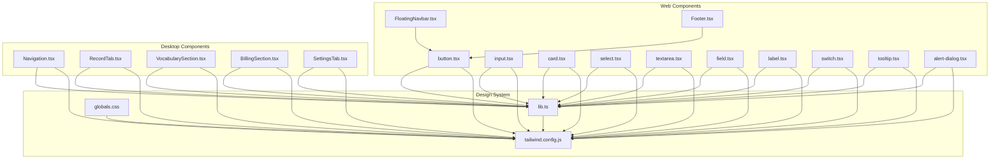
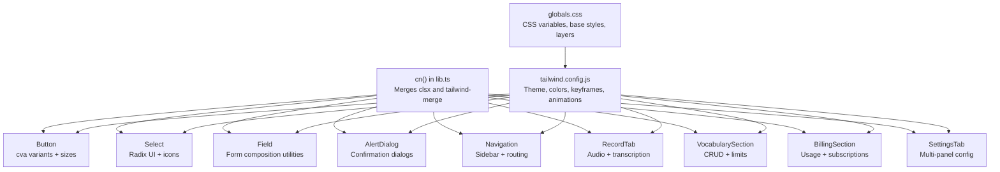
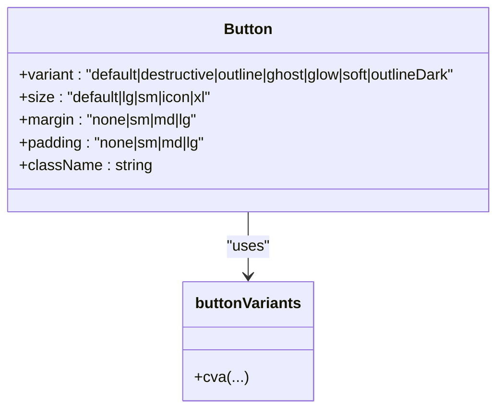
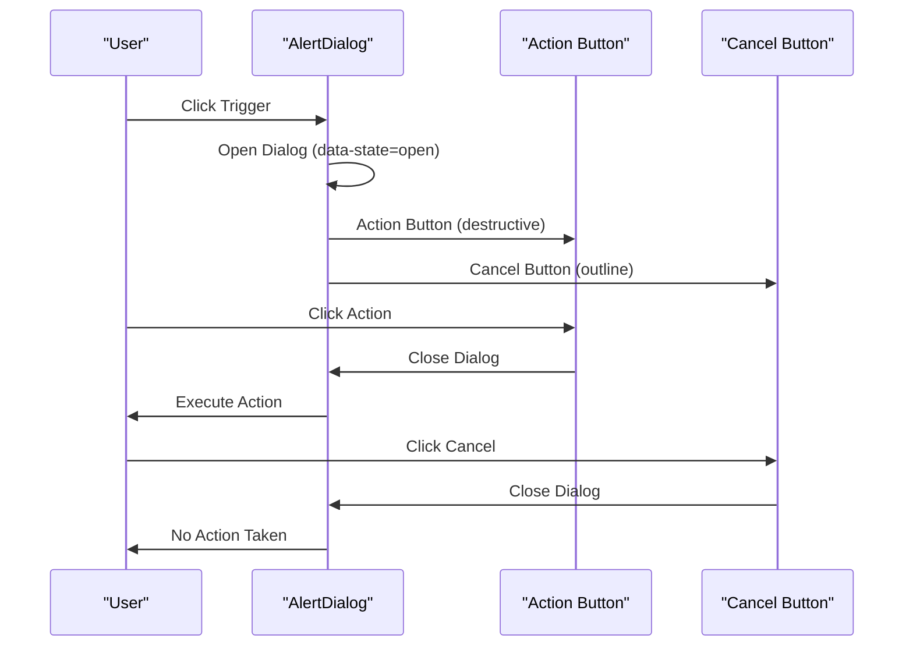
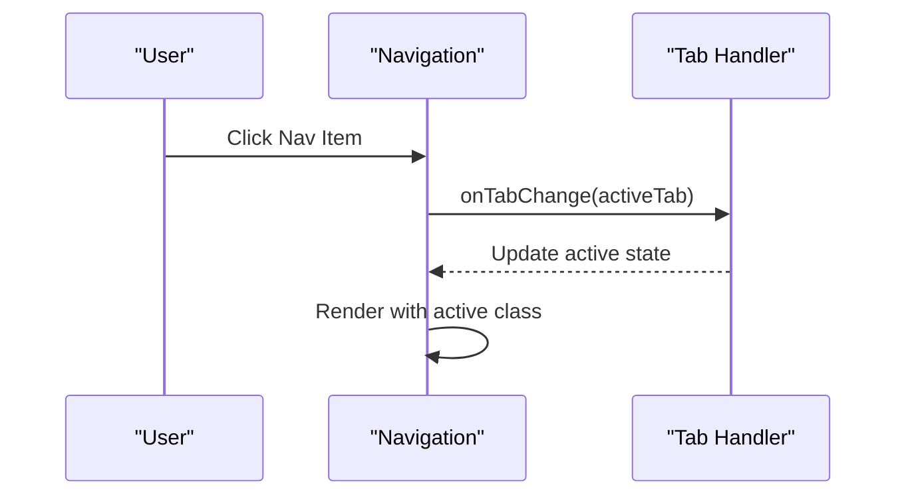
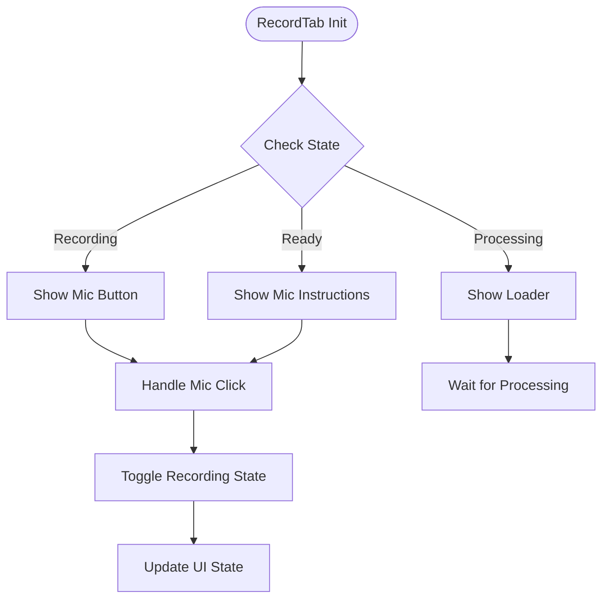
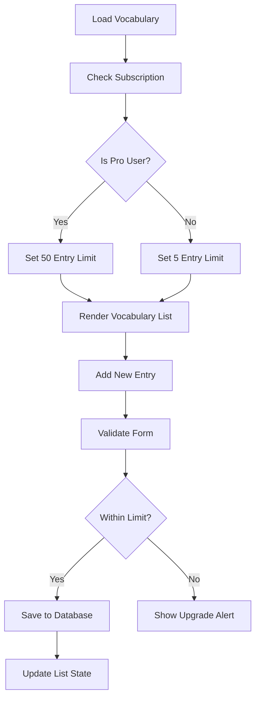
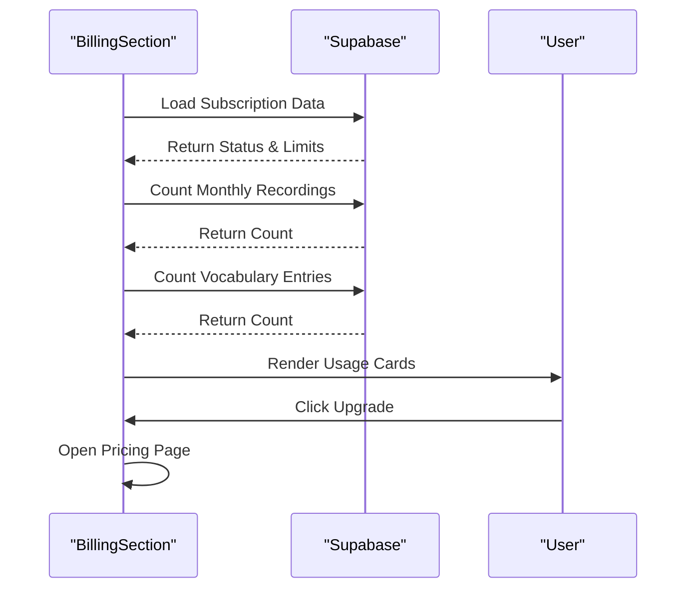
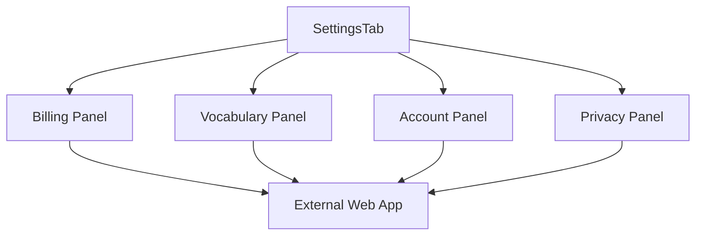
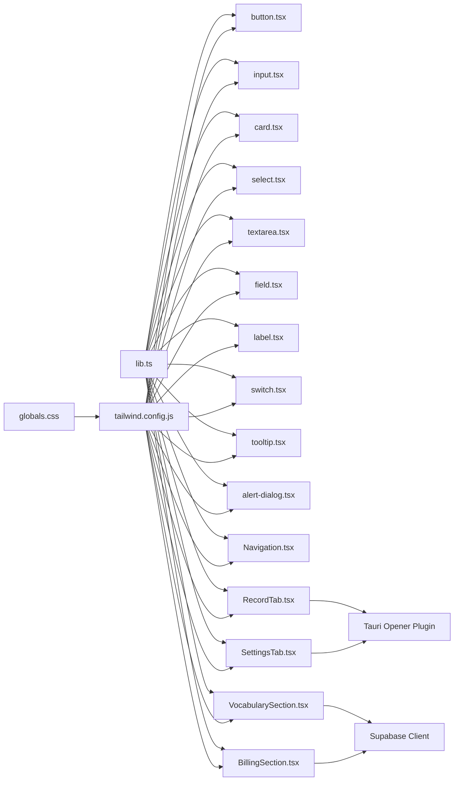

# UI Component Library

<cite>
**Referenced Files in This Document**
- [FloatingNavbar.tsx](file://packages/web/components/shared/FloatingNavbar.tsx)
- [Footer.tsx](file://packages/web/components/shared/Footer.tsx)
- [button.tsx](file://packages/web/components/ui/button.tsx)
- [input.tsx](file://packages/web/components/ui/input.tsx)
- [card.tsx](file://packages/web/components/ui/card.tsx)
- [select.tsx](file://packages/web/components/ui/select.tsx)
- [textarea.tsx](file://packages/web/components/ui/textarea.tsx)
- [field.tsx](file://packages/web/components/ui/field.tsx)
- [label.tsx](file://packages/web/components/ui/label.tsx)
- [switch.tsx](file://packages/web/components/ui/switch.tsx)
- [tooltip.tsx](file://packages/web/components/ui/tooltip.tsx)
- [alert-dialog.tsx](file://packages/web/components/ui/alert-dialog.tsx)
- [lib.ts](file://packages/web/components/ui/lib.ts)
- [Navigation.tsx](file://packages/desktop/src/components/Navigation.tsx)
- [RecordTab.tsx](file://packages/desktop/src/components/RecordTab.tsx)
- [VocabularySection.tsx](file://packages/desktop/src/components/VocabularySection.tsx)
- [BillingSection.tsx](file://packages/desktop/src/components/BillingSection.tsx)
- [SettingsTab.tsx](file://packages/desktop/src/components/SettingsTab.tsx)
- [tailwind.config.js](file://tailwind.config.js)
- [globals.css](file://app/globals.css)
- [index.ts](file://components/settings/index.ts)
</cite>

## Update Summary
**Changes Made**
- Added comprehensive documentation for the new AlertDialog component built on Radix UI primitives
- Integrated AlertDialog into the core component catalog with complete API coverage
- Documented modal dialog functionality for confirmation dialogs and user verification flows
- Added usage examples demonstrating destructive action patterns and confirmation workflows
- Updated component architecture to include comprehensive modal dialog patterns

## Table of Contents
1. [Introduction](#introduction)
2. [Project Structure](#project-structure)
3. [Core Components](#core-components)
4. [Desktop Application Components](#desktop-application-components)
5. [Architecture Overview](#architecture-overview)
6. [Detailed Component Analysis](#detailed-component-analysis)
7. [Component Integration Patterns](#component-integration-patterns)
8. [Dependency Analysis](#dependency-analysis)
9. [Performance Considerations](#performance-considerations)
10. [Troubleshooting Guide](#troubleshooting-guide)
11. [Conclusion](#conclusion)
12. [Appendices](#appendices)

## Introduction
This document describes OSCAR's UI component library, focusing on reusable React components and the underlying design system. The library emphasizes composability, accessibility, and theme consistency using Radix UI primitives and Tailwind CSS. It covers the component catalog (buttons, inputs, cards, selects, textareas, alert dialogs), supporting form field utilities, shared layout components (floating navbar and footer), and new desktop application components including Navigation, RecordTab, VocabularySection, BillingSection, and SettingsTab. Guidance is provided for responsive design, accessibility, theming, animations, customization, and integration patterns across both web and desktop applications.

## Project Structure
The UI components are organized under components/ui and components/shared for web, with dedicated desktop components in packages/desktop/src/components. The desktop application includes specialized components for audio recording, vocabulary management, billing, and settings. A centralized design system configuration exists in Tailwind CSS and global styles with utilities for class merging and component composition.



**Diagram sources**
- [FloatingNavbar.tsx:1-31](file://packages/web/components/shared/FloatingNavbar.tsx#L1-L31)
- [Footer.tsx:1-40](file://packages/web/components/shared/Footer.tsx#L1-L40)
- [button.tsx:1-76](file://packages/web/components/ui/button.tsx#L1-L76)
- [input.tsx:1-23](file://packages/web/components/ui/input.tsx#L1-L23)
- [card.tsx:1-77](file://packages/web/components/ui/card.tsx#L1-L77)
- [select.tsx:1-160](file://packages/web/components/ui/select.tsx#L1-L160)
- [textarea.tsx:1-23](file://packages/web/components/ui/textarea.tsx#L1-L23)
- [field.tsx:1-245](file://packages/web/components/ui/field.tsx#L1-L245)
- [label.tsx:1-27](file://packages/web/components/ui/label.tsx#L1-L27)
- [switch.tsx:1-30](file://packages/web/components/ui/switch.tsx#L1-L30)
- [tooltip.tsx:1-33](file://packages/web/components/ui/tooltip.tsx#L1-L33)
- [alert-dialog.tsx:1-142](file://packages/web/components/ui/alert-dialog.tsx#L1-L142)
- [Navigation.tsx:1-62](file://packages/desktop/src/components/Navigation.tsx#L1-L62)
- [RecordTab.tsx:1-177](file://packages/desktop/src/components/RecordTab.tsx#L1-L177)
- [VocabularySection.tsx:1-323](file://packages/desktop/src/components/VocabularySection.tsx#L1-L323)
- [BillingSection.tsx:1-265](file://packages/desktop/src/components/BillingSection.tsx#L1-L265)
- [SettingsTab.tsx:1-236](file://packages/desktop/src/components/SettingsTab.tsx#L1-L236)
- [lib.ts:1-7](file://packages/web/components/ui/lib.ts#L1-L7)
- [tailwind.config.js:1-101](file://tailwind.config.js#L1-L101)
- [globals.css:1-156](file://app/globals.css#L1-L156)

**Section sources**
- [FloatingNavbar.tsx:1-31](file://packages/web/components/shared/FloatingNavbar.tsx#L1-L31)
- [Footer.tsx:1-40](file://packages/web/components/shared/Footer.tsx#L1-L40)
- [button.tsx:1-76](file://packages/web/components/ui/button.tsx#L1-L76)
- [input.tsx:1-23](file://packages/web/components/ui/input.tsx#L1-L23)
- [card.tsx:1-77](file://packages/web/components/ui/card.tsx#L1-L77)
- [select.tsx:1-160](file://packages/web/components/ui/select.tsx#L1-L160)
- [textarea.tsx:1-23](file://packages/web/components/ui/textarea.tsx#L1-L23)
- [field.tsx:1-245](file://packages/web/components/ui/field.tsx#L1-L245)
- [label.tsx:1-27](file://packages/web/components/ui/label.tsx#L1-L27)
- [switch.tsx:1-30](file://packages/web/components/ui/switch.tsx#L1-L30)
- [tooltip.tsx:1-33](file://packages/web/components/ui/tooltip.tsx#L1-L33)
- [alert-dialog.tsx:1-142](file://packages/web/components/ui/alert-dialog.tsx#L1-L142)
- [Navigation.tsx:1-62](file://packages/desktop/src/components/Navigation.tsx#L1-L62)
- [RecordTab.tsx:1-177](file://packages/desktop/src/components/RecordTab.tsx#L1-L177)
- [VocabularySection.tsx:1-323](file://packages/desktop/src/components/VocabularySection.tsx#L1-L323)
- [BillingSection.tsx:1-265](file://packages/desktop/src/components/BillingSection.tsx#L1-L265)
- [SettingsTab.tsx:1-236](file://packages/desktop/src/components/SettingsTab.tsx#L1-L236)
- [lib.ts:1-7](file://packages/web/components/ui/lib.ts#L1-L7)
- [tailwind.config.js:1-101](file://tailwind.config.js#L1-L101)
- [globals.css:1-156](file://app/globals.css#L1-L156)

## Core Components
This section documents the primary UI components and their capabilities, props, and customization options for both web and desktop applications.

### Web Components
- **Button**
  - Variants: default, destructive, outline, ghost, glow, soft, outlineDark
  - Sizes: default, lg, sm, icon, xl
  - Spacing controls: margin and padding presets
  - Props: inherits ButtonHTMLAttributes; supports variant, size, margin, padding
  - Accessibility: focus-visible ring; disabled state handled
  - Customization: pass additional className; use variant and size to align with design tokens
  - Example usage: see [button.tsx:51-73](file://packages/web/components/ui/button.tsx#L51-L73)

- **Input**
  - Purpose: single-line text input with consistent styling
  - Props: inherits input HTML attributes; forwards ref
  - Customization: extend className for overrides; respects focus and disabled states
  - Example usage: see [input.tsx:5-22](file://packages/web/components/ui/input.tsx#L5-L22)

- **Card**
  - Composition: Card, CardHeader, CardTitle, CardDescription, CardContent, CardFooter
  - Props: forwards HTML attributes; uses semantic wrappers for content
  - Customization: apply className to any part; maintain internal spacing via composition
  - Example usage: see [card.tsx:5-76](file://packages/web/components/ui/card.tsx#L5-L76)

- **Select (Radix UI)**
  - Primitives: Root, Group, Value, Trigger, Content, Label, Item, Separator, ScrollUp/DownButton
  - Features: portal rendering, viewport sizing, keyboard navigation, icons, scrolling
  - Props: Trigger and Content accept className and position; supports popper positioning
  - Animations: open/close transitions via data-[state] attributes
  - Example usage: see [select.tsx:9-159](file://packages/web/components/ui/select.tsx#L9-L159)

- **Textarea**
  - Purpose: multi-line text input with consistent styling
  - Props: inherits textarea HTML attributes; forwards ref
  - Customization: extend className for overrides; respects focus and disabled states
  - Example usage: see [textarea.tsx:5-22](file://packages/web/components/ui/textarea.tsx#L5-L22)

- **Field Utilities (form composition)**
  - Components: FieldSet, FieldLegend, FieldGroup, Field, FieldContent, FieldLabel, FieldTitle, FieldDescription, FieldSeparator, FieldError
  - Orientation: vertical, horizontal, responsive
  - Validation: FieldError renders either children or a list of messages
  - Customization: use data-slot attributes and variants to style nested elements
  - Example usage: see [field.tsx:10-244](file://packages/web/components/ui/field.tsx#L10-L244)

- **Label (Radix UI)**
  - Purpose: accessible label for form controls
  - Props: inherits Label primitive; applies labelVariants
  - Example usage: see [label.tsx:13-26](file://packages/web/components/ui/label.tsx#L13-L26)

- **Switch (Radix UI)**
  - Purpose: toggle control with accessible states
  - Props: inherits Switch primitive; applies thumb translation classes
  - Example usage: see [switch.tsx:8-29](file://packages/web/components/ui/switch.tsx#L8-L29)

- **Tooltip (Radix UI)**
  - Purpose: contextual information on hover/focus
  - Props: TooltipProvider, Tooltip, TooltipTrigger, TooltipContent; supports sideOffset
  - Animations: fade and slide transitions via data-[state] and data-[side]
  - Example usage: see [tooltip.tsx:8-32](file://packages/web/components/ui/tooltip.tsx#L8-L32)

- **AlertDialog (Radix UI)**
  - **Updated** Added comprehensive modal dialog functionality for confirmation dialogs and user verification flows
  - Primitives: Root, Trigger, Portal, Overlay, Content, Header, Footer, Title, Description, Action, Cancel
  - Features: backdrop overlay, centered modal, smooth animations, accessible focus management
  - Props: Content accepts className; Action and Cancel inherit buttonVariants; Title/Description support text styling
  - Animations: fade and zoom transitions via data-[state] attributes
  - Accessibility: Modal semantics, focus trapping, escape key handling, ARIA attributes
  - Use cases: Confirmation dialogs, destructive actions, user verification, critical warnings
  - Example usage: see [alert-dialog.tsx:101-127](file://packages/web/components/ui/alert-dialog.tsx#L101-L127)

- **Shared Layout Components**
  - Floating Navbar: fixed top bar with logo and branding
  - Footer: legal links and copyright
  - Example usage: see [FloatingNavbar.tsx:6-30](file://packages/web/components/shared/FloatingNavbar.tsx#L6-L30), [Footer.tsx:4-39](file://packages/web/components/shared/Footer.tsx#L4-L39)

**Section sources**
- [button.tsx:51-73](file://packages/web/components/ui/button.tsx#L51-L73)
- [input.tsx:5-22](file://packages/web/components/ui/input.tsx#L5-L22)
- [card.tsx:5-76](file://packages/web/components/ui/card.tsx#L5-L76)
- [select.tsx:9-159](file://packages/web/components/ui/select.tsx#L9-L159)
- [textarea.tsx:5-22](file://packages/web/components/ui/textarea.tsx#L5-L22)
- [field.tsx:10-244](file://packages/web/components/ui/field.tsx#L10-L244)
- [label.tsx:13-26](file://packages/web/components/ui/label.tsx#L13-L26)
- [switch.tsx:8-29](file://packages/web/components/ui/switch.tsx#L8-L29)
- [tooltip.tsx:8-32](file://packages/web/components/ui/tooltip.tsx#L8-L32)
- [alert-dialog.tsx:101-127](file://packages/web/components/ui/alert-dialog.tsx#L101-L127)
- [FloatingNavbar.tsx:6-30](file://packages/web/components/shared/FloatingNavbar.tsx#L6-L30)
- [Footer.tsx:4-39](file://packages/web/components/shared/Footer.tsx#L4-L39)

## Desktop Application Components
This section documents the new desktop-specific components that provide core application functionality.

### Navigation Component
A sidebar navigation component that provides tab-based routing for the desktop application.

- **Props**
  - activeTab: "record" | "vocabulary" | "billing" | "settings"
  - onTabChange: (tab: TabType) => void
  - onSignOut: () => void
  - userEmail: string

- **Features**
  - Tab-based navigation with Lucide icons
  - Active tab highlighting with indicator
  - User information display
  - Sign out functionality
  - Responsive sidebar layout

- **Usage Example**
```typescript
<Navigation
  activeTab={activeTab}
  onTabChange={setActiveTab}
  onSignOut={handleSignOut}
  userEmail={userEmail}
/>
```

**Section sources**
- [Navigation.tsx:6-11](file://packages/desktop/src/components/Navigation.tsx#L6-L11)

### RecordTab Component
A comprehensive audio recording interface with transcription capabilities.

- **Props**
  - isRecording: boolean
  - isProcessing: boolean
  - whisperLoaded: boolean
  - transcript: string
  - aiEditing: boolean
  - tonePreset: "none" | "professional" | "casual" | "friendly"
  - dictWords: string[]
  - status: string
  - hotkeyWarning: string

- **Actions**
  - onStartRecording: () => void
  - onStopRecording: () => void
  - onCopyTranscript: () => void
  - onClearTranscript: () => void
  - onToggleAiEditing: () => void
  - onToneChange: (tone: TonePreset) => void

- **Features**
  - Real-time recording status indicators
  - Mic button with recording state
  - AI editing toggle with tone presets
  - Transcript display with copy/clear actions
  - Feature badges for Whisper model and dictionary words
  - Hotkey availability warnings

- **Usage Example**
```typescript
<RecordTab
  isRecording={isRecording}
  isProcessing={isProcessing}
  whisperLoaded={whisperLoaded}
  transcript={transcript}
  aiEditing={aiEditing}
  tonePreset={tonePreset}
  dictWords={dictWords}
  status={status}
  hotkeyWarning={hotkeyWarning}
  onStartRecording={startRecording}
  onStopRecording={stopRecording}
  onCopyTranscript={copyTranscript}
  onClearTranscript={clearTranscript}
  onToggleAiEditing={toggleAiEditing}
  onToneChange={setTonePreset}
/>
```

**Section sources**
- [RecordTab.tsx:5-21](file://packages/desktop/src/components/RecordTab.tsx#L5-L21)

### VocabularySection Component
A vocabulary management system for custom word entries to improve transcription accuracy.

- **Props**
  - userId: string

- **Features**
  - CRUD operations for vocabulary entries
  - Free vs Pro user limits (5 vs 50 entries)
  - Term, pronunciation, and context fields
  - Edit mode with validation
  - Subscription status checking
  - Loading states and error handling

- **Usage Example**
```typescript
<VocabularySection userId={userId} />
```

**Section sources**
- [VocabularySection.tsx:13-15](file://packages/desktop/src/components/VocabularySection.tsx#L13-L15)

### BillingSection Component
A comprehensive billing and subscription management interface.

- **Props**
  - userId: string
  - userEmail: string

- **Features**
  - Subscription status tracking
  - Monthly usage statistics
  - Recording and vocabulary limits
  - Pro vs Free plan comparison
  - External billing portal integration
  - Usage percentage calculations

- **Usage Example**
```typescript
<BillingSection userId={userId} userEmail={userEmail} />
```

**Section sources**
- [BillingSection.tsx:8-11](file://packages/desktop/src/components/BillingSection.tsx#L8-L11)

### SettingsTab Component
A multi-panel settings interface for application configuration.

- **Props**
  - whisperModelPath: string
  - autoPaste: boolean
  - aiEditing: boolean
  - tonePreset: "none" | "professional" | "casual" | "friendly"
  - userApiKey: string
  - whisperLoaded: boolean
  - onModelPathChange: (path: string) => void
  - onLoadModel: () => void
  - onAutoPasteChange: (value: boolean) => void
  - onAiEditingChange: (value: boolean) => void
  - onTonePresetChange: (tone: TonePreset) => void
  - onApiKeyChange: (key: string) => void
  - onSaveApiKey: () => void
  - onClearData: () => void
  - userEmail?: string

- **Sub-tabs**
  - Billing: Subscription management
  - Vocabulary: Personal dictionary
  - Account: Profile information
  - Privacy: Data export and legal

- **Usage Example**
```typescript
<SettingsTab
  whisperModelPath={whisperModelPath}
  autoPaste={autoPaste}
  aiEditing={aiEditing}
  tonePreset={tonePreset}
  userApiKey={userApiKey}
  whisperLoaded={whisperLoaded}
  onModelPathChange={setModelPath}
  onLoadModel={loadModel}
  onAutoPasteChange={setAutoPaste}
  onAiEditingChange={setAiEditing}
  onTonePresetChange={setTonePreset}
  onApiKeyChange={setApiKey}
  onSaveApiKey={saveApiKey}
  onClearData={clearData}
  userEmail={userEmail}
/>
```

**Section sources**
- [SettingsTab.tsx:7-23](file://packages/desktop/src/components/SettingsTab.tsx#L7-L23)

## Architecture Overview
The design system centers on:
- Utility-first styling with Tailwind CSS and a custom cn() merger
- Theme tokens defined via CSS variables and extended in Tailwind
- Accessible UI primitives from Radix UI integrated with Tailwind classes
- Component composition patterns that separate structure from styling
- Desktop-specific component patterns for complex workflows



**Diagram sources**
- [lib.ts:4-6](file://packages/web/components/ui/lib.ts#L4-L6)
- [tailwind.config.js:9-98](file://tailwind.config.js#L9-L98)
- [globals.css:47-118](file://app/globals.css#L47-L118)
- [button.tsx:7-49](file://packages/web/components/ui/button.tsx#L7-L49)
- [select.tsx:73-98](file://packages/web/components/ui/select.tsx#L73-L98)
- [field.tsx:57-79](file://packages/web/components/ui/field.tsx#L57-L79)
- [alert-dialog.tsx:101-127](file://packages/web/components/ui/alert-dialog.tsx#L101-L127)
- [Navigation.tsx:13-19](file://packages/desktop/src/components/Navigation.tsx#L13-L19)
- [RecordTab.tsx:23-39](file://packages/desktop/src/components/RecordTab.tsx#L23-L39)
- [VocabularySection.tsx:19-40](file://packages/desktop/src/components/VocabularySection.tsx#L19-L40)
- [BillingSection.tsx:28-43](file://packages/desktop/src/components/BillingSection.tsx#L28-L43)
- [SettingsTab.tsx:25-42](file://packages/desktop/src/components/SettingsTab.tsx#L25-L42)

## Detailed Component Analysis

### Button Component
- **Implementation pattern**: class-variance-authority (cva) for variants and sizes; cn() merges defaults with overrides
- **States and interactions**: hover, focus-visible ring, disabled pointer-events and opacity
- **Customization**: variant, size, margin, padding; additional className
- **Accessibility**: focus-visible ring; disabled state prevents interaction
- **Composition**: integrates with icons and spacing via gap and padding props



**Diagram sources**
- [button.tsx:7-49](file://packages/web/components/ui/button.tsx#L7-L49)
- [button.tsx:51-73](file://packages/web/components/ui/button.tsx#L51-L73)

**Section sources**
- [button.tsx:7-49](file://packages/web/components/ui/button.tsx#L7-L49)
- [button.tsx:51-73](file://packages/web/components/ui/button.tsx#L51-L73)

### AlertDialog Component
- **Implementation pattern**: Radix UI AlertDialog primitives with Tailwind CSS styling
- **Primitives**: Root, Trigger, Portal, Overlay, Content, Header, Footer, Title, Description, Action, Cancel
- **State management**: Open/close state via data-[state] attributes; automatic focus management
- **Animations**: Fade and zoom transitions; slide-in/slide-out effects
- **Accessibility**: Modal semantics, focus trapping, escape key handling, ARIA attributes
- **Integration**: Action buttons inherit buttonVariants for consistent styling
- **Usage patterns**: Confirmation dialogs, destructive actions, user verification flows



**Diagram sources**
- [alert-dialog.tsx:101-127](file://packages/web/components/ui/alert-dialog.tsx#L101-L127)
- [alert-dialog.tsx:130-141](file://packages/web/components/ui/alert-dialog.tsx#L130-L141)

**Section sources**
- [alert-dialog.tsx:101-127](file://packages/web/components/ui/alert-dialog.tsx#L101-L127)
- [alert-dialog.tsx:130-141](file://packages/web/components/ui/alert-dialog.tsx#L130-L141)

### Navigation Component
- **Implementation pattern**: icon-driven sidebar with active state management
- **State management**: active tab tracking, user information display
- **Integration**: event handlers for tab changes and sign out
- **Styling**: CSS classes for active indicators and responsive layout



**Diagram sources**
- [Navigation.tsx:30-46](file://packages/desktop/src/components/Navigation.tsx#L30-L46)

**Section sources**
- [Navigation.tsx:13-19](file://packages/desktop/src/components/Navigation.tsx#L13-L19)

### RecordTab Component
- **Complex state management**: recording, processing, AI editing states
- **Real-time feedback**: status indicators, feature badges, loading states
- **User interactions**: mic button, AI editing toggle, action buttons
- **External integrations**: Whisper model, AI editing services



**Diagram sources**
- [RecordTab.tsx:47-83](file://packages/desktop/src/components/RecordTab.tsx#L47-L83)
- [RecordTab.tsx:113-141](file://packages/desktop/src/components/RecordTab.tsx#L113-L141)

**Section sources**
- [RecordTab.tsx:23-39](file://packages/desktop/src/components/RecordTab.tsx#L23-L39)

### VocabularySection Component
- **CRUD operations**: add, edit, delete vocabulary entries
- **State management**: loading states, form validation, edit modes
- **Business logic**: free vs Pro user limits, subscription checking
- **Data persistence**: Supabase integration for CRUD operations



**Diagram sources**
- [VocabularySection.tsx:36-54](file://packages/desktop/src/components/VocabularySection.tsx#L36-L54)
- [VocabularySection.tsx:73-109](file://packages/desktop/src/components/VocabularySection.tsx#L73-L109)

**Section sources**
- [VocabularySection.tsx:19-40](file://packages/desktop/src/components/VocabularySection.tsx#L19-L40)

### BillingSection Component
- **Data aggregation**: subscription status, usage statistics, limits
- **External integrations**: Supabase for data, Tauri opener for external URLs
- **Calculations**: usage percentages, date formatting
- **User actions**: upgrade to Pro, external billing portal



**Diagram sources**
- [BillingSection.tsx:41-88](file://packages/desktop/src/components/BillingSection.tsx#L41-L88)

**Section sources**
- [BillingSection.tsx:28-43](file://packages/desktop/src/components/BillingSection.tsx#L28-L43)

### SettingsTab Component
- **Multi-panel architecture**: sub-tabs for different settings categories
- **External integration**: opens external web app for certain settings
- **Danger zone**: account deletion and data clearing
- **State management**: active sub-tab tracking



**Diagram sources**
- [SettingsTab.tsx:57-77](file://packages/desktop/src/components/SettingsTab.tsx#L57-L77)
- [SettingsTab.tsx:82-104](file://packages/desktop/src/components/SettingsTab.tsx#L82-L104)

**Section sources**
- [SettingsTab.tsx:25-42](file://packages/desktop/src/components/SettingsTab.tsx#L25-L42)

## Component Integration Patterns
The desktop application follows specific integration patterns for complex workflows:

### Navigation Integration
- Navigation component manages tab state and routes to appropriate sections
- Each tab corresponds to a specific component (RecordTab, VocabularySection, BillingSection, SettingsTab)
- User authentication state affects available navigation options

### AlertDialog Integration Patterns
- **Confirmation dialogs**: Use AlertDialog for destructive actions like account deletion
- **User verification**: Implement verification flows before critical operations
- **Consistent styling**: Action buttons inherit buttonVariants for uniform appearance
- **Accessibility**: Proper focus management and ARIA attributes maintained

### State Management Patterns
- **Local state**: Simple UI state (active tabs, form inputs)
- **Global state**: Complex application state (user data, subscription info)
- **External state**: Database state (vocabulary entries, recordings)
- **Event-driven updates**: Callback functions for user interactions

### Data Flow Patterns
- **Top-down props**: Parent components pass data and callbacks
- **Bottom-up events**: Child components trigger parent handlers
- **External APIs**: Database and external service integrations
- **Real-time updates**: Status indicators and loading states

**Section sources**
- [Navigation.tsx:13-19](file://packages/desktop/src/components/Navigation.tsx#L13-L19)
- [alert-dialog.tsx:101-127](file://packages/web/components/ui/alert-dialog.tsx#L101-L127)
- [RecordTab.tsx:23-39](file://packages/desktop/src/components/RecordTab.tsx#L23-L39)
- [VocabularySection.tsx:19-40](file://packages/desktop/src/components/VocabularySection.tsx#L19-L40)
- [BillingSection.tsx:28-43](file://packages/desktop/src/components/BillingSection.tsx#L28-L43)
- [SettingsTab.tsx:25-42](file://packages/desktop/src/components/SettingsTab.tsx#L25-L42)

## Dependency Analysis
- **Component dependencies**
  - All UI components depend on cn() from lib.ts for class merging
  - Tailwind utilities derive from tailwind.config.js and globals.css
  - Radix UI primitives power Select, Tooltip, Switch, Label, and AlertDialog
  - Desktop components integrate with external libraries (Lucide icons, Tauri plugins)
- **Desktop-specific dependencies**
  - Supabase for database operations
  - Tauri opener plugin for external URL opening
  - Lucide React for icons
- **Coupling and cohesion**
  - High cohesion within components; low coupling via cn() and Tailwind tokens
  - Shared utilities minimize duplication across components
  - Desktop components maintain separation between UI and business logic



**Diagram sources**
- [lib.ts:4-6](file://packages/web/components/ui/lib.ts#L4-L6)
- [tailwind.config.js:9-98](file://tailwind.config.js#L9-L98)
- [globals.css:47-118](file://app/globals.css#L47-L118)
- [button.tsx:5-6](file://packages/web/components/ui/button.tsx#L5-L6)
- [input.tsx](file://packages/web/components/ui/input.tsx#L3)
- [card.tsx](file://packages/web/components/ui/card.tsx#L3)
- [select.tsx](file://packages/web/components/ui/select.tsx#L7)
- [textarea.tsx](file://packages/web/components/ui/textarea.tsx#L3)
- [field.tsx](file://packages/web/components/ui/field.tsx#L6)
- [label.tsx](file://packages/web/components/ui/label.tsx#L7)
- [switch.tsx](file://packages/web/components/ui/switch.tsx#L6)
- [tooltip.tsx](file://packages/web/components/ui/tooltip.tsx#L6)
- [alert-dialog.tsx](file://packages/web/components/ui/alert-dialog.tsx#L4)
- [Navigation.tsx:1-2](file://packages/desktop/src/components/Navigation.tsx#L1-L2)
- [RecordTab.tsx](file://packages/desktop/src/components/RecordTab.tsx#L1)
- [VocabularySection.tsx](file://packages/desktop/src/components/VocabularySection.tsx#L3)
- [BillingSection.tsx](file://packages/desktop/src/components/BillingSection.tsx#L4)
- [SettingsTab.tsx](file://packages/desktop/src/components/SettingsTab.tsx#L4)

**Section sources**
- [lib.ts:4-6](file://packages/web/components/ui/lib.ts#L4-L6)
- [tailwind.config.js:9-98](file://tailwind.config.js#L9-L98)
- [globals.css:47-118](file://app/globals.css#L47-L118)
- [button.tsx:5-6](file://packages/web/components/ui/button.tsx#L5-L6)
- [input.tsx](file://packages/web/components/ui/input.tsx#L3)
- [card.tsx](file://packages/web/components/ui/card.tsx#L3)
- [select.tsx](file://packages/web/components/ui/select.tsx#L7)
- [textarea.tsx](file://packages/web/components/ui/textarea.tsx#L3)
- [field.tsx](file://packages/web/components/ui/field.tsx#L6)
- [label.tsx](file://packages/web/components/ui/label.tsx#L7)
- [switch.tsx](file://packages/web/components/ui/switch.tsx#L6)
- [tooltip.tsx](file://packages/web/components/ui/tooltip.tsx#L6)
- [alert-dialog.tsx](file://packages/web/components/ui/alert-dialog.tsx#L4)
- [Navigation.tsx:1-2](file://packages/desktop/src/components/Navigation.tsx#L1-L2)
- [RecordTab.tsx](file://packages/desktop/src/components/RecordTab.tsx#L1)
- [VocabularySection.tsx](file://packages/desktop/src/components/VocabularySection.tsx#L3)
- [BillingSection.tsx](file://packages/desktop/src/components/BillingSection.tsx#L4)
- [SettingsTab.tsx](file://packages/desktop/src/components/SettingsTab.tsx#L4)

## Performance Considerations
- **Prefer className over inline styles** to leverage CSS specificity and reduce reflows
- **Use cn() to merge classes efficiently**; avoid excessive conditional class concatenation
- **Limit heavy animations on low-end devices**; keep transitions short (as seen in accordion keyframes)
- **Defer non-critical images** (e.g., logos) with lazy loading where appropriate
- **Keep component trees shallow**; compose smaller, focused components to minimize re-renders
- **Optimize database queries** in desktop components (batch operations, caching)
- **Implement proper loading states** for async operations (vocabulary, billing data)
- **Use memoization** for expensive calculations (usage percentages, date formatting)
- **AlertDialog animations**: Smooth fade and zoom transitions; consider disabling for low-power devices

## Troubleshooting Guide
- **Button disabled state not working**
  - Ensure disabled prop is passed; verify pointer-events and opacity classes are applied
  - Reference: [button.tsx:8-49](file://packages/web/components/ui/button.tsx#L8-L49)
- **Select dropdown not visible**
  - Confirm Portal rendering and z-index; verify position and viewport classes
  - Reference: [select.tsx:70-99](file://packages/web/components/ui/select.tsx#L70-L99)
- **FieldError not rendering**
  - Provide either children or an errors array with message fields
  - Reference: [field.tsx:186-231](file://packages/web/components/ui/field.tsx#L186-L231)
- **Tooltip not appearing**
  - Wrap content with TooltipProvider and ensure TooltipTrigger is used
  - Reference: [tooltip.tsx:8-32](file://packages/web/components/ui/tooltip.tsx#L8-L32)
- **AlertDialog not opening**
  - Verify AlertDialogTrigger is wrapped around actionable element
  - Check that Root component wraps the entire dialog structure
  - Ensure Portal is rendering in DOM
  - Reference: [alert-dialog.tsx:101-127](file://packages/web/components/ui/alert-dialog.tsx#L101-L127)
- **AlertDialog action buttons not styled**
  - Confirm Action and Cancel components inherit buttonVariants
  - Verify variant prop is passed correctly
  - Reference: [alert-dialog.tsx:101-127](file://packages/web/components/ui/alert-dialog.tsx#L101-L127)
- **Navigation tab not changing**
  - Verify onTabChange handler is properly passed and called
  - Check activeTab prop binding
  - Reference: [Navigation.tsx:30-46](file://packages/desktop/src/components/Navigation.tsx#L30-L46)
- **RecordTab microphone not responding**
  - Check whisperLoaded state and disabled conditions
  - Verify onStartRecording/onStopRecording handlers
  - Reference: [RecordTab.tsx:68-72](file://packages/desktop/src/components/RecordTab.tsx#L68-L72)
- **VocabularySection not loading entries**
  - Verify userId prop and Supabase connection
  - Check subscription status affecting limits
  - Reference: [VocabularySection.tsx:36-71](file://packages/desktop/src/components/VocabularySection.tsx#L36-L71)
- **BillingSection data not displaying**
  - Ensure userId prop and database permissions
  - Check subscription table structure
  - Reference: [BillingSection.tsx:41-88](file://packages/desktop/src/components/BillingSection.tsx#L41-L88)
- **SettingsTab external links not opening**
  - Verify Tauri opener plugin installation
  - Check URL validity and browser permissions
  - Reference: [SettingsTab.tsx:96-101](file://packages/desktop/src/components/SettingsTab.tsx#L96-L101)
- **Theming inconsistencies**
  - Verify CSS variables in :root and .dark; confirm Tailwind theme.extend matches tokens
  - Reference: [globals.css:65-117](file://app/globals.css#L65-L117), [tailwind.config.js:22-74](file://tailwind.config.js#L22-L74)

**Section sources**
- [button.tsx:8-49](file://packages/web/components/ui/button.tsx#L8-L49)
- [select.tsx:70-99](file://packages/web/components/ui/select.tsx#L70-L99)
- [field.tsx:186-231](file://packages/web/components/ui/field.tsx#L186-L231)
- [tooltip.tsx:8-32](file://packages/web/components/ui/tooltip.tsx#L8-L32)
- [alert-dialog.tsx:101-127](file://packages/web/components/ui/alert-dialog.tsx#L101-L127)
- [Navigation.tsx:30-46](file://packages/desktop/src/components/Navigation.tsx#L30-L46)
- [RecordTab.tsx:68-72](file://packages/desktop/src/components/RecordTab.tsx#L68-L72)
- [VocabularySection.tsx:36-71](file://packages/desktop/src/components/VocabularySection.tsx#L36-L71)
- [BillingSection.tsx:41-88](file://packages/desktop/src/components/BillingSection.tsx#L41-L88)
- [SettingsTab.tsx:96-101](file://packages/desktop/src/components/SettingsTab.tsx#L96-L101)
- [globals.css:65-117](file://app/globals.css#L65-L117)
- [tailwind.config.js:22-74](file://tailwind.config.js#L22-L74)

## Conclusion
OSCAR's UI component library combines Radix UI primitives with Tailwind CSS to deliver accessible, theme-consistent, and customizable components across both web and desktop applications. The design system emphasizes composability, clear state handling, and responsive behavior. The addition of the AlertDialog component significantly enhances the library's capability to handle confirmation dialogs and user verification flows with comprehensive accessibility and animation support. The integration of desktop-specific components (Navigation, RecordTab, VocabularySection, BillingSection, SettingsTab) demonstrates the library's extensibility and ability to handle complex application workflows. By leveraging the provided utilities and patterns, teams can build consistent interfaces while maintaining flexibility for customization and advanced use cases in both environments.

## Appendices

### Responsive Design Guidelines
- **Use responsive variants in Field** (responsive orientation) and component sizes (e.g., sm/lg/xl)
- **Prefer container queries and @media utilities sparingly**; rely on component variants when possible
- **Test breakpoints across mobile, tablet, and desktop layouts**
- **Desktop components should adapt to different screen sizes** while maintaining functionality
- **AlertDialog**: Centered modal with max-width constraints; responsive padding and spacing

### Accessibility Compliance
- **Buttons**: ensure focus-visible rings and disabled states
- **Inputs/Labels**: pair labels with inputs for screen readers
- **Select/Tooltip/Switch**: use Radix UI primitives for native keyboard and ARIA support
- **AlertDialog**: modal semantics, focus trapping, escape key handling, ARIA attributes
- **Navigation**: ensure keyboard navigation and screen reader compatibility
- **RecordTab**: provide proper ARIA labels for recording status
- **VocabularySection**: ensure form validation feedback is accessible
- **BillingSection**: provide clear usage information for assistive technologies
- **SettingsTab**: ensure proper heading hierarchy and navigation landmarks
- References: [button.tsx:8-49](file://packages/web/components/ui/button.tsx#L8-L49), [label.tsx:13-26](file://packages/web/components/ui/label.tsx#L13-L26), [select.tsx:15-33](file://packages/web/components/ui/select.tsx#L15-L33), [tooltip.tsx:14-32](file://packages/web/components/ui/tooltip.tsx#L14-L32), [alert-dialog.tsx:101-127](file://packages/web/components/ui/alert-dialog.tsx#L101-L127), [Navigation.tsx:13-19](file://packages/desktop/src/components/Navigation.tsx#L13-L19), [RecordTab.tsx:23-39](file://packages/desktop/src/components/RecordTab.tsx#L23-L39), [VocabularySection.tsx:19-40](file://packages/desktop/src/components/VocabularySection.tsx#L19-L40), [BillingSection.tsx:28-43](file://packages/desktop/src/components/BillingSection.tsx#L28-L43), [SettingsTab.tsx:25-42](file://packages/desktop/src/components/SettingsTab.tsx#L25-L42)

### Theming Support
- **Centralized tokens via CSS variables** in :root and .dark
- **Tailwind theme.extend mirrors CSS variables** for color and radius scales
- **Use variant props to align with theme**; avoid hardcoding colors outside tokens
- **AlertDialog Action buttons inherit buttonVariants** for consistent styling
- **Desktop components should respect system theme preferences**
- **Consistent iconography using Lucide React** across all components
- References: [globals.css:65-117](file://app/globals.css#L65-L117), [tailwind.config.js:22-74](file://tailwind.config.js#L22-L74), [alert-dialog.tsx:101-127](file://packages/web/components/ui/alert-dialog.tsx#L101-L127)

### Animation and Transitions
- **Accordion-like transitions defined via keyframes** and animation shortcuts
- **Tooltip and Select use data-[state] and data-[side]** for smooth enter/exit animations
- **AlertDialog uses fade and zoom transitions** with slide-in/slide-out effects
- **RecordTab includes spin animations** for loading states
- **Navigation provides smooth active state transitions**
- **Desktop components should balance visual feedback with performance**
- References: [tailwind.config.js:75-96](file://tailwind.config.js#L75-L96), [select.tsx:73-98](file://packages/web/components/ui/select.tsx#L73-L98), [tooltip.tsx:17-29](file://packages/web/components/ui/tooltip.tsx#L17-L29), [alert-dialog.tsx:30-46](file://packages/web/components/ui/alert-dialog.tsx#L30-L46), [RecordTab.tsx:74-76](file://packages/desktop/src/components/RecordTab.tsx#L74-L76), [Navigation.tsx:35-42](file://packages/desktop/src/components/Navigation.tsx#L35-L42)

### Cross-Browser Compatibility
- **Use Tailwind utilities and Radix UI primitives** for consistent behavior across browsers
- **Validate focus styles and keyboard interactions** on target browsers
- **Avoid vendor-prefixed CSS**; rely on Tailwind's autoprefixing via PostCSS
- **Desktop application requires Tauri runtime compatibility**
- **AlertDialog animations**: Smooth transitions supported across modern browsers
- **External integrations should handle browser differences gracefully**

### Integration Patterns
- **Compose Field with Input/Select/Textarea/Label** for forms
- **Use Button variants to communicate intent**; pair destructive actions with AlertDialog
- **Combine Tooltip with actionable elements** for contextual help
- **AlertDialog for destructive actions**: Confirmation dialogs with proper styling inheritance
- **Desktop components should follow separation of concerns** between UI and business logic
- **Use callback patterns for state management** across component boundaries
- **Implement proper error handling** for external API integrations
- References: [field.tsx:10-244](file://packages/web/components/ui/field.tsx#L10-L244), [button.tsx:10-48](file://packages/web/components/ui/button.tsx#L10-L48), [tooltip.tsx:14-32](file://packages/web/components/ui/tooltip.tsx#L14-L32), [alert-dialog.tsx:101-127](file://packages/web/components/ui/alert-dialog.tsx#L101-L127), [Navigation.tsx:13-19](file://packages/desktop/src/components/Navigation.tsx#L13-L19), [RecordTab.tsx:23-39](file://packages/desktop/src/components/RecordTab.tsx#L23-L39), [VocabularySection.tsx:19-40](file://packages/desktop/src/components/VocabularySection.tsx#L19-L40), [BillingSection.tsx:28-43](file://packages/desktop/src/components/BillingSection.tsx#L28-L43), [SettingsTab.tsx:25-42](file://packages/desktop/src/components/SettingsTab.tsx#L25-L42)

### Desktop-Specific Considerations
- **State persistence** across application restarts
- **File system integration** for model paths and data storage
- **System notifications** for recording status and completion
- **Hardware integration** for microphone and audio processing
- **External service coordination** with web application features
- **Performance optimization** for real-time audio processing
- **Security considerations** for user data and API keys
- **AlertDialog accessibility**: Proper focus management and ARIA attributes for confirmation flows