# UI Component Library

<cite>
**Referenced Files in This Document**
- [FloatingNavbar.tsx](file://packages/web/components/shared/FloatingNavbar.tsx)
- [Footer.tsx](file://packages/web/components/shared/Footer.tsx)
- [button.tsx](file://packages/web/components/ui/button.tsx)
- [input.tsx](file://packages/web/components/ui/input.tsx)
- [card.tsx](file://packages/web/components/ui/card.tsx)
- [select.tsx](file://packages/web/components/ui/select.tsx)
- [textarea.tsx](file://packages/web/components/ui/textarea.tsx)
- [field.tsx](file://packages/web/components/ui/field.tsx)
- [label.tsx](file://packages/web/components/ui/label.tsx)
- [switch.tsx](file://packages/web/components/ui/switch.tsx)
- [tooltip.tsx](file://packages/web/components/ui/tooltip.tsx)
- [alert-dialog.tsx](file://packages/web/components/ui/alert-dialog.tsx)
- [lib.ts](file://packages/web/components/ui/lib.ts)
- [Navigation.tsx](file://packages/desktop/src/components/Navigation.tsx)
- [NotesTab.tsx](file://packages/desktop/src/components/NotesTab.tsx)
- [NoteCard.tsx](file://packages/desktop/src/components/NoteCard.tsx)
- [TrashPanel.tsx](file://packages/desktop/src/components/TrashPanel.tsx)
- [UpdateNotification.tsx](file://packages/desktop/src/components/UpdateNotification.tsx)
- [Header.tsx](file://packages/desktop/src/components/Header.tsx)
- [useUpdater.ts](file://packages/desktop/src/hooks/useUpdater.ts)
- [VocabularySection.tsx](file://packages/desktop/src/components/VocabularySection.tsx)
- [BillingSection.tsx](file://packages/desktop/src/components/BillingSection.tsx)
- [SettingsTab.tsx](file://packages/desktop/src/components/SettingsTab.tsx)
- [tailwind.config.js](file://tailwind.config.js)
- [globals.css](file://app/globals.css)
- [index.ts](file://components/settings/index.ts)
</cite>

## Update Summary
**Changes Made**
- Added comprehensive documentation for new desktop components: NotesTab, NoteCard, TrashPanel, UpdateNotification, and Header
- Documented the useUpdater hook for application update management
- Removed RecordTab component documentation as it has been replaced with NotesTab
- Updated Navigation component to reflect the removal of the record tab
- Enhanced SettingsTab documentation with new sub-tabs and external integration patterns
- Added usage examples for new components with props, events, and customization options
- Updated component architecture to include notes-focused workflows and update management

## Table of Contents
1. [Introduction](#introduction)
2. [Project Structure](#project-structure)
3. [Core Components](#core-components)
4. [Desktop Application Components](#desktop-application-components)
5. [Architecture Overview](#architecture-overview)
6. [Detailed Component Analysis](#detailed-component-analysis)
7. [Component Integration Patterns](#component-integration-patterns)
8. [Dependency Analysis](#dependency-analysis)
9. [Performance Considerations](#performance-considerations)
10. [Troubleshooting Guide](#troubleshooting-guide)
11. [Conclusion](#conclusion)
12. [Appendices](#appendices)

## Introduction
This document describes OSCAR's UI component library, focusing on reusable React components and the underlying design system. The library emphasizes composability, accessibility, and theme consistency using Radix UI primitives and Tailwind CSS. It covers the component catalog (buttons, inputs, cards, selects, textareas, alert dialogs), supporting form field utilities, shared layout components (floating navbar and footer), and new desktop application components including Navigation, NotesTab, NoteCard, TrashPanel, UpdateNotification, Header, and SettingsTab. The library now features a notes-focused workflow replacing the previous recording-centric approach, with comprehensive update management and user authentication components. Guidance is provided for responsive design, accessibility, theming, animations, customization, and integration patterns across both web and desktop applications.

## Project Structure
The UI components are organized under components/ui and components/shared for web, with dedicated desktop components in packages/desktop/src/components. The desktop application now focuses on notes management with specialized components for note listing, individual note viewing, trash management, user authentication, and update notifications. A centralized design system configuration exists in Tailwind CSS and global styles with utilities for class merging and component composition.

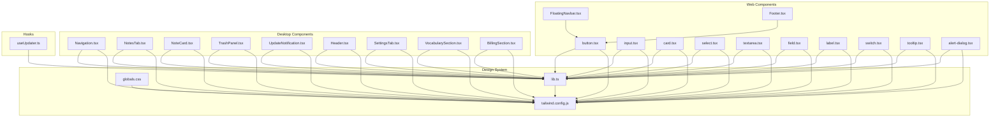

**Diagram sources**
- [FloatingNavbar.tsx:1-31](file://packages/web/components/shared/FloatingNavbar.tsx#L1-L31)
- [Footer.tsx:1-40](file://packages/web/components/shared/Footer.tsx#L1-L40)
- [button.tsx:1-76](file://packages/web/components/ui/button.tsx#L1-L76)
- [input.tsx:1-23](file://packages/web/components/ui/input.tsx#L1-L23)
- [card.tsx:1-77](file://packages/web/components/ui/card.tsx#L1-L77)
- [select.tsx:1-160](file://packages/web/components/ui/select.tsx#L1-L160)
- [textarea.tsx:1-23](file://packages/web/components/ui/textarea.tsx#L1-L23)
- [field.tsx:1-245](file://packages/web/components/ui/field.tsx#L1-L245)
- [label.tsx:1-27](file://packages/web/components/ui/label.tsx#L1-L27)
- [switch.tsx:1-30](file://packages/web/components/ui/switch.tsx#L1-L30)
- [tooltip.tsx:1-33](file://packages/web/components/ui/tooltip.tsx#L1-L33)
- [alert-dialog.tsx:1-142](file://packages/web/components/ui/alert-dialog.tsx#L1-L142)
- [Navigation.tsx:1-91](file://packages/desktop/src/components/Navigation.tsx#L1-L91)
- [NotesTab.tsx:1-416](file://packages/desktop/src/components/NotesTab.tsx#L1-L416)
- [NoteCard.tsx:1-85](file://packages/desktop/src/components/NoteCard.tsx#L1-L85)
- [TrashPanel.tsx:1-153](file://packages/desktop/src/components/TrashPanel.tsx#L1-L153)
- [UpdateNotification.tsx:1-91](file://packages/desktop/src/components/UpdateNotification.tsx#L1-L91)
- [Header.tsx:1-91](file://packages/desktop/src/components/Header.tsx#L1-L91)
- [SettingsTab.tsx:1-248](file://packages/desktop/src/components/SettingsTab.tsx#L1-L248)
- [VocabularySection.tsx:1-323](file://packages/desktop/src/components/VocabularySection.tsx#L1-L323)
- [BillingSection.tsx:1-265](file://packages/desktop/src/components/BillingSection.tsx#L1-L265)
- [useUpdater.ts:1-129](file://packages/desktop/src/hooks/useUpdater.ts#L1-L129)
- [lib.ts:1-7](file://packages/web/components/ui/lib.ts#L1-L7)
- [tailwind.config.js:1-101](file://tailwind.config.js#L1-L101)
- [globals.css:1-156](file://app/globals.css#L1-L156)

**Section sources**
- [FloatingNavbar.tsx:1-31](file://packages/web/components/shared/FloatingNavbar.tsx#L1-L31)
- [Footer.tsx:1-40](file://packages/web/components/shared/Footer.tsx#L1-L40)
- [button.tsx:1-76](file://packages/web/components/ui/button.tsx#L1-L76)
- [input.tsx:1-23](file://packages/web/components/ui/input.tsx#L1-L23)
- [card.tsx:1-77](file://packages/web/components/ui/card.tsx#L1-L77)
- [select.tsx:1-160](file://packages/web/components/ui/select.tsx#L1-L160)
- [textarea.tsx:1-23](file://packages/web/components/ui/textarea.tsx#L1-L23)
- [field.tsx:1-245](file://packages/web/components/ui/field.tsx#L1-L245)
- [label.tsx:1-27](file://packages/web/components/ui/label.tsx#L1-L27)
- [switch.tsx:1-30](file://packages/web/components/ui/switch.tsx#L1-L30)
- [tooltip.tsx:1-33](file://packages/web/components/ui/tooltip.tsx#L1-L33)
- [alert-dialog.tsx:1-142](file://packages/web/components/ui/alert-dialog.tsx#L1-L142)
- [Navigation.tsx:1-91](file://packages/desktop/src/components/Navigation.tsx#L1-L91)
- [NotesTab.tsx:1-416](file://packages/desktop/src/components/NotesTab.tsx#L1-L416)
- [NoteCard.tsx:1-85](file://packages/desktop/src/components/NoteCard.tsx#L1-L85)
- [TrashPanel.tsx:1-153](file://packages/desktop/src/components/TrashPanel.tsx#L1-L153)
- [UpdateNotification.tsx:1-91](file://packages/desktop/src/components/UpdateNotification.tsx#L1-L91)
- [Header.tsx:1-91](file://packages/desktop/src/components/Header.tsx#L1-L91)
- [SettingsTab.tsx:1-248](file://packages/desktop/src/components/SettingsTab.tsx#L1-L248)
- [VocabularySection.tsx:1-323](file://packages/desktop/src/components/VocabularySection.tsx#L1-L323)
- [BillingSection.tsx:1-265](file://packages/desktop/src/components/BillingSection.tsx#L1-L265)
- [useUpdater.ts:1-129](file://packages/desktop/src/hooks/useUpdater.ts#L1-L129)
- [lib.ts:1-7](file://packages/web/components/ui/lib.ts#L1-L7)
- [tailwind.config.js:1-101](file://tailwind.config.js#L1-L101)
- [globals.css:1-156](file://app/globals.css#L1-L156)

## Core Components
This section documents the primary UI components and their capabilities, props, and customization options for both web and desktop applications.

### Web Components
- **Button**
  - Variants: default, destructive, outline, ghost, glow, soft, outlineDark
  - Sizes: default, lg, sm, icon, xl
  - Spacing controls: margin and padding presets
  - Props: inherits ButtonHTMLAttributes; supports variant, size, margin, padding
  - Accessibility: focus-visible ring; disabled state handled
  - Customization: pass additional className; use variant and size to align with design tokens
  - Example usage: see [button.tsx:51-73](file://packages/web/components/ui/button.tsx#L51-L73)

- **Input**
  - Purpose: single-line text input with consistent styling
  - Props: inherits input HTML attributes; forwards ref
  - Customization: extend className for overrides; respects focus and disabled states
  - Example usage: see [input.tsx:5-22](file://packages/web/components/ui/input.tsx#L5-L22)

- **Card**
  - Composition: Card, CardHeader, CardTitle, CardDescription, CardContent, CardFooter
  - Props: forwards HTML attributes; uses semantic wrappers for content
  - Customization: apply className to any part; maintain internal spacing via composition
  - Example usage: see [card.tsx:5-76](file://packages/web/components/ui/card.tsx#L5-L76)

- **Select (Radix UI)**
  - Primitives: Root, Group, Value, Trigger, Content, Label, Item, Separator, ScrollUp/DownButton
  - Features: portal rendering, viewport sizing, keyboard navigation, icons, scrolling
  - Props: Trigger and Content accept className and position; supports popper positioning
  - Animations: open/close transitions via data-[state] attributes
  - Example usage: see [select.tsx:9-159](file://packages/web/components/ui/select.tsx#L9-L159)

- **Textarea**
  - Purpose: multi-line text input with consistent styling
  - Props: inherits textarea HTML attributes; forwards ref
  - Customization: extend className for overrides; respects focus and disabled states
  - Example usage: see [textarea.tsx:5-22](file://packages/web/components/ui/textarea.tsx#L5-L22)

- **Field Utilities (form composition)**
  - Components: FieldSet, FieldLegend, FieldGroup, Field, FieldContent, FieldLabel, FieldTitle, FieldDescription, FieldSeparator, FieldError
  - Orientation: vertical, horizontal, responsive
  - Validation: FieldError renders either children or a list of messages
  - Customization: use data-slot attributes and variants to style nested elements
  - Example usage: see [field.tsx:10-244](file://packages/web/components/ui/field.tsx#L10-L244)

- **Label (Radix UI)**
  - Purpose: accessible label for form controls
  - Props: inherits Label primitive; applies labelVariants
  - Example usage: see [label.tsx:13-26](file://packages/web/components/ui/label.tsx#L13-L26)

- **Switch (Radix UI)**
  - Purpose: toggle control with accessible states
  - Props: inherits Switch primitive; applies thumb translation classes
  - Example usage: see [switch.tsx:8-29](file://packages/web/components/ui/switch.tsx#L8-L29)

- **Tooltip (Radix UI)**
  - Purpose: contextual information on hover/focus
  - Props: TooltipProvider, Tooltip, TooltipTrigger, TooltipContent; supports sideOffset
  - Animations: fade and slide transitions via data-[state] and data-[side]
  - Example usage: see [tooltip.tsx:8-32](file://packages/web/components/ui/tooltip.tsx#L8-L32)

- **AlertDialog (Radix UI)**
  - **Updated** Added comprehensive modal dialog functionality for confirmation dialogs and user verification flows
  - Primitives: Root, Trigger, Portal, Overlay, Content, Header, Footer, Title, Description, Action, Cancel
  - Features: backdrop overlay, centered modal, smooth animations, accessible focus management
  - Props: Content accepts className; Action and Cancel inherit buttonVariants; Title/Description support text styling
  - Animations: fade and zoom transitions via data-[state] attributes
  - Accessibility: Modal semantics, focus trapping, escape key handling, ARIA attributes
  - Use cases: Confirmation dialogs, destructive actions, user verification, critical warnings
  - Example usage: see [alert-dialog.tsx:101-127](file://packages/web/components/ui/alert-dialog.tsx#L101-L127)

- **Shared Layout Components**
  - Floating Navbar: fixed top bar with logo and branding
  - Footer: legal links and copyright
  - Example usage: see [FloatingNavbar.tsx:6-30](file://packages/web/components/shared/FloatingNavbar.tsx#L6-L30), [Footer.tsx:4-39](file://packages/web/components/shared/Footer.tsx#L4-L39)

**Section sources**
- [button.tsx:51-73](file://packages/web/components/ui/button.tsx#L51-L73)
- [input.tsx:5-22](file://packages/web/components/ui/input.tsx#L5-L22)
- [card.tsx:5-76](file://packages/web/components/ui/card.tsx#L5-L76)
- [select.tsx:9-159](file://packages/web/components/ui/select.tsx#L9-L159)
- [textarea.tsx:5-22](file://packages/web/components/ui/textarea.tsx#L5-L22)
- [field.tsx:10-244](file://packages/web/components/ui/field.tsx#L10-L244)
- [label.tsx:13-26](file://packages/web/components/ui/label.tsx#L13-L26)
- [switch.tsx:8-29](file://packages/web/components/ui/switch.tsx#L8-L29)
- [tooltip.tsx:8-32](file://packages/web/components/ui/tooltip.tsx#L8-L32)
- [alert-dialog.tsx:101-127](file://packages/web/components/ui/alert-dialog.tsx#L101-L127)
- [FloatingNavbar.tsx:6-30](file://packages/web/components/shared/FloatingNavbar.tsx#L6-L30)
- [Footer.tsx:4-39](file://packages/web/components/shared/Footer.tsx#L4-L39)

## Desktop Application Components
This section documents the new desktop-specific components that provide core application functionality, now focused on notes management and user experience enhancements.

### Navigation Component
A streamlined sidebar navigation component that provides tab-based routing for the desktop application, now focused solely on notes management.

- **Props**
  - activeTab: "notes" | "vocabulary" | "billing" | "settings"
  - onTabChange: (tab: TabType) => void
  - userEmail: string
  - isProUser?: boolean
  - onUpgradeClick?: () => void

- **Features**
  - Simplified navigation with only "notes" tab (removed "record" tab)
  - Pro user upgrade card for free users
  - Settings tab integration
  - User information display
  - Responsive sidebar layout

- **Usage Example**
```typescript
<Navigation
  activeTab={activeTab}
  onTabChange={setActiveTab}
  userEmail={userEmail}
  isProUser={isProUser}
  onUpgradeClick={handleUpgrade}
/>
```

**Section sources**
- [Navigation.tsx:6-11](file://packages/desktop/src/components/Navigation.tsx#L6-L11)

### NotesTab Component
A comprehensive notes management interface that replaces the previous RecordTab, providing full note listing, searching, sorting, and detail viewing capabilities.

- **Props**
  - userId: string (available for future use)

- **Features**
  - Complete note listing with pagination (5 items per page)
  - Advanced filtering: search by title/content, starred-only view
  - Sorting options: created date, updated date, length
  - Note detail view with back navigation
  - Star/unstar functionality with optimistic updates
  - Trash management with floating trash button
  - Empty state handling with contextual messages
  - Loading states and error handling

- **Actions**
  - handleDelete: Deletes notes with confirmation
  - handleRestore: Refreshes notes after trash operations
  - handleToggleStar: Toggles star status with optimistic UI
  - handleNoteClick: Opens note detail view
  - handleBackToList: Returns to notes list

- **Usage Example**
```typescript
<NotesTab userId={userId} />
```

**Section sources**
- [NotesTab.tsx:10-13](file://packages/desktop/src/components/NotesTab.tsx#L10-L13)

### NoteCard Component
Individual note card component used within NotesTab for displaying note previews and actions.

- **Props**
  - note: DBNote (note data)
  - onClick: () => void (note selection handler)
  - onToggleStar: (e: React.MouseEvent) => void (star toggle handler)
  - onDelete: (e: React.MouseEvent) => void (delete handler)
  - isDeleting?: boolean (deletion state)

- **Features**
  - Note title with fallback to "Untitled Note"
  - Formatted creation date display
  - Star/unstar action buttons
  - Delete action with loading state
  - Text preview with truncation (150 characters)
  - Click-to-open functionality

- **Usage Example**
```typescript
<NoteCard
  note={note}
  onClick={() => handleNoteClick(note)}
  onToggleStar={(e) => handleToggleStar(note, e)}
  onDelete={(e) => handleDelete(note.id, e)}
  isDeleting={deletingId === note.id}
/>
```

**Section sources**
- [NoteCard.tsx:4-10](file://packages/desktop/src/components/NoteCard.tsx#L4-L10)

### TrashPanel Component
A comprehensive trash management panel for recovering deleted notes and permanent deletion.

- **Props**
  - isOpen: boolean (panel visibility)
  - onClose: () => void (close handler)
  - onRestore?: () => void (restore callback)

- **Features**
  - Modal overlay with click-to-close
  - Loading states for trash loading
  - Empty state handling
  - Individual note restoration
  - Permanent deletion with confirmation
  - Formatted deletion dates
  - Preview text with truncation (100 characters)
  - Optimistic UI updates

- **Actions**
  - handleRestore: Restores individual notes
  - handlePermanentDelete: Permanently deletes notes
  - loadTrashedNotes: Loads trash contents

- **Usage Example**
```typescript
<TrashPanel
  isOpen={isTrashOpen}
  onClose={() => setIsTrashOpen(false)}
  onRestore={handleRestore}
/>
```

**Section sources**
- [TrashPanel.tsx:6-10](file://packages/desktop/src/components/TrashPanel.tsx#L6-L10)

### UpdateNotification Component
A notification component for displaying application update status and managing updates.

- **Props**
  - updateAvailable: boolean (update availability)
  - downloading: boolean (download in progress)
  - downloadProgress: number (download percentage)
  - readyToInstall: boolean (update ready)
  - error: string | null (error message)
  - updateInfo: { version: string; currentVersion: string; body?: string } | null (update details)
  - onDownload: () => void (download handler)
  - onInstall: () => void (install handler)
  - onDismiss: () => void (dismiss handler)

- **Features**
  - Multiple states: available, downloading, ready, error
  - Progress bar for downloads
  - Update notes display
  - Dismiss functionality
  - Different UI for each state

- **Usage Example**
```typescript
<UpdateNotification
  updateAvailable={updater.updateAvailable}
  downloading={updater.downloading}
  downloadProgress={updater.downloadProgress}
  readyToInstall={updater.readyToInstall}
  error={updater.error}
  updateInfo={updater.updateInfo}
  onDownload={updater.downloadAndInstall}
  onInstall={updater.installAndRelaunch}
  onDismiss={() => setUpdateDismissed(true)}
/>
```

**Section sources**
- [UpdateNotification.tsx:3-17](file://packages/desktop/src/components/UpdateNotification.tsx#L3-L17)

### Header Component
A user authentication and settings access component for the desktop application.

- **Props**
  - userEmail?: string (user email for display)
  - onSignOut?: () => void (sign out handler)
  - onSettingsClick?: () => void (settings handler)

- **Features**
  - User profile dropdown with avatar initials
  - Click-outside detection for dropdown closing
  - Settings access button
  - Sign out functionality
  - Responsive dropdown menu
  - User information display in dropdown

- **Actions**
  - setIsDropdownOpen: Toggles dropdown visibility
  - getInitials: Generates user initials from email
  - handleClickOutside: Handles clicks outside dropdown

- **Usage Example**
```typescript
<Header
  userEmail={userEmail}
  onSignOut={handleSignOut}
  onSettingsClick={handleSettings}
/>
```

**Section sources**
- [Header.tsx:4-8](file://packages/desktop/src/components/Header.tsx#L4-L8)

### useUpdater Hook
A custom hook for managing application updates with comprehensive state management.

- **State Properties**
  - checking: boolean (update check in progress)
  - updateAvailable: boolean (update detected)
  - downloading: boolean (download in progress)
  - downloadProgress: number (download percentage)
  - readyToInstall: boolean (update ready)
  - error: string | null (error message)
  - updateInfo: UpdateInfo | null (update details)

- **Methods**
  - checkForUpdates: Checks for available updates
  - downloadAndInstall: Downloads and installs updates with progress tracking
  - installAndRelaunch: Installs and relaunches the application

- **Usage Example**
```typescript
const updater = useUpdater();

// Check for updates
await updater.checkForUpdates();

// Download and install
await updater.downloadAndInstall();

// Install and relaunch
await updater.installAndRelaunch();
```

**Section sources**
- [useUpdater.ts:22-31](file://packages/desktop/src/hooks/useUpdater.ts#L22-L31)

### SettingsTab Component
A multi-panel settings interface for application configuration with enhanced sub-tabs.

- **Props**
  - whisperModelPath: string
  - autoPaste: boolean
  - aiEditing: boolean
  - tonePreset: "none" | "professional" | "casual" | "friendly"
  - userApiKey: string
  - whisperLoaded: boolean
  - onModelPathChange: (path: string) => void
  - onLoadModel: () => void
  - onAutoPasteChange: (value: boolean) => void
  - onAiEditingChange: (value: boolean) => void
  - onTonePresetChange: (tone: TonePreset) => void
  - onApiKeyChange: (key: string) => void
  - onSaveApiKey: () => void
  - onClearData: () => void
  - userEmail?: string
  - onSignOut: () => void

- **Sub-tabs**
  - Billing: Subscription management (external web app integration)
  - Vocabulary: Personal dictionary (external web app integration)
  - Account: Profile information and sign out
  - Privacy: Data export and legal compliance

- **Features**
  - External web app integration for billing, vocabulary, and account management
  - Local data clearing functionality
  - Account deletion and data export integration
  - Legal policy links

- **Usage Example**
```typescript
<SettingsTab
  whisperModelPath={whisperModelPath}
  autoPaste={autoPaste}
  aiEditing={aiEditing}
  tonePreset={tonePreset}
  userApiKey={userApiKey}
  whisperLoaded={whisperLoaded}
  onModelPathChange={setModelPath}
  onLoadModel={loadModel}
  onAutoPasteChange={setAutoPaste}
  onAiEditingChange={setAiEditing}
  onTonePresetChange={setTonePreset}
  onApiKeyChange={setApiKey}
  onSaveApiKey={saveApiKey}
  onClearData={clearData}
  userEmail={userEmail}
  onSignOut={handleSignOut}
/>
```

**Section sources**
- [SettingsTab.tsx:7-24](file://packages/desktop/src/components/SettingsTab.tsx#L7-L24)

### VocabularySection Component
A vocabulary management system for custom word entries to improve transcription accuracy.

- **Props**
  - userId: string

- **Features**
  - CRUD operations for vocabulary entries
  - Free vs Pro user limits (5 vs 50 entries)
  - Term, pronunciation, and context fields
  - Edit mode with validation
  - Subscription status checking
  - Loading states and error handling

- **Usage Example**
```typescript
<VocabularySection userId={userId} />
```

**Section sources**
- [VocabularySection.tsx:13-15](file://packages/desktop/src/components/VocabularySection.tsx#L13-L15)

### BillingSection Component
A comprehensive billing and subscription management interface.

- **Props**
  - userId: string
  - userEmail: string

- **Features**
  - Subscription status tracking
  - Monthly usage statistics
  - Recording and vocabulary limits
  - Pro vs Free plan comparison
  - External billing portal integration
  - Usage percentage calculations

- **Usage Example**
```typescript
<BillingSection userId={userId} userEmail={userEmail} />
```

**Section sources**
- [BillingSection.tsx:8-11](file://packages/desktop/src/components/BillingSection.tsx#L8-L11)

## Architecture Overview
The design system centers on:
- Utility-first styling with Tailwind CSS and a custom cn() merger
- Theme tokens defined via CSS variables and extended in Tailwind
- Accessible UI primitives from Radix UI integrated with Tailwind classes
- Component composition patterns that separate structure from styling
- Desktop-specific component patterns for complex workflows
- Notes-focused architecture replacing audio recording workflows
- Comprehensive update management system with useUpdater hook
- Enhanced user authentication and settings access

```mermaid
graph TB
CN["cn() in lib.ts<br/>Merges clsx and tailwind-merge"]
TWCFG["tailwind.config.js<br/>Theme, colors, keyframes, animations"]
CSSROOT["globals.css<br/>CSS variables, base styles, layers"]
BTN["Button<br/>cva variants + sizes"]
SEL["Select<br/>Radix UI + icons"]
FLD["Field<br/>Form composition utilities"]
AD["AlertDialog<br/>Confirmation dialogs"]
NAV["Navigation<br/>Sidebar + routing"]
NT["NotesTab<br/>Notes management + pagination"]
NC["NoteCard<br/>Individual note display"]
TP["TrashPanel<br/>Trash management + recovery"]
UN["UpdateNotification<br/>Update status + progress"]
HD["Header<br/>User auth + settings access"]
UU["useUpdater<br/>Update management hook"]
STS["SettingsTab<br/>Multi-panel config + external links"]
VS["VocabularySection<br/>CRUD + limits"]
BS["BillingSection<br/>Usage + subscriptions"]
CN --> BTN
CN --> SEL
CN --> FLD
CN --> AD
CN --> NAV
CN --> NT
CN --> NC
CN --> TP
CN --> UN
CN --> HD
CN --> UU
CN --> STS
CN --> VS
CN --> BS
TWCFG --> BTN
TWCFG --> SEL
TWCFG --> FLD
TWCFG --> AD
TWCFG --> NAV
TWCFG --> NT
TWCFG --> NC
TWCFG --> TP
TWCFG --> UN
TWCFG --> HD
TWCFG --> UU
TWCFG --> STS
TWCFG --> VS
TWCFG --> BS
CSSROOT --> TWCFG
```

**Diagram sources**
- [lib.ts:4-6](file://packages/web/components/ui/lib.ts#L4-L6)
- [tailwind.config.js:9-98](file://tailwind.config.js#L9-L98)
- [globals.css:47-118](file://app/globals.css#L47-L118)
- [button.tsx:7-49](file://packages/web/components/ui/button.tsx#L7-L49)
- [select.tsx:73-98](file://packages/web/components/ui/select.tsx#L73-L98)
- [field.tsx:57-79](file://packages/web/components/ui/field.tsx#L57-L79)
- [alert-dialog.tsx:101-127](file://packages/web/components/ui/alert-dialog.tsx#L101-L127)
- [Navigation.tsx:13-19](file://packages/desktop/src/components/Navigation.tsx#L13-L19)
- [NotesTab.tsx:23-39](file://packages/desktop/src/components/NotesTab.tsx#L23-L39)
- [NoteCard.tsx:12-18](file://packages/desktop/src/components/NoteCard.tsx#L12-L18)
- [TrashPanel.tsx:12-17](file://packages/desktop/src/components/TrashPanel.tsx#L12-L17)
- [UpdateNotification.tsx:19-29](file://packages/desktop/src/components/UpdateNotification.tsx#L19-L29)
- [Header.tsx:10-12](file://packages/desktop/src/components/Header.tsx#L10-L12)
- [useUpdater.ts:22-31](file://packages/desktop/src/hooks/useUpdater.ts#L22-L31)
- [SettingsTab.tsx:25-42](file://packages/desktop/src/components/SettingsTab.tsx#L25-L42)
- [VocabularySection.tsx:19-40](file://packages/desktop/src/components/VocabularySection.tsx#L19-L40)
- [BillingSection.tsx:28-43](file://packages/desktop/src/components/BillingSection.tsx#L28-L43)

## Detailed Component Analysis

### Button Component
- **Implementation pattern**: class-variance-authority (cva) for variants and sizes; cn() merges defaults with overrides
- **States and interactions**: hover, focus-visible ring, disabled pointer-events and opacity
- **Customization**: variant, size, margin, padding; additional className
- **Accessibility**: focus-visible ring; disabled state prevents interaction
- **Composition**: integrates with icons and spacing via gap and padding props

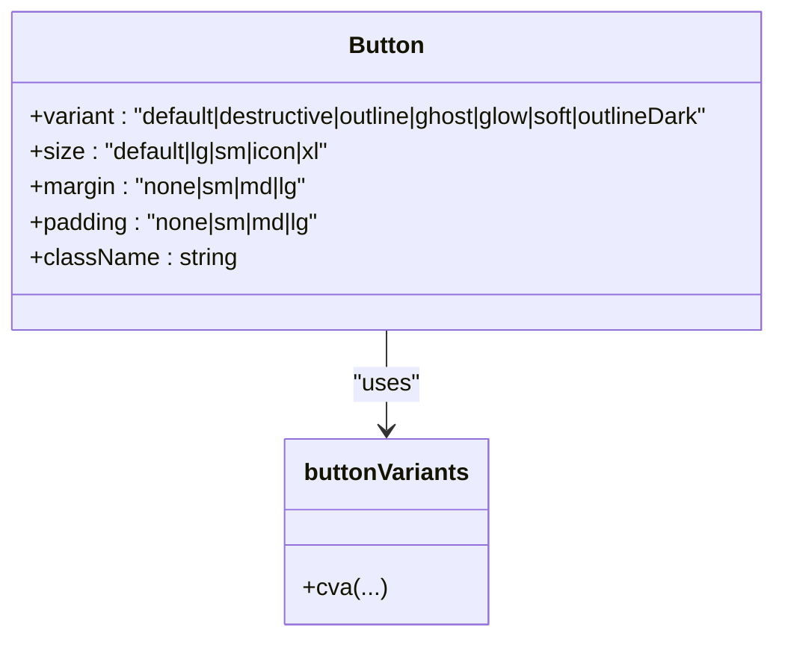

**Diagram sources**
- [button.tsx:7-49](file://packages/web/components/ui/button.tsx#L7-L49)
- [button.tsx:51-73](file://packages/web/components/ui/button.tsx#L51-L73)

**Section sources**
- [button.tsx:7-49](file://packages/web/components/ui/button.tsx#L7-L49)
- [button.tsx:51-73](file://packages/web/components/ui/button.tsx#L51-L73)

### AlertDialog Component
- **Implementation pattern**: Radix UI AlertDialog primitives with Tailwind CSS styling
- **Primitives**: Root, Trigger, Portal, Overlay, Content, Header, Footer, Title, Description, Action, Cancel
- **State management**: Open/close state via data-[state] attributes; automatic focus management
- **Animations**: Fade and zoom transitions; slide-in/slide-out effects
- **Accessibility**: Modal semantics, focus trapping, escape key handling, ARIA attributes
- **Integration**: Action buttons inherit buttonVariants for consistent styling
- **Usage patterns**: Confirmation dialogs, destructive actions, user verification flows

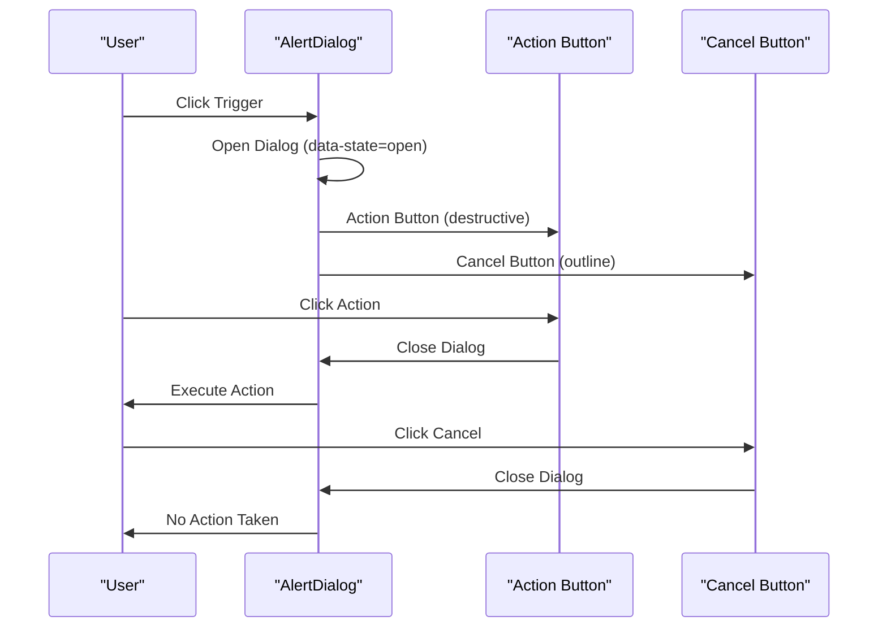

**Diagram sources**
- [alert-dialog.tsx:101-127](file://packages/web/components/ui/alert-dialog.tsx#L101-L127)
- [alert-dialog.tsx:130-141](file://packages/web/components/ui/alert-dialog.tsx#L130-L141)

**Section sources**
- [alert-dialog.tsx:101-127](file://packages/web/components/ui/alert-dialog.tsx#L101-L127)
- [alert-dialog.tsx:130-141](file://packages/web/components/ui/alert-dialog.tsx#L130-L141)

### Navigation Component
- **Implementation pattern**: simplified sidebar with notes-focused navigation
- **State management**: active tab tracking, user information display
- **Integration**: event handlers for tab changes and upgrade actions
- **Styling**: CSS classes for active indicators and responsive layout
- **Removed**: "record" tab replaced with "notes" tab

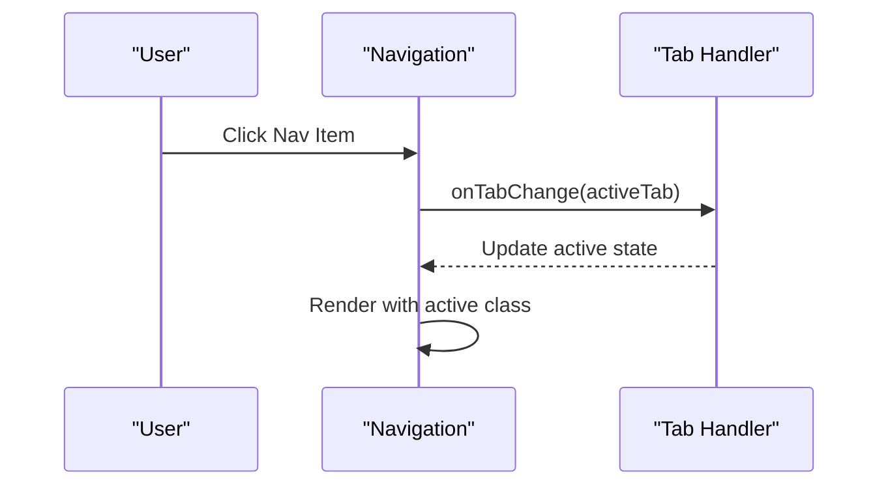

**Diagram sources**
- [Navigation.tsx:30-46](file://packages/desktop/src/components/Navigation.tsx#L30-L46)

**Section sources**
- [Navigation.tsx:13-19](file://packages/desktop/src/components/Navigation.tsx#L13-L19)

### NotesTab Component
- **Complex state management**: notes list, filtering, sorting, pagination, detail view
- **Advanced filtering**: search by title/content, starred-only view
- **Sorting options**: created date, updated date, length with stable secondary sort
- **Pagination**: 5 items per page with ellipsis navigation
- **User interactions**: note selection, star toggling, deletion with confirmation
- **External integrations**: notes service for CRUD operations, trash management

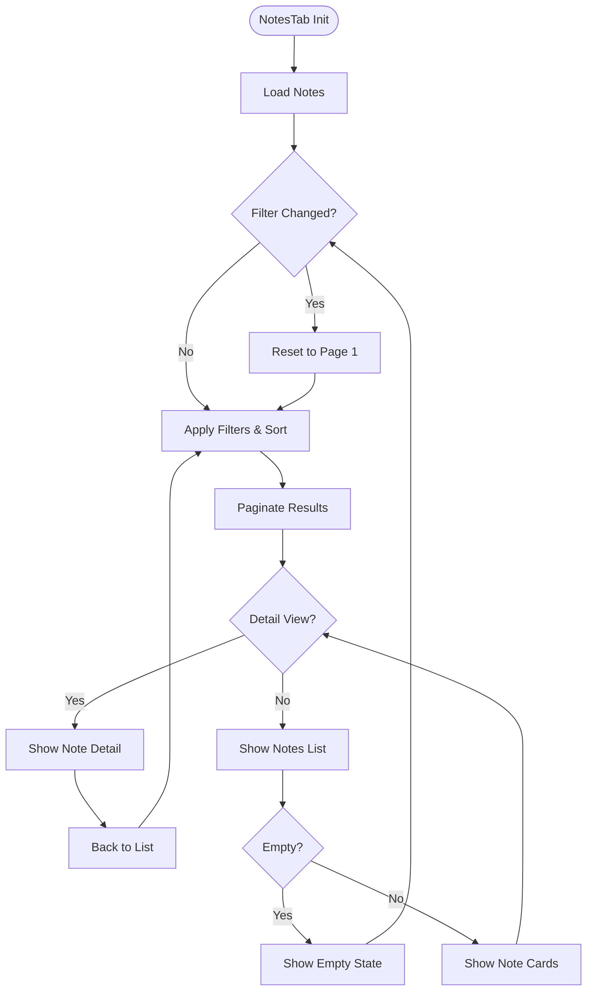

**Diagram sources**
- [NotesTab.tsx:32-47](file://packages/desktop/src/components/NotesTab.tsx#L32-L47)
- [NotesTab.tsx:50-96](file://packages/desktop/src/components/NotesTab.tsx#L50-L96)
- [NotesTab.tsx:100-103](file://packages/desktop/src/components/NotesTab.tsx#L100-L103)
- [NotesTab.tsx:159-166](file://packages/desktop/src/components/NotesTab.tsx#L159-L166)

**Section sources**
- [NotesTab.tsx:23-39](file://packages/desktop/src/components/NotesTab.tsx#L23-L39)

### NoteCard Component
- **Implementation pattern**: individual note presentation with action buttons
- **State management**: star state, delete state, click handling
- **Formatting**: date formatting, text truncation with ellipsis
- **User interactions**: click-to-open, star toggle, delete with loading state

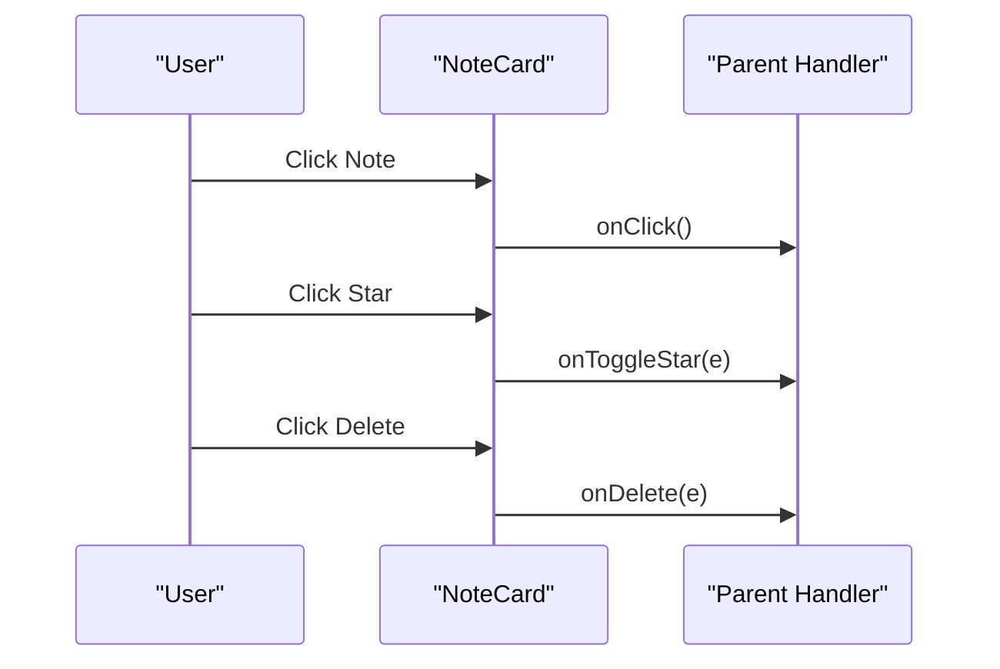

**Diagram sources**
- [NoteCard.tsx:34-82](file://packages/desktop/src/components/NoteCard.tsx#L34-L82)

**Section sources**
- [NoteCard.tsx:12-18](file://packages/desktop/src/components/NoteCard.tsx#L12-L18)

### TrashPanel Component
- **Modal architecture**: overlay-based panel with click-to-close
- **State management**: loading states, restoration states, deletion states
- **User interactions**: restore individual notes, permanent deletion with confirmation
- **External integrations**: notes service for trash operations

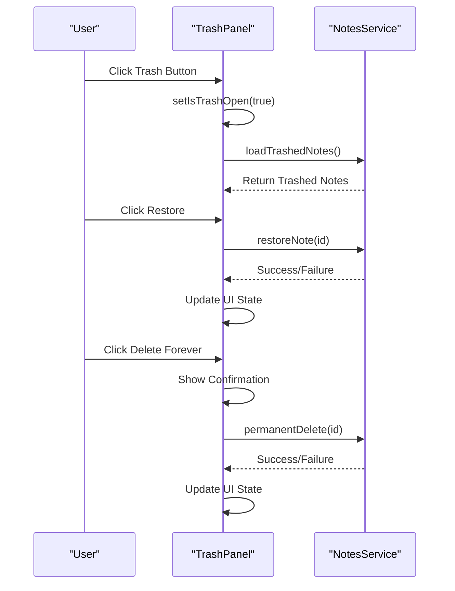

**Diagram sources**
- [TrashPanel.tsx:18-40](file://packages/desktop/src/components/TrashPanel.tsx#L18-L40)
- [TrashPanel.tsx:42-65](file://packages/desktop/src/components/TrashPanel.tsx#L42-L65)

**Section sources**
- [TrashPanel.tsx:12-17](file://packages/desktop/src/components/TrashPanel.tsx#L12-L17)

### UpdateNotification Component
- **State management**: multiple states (available, downloading, ready, error)
- **Progress tracking**: download progress with percentage calculation
- **User interactions**: download, install, dismiss actions
- **External integration**: Tauri updater plugin for update management

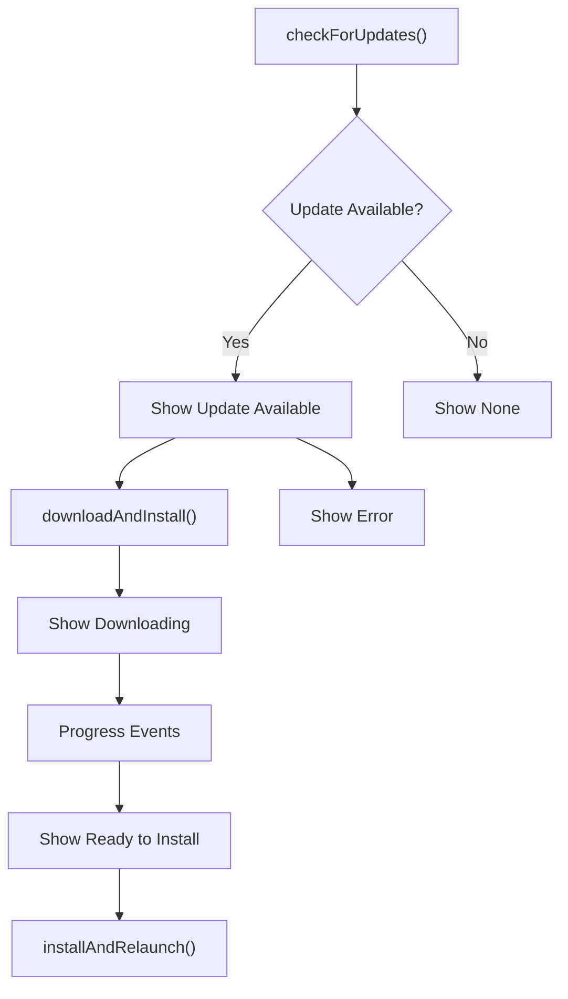

**Diagram sources**
- [useUpdater.ts:33-68](file://packages/desktop/src/hooks/useUpdater.ts#L33-L68)
- [useUpdater.ts:70-110](file://packages/desktop/src/hooks/useUpdater.ts#L70-L110)
- [useUpdater.ts:112-121](file://packages/desktop/src/hooks/useUpdater.ts#L112-L121)

**Section sources**
- [UpdateNotification.tsx:19-29](file://packages/desktop/src/components/UpdateNotification.tsx#L19-L29)

### Header Component
- **Dropdown architecture**: user profile dropdown with click-outside detection
- **State management**: dropdown visibility, user information display
- **User interactions**: settings access, sign out functionality
- **Accessibility**: proper ARIA attributes, keyboard navigation support

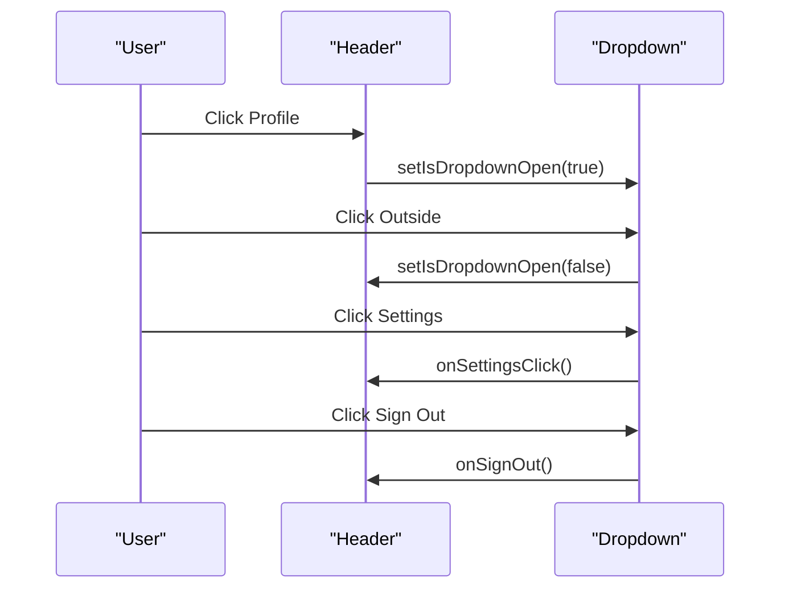

**Diagram sources**
- [Header.tsx:14-24](file://packages/desktop/src/components/Header.tsx#L14-L24)
- [Header.tsx:52-86](file://packages/desktop/src/components/Header.tsx#L52-L86)

**Section sources**
- [Header.tsx:10-12](file://packages/desktop/src/components/Header.tsx#L10-L12)

### useUpdater Hook
- **State management**: comprehensive update state with progress tracking
- **Async operations**: update checking, downloading, installing with error handling
- **Event handling**: progress events during download process
- **External integration**: Tauri updater plugin for native update management

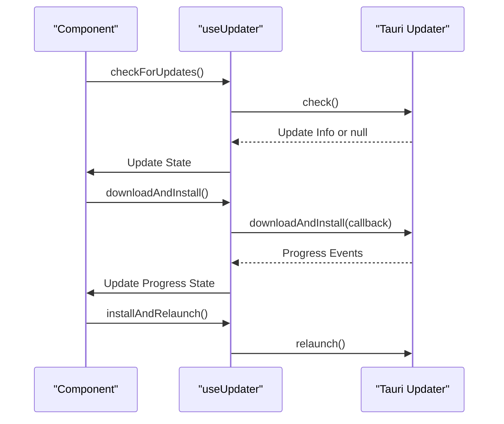

**Diagram sources**
- [useUpdater.ts:33-68](file://packages/desktop/src/hooks/useUpdater.ts#L33-L68)
- [useUpdater.ts:70-110](file://packages/desktop/src/hooks/useUpdater.ts#L70-L110)
- [useUpdater.ts:112-121](file://packages/desktop/src/hooks/useUpdater.ts#L112-L121)

**Section sources**
- [useUpdater.ts:22-31](file://packages/desktop/src/hooks/useUpdater.ts#L22-L31)

### SettingsTab Component
- **Multi-panel architecture**: sub-tabs for different settings categories
- **External integration**: opens external web app for billing, vocabulary, and account management
- **Danger zone**: account deletion and data clearing
- **State management**: active sub-tab tracking

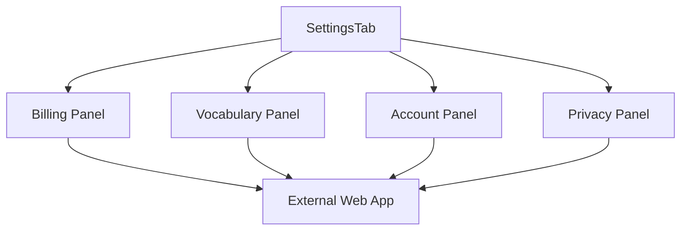

**Diagram sources**
- [SettingsTab.tsx:55-75](file://packages/desktop/src/components/SettingsTab.tsx#L55-L75)
- [SettingsTab.tsx:78-244](file://packages/desktop/src/components/SettingsTab.tsx#L78-L244)

**Section sources**
- [SettingsTab.tsx:25-42](file://packages/desktop/src/components/SettingsTab.tsx#L25-L42)

## Component Integration Patterns
The desktop application follows specific integration patterns for complex workflows:

### Navigation Integration
- Navigation component manages tab state and routes to appropriate sections
- NotesTab is now the primary focus replacing the previous RecordTab
- Each tab corresponds to a specific component (NotesTab, VocabularySection, BillingSection, SettingsTab)
- User authentication state affects available navigation options

### Notes Management Integration
- NotesTab orchestrates NoteCard components for individual note display
- TrashPanel integrates with NotesTab for trash operations
- NotesTab handles pagination, filtering, and sorting
- NoteCard components handle individual note interactions

### Update Management Integration
- useUpdater hook provides state management for application updates
- UpdateNotification component displays update status to users
- Integration with Tauri updater plugin for native update handling
- Progress tracking and error handling for update operations

### Authentication Integration
- Header component provides user authentication and settings access
- SettingsTab integrates with external web app for account management
- Sign out functionality coordinated across components

### AlertDialog Integration Patterns
- **Confirmation dialogs**: Use AlertDialog for destructive actions like account deletion
- **User verification**: Implement verification flows before critical operations
- **Consistent styling**: Action buttons inherit buttonVariants for uniform appearance
- **Accessibility**: Proper focus management and ARIA attributes maintained

### State Management Patterns
- **Local state**: Simple UI state (active tabs, form inputs, dropdowns)
- **Global state**: Complex application state (user data, subscription info, update status)
- **External state**: Database state (notes, vocabulary entries, recordings)
- **Event-driven updates**: Callback functions for user interactions
- **Optimistic updates**: NotesTab implements optimistic UI for star toggling

### Data Flow Patterns
- **Top-down props**: Parent components pass data and callbacks
- **Bottom-up events**: Child components trigger parent handlers
- **External APIs**: Database and external service integrations
- **Real-time updates**: Status indicators and loading states
- **Update notifications**: Progress tracking and state synchronization

**Section sources**
- [Navigation.tsx:13-19](file://packages/desktop/src/components/Navigation.tsx#L13-L19)
- [NotesTab.tsx:23-39](file://packages/desktop/src/components/NotesTab.tsx#L23-L39)
- [NoteCard.tsx:12-18](file://packages/desktop/src/components/NoteCard.tsx#L12-L18)
- [TrashPanel.tsx:12-17](file://packages/desktop/src/components/TrashPanel.tsx#L12-L17)
- [UpdateNotification.tsx:19-29](file://packages/desktop/src/components/UpdateNotification.tsx#L19-L29)
- [useUpdater.ts:22-31](file://packages/desktop/src/hooks/useUpdater.ts#L22-L31)
- [Header.tsx:10-12](file://packages/desktop/src/components/Header.tsx#L10-L12)
- [alert-dialog.tsx:101-127](file://packages/web/components/ui/alert-dialog.tsx#L101-L127)

## Dependency Analysis
- **Component dependencies**
  - All UI components depend on cn() from lib.ts for class merging
  - Tailwind utilities derive from tailwind.config.js and globals.css
  - Radix UI primitives power Select, Tooltip, Switch, Label, and AlertDialog
  - Desktop components integrate with external libraries (Lucide icons, Tauri plugins)
- **Desktop-specific dependencies**
  - Supabase for database operations
  - Tauri updater plugin for update management
  - Tauri opener plugin for external URL opening
  - Lucide React for icons
- **New dependencies**
  - useUpdater hook depends on @tauri-apps/plugin-updater and @tauri-apps/plugin-process
  - NotesTab depends on notesService for CRUD operations
  - TrashPanel depends on notesService for trash operations
- **Coupling and cohesion**
  - High cohesion within components; low coupling via cn() and Tailwind tokens
  - Shared utilities minimize duplication across components
  - Desktop components maintain separation between UI and business logic
  - NotesTab provides orchestration for related components

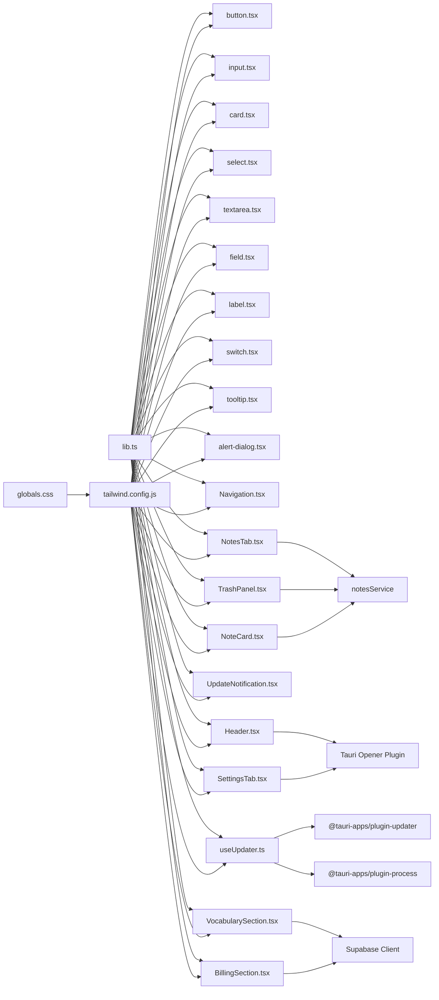

**Diagram sources**
- [lib.ts:4-6](file://packages/web/components/ui/lib.ts#L4-L6)
- [tailwind.config.js:9-98](file://tailwind.config.js#L9-L98)
- [globals.css:47-118](file://app/globals.css#L47-L118)
- [button.tsx:5-6](file://packages/web/components/ui/button.tsx#L5-L6)
- [input.tsx](file://packages/web/components/ui/input.tsx#L3)
- [card.tsx](file://packages/web/components/ui/card.tsx#L3)
- [select.tsx](file://packages/web/components/ui/select.tsx#L7)
- [textarea.tsx](file://packages/web/components/ui/textarea.tsx#L3)
- [field.tsx](file://packages/web/components/ui/field.tsx#L6)
- [label.tsx](file://packages/web/components/ui/label.tsx#L7)
- [switch.tsx](file://packages/web/components/ui/switch.tsx#L6)
- [tooltip.tsx](file://packages/web/components/ui/tooltip.tsx#L6)
- [alert-dialog.tsx](file://packages/web/components/ui/alert-dialog.tsx#L4)
- [Navigation.tsx:1-2](file://packages/desktop/src/components/Navigation.tsx#L1-L2)
- [NotesTab.tsx:3](file://packages/desktop/src/components/NotesTab.tsx#L3)
- [NoteCard.tsx:1](file://packages/desktop/src/components/NoteCard.tsx#L1)
- [TrashPanel.tsx:3](file://packages/desktop/src/components/TrashPanel.tsx#L3)
- [UpdateNotification.tsx:1](file://packages/desktop/src/components/UpdateNotification.tsx#L1)
- [Header.tsx:1](file://packages/desktop/src/components/Header.tsx#L1)
- [useUpdater.ts:2](file://packages/desktop/src/hooks/useUpdater.ts#L2)
- [SettingsTab.tsx:1](file://packages/desktop/src/components/SettingsTab.tsx#L1)
- [VocabularySection.tsx](file://packages/desktop/src/components/VocabularySection.tsx#L3)
- [BillingSection.tsx](file://packages/desktop/src/components/BillingSection.tsx#L4)

**Section sources**
- [lib.ts:4-6](file://packages/web/components/ui/lib.ts#L4-L6)
- [tailwind.config.js:9-98](file://tailwind.config.js#L9-L98)
- [globals.css:47-118](file://app/globals.css#L47-L118)
- [button.tsx:5-6](file://packages/web/components/ui/button.tsx#L5-L6)
- [input.tsx](file://packages/web/components/ui/input.tsx#L3)
- [card.tsx](file://packages/web/components/ui/card.tsx#L3)
- [select.tsx](file://packages/web/components/ui/select.tsx#L7)
- [textarea.tsx](file://packages/web/components/ui/textarea.tsx#L3)
- [field.tsx](file://packages/web/components/ui/field.tsx#L6)
- [label.tsx](file://packages/web/components/ui/label.tsx#L7)
- [switch.tsx](file://packages/web/components/ui/switch.tsx#L6)
- [tooltip.tsx](file://packages/web/components/ui/tooltip.tsx#L6)
- [alert-dialog.tsx](file://packages/web/components/ui/alert-dialog.tsx#L4)
- [Navigation.tsx:1-2](file://packages/desktop/src/components/Navigation.tsx#L1-L2)
- [NotesTab.tsx:3](file://packages/desktop/src/components/NotesTab.tsx#L3)
- [NoteCard.tsx:1](file://packages/desktop/src/components/NoteCard.tsx#L1)
- [TrashPanel.tsx:3](file://packages/desktop/src/components/TrashPanel.tsx#L3)
- [UpdateNotification.tsx:1](file://packages/desktop/src/components/UpdateNotification.tsx#L1)
- [Header.tsx:1](file://packages/desktop/src/components/Header.tsx#L1)
- [useUpdater.ts:2](file://packages/desktop/src/hooks/useUpdater.ts#L2)
- [SettingsTab.tsx:1](file://packages/desktop/src/components/SettingsTab.tsx#L1)
- [VocabularySection.tsx](file://packages/desktop/src/components/VocabularySection.tsx#L3)
- [BillingSection.tsx](file://packages/desktop/src/components/BillingSection.tsx#L4)

## Performance Considerations
- **Prefer className over inline styles** to leverage CSS specificity and reduce reflows
- **Use cn() to merge classes efficiently**; avoid excessive conditional class concatenation
- **Limit heavy animations on low-end devices**; keep transitions short (as seen in accordion keyframes)
- **Defer non-critical images** (e.g., logos) with lazy loading where appropriate
- **Keep component trees shallow**; compose smaller, focused components to minimize re-renders
- **Optimize database queries** in desktop components (batch operations, caching)
- **Implement proper loading states** for async operations (notes, trash, updates)
- **Use memoization** for expensive calculations (pagination, filtering, formatting)
- **AlertDialog animations**: Smooth fade and zoom transitions; consider disabling for low-power devices
- **NotesTab optimizations**: Memoized filtering and sorting, pagination to limit DOM nodes
- **Update progress tracking**: Efficient progress calculation and state updates
- **TrashPanel loading**: Optimistic UI updates for better perceived performance

## Troubleshooting Guide
- **Button disabled state not working**
  - Ensure disabled prop is passed; verify pointer-events and opacity classes are applied
  - Reference: [button.tsx:8-49](file://packages/web/components/ui/button.tsx#L8-L49)
- **Select dropdown not visible**
  - Confirm Portal rendering and z-index; verify position and viewport classes
  - Reference: [select.tsx:70-99](file://packages/web/components/ui/select.tsx#L70-L99)
- **FieldError not rendering**
  - Provide either children or an errors array with message fields
  - Reference: [field.tsx:186-231](file://packages/web/components/ui/field.tsx#L186-L231)
- **Tooltip not appearing**
  - Wrap content with TooltipProvider and ensure TooltipTrigger is used
  - Reference: [tooltip.tsx:8-32](file://packages/web/components/ui/tooltip.tsx#L8-L32)
- **AlertDialog not opening**
  - Verify AlertDialogTrigger is wrapped around actionable element
  - Check that Root component wraps the entire dialog structure
  - Ensure Portal is rendering in DOM
  - Reference: [alert-dialog.tsx:101-127](file://packages/web/components/ui/alert-dialog.tsx#L101-L127)
- **AlertDialog action buttons not styled**
  - Confirm Action and Cancel components inherit buttonVariants
  - Verify variant prop is passed correctly
  - Reference: [alert-dialog.tsx:101-127](file://packages/web/components/ui/alert-dialog.tsx#L101-L127)
- **Navigation tab not changing**
  - Verify onTabChange handler is properly passed and called
  - Check activeTab prop binding
  - Reference: [Navigation.tsx:30-46](file://packages/desktop/src/components/Navigation.tsx#L30-L46)
- **NotesTab not loading notes**
  - Verify userId prop and notes service connection
  - Check for network errors and loading states
  - Reference: [NotesTab.tsx:105-114](file://packages/desktop/src/components/NotesTab.tsx#L105-L114)
- **NoteCard click handlers not working**
  - Verify onClick prop is passed correctly
  - Check event propagation issues
  - Reference: [NoteCard.tsx:34-37](file://packages/desktop/src/components/NoteCard.tsx#L34-L37)
- **TrashPanel not showing**
  - Verify isOpen prop and floating button click
  - Check for modal overlay issues
  - Reference: [TrashPanel.tsx:79](file://packages/desktop/src/components/TrashPanel.tsx#L79)
- **UpdateNotification not displaying**
  - Verify update state props and component mounting
  - Check for update checking and state updates
  - Reference: [UpdateNotification.tsx:30](file://packages/desktop/src/components/UpdateNotification.tsx#L30)
- **useUpdater hook not working**
  - Verify Tauri updater plugin installation
  - Check for proper state initialization and method calls
  - Reference: [useUpdater.ts:22-31](file://packages/desktop/src/hooks/useUpdater.ts#L22-L31)
- **Header dropdown not closing**
  - Verify click-outside detection and event listeners
  - Check dropdownRef usage and cleanup
  - Reference: [Header.tsx:14-24](file://packages/desktop/src/components/Header.tsx#L14-L24)
- **SettingsTab external links not opening**
  - Verify Tauri opener plugin installation
  - Check URL validity and browser permissions
  - Reference: [SettingsTab.tsx:96](file://packages/desktop/src/components/SettingsTab.tsx#L96)
- **Theming inconsistencies**
  - Verify CSS variables in :root and .dark; confirm Tailwind theme.extend matches tokens
  - Reference: [globals.css:65-117](file://app/globals.css#L65-L117), [tailwind.config.js:22-74](file://tailwind.config.js#L22-L74)

**Section sources**
- [button.tsx:8-49](file://packages/web/components/ui/button.tsx#L8-L49)
- [select.tsx:70-99](file://packages/web/components/ui/select.tsx#L70-L99)
- [field.tsx:186-231](file://packages/web/components/ui/field.tsx#L186-L231)
- [tooltip.tsx:8-32](file://packages/web/components/ui/tooltip.tsx#L8-L32)
- [alert-dialog.tsx:101-127](file://packages/web/components/ui/alert-dialog.tsx#L101-L127)
- [Navigation.tsx:30-46](file://packages/desktop/src/components/Navigation.tsx#L30-L46)
- [NotesTab.tsx:105-114](file://packages/desktop/src/components/NotesTab.tsx#L105-L114)
- [NoteCard.tsx:34-37](file://packages/desktop/src/components/NoteCard.tsx#L34-L37)
- [TrashPanel.tsx:79](file://packages/desktop/src/components/TrashPanel.tsx#L79)
- [UpdateNotification.tsx:30](file://packages/desktop/src/components/UpdateNotification.tsx#L30)
- [useUpdater.ts:22-31](file://packages/desktop/src/hooks/useUpdater.ts#L22-L31)
- [Header.tsx:14-24](file://packages/desktop/src/components/Header.tsx#L14-L24)
- [SettingsTab.tsx:96](file://packages/desktop/src/components/SettingsTab.tsx#L96)
- [globals.css:65-117](file://app/globals.css#L65-L117)
- [tailwind.config.js:22-74](file://tailwind.config.js#L22-L74)

## Conclusion
OSCAR's UI component library combines Radix UI primitives with Tailwind CSS to deliver accessible, theme-consistent, and customizable components across both web and desktop applications. The design system emphasizes composability, clear state handling, and responsive behavior. The addition of the AlertDialog component significantly enhances the library's capability to handle confirmation dialogs and user verification flows with comprehensive accessibility and animation support. 

The desktop application has evolved from an audio recording-focused interface to a comprehensive notes management system. The new NotesTab component provides sophisticated note listing, filtering, sorting, and detail viewing capabilities, replacing the previous RecordTab. The introduction of TrashPanel enables robust trash management with recovery options, while the Header component provides user authentication and settings access. The useUpdater hook delivers comprehensive application update management with progress tracking and error handling.

The integration of new components (NotesTab, NoteCard, TrashPanel, UpdateNotification, Header, useUpdater) demonstrates the library's extensibility and ability to handle complex application workflows. By leveraging the provided utilities and patterns, teams can build consistent interfaces while maintaining flexibility for customization and advanced use cases in both environments. The notes-focused architecture provides a more cohesive user experience for content creation and management, while the enhanced update management system ensures users always have access to the latest features and improvements.

## Appendices

### Responsive Design Guidelines
- **Use responsive variants in Field** (responsive orientation) and component sizes (e.g., sm/lg/xl)
- **Prefer container queries and @media utilities sparingly**; rely on component variants when possible
- **Test breakpoints across mobile, tablet, and desktop layouts**
- **Desktop components should adapt to different screen sizes** while maintaining functionality
- **AlertDialog**: Centered modal with max-width constraints; responsive padding and spacing
- **NotesTab**: Responsive pagination and filtering for different screen sizes
- **UpdateNotification**: Fixed positioning with responsive content layout

### Accessibility Compliance
- **Buttons**: ensure focus-visible rings and disabled states
- **Inputs/Labels**: pair labels with inputs for screen readers
- **Select/Tooltip/Switch**: use Radix UI primitives for native keyboard and ARIA support
- **AlertDialog**: modal semantics, focus trapping, escape key handling, ARIA attributes
- **Navigation**: ensure keyboard navigation and screen reader compatibility
- **NotesTab**: proper ARIA labels for pagination and filtering controls
- **NoteCard**: ensure interactive elements have proper focus management
- **TrashPanel**: modal semantics with proper focus management and escape handling
- **UpdateNotification**: status announcements for screen readers
- **Header**: dropdown accessibility with proper ARIA attributes and keyboard navigation
- **SettingsTab**: ensure proper heading hierarchy and navigation landmarks
- References: [button.tsx:8-49](file://packages/web/components/ui/button.tsx#L8-L49), [label.tsx:13-26](file://packages/web/components/ui/label.tsx#L13-L26), [select.tsx:15-33](file://packages/web/components/ui/select.tsx#L15-L33), [tooltip.tsx:14-32](file://packages/web/components/ui/tooltip.tsx#L14-L32), [alert-dialog.tsx:101-127](file://packages/web/components/ui/alert-dialog.tsx#L101-L127), [Navigation.tsx:13-19](file://packages/desktop/src/components/Navigation.tsx#L13-L19), [NotesTab.tsx:23-39](file://packages/desktop/src/components/NotesTab.tsx#L23-L39), [NoteCard.tsx:12-18](file://packages/desktop/src/components/NoteCard.tsx#L12-L18), [TrashPanel.tsx:12-17](file://packages/desktop/src/components/TrashPanel.tsx#L12-L17), [UpdateNotification.tsx:19-29](file://packages/desktop/src/components/UpdateNotification.tsx#L19-L29), [Header.tsx:10-12](file://packages/desktop/src/components/Header.tsx#L10-L12), [SettingsTab.tsx:25-42](file://packages/desktop/src/components/SettingsTab.tsx#L25-L42)

### Theming Support
- **Centralized tokens via CSS variables** in :root and .dark
- **Tailwind theme.extend mirrors CSS variables** for color and radius scales
- **Use variant props to align with theme**; avoid hardcoding colors outside tokens
- **AlertDialog Action buttons inherit buttonVariants** for consistent styling
- **Desktop components should respect system theme preferences**
- **Consistent iconography using Lucide React** across all components
- **NotesTab**: maintains consistent theming across list and detail views
- **UpdateNotification**: themed based on state (success, downloading, error)
- References: [globals.css:65-117](file://app/globals.css#L65-L117), [tailwind.config.js:22-74](file://tailwind.config.js#L22-L74), [alert-dialog.tsx:101-127](file://packages/web/components/ui/alert-dialog.tsx#L101-L127), [NotesTab.tsx:23-39](file://packages/desktop/src/components/NotesTab.tsx#L23-L39), [UpdateNotification.tsx:19-29](file://packages/desktop/src/components/UpdateNotification.tsx#L19-L29)

### Animation and Transitions
- **Accordion-like transitions defined via keyframes** and animation shortcuts
- **Tooltip and Select use data-[state] and data-[side]** for smooth enter/exit animations
- **AlertDialog uses fade and zoom transitions** with slide-in/slide-out effects
- **RecordTab includes spin animations** for loading states (replaced by NotesTab loading states)
- **Navigation provides smooth active state transitions**
- **NotesTab**: pagination transitions and loading spinners
- **UpdateNotification**: smooth state transitions between update states
- **Header**: dropdown slide-down and slide-up animations
- **Desktop components should balance visual feedback with performance**
- References: [tailwind.config.js:75-96](file://tailwind.config.js#L75-L96), [select.tsx:73-98](file://packages/web/components/ui/select.tsx#L73-L98), [tooltip.tsx:17-29](file://packages/web/components/ui/tooltip.tsx#L17-L29), [alert-dialog.tsx:30-46](file://packages/web/components/ui/alert-dialog.tsx#L30-L46), [NotesTab.tsx:74-76](file://packages/desktop/src/components/NotesTab.tsx#L74-L76), [Navigation.tsx:35-42](file://packages/desktop/src/components/Navigation.tsx#L35-L42), [UpdateNotification.tsx:44-55](file://packages/desktop/src/components/UpdateNotification.tsx#L44-L55), [Header.tsx:49](file://packages/desktop/src/components/Header.tsx#L49)

### Cross-Browser Compatibility
- **Use Tailwind utilities and Radix UI primitives** for consistent behavior across browsers
- **Validate focus styles and keyboard interactions** on target browsers
- **Avoid vendor-prefixed CSS**; rely on Tailwind's autoprefixing via PostCSS
- **Desktop application requires Tauri runtime compatibility**
- **AlertDialog animations**: Smooth transitions supported across modern browsers
- **External integrations should handle browser differences gracefully**
- **UpdateNotification**: Works across different browser environments
- **Header dropdown**: Compatible with various browser implementations

### Integration Patterns
- **Compose Field with Input/Select/Textarea/Label** for forms
- **Use Button variants to communicate intent**; pair destructive actions with AlertDialog
- **Combine Tooltip with actionable elements** for contextual help
- **AlertDialog for destructive actions**: Confirmation dialogs with proper styling inheritance
- **Desktop components should follow separation of concerns** between UI and business logic
- **Use callback patterns for state management** across component boundaries
- **Implement proper error handling** for external API integrations
- **NotesTab**: Orchestration pattern for related components (NotesTab -> NoteCard -> TrashPanel)
- **useUpdater**: Centralized state management for update operations
- **Header**: Authentication and settings access coordination
- References: [field.tsx:10-244](file://packages/web/components/ui/field.tsx#L10-L244), [button.tsx:10-48](file://packages/web/components/ui/button.tsx#L10-L48), [tooltip.tsx:14-32](file://packages/web/components/ui/tooltip.tsx#L14-L32), [alert-dialog.tsx:101-127](file://packages/web/components/ui/alert-dialog.tsx#L101-L127), [Navigation.tsx:13-19](file://packages/desktop/src/components/Navigation.tsx#L13-L19), [NotesTab.tsx:23-39](file://packages/desktop/src/components/NotesTab.tsx#L23-L39), [NoteCard.tsx:12-18](file://packages/desktop/src/components/NoteCard.tsx#L12-L18), [TrashPanel.tsx:12-17](file://packages/desktop/src/components/TrashPanel.tsx#L12-L17), [UpdateNotification.tsx:19-29](file://packages/desktop/src/components/UpdateNotification.tsx#L19-L29), [Header.tsx:10-12](file://packages/desktop/src/components/Header.tsx#L10-L12), [SettingsTab.tsx:25-42](file://packages/desktop/src/components/SettingsTab.tsx#L25-L42), [useUpdater.ts:22-31](file://packages/desktop/src/hooks/useUpdater.ts#L22-L31)

### Desktop-Specific Considerations
- **State persistence** across application restarts
- **File system integration** for model paths and data storage
- **System notifications** for recording status and completion (replaced by note notifications)
- **Hardware integration** for microphone and audio processing
- **External service coordination** with web application features
- **Performance optimization** for real-time note operations
- **Security considerations** for user data and API keys
- **AlertDialog accessibility**: Proper focus management and ARIA attributes for confirmation flows
- **Notes management**: Optimistic UI updates for better perceived performance
- **Update management**: Native Tauri integration for seamless updates
- **Authentication flow**: Secure user session management and settings access
- **AlertDialog accessibility**: Proper focus management and ARIA attributes for confirmation flows