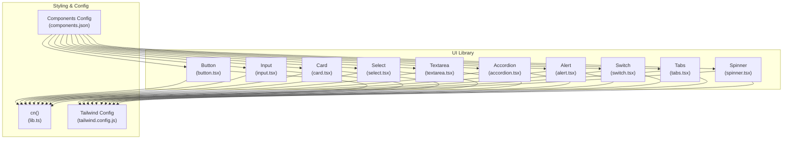
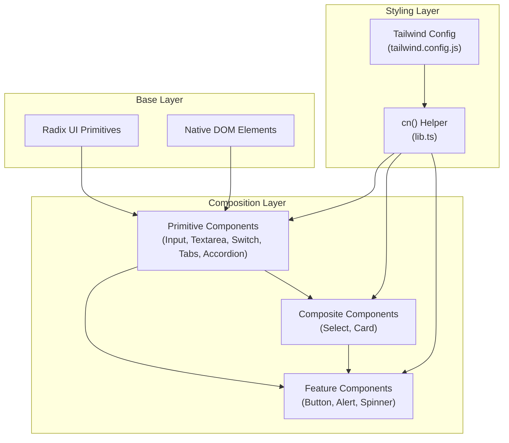
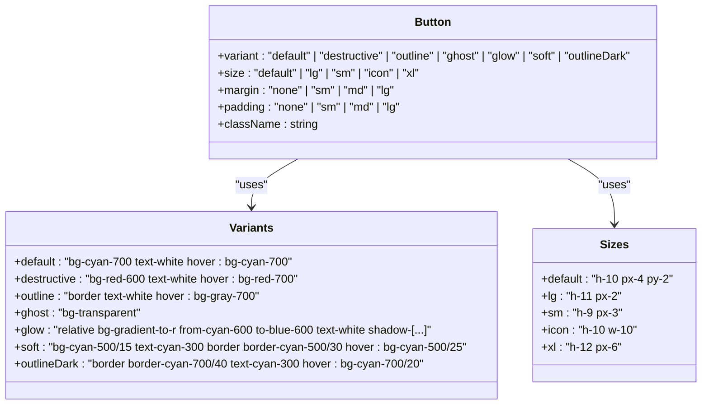
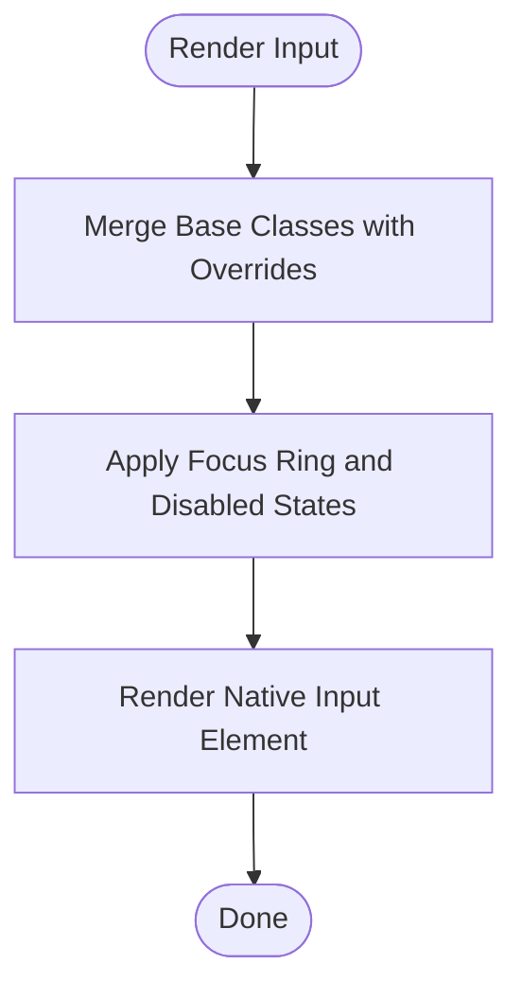
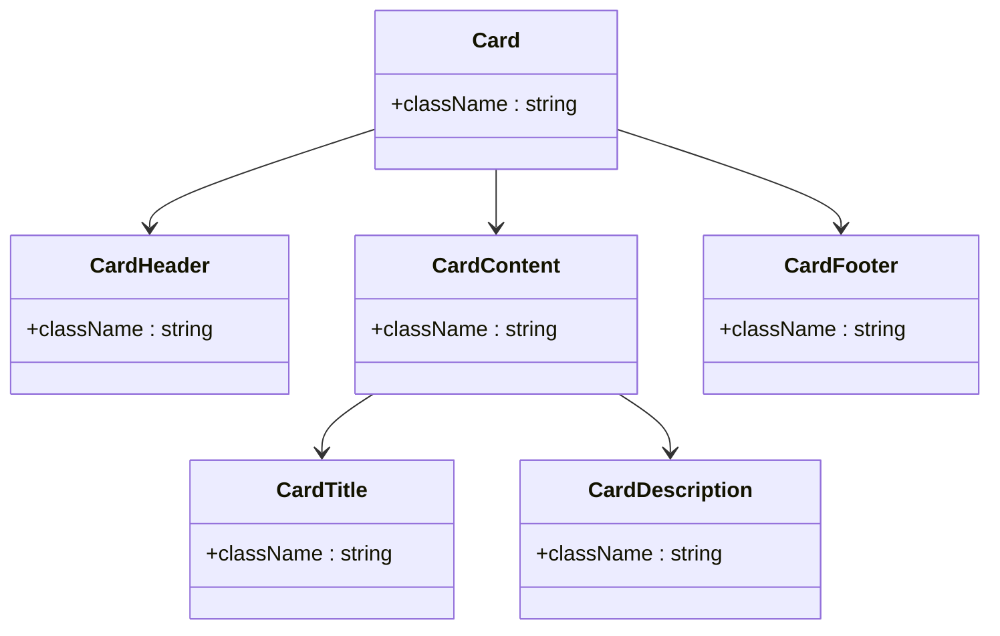
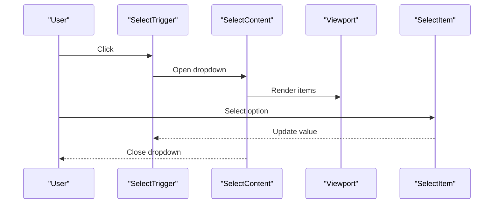
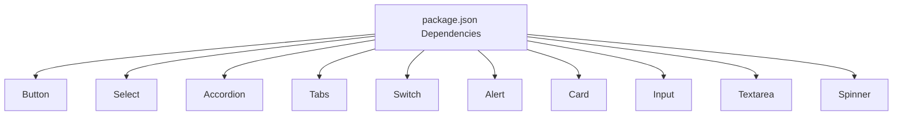

# Ui Component Library

<cite>
**Referenced Files in This Document**
- [package.json](file://package.json)
- [tailwind.config.js](file://tailwind.config.js)
- [components.json](file://components.json)
- [lib.ts](file://components/ui/lib.ts)
- [button.tsx](file://components/ui/button.tsx)
- [input.tsx](file://components/ui/input.tsx)
- [card.tsx](file://components/ui/card.tsx)
- [select.tsx](file://components/ui/select.tsx)
- [textarea.tsx](file://components/ui/textarea.tsx)
- [accordion.tsx](file://components/ui/accordion.tsx)
- [alert.tsx](file://components/ui/alert.tsx)
- [switch.tsx](file://components/ui/switch.tsx)
- [tabs.tsx](file://components/ui/tabs.tsx)
- [spinner.tsx](file://components/ui/spinner.tsx)
</cite>

## Table of Contents
1. [Introduction](#introduction)
2. [Project Structure](#project-structure)
3. [Core Components](#core-components)
4. [Architecture Overview](#architecture-overview)
5. [Detailed Component Analysis](#detailed-component-analysis)
6. [Dependency Analysis](#dependency-analysis)
7. [Performance Considerations](#performance-considerations)
8. [Troubleshooting Guide](#troubleshooting-guide)
9. [Conclusion](#conclusion)

## Introduction
This document describes the Ui Component Library used in the OSCAR AI Voice Notes application. The library provides reusable, accessible, and customizable UI primitives built with React and Radix UI, styled consistently using Tailwind CSS and configured through a centralized design system. It emphasizes composability, type safety, and maintainability while integrating seamlessly with Next.js applications.

## Project Structure
The UI components are organized under the components/ui directory and are integrated with:
- Tailwind CSS for styling and animations
- Radix UI for accessible base primitives
- class-variance-authority (CVA) for variant-driven component styling
- clsx and tailwind-merge for conditional class merging

**Diagram sources**
- [button.tsx](file://components/ui/button.tsx#L1-L76)
- [input.tsx](file://components/ui/input.tsx#L1-L23)
- [card.tsx](file://components/ui/card.tsx#L1-L77)
- [select.tsx](file://components/ui/select.tsx#L1-L160)
- [textarea.tsx](file://components/ui/textarea.tsx#L1-L23)
- [accordion.tsx](file://components/ui/accordion.tsx#L1-L58)
- [alert.tsx](file://components/ui/alert.tsx#L1-L60)
- [switch.tsx](file://components/ui/switch.tsx#L1-L30)
- [tabs.tsx](file://components/ui/tabs.tsx#L1-L56)
- [spinner.tsx](file://components/ui/spinner.tsx#L1-L17)
- [lib.ts](file://components/ui/lib.ts#L1-L7)
- [tailwind.config.js](file://tailwind.config.js#L1-L101)
- [components.json](file://components.json#L1-L25)

**Section sources**
- [package.json](file://package.json#L11-L39)
- [tailwind.config.js](file://tailwind.config.js#L1-L101)
- [components.json](file://components.json#L1-L25)

## Core Components
This section outlines the primary UI components and their capabilities:

- Button: Provides multiple variants (default, destructive, outline, ghost, glow, soft, outlineDark), sizes (default, lg, sm, icon, xl), and spacing controls (margin, padding). Uses CVA for variant composition and cn for class merging.
- Input: A forward-ref’d input with consistent focus states, disabled handling, and responsive typography.
- Card: A semantic grouping primitive with header, title, description, content, and footer slots for structured layouts.
- Select: A composite component built on Radix UI with trigger, content, viewport, items, labels, separators, and scroll buttons.
- Textarea: A forward-ref’d textarea with consistent focus states and responsive typography.
- Accordion: A collapsible container with items, triggers, and content, including animation classes for open/close transitions.
- Alert: A contextual alert with default and destructive variants and composed title/description slots.
- Switch: An accessible toggle component with controlled states and focus-visible ring styling.
- Tabs: A tabbed interface with list, triggers, and content areas.
- Spinner: A lightweight loading indicator using Lucide React icons.

**Section sources**
- [button.tsx](file://components/ui/button.tsx#L1-L76)
- [input.tsx](file://components/ui/input.tsx#L1-L23)
- [card.tsx](file://components/ui/card.tsx#L1-L77)
- [select.tsx](file://components/ui/select.tsx#L1-L160)
- [textarea.tsx](file://components/ui/textarea.tsx#L1-L23)
- [accordion.tsx](file://components/ui/accordion.tsx#L1-L58)
- [alert.tsx](file://components/ui/alert.tsx#L1-L60)
- [switch.tsx](file://components/ui/switch.tsx#L1-L30)
- [tabs.tsx](file://components/ui/tabs.tsx#L1-L56)
- [spinner.tsx](file://components/ui/spinner.tsx#L1-L17)

## Architecture Overview
The UI library follows a modular architecture:
- Base primitives are thin wrappers around Radix UI or native DOM elements.
- Styling is centralized via Tailwind utilities and a shared cn helper.
- Variants and defaults are defined with CVA for predictable composition.
- Accessibility is ensured through proper roles, ARIA attributes, and keyboard navigation.

**Diagram sources**
- [button.tsx](file://components/ui/button.tsx#L1-L76)
- [input.tsx](file://components/ui/input.tsx#L1-L23)
- [card.tsx](file://components/ui/card.tsx#L1-L77)
- [select.tsx](file://components/ui/select.tsx#L1-L160)
- [textarea.tsx](file://components/ui/textarea.tsx#L1-L23)
- [accordion.tsx](file://components/ui/accordion.tsx#L1-L58)
- [alert.tsx](file://components/ui/alert.tsx#L1-L60)
- [switch.tsx](file://components/ui/switch.tsx#L1-L30)
- [tabs.tsx](file://components/ui/tabs.tsx#L1-L56)
- [spinner.tsx](file://components/ui/spinner.tsx#L1-L17)
- [lib.ts](file://components/ui/lib.ts#L1-L7)
- [tailwind.config.js](file://tailwind.config.js#L1-L101)

## Detailed Component Analysis

### Button Component
The Button component demonstrates advanced variant composition and spacing controls:
- Uses CVA to define variants (default, destructive, outline, ghost, glow, soft, outlineDark) and sizes (default, lg, sm, icon, xl).
- Supports margin and padding overrides to fine-tune spacing.
- Merges classes deterministically using cn to ensure overrides work predictably.

**Diagram sources**
- [button.tsx](file://components/ui/button.tsx#L7-L49)

**Section sources**
- [button.tsx](file://components/ui/button.tsx#L1-L76)

### Input Component
The Input component ensures consistent styling and accessibility:
- Forward refs to the underlying input element.
- Focus-visible ring, disabled state handling, and responsive typography.
- Extends className to allow customization while preserving base styles.

**Diagram sources**
- [input.tsx](file://components/ui/input.tsx#L5-L19)

**Section sources**
- [input.tsx](file://components/ui/input.tsx#L1-L23)

### Card Component Family
The Card family provides a structured layout system:
- Card: Base container with rounded corners, border, and shadow.
- CardHeader/CardFooter: Flexible containers for top/bottom regions.
- CardTitle/CardDescription: Semantic text elements with appropriate typography.
- CardContent: Content area with top padding reset.

**Diagram sources**
- [card.tsx](file://components/ui/card.tsx#L5-L76)

**Section sources**
- [card.tsx](file://components/ui/card.tsx#L1-L77)

### Select Component Family
The Select component integrates Radix UI with custom styling and icons:
- Trigger: Combines label, value, and dropdown chevrons.
- Content: Portal-based overlay with scroll buttons and viewport sizing.
- Item: Selected indicator with check icon.
- Label, Separator, ScrollUp/Down Buttons: Additional composite parts.

**Diagram sources**
- [select.tsx](file://components/ui/select.tsx#L15-L159)

**Section sources**
- [select.tsx](file://components/ui/select.tsx#L1-L160)

### Textarea Component
The Textarea component mirrors Input’s approach:
- Forward ref to the textarea element.
- Consistent focus states and responsive typography.
- Extensible via className overrides.

**Section sources**
- [textarea.tsx](file://components/ui/textarea.tsx#L1-L23)

### Accordion Component Family
The Accordion enables collapsible content sections:
- AccordionItem: Border and item wrapper.
- AccordionTrigger: Header with chevron rotation and underline on hover.
- AccordionContent: Animated expansion/collapse with padding resets.

**Section sources**
- [accordion.tsx](file://components/ui/accordion.tsx#L1-L58)

### Alert Component Family
The Alert component communicates contextual messages:
- Variants: default and destructive.
- Slots: AlertTitle and AlertDescription for structured content.

**Section sources**
- [alert.tsx](file://components/ui/alert.tsx#L1-L60)

### Switch Component
The Switch provides an accessible toggle:
- Controlled states with data-[state=checked]/data-[state=unchecked].
- Thumb translation for visual feedback.
- Focus-visible ring for keyboard accessibility.

**Section sources**
- [switch.tsx](file://components/ui/switch.tsx#L1-L30)

### Tabs Component Family
The Tabs component organizes content into selectable sections:
- TabsList: Background and text color styling.
- TabsTrigger: Active state styling and focus-visible ring.
- TabsContent: Focus-visible ring and offset behavior.

**Section sources**
- [tabs.tsx](file://components/ui/tabs.tsx#L1-L56)

### Spinner Component
The Spinner provides a lightweight loading indicator:
- Uses Loader2Icon from Lucide React.
- Applies size and animation classes via cn.

**Section sources**
- [spinner.tsx](file://components/ui/spinner.tsx#L1-L17)

## Dependency Analysis
The UI library relies on external dependencies and internal utilities:
- Radix UI packages for accessible primitives (accordion, dialog, icons, label, select, separator, slot, switch, tabs, toast, tooltip).
- Tailwind CSS for styling and animations.
- class-variance-authority for variant composition.
- clsx and tailwind-merge for robust class merging.
- lucide-react for icons.

**Diagram sources**
- [package.json](file://package.json#L11-L39)

**Section sources**
- [package.json](file://package.json#L11-L39)

## Performance Considerations
- Prefer variant props over dynamic className concatenation to minimize re-renders.
- Use cn sparingly and pass only necessary overrides to reduce DOM churn.
- Leverage Radix UI’s built-in optimizations for accessibility and SSR compatibility.
- Keep component trees shallow to avoid excessive reflows during animations.

## Troubleshooting Guide
- Missing icons: Ensure lucide-react is installed and available.
- Styles not applying: Verify Tailwind content paths and that cn is used correctly.
- Select dropdown positioning: Confirm portal rendering and viewport sizing logic.
- Focus rings: Ensure focus-visible ring utilities are enabled in Tailwind config.
- Variant conflicts: When combining margin/padding with size, note the order of cn merges to prevent unintended overrides.

**Section sources**
- [lib.ts](file://components/ui/lib.ts#L1-L7)
- [tailwind.config.js](file://tailwind.config.js#L1-L101)
- [select.tsx](file://components/ui/select.tsx#L70-L99)

## Conclusion
The Ui Component Library offers a cohesive set of accessible, composable UI primitives designed for scalability and consistency. By centralizing styling through cn and Tailwind, and composition through CVA, the library supports rapid development while maintaining design system integrity. The integration with Radix UI and Lucide React ensures robust accessibility and visual polish across the application.