# User Management & Authentication

<cite>
**Referenced Files in This Document**
- [app/auth/page.tsx](file://packages/web/app/auth/page.tsx)
- [app/auth/callback/route.ts](file://packages/web/app/auth/callback/route.ts)
- [lib/supabase/client.ts](file://packages/web/lib/supabase/client.ts)
- [lib/supabase/server.ts](file://packages/web/lib/supabase/server.ts)
- [lib/supabase/middleware.ts](file://packages/web/lib/supabase/middleware.ts)
- [middleware.ts](file://packages/web/middleware.ts)
- [lib/contexts/AuthContext.tsx](file://packages/web/lib/contexts/AuthContext.tsx)
- [components/shared/AuthEdgeButton.tsx](file://packages/web/components/shared/AuthEdgeButton.tsx)
- [app/layout.tsx](file://packages/web/app/layout.tsx)
- [app/settings/page.tsx](file://packages/web/app/settings/page.tsx)
- [components/settings/AccountSection.tsx](file://packages/web/components/settings/AccountSection.tsx)
- [components/settings/BillingSection.tsx](file://packages/web/components/settings/BillingSection.tsx)
- [components/settings/DataPrivacySection.tsx](file://packages/web/components/settings/DataPrivacySection.tsx)
- [components/settings/VocabularySection.tsx](file://packages/web/components/settings/VocabularySection.tsx)
- [lib/constants.ts](file://packages/web/lib/constants.ts)
- [tauri.conf.json](file://packages/desktop/src-tauri/tauri.conf.json)
</cite>

## Update Summary
**Changes Made**
- Added comprehensive documentation for the new AccountSection component with profile management, password management, and secure account deletion processes
- Enhanced settings page integration with dynamic loading for account management features
- Updated authentication architecture to include dedicated account management workflows
- Added detailed account deletion process documentation with security considerations
- Enhanced user data management capabilities with profile information display and password management guidance

## Table of Contents
1. [Introduction](#introduction)
2. [Project Structure](#project-structure)
3. [Core Components](#core-components)
4. [Architecture Overview](#architecture-overview)
5. [Enhanced Account Management System](#enhanced-account-management-system)
6. [Desktop Deep Link Integration](#desktop-deep-link-integration)
7. [Detailed Component Analysis](#detailed-component-analysis)
8. [Dependency Analysis](#dependency-analysis)
9. [Performance Considerations](#performance-considerations)
10. [Troubleshooting Guide](#troubleshooting-guide)
11. [Migration and Best Practices](#migration-and-best-practices)
12. [Conclusion](#conclusion)

## Introduction
This document explains the user management and authentication system built with Supabase and integrated into a Next.js application with hybrid support for both web and desktop contexts. The system now features substantial improvements with a comprehensive account management system including profile management, password management guidance, and secure account deletion processes. It covers client-side and server-side Supabase configurations, OAuth-based authentication flows, session handling, middleware-driven automatic session refresh, and authentication protection. The documentation includes the authentication edge button, social login integration, desktop deep link handling, enhanced account management workflows, security considerations (including JWT handling and session expiration), troubleshooting guidance, performance optimization, and migration notes.

## Project Structure
The authentication system spans client-side UI, server-side routes, Supabase client abstractions, middleware, and desktop integration. Key areas include:
- Client-side authentication UI and actions
- Supabase client and server abstractions
- OAuth callback route with desktop flow support
- Middleware for session refresh and route protection
- Authentication context for React components
- Authentication edge button for quick access
- Enhanced settings page with dedicated account management sections
- Tauri deep-link plugin configuration for desktop integration

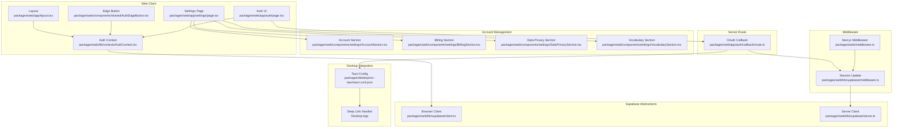

**Diagram sources**
- [packages/web/app/auth/page.tsx:1-274](file://packages/web/app/auth/page.tsx#L1-L274)
- [packages/web/lib/contexts/AuthContext.tsx:1-104](file://packages/web/lib/contexts/AuthContext.tsx#L1-L104)
- [packages/web/components/shared/AuthEdgeButton.tsx:1-208](file://packages/web/components/shared/AuthEdgeButton.tsx#L1-L208)
- [packages/web/app/layout.tsx:1-92](file://packages/web/app/layout.tsx#L1-L92)
- [packages/web/app/settings/page.tsx:1-190](file://packages/web/app/settings/page.tsx#L1-L190)
- [packages/web/components/settings/AccountSection.tsx:1-156](file://packages/web/components/settings/AccountSection.tsx#L1-L156)
- [packages/web/lib/supabase/client.ts:1-34](file://packages/web/lib/supabase/client.ts#L1-L34)
- [packages/web/lib/supabase/server.ts:1-37](file://packages/web/lib/supabase/server.ts#L1-L37)
- [packages/web/middleware.ts:1-21](file://packages/web/middleware.ts#L1-L21)
- [packages/web/lib/supabase/middleware.ts:1-81](file://packages/web/lib/supabase/middleware.ts#L1-L81)
- [packages/web/app/auth/callback/route.ts:1-40](file://packages/web/app/auth/callback/route.ts#L1-L40)
- [packages/desktop/src-tauri/tauri.conf.json:1-51](file://packages/desktop/src-tauri/tauri.conf.json#L1-L51)

**Section sources**
- [packages/web/app/auth/page.tsx:1-274](file://packages/web/app/auth/page.tsx#L1-L274)
- [packages/web/lib/contexts/AuthContext.tsx:1-104](file://packages/web/lib/contexts/AuthContext.tsx#L1-L104)
- [packages/web/components/shared/AuthEdgeButton.tsx:1-208](file://packages/web/components/shared/AuthEdgeButton.tsx#L1-L208)
- [packages/web/app/layout.tsx:1-92](file://packages/web/app/layout.tsx#L1-L92)
- [packages/web/app/settings/page.tsx:1-190](file://packages/web/app/settings/page.tsx#L1-L190)
- [packages/web/components/settings/AccountSection.tsx:1-156](file://packages/web/components/settings/AccountSection.tsx#L1-L156)
- [packages/web/lib/supabase/client.ts:1-34](file://packages/web/lib/supabase/client.ts#L1-L34)
- [packages/web/lib/supabase/server.ts:1-37](file://packages/web/lib/supabase/server.ts#L1-L37)
- [packages/web/middleware.ts:1-21](file://packages/web/middleware.ts#L1-L21)
- [packages/web/lib/supabase/middleware.ts:1-81](file://packages/web/lib/supabase/middleware.ts#L1-L81)
- [packages/web/app/auth/callback/route.ts:1-40](file://packages/web/app/auth/callback/route.ts#L1-L40)
- [packages/desktop/src-tauri/tauri.conf.json:1-51](file://packages/desktop/src-tauri/tauri.conf.json#L1-L51)

## Core Components
- Supabase browser client: Singleton wrapper ensuring consistent auth state across the client.
- Supabase server client: Cookie-aware SSR client for server-side session reads/writes.
- Auth context: Provides user/session state, Google OAuth initiation, and sign-out to React components.
- OAuth callback route: Exchanges the OAuth code for a session and supports both web and desktop flows.
- Middleware: Refreshes session cookies on every request and enforces route protection.
- Auth edge button: A responsive floating control for sign-in/sign-out and navigation to profile-related pages.
- Enhanced settings page: Dynamic loading of account management sections including profile, billing, vocabulary, and privacy.
- Account section: Dedicated component for profile information display, password management guidance, and secure account deletion.
- Tauri deep-link plugin: Handles custom scheme authentication for desktop applications.

Key responsibilities:
- Client initialization and session persistence
- Social login via Google OAuth with desktop deep link support
- Automatic session refresh and route protection
- Hybrid authentication flow handling for web and desktop contexts
- Comprehensive account management with profile, billing, vocabulary, and privacy sections
- Secure account deletion processes with user confirmation
- Desktop application integration through custom URI schemes

**Section sources**
- [packages/web/lib/supabase/client.ts:1-34](file://packages/web/lib/supabase/client.ts#L1-L34)
- [packages/web/lib/supabase/server.ts:1-37](file://packages/web/lib/supabase/server.ts#L1-L37)
- [packages/web/lib/contexts/AuthContext.tsx:1-104](file://packages/web/lib/contexts/AuthContext.tsx#L1-L104)
- [packages/web/app/auth/callback/route.ts:1-40](file://packages/web/app/auth/callback/route.ts#L1-L40)
- [packages/web/lib/supabase/middleware.ts:1-81](file://packages/web/lib/supabase/middleware.ts#L1-L81)
- [packages/web/components/shared/AuthEdgeButton.tsx:1-208](file://packages/web/components/shared/AuthEdgeButton.tsx#L1-L208)
- [packages/web/app/settings/page.tsx:1-190](file://packages/web/app/settings/page.tsx#L1-L190)
- [packages/web/components/settings/AccountSection.tsx:1-156](file://packages/web/components/settings/AccountSection.tsx#L1-L156)
- [packages/desktop/src-tauri/tauri.conf.json:12-19](file://packages/desktop/src-tauri/tauri.conf.json#L12-L19)

## Architecture Overview
The system uses Supabase Auth with OAuth and has been enhanced with desktop deep link integration and comprehensive account management capabilities. The hybrid flow supports both web and desktop contexts with dedicated account management sections:
- Client triggers Google OAuth via the context.
- Supabase redirects to Google for consent.
- Google redirects back to the app's OAuth callback with an authorization code.
- The server exchanges the code for a session and determines the flow context.
- For web: Redirect to post-callback page for session synchronization.
- For desktop: Redirect to custom URI scheme with session tokens.
- Middleware ensures subsequent requests carry the latest session.
- Protected routes redirect unauthenticated users to the login page.
- Enhanced settings page provides dynamic loading of account management sections.

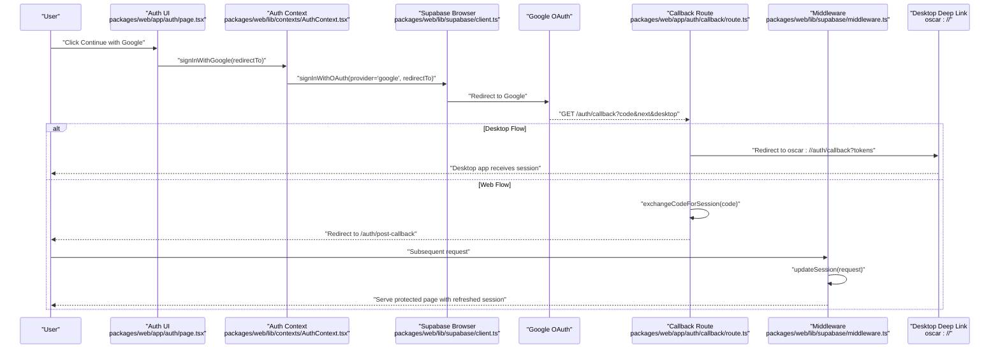

**Diagram sources**
- [packages/web/app/auth/page.tsx:159-172](file://packages/web/app/auth/page.tsx#L159-L172)
- [packages/web/lib/contexts/AuthContext.tsx:59-81](file://packages/web/lib/contexts/AuthContext.tsx#L59-L81)
- [packages/web/lib/supabase/client.ts:12-25](file://packages/web/lib/supabase/client.ts#L12-L25)
- [packages/web/app/auth/callback/route.ts:4-39](file://packages/web/app/auth/callback/route.ts#L4-L39)
- [packages/web/lib/supabase/middleware.ts:4-80](file://packages/web/lib/supabase/middleware.ts#L4-L80)

## Enhanced Account Management System
The system now includes a comprehensive account management section that provides users with complete control over their account information and security:

### Account Section Features
- **Profile Information Management**: Displays user email and unique user ID with read-only fields
- **Password Management**: Provides guidance for password changes through Google account settings
- **Secure Account Deletion**: Implements a two-step confirmation process with comprehensive data deletion warnings
- **Responsive Design**: Adapts to different screen sizes with card-based layout and appropriate spacing

### Account Deletion Process
The account deletion process follows strict security protocols:
1. User initiates deletion from the Account Section
2. Confirmation dialog displays comprehensive data loss information
3. User confirms deletion through AlertDialog
4. System processes deletion request with loading states
5. User receives feedback through toast notifications
6. Support-based deletion process (currently implemented as TODO)

### Settings Page Integration
The settings page dynamically loads account management sections with:
- Lazy loading for improved performance
- Skeleton loading states during component initialization
- Tab-based navigation for different account management areas
- Responsive design with mobile dropdown and desktop tabs

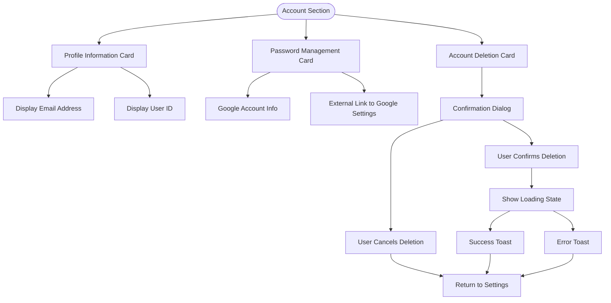

**Diagram sources**
- [packages/web/components/settings/AccountSection.tsx:47-152](file://packages/web/components/settings/AccountSection.tsx#L47-L152)

**Section sources**
- [packages/web/components/settings/AccountSection.tsx:1-156](file://packages/web/components/settings/AccountSection.tsx#L1-L156)
- [packages/web/app/settings/page.tsx:1-190](file://packages/web/app/settings/page.tsx#L1-L190)

## Desktop Deep Link Integration
The authentication system now supports desktop applications through Tauri's deep link plugin. This enables seamless authentication experiences across platforms:

### Tauri Configuration
- Custom URI scheme: `oscar://`
- Deep link plugin enabled for desktop platform
- Mobile platform configuration available but currently empty

### Desktop Authentication Flow
1. Desktop app initiates OAuth flow
2. User authenticates via Google
3. OAuth callback detects desktop context (`desktop=true`)
4. Server responds with deep link redirect containing session tokens
5. Desktop app receives tokens and establishes local session

### Token Handling
Desktop flow passes session tokens directly:
- Access token for API authentication
- Refresh token for session renewal
- Expiration time for token lifecycle management

**Section sources**
- [packages/desktop/src-tauri/tauri.conf.json:12-19](file://packages/desktop/src-tauri/tauri.conf.json#L12-L19)
- [packages/web/app/auth/callback/route.ts:9-22](file://packages/web/app/auth/callback/route.ts#L9-L22)

## Detailed Component Analysis

### Supabase Browser Client
- Purpose: Provide a singleton Supabase browser client configured with public environment variables.
- Behavior: Creates a single client instance to prevent auth state inconsistencies across components.

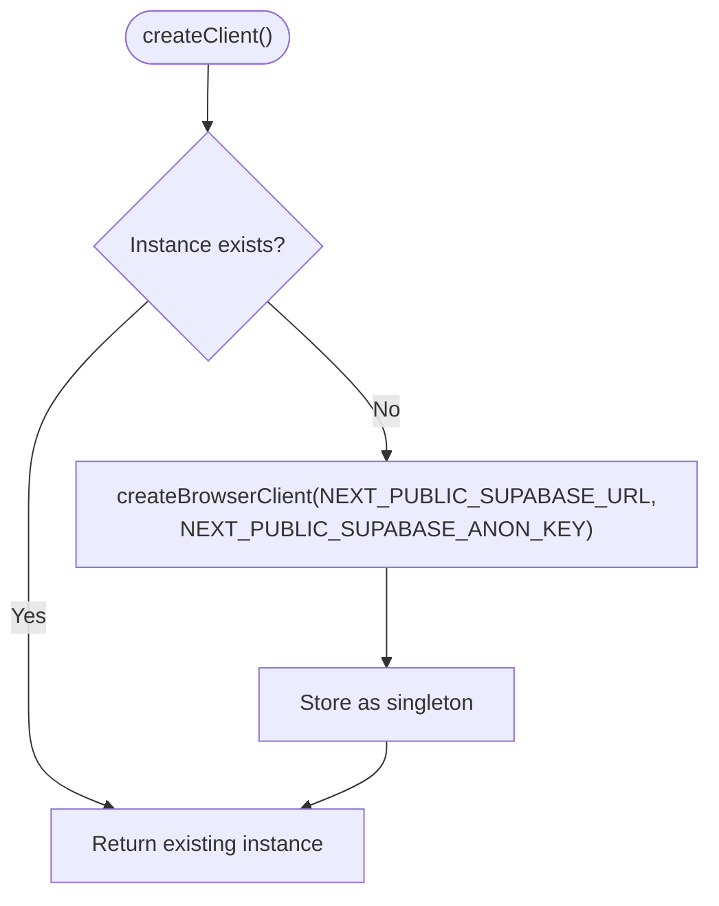

**Diagram sources**
- [packages/web/lib/supabase/client.ts:12-25](file://packages/web/lib/supabase/client.ts#L12-L25)

**Section sources**
- [packages/web/lib/supabase/client.ts:1-34](file://packages/web/lib/supabase/client.ts#L1-L34)

### Supabase Server Client
- Purpose: Provide a server-side client that reads and writes cookies for session persistence.
- Behavior: Uses Next.js cookies API to synchronize auth cookies with the response.

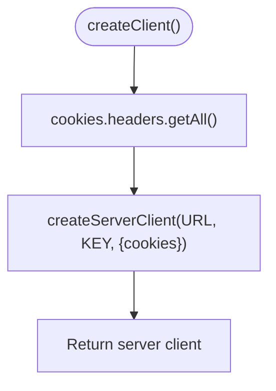

**Diagram sources**
- [packages/web/lib/supabase/server.ts:4-36](file://packages/web/lib/supabase/server.ts#L4-L36)

**Section sources**
- [packages/web/lib/supabase/server.ts:1-37](file://packages/web/lib/supabase/server.ts#L1-L37)

### Auth Context (React Provider)
- Purpose: Manage user/session state, expose sign-in/sign-out, and subscribe to auth state changes.
- Key actions:
  - Initialize session on mount
  - Subscribe to auth state changes
  - Sign in with Google OAuth and set redirect URL
  - Sign out

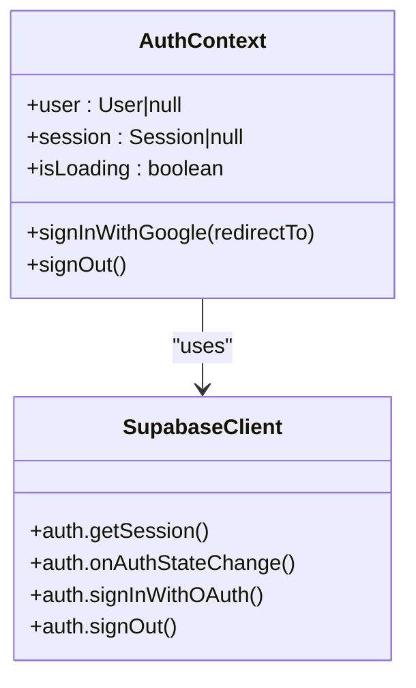

**Diagram sources**
- [packages/web/lib/contexts/AuthContext.tsx:14-103](file://packages/web/lib/contexts/AuthContext.tsx#L14-L103)
- [packages/web/lib/supabase/client.ts:12-25](file://packages/web/lib/supabase/client.ts#L12-L25)

**Section sources**
- [packages/web/lib/contexts/AuthContext.tsx:1-104](file://packages/web/lib/contexts/AuthContext.tsx#L1-L104)

### Enhanced OAuth Callback Route
- Purpose: Accept the OAuth authorization code and exchange it for a session with desktop flow support.
- Behavior: 
  - Detects desktop flow via `desktop=true` parameter
  - For desktop: Redirects to `oscar://` deep link with session tokens
  - For web: Redirects to post-callback page for session synchronization
  - Handles authentication errors for both contexts

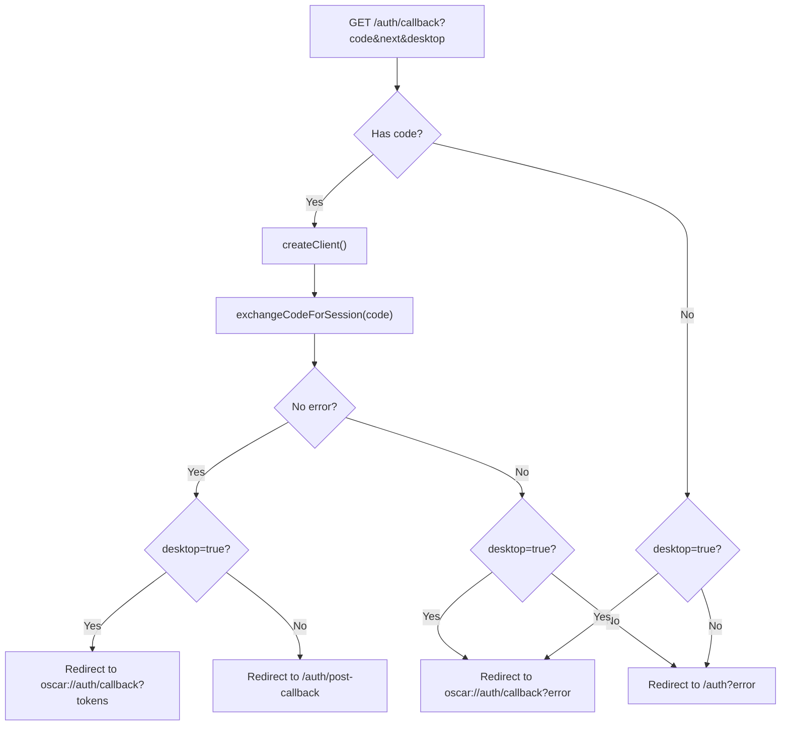

**Diagram sources**
- [packages/web/app/auth/callback/route.ts:4-39](file://packages/web/app/auth/callback/route.ts#L4-L39)

**Section sources**
- [packages/web/app/auth/callback/route.ts:1-40](file://packages/web/app/auth/callback/route.ts#L1-L40)

### Middleware and Session Protection
- Purpose: Refresh session cookies on every request and enforce route protection.
- Protected routes: recording, results, notes, settings, billing.
- Behavior:
  - If accessing a protected path without a user, redirect to auth with the intended path.
  - If accessing the auth page while logged in, redirect to the intended path.

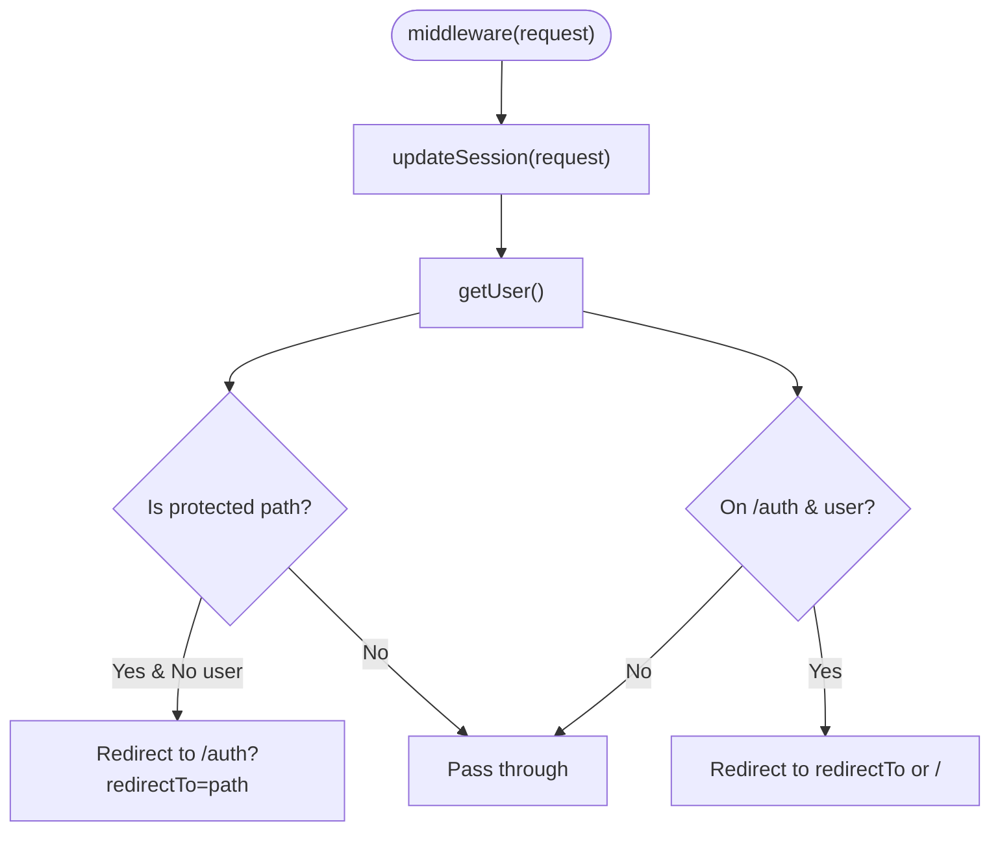

**Diagram sources**
- [packages/web/middleware.ts:4-6](file://packages/web/middleware.ts#L4-L6)
- [packages/web/lib/supabase/middleware.ts:44-77](file://packages/web/lib/supabase/middleware.ts#L44-L77)

**Section sources**
- [packages/web/middleware.ts:1-21](file://packages/web/middleware.ts#L1-L21)
- [packages/web/lib/supabase/middleware.ts:1-81](file://packages/web/lib/supabase/middleware.ts#L1-L81)

### Authentication Edge Button
- Purpose: Provide a responsive floating control for quick sign-in/out and navigation to notes/settings.
- Behavior:
  - Shows icons on mobile; horizontal sliding label on desktop.
  - Displays user avatar or initials when signed in.
  - Navigates to auth page or performs sign-out.

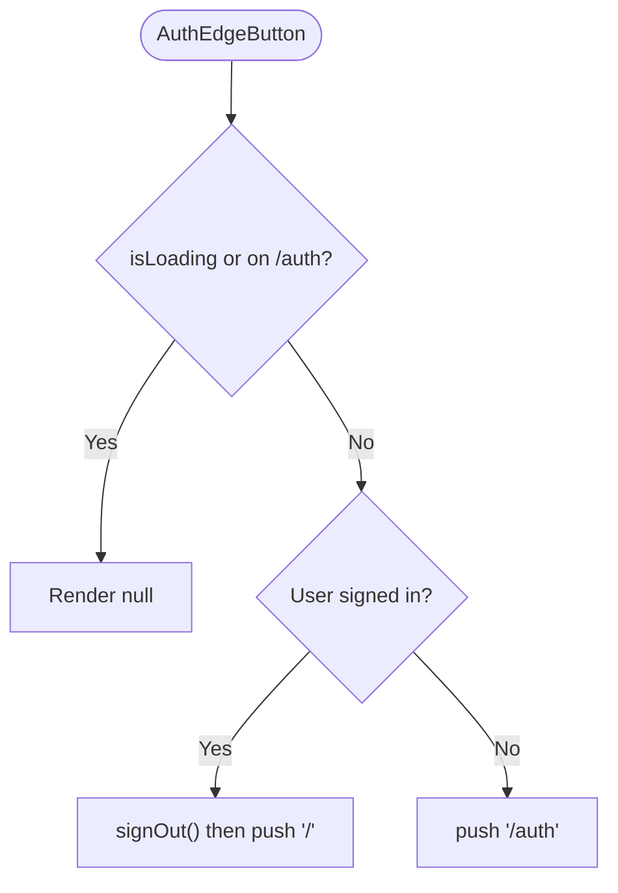

**Diagram sources**
- [packages/web/components/shared/AuthEdgeButton.tsx:17-34](file://packages/web/components/shared/AuthEdgeButton.tsx#L17-L34)

**Section sources**
- [packages/web/components/shared/AuthEdgeButton.tsx:1-208](file://packages/web/components/shared/AuthEdgeButton.tsx#L1-L208)
- [packages/web/lib/constants.ts:186-195](file://packages/web/lib/constants.ts#L186-L195)

### Enhanced Settings Page Integration
- Purpose: Demonstrate protected route behavior and user-dependent rendering with dynamic loading of account management sections.
- Behavior:
  - Redirects to auth with a return-to parameter if not authenticated.
  - Dynamically loads account, billing, vocabulary, and privacy sections.
  - Implements skeleton loading states for improved user experience.
  - Provides responsive tab-based navigation.

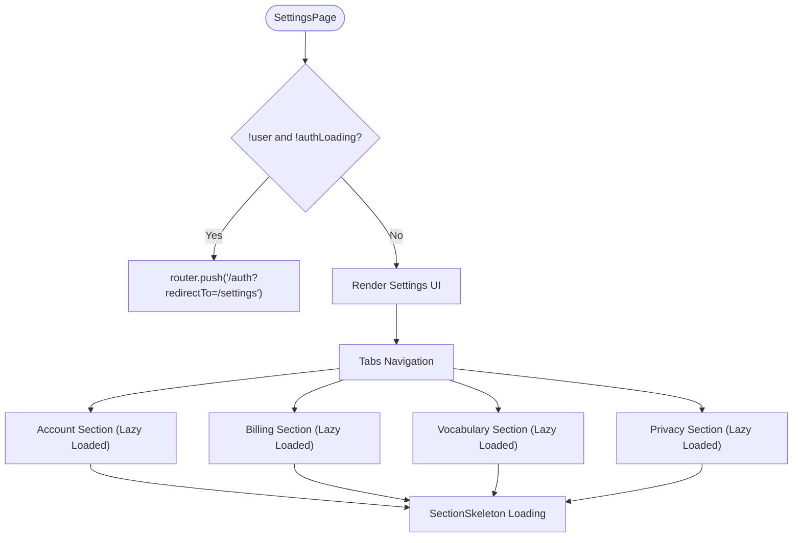

**Diagram sources**
- [packages/web/app/settings/page.tsx:60-189](file://packages/web/app/settings/page.tsx#L60-L189)

**Section sources**
- [packages/web/app/settings/page.tsx:1-190](file://packages/web/app/settings/page.tsx#L1-L190)

### Account Section Component
- Purpose: Provide comprehensive account management capabilities including profile information, password management, and secure account deletion.
- Key features:
  - Profile information display with email and user ID
  - Password management guidance for Google OAuth users
  - Secure account deletion with confirmation dialog
  - Responsive card-based design with appropriate styling
  - Toast notifications for user feedback

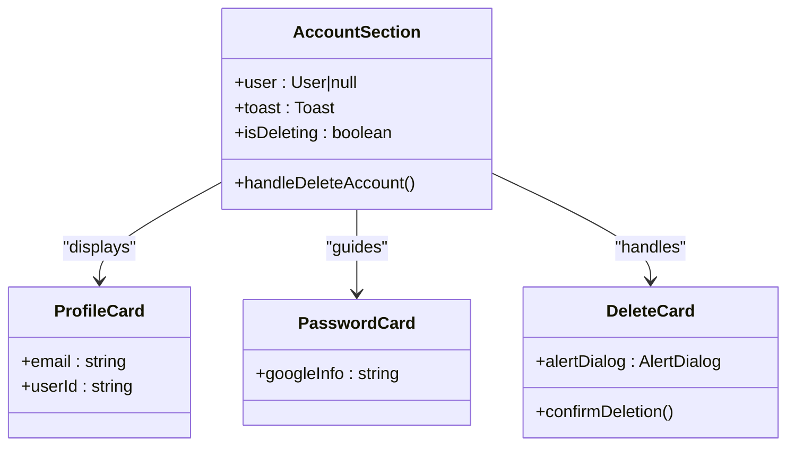

**Diagram sources**
- [packages/web/components/settings/AccountSection.tsx:23-156](file://packages/web/components/settings/AccountSection.tsx#L23-L156)

**Section sources**
- [packages/web/components/settings/AccountSection.tsx:1-156](file://packages/web/components/settings/AccountSection.tsx#L1-L156)

## Dependency Analysis
- Client-side depends on the browser Supabase client and the auth context.
- Server-side depends on the server Supabase client and middleware.
- Middleware depends on the server client and Next.js cookies API.
- Auth UI and edge button depend on the auth context.
- Settings page depends on the auth context and constants for routing.
- Account section depends on auth context, toast notifications, and alert dialogs.
- Desktop integration depends on Tauri deep-link plugin configuration.

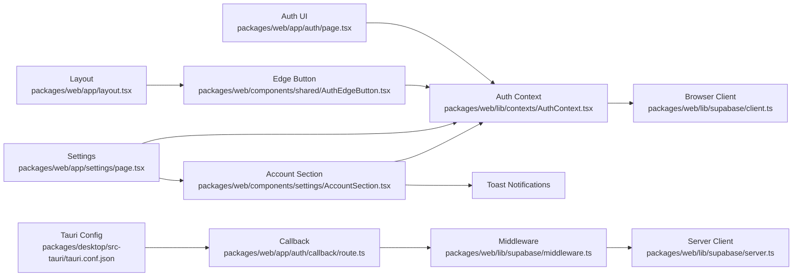

**Diagram sources**
- [packages/web/app/auth/page.tsx:1-274](file://packages/web/app/auth/page.tsx#L1-L274)
- [packages/web/lib/contexts/AuthContext.tsx:1-104](file://packages/web/lib/contexts/AuthContext.tsx#L1-L104)
- [packages/web/components/shared/AuthEdgeButton.tsx:1-208](file://packages/web/components/shared/AuthEdgeButton.tsx#L1-L208)
- [packages/web/lib/supabase/client.ts:1-34](file://packages/web/lib/supabase/client.ts#L1-L34)
- [packages/web/lib/supabase/middleware.ts:1-81](file://packages/web/lib/supabase/middleware.ts#L1-L81)
- [packages/web/lib/supabase/server.ts:1-37](file://packages/web/lib/supabase/server.ts#L1-L37)
- [packages/web/app/auth/callback/route.ts:1-40](file://packages/web/app/auth/callback/route.ts#L1-L40)
- [packages/web/app/layout.tsx:1-92](file://packages/web/app/layout.tsx#L1-L92)
- [packages/web/app/settings/page.tsx:1-190](file://packages/web/app/settings/page.tsx#L1-L190)
- [packages/web/components/settings/AccountSection.tsx:1-156](file://packages/web/components/settings/AccountSection.tsx#L1-L156)
- [packages/desktop/src-tauri/tauri.conf.json:12-19](file://packages/desktop/src-tauri/tauri.conf.json#L12-L19)

**Section sources**
- [packages/web/lib/contexts/AuthContext.tsx:1-104](file://packages/web/lib/contexts/AuthContext.tsx#L1-L104)
- [packages/web/lib/supabase/client.ts:1-34](file://packages/web/lib/supabase/client.ts#L1-L34)
- [packages/web/lib/supabase/server.ts:1-37](file://packages/web/lib/supabase/server.ts#L1-L37)
- [packages/web/lib/supabase/middleware.ts:1-81](file://packages/web/lib/supabase/middleware.ts#L1-L81)
- [packages/web/middleware.ts:1-21](file://packages/web/middleware.ts#L1-L21)
- [packages/web/app/auth/callback/route.ts:1-40](file://packages/web/app/auth/callback/route.ts#L1-L40)
- [packages/web/app/auth/page.tsx:1-274](file://packages/web/app/auth/page.tsx#L1-L274)
- [packages/web/components/shared/AuthEdgeButton.tsx:1-208](file://packages/web/components/shared/AuthEdgeButton.tsx#L1-L208)
- [packages/web/app/layout.tsx:1-92](file://packages/web/app/layout.tsx#L1-L92)
- [packages/web/app/settings/page.tsx:1-190](file://packages/web/app/settings/page.tsx#L1-L190)
- [packages/web/components/settings/AccountSection.tsx:1-156](file://packages/web/components/settings/AccountSection.tsx#L1-L156)
- [packages/desktop/src-tauri/tauri.conf.json:1-51](file://packages/desktop/src-tauri/tauri.conf.json#L1-L51)

## Performance Considerations
- Use the singleton browser client to avoid duplicate listeners and inconsistent auth state.
- Rely on middleware to refresh sessions automatically on every request to minimize stale cookies.
- Keep OAuth redirect URLs minimal and deterministic to reduce overhead.
- Defer heavy UI sections (e.g., settings) using dynamic imports to improve initial load performance.
- Avoid unnecessary re-renders by memoizing callbacks in the auth context.
- Optimize desktop deep link handling to minimize authentication latency.
- Cache session tokens securely in desktop applications for reduced authentication frequency.
- Implement skeleton loading states for dynamic components to improve perceived performance.
- Use lazy loading for account management sections to reduce initial bundle size.

## Troubleshooting Guide
Common issues and resolutions:
- OAuth callback fails silently
  - Ensure the callback URL matches the environment configuration and includes the intended destination.
  - Verify the server client is used in the callback route to exchange the code for a session.
  - Check desktop flow detection via `desktop=true` parameter.
- Redirect loops after login
  - Confirm middleware protected paths and the presence of a valid user session.
  - Ensure cookies are readable by the server and that the server client is configured correctly.
  - Verify desktop deep link scheme registration in operating system.
- Auth edge button does not appear
  - Check that the button is rendered outside the auth page and that the auth state is not loading.
- Protected page shows blank or redirects incorrectly
  - Verify the auth context exposes a user and that the middleware matcher excludes static assets and API routes.
- Desktop authentication fails
  - Ensure Tauri deep-link plugin is properly configured with custom scheme 'oscar'.
  - Verify desktop app can handle `oscar://` URI scheme.
  - Check that session tokens are properly extracted from deep link parameters.
- Account section not loading
  - Verify dynamic import is properly configured in settings page.
  - Check that AccountSection component is exported correctly.
  - Ensure auth context is available when component mounts.
- Account deletion not working
  - Check that AlertDialog is properly imported and configured.
  - Verify toast notifications are working correctly.
  - Ensure account deletion API endpoint is implemented.

**Section sources**
- [packages/web/app/auth/callback/route.ts:1-40](file://packages/web/app/auth/callback/route.ts#L1-L40)
- [packages/web/lib/supabase/middleware.ts:44-77](file://packages/web/lib/supabase/middleware.ts#L44-L77)
- [packages/web/components/shared/AuthEdgeButton.tsx:23-24](file://packages/web/components/shared/AuthEdgeButton.tsx#L23-L24)
- [packages/web/middleware.ts:8-20](file://packages/web/middleware.ts#L8-L20)
- [packages/desktop/src-tauri/tauri.conf.json:12-19](file://packages/desktop/src-tauri/tauri.conf.json#L12-L19)
- [packages/web/app/settings/page.tsx:35-40](file://packages/web/app/settings/page.tsx#L35-L40)
- [packages/web/components/settings/AccountSection.tsx:116-150](file://packages/web/components/settings/AccountSection.tsx#L116-L150)

## Migration and Best Practices
- Environment variables
  - Ensure NEXT_PUBLIC_SUPABASE_URL and NEXT_PUBLIC_SUPABASE_ANON_KEY are set consistently across environments.
  - For OAuth, configure providers in the Supabase dashboard and ensure redirect URLs match the application's base URL.
- Session expiration and refresh
  - Rely on middleware to refresh sessions on each request; avoid manual cookie parsing in components.
  - Keep the auth context as the single source of truth for user/session state.
  - Implement proper token lifecycle management for desktop applications.
- Security
  - Treat JWT tokens as opaque; do not parse claims manually unless necessary.
  - Enforce row-level security policies on the backend and validate permissions server-side where sensitive operations occur.
  - Limit sensitive operations to authenticated users and use protected routes.
  - Securely store desktop session tokens and implement proper token rotation.
  - Implement proper validation for account deletion requests.
  - Use confirmation dialogs for destructive operations.
- User data protection
  - Never log tokens or session details.
  - Sanitize user metadata and avoid storing sensitive data in user_metadata.
  - Implement proper error handling for desktop authentication failures.
  - Ensure account deletion processes follow GDPR compliance guidelines.
- Desktop integration
  - Configure Tauri deep-link plugin with appropriate custom schemes.
  - Handle desktop-specific authentication flows separately from web flows.
  - Implement proper error recovery for desktop authentication attempts.
- Migration notes
  - When adding new protected routes, update the middleware's protected paths list.
  - When changing OAuth providers, update the provider name and any required query parameters in the auth context.
  - When introducing new UI controls that require authentication, gate them using the auth context and redirect logic.
  - For desktop applications, implement proper deep link handling and token management.
  - When adding new account management features, ensure proper integration with existing settings page structure.
  - Implement proper loading states and error handling for dynamic components.

## Conclusion
The authentication system leverages Supabase Auth with Google OAuth, a robust middleware-driven session refresh mechanism, and a centralized auth context for React components. The system has been substantially enhanced with desktop deep link integration through Tauri, enabling seamless authentication across web and desktop contexts. The new comprehensive account management system provides users with complete control over their account information, including profile management, password guidance, and secure account deletion processes. The hybrid approach provides secure, seamless user management with automatic session handling, route protection, desktop-specific authentication flows, and enhanced account management capabilities. Following the best practices and troubleshooting guidance ensures reliable operation and maintainability across all supported platforms.