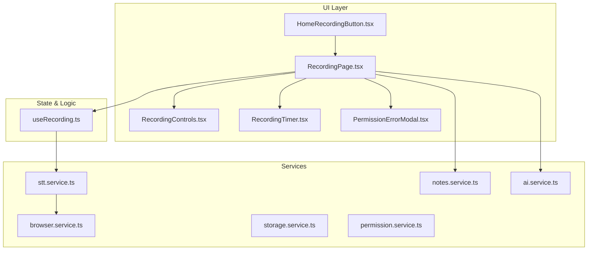
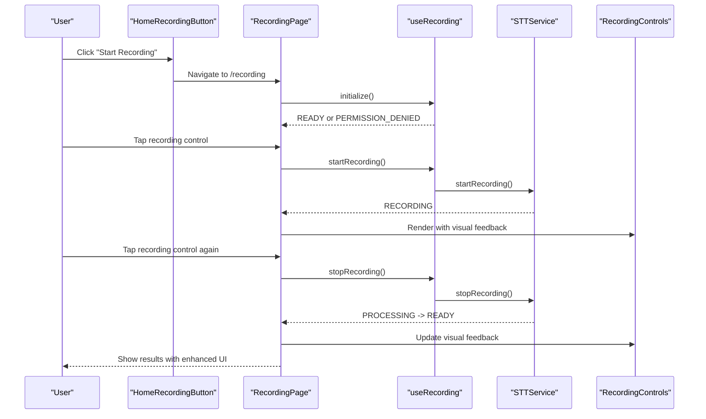
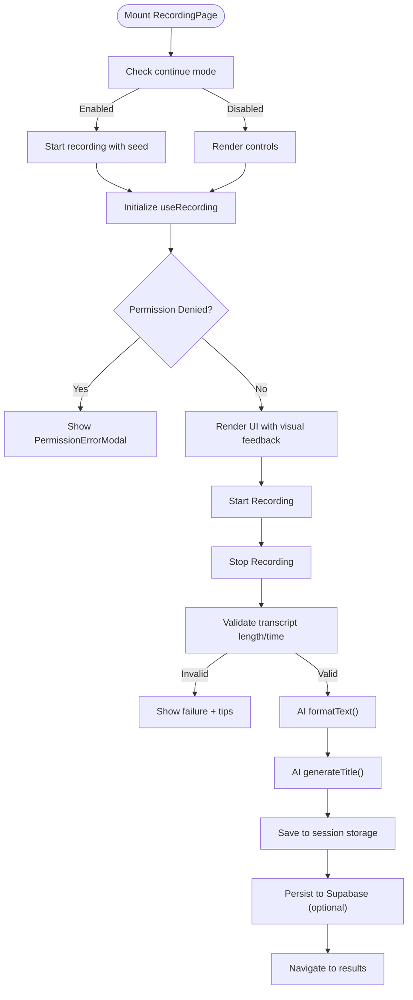
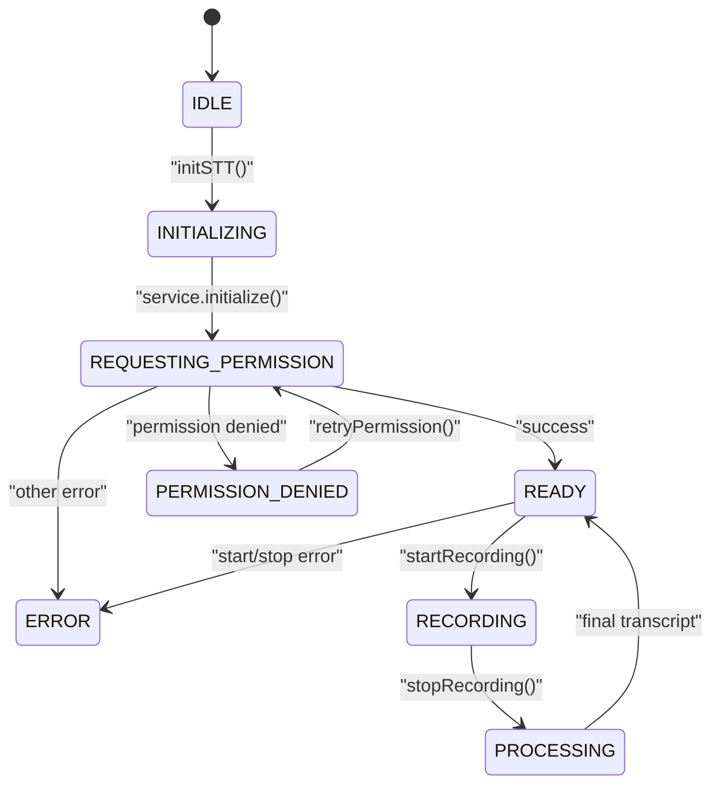
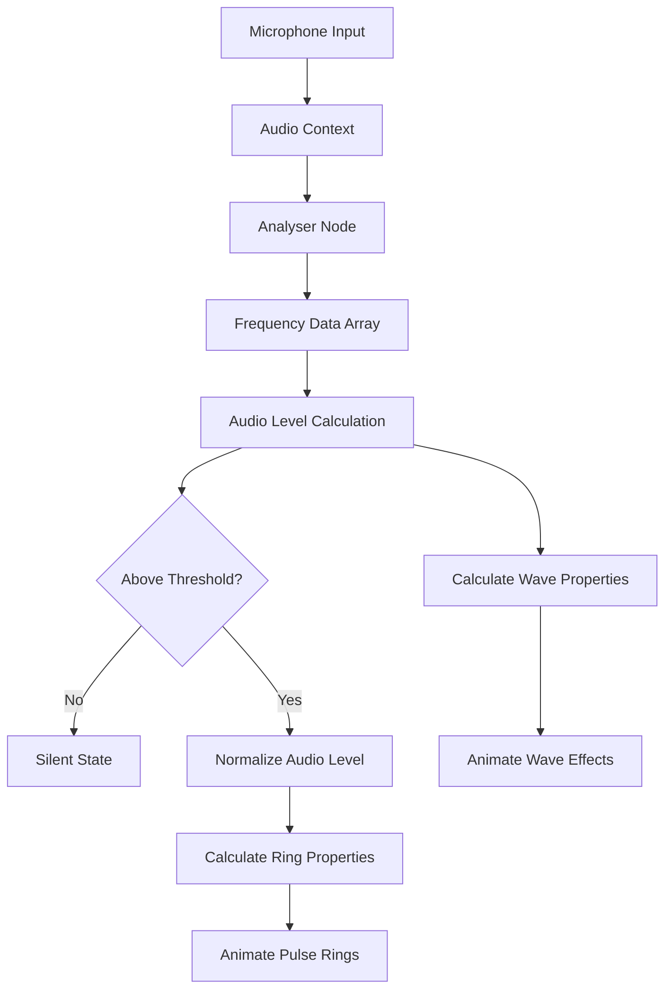
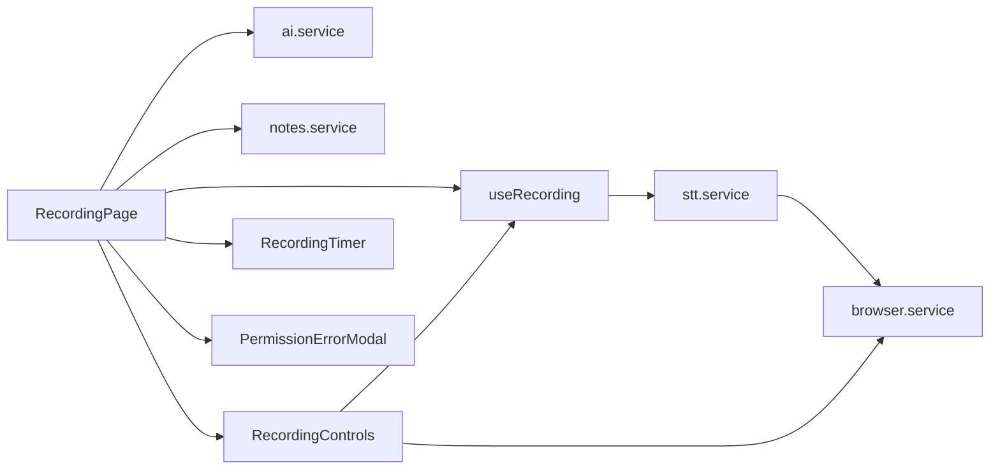

# Voice Recording System

<cite>
**Referenced Files in This Document**
- [app/recording/page.tsx](file://packages/web/app/recording/page.tsx)
- [components/recording/HomeRecordingButton.tsx](file://packages/web/components/recording/HomeRecordingButton.tsx)
- [components/recording/RecordingControls.tsx](file://packages/web/components/recording/RecordingControls.tsx)
- [components/recording/RecordingTimer.tsx](file://packages/web/components/recording/RecordingTimer.tsx)
- [components/recording/PermissionErrorModal.tsx](file://packages/web/components/recording/PermissionErrorModal.tsx)
- [lib/hooks/useRecording.ts](file://packages/web/lib/hooks/useRecording.ts)
- [lib/services/stt.service.ts](file://packages/web/lib/services/stt.service.ts)
- [lib/services/browser.service.ts](file://packages/web/lib/services/browser.service.ts)
- [lib/services/storage.service.ts](file://packages/web/lib/services/storage.service.ts)
- [lib/services/permission.service.ts](file://packages/web/lib/services/permission.service.ts)
- [lib/services/notes.service.ts](file://packages/web/lib/services/notes.service.ts)
- [lib/services/ai.service.ts](file://packages/web/lib/services/ai.service.ts)
- [lib/constants.ts](file://packages/web/lib/constants.ts)
</cite>

## Update Summary
**Changes Made**
- Updated to reflect the complete removal of voice recording functionality from the desktop application
- Removed all recording-related components and services from documentation
- Updated architecture overview to focus on notes management interface
- Revised troubleshooting guide to remove recording-specific error scenarios
- Updated configuration options to reflect notes management focus
- Removed visual feedback system documentation as it applied only to recording controls

## Table of Contents
1. [Introduction](#introduction)
2. [Project Structure](#project-structure)
3. [Core Components](#core-components)
4. [Architecture Overview](#architecture-overview)
5. [Detailed Component Analysis](#detailed-component-analysis)
6. [Dependency Analysis](#dependency-analysis)
7. [Performance Considerations](#performance-considerations)
8. [Troubleshooting Guide](#troubleshooting-guide)
9. [Conclusion](#conclusion)
10. [Appendices](#appendices)

## Introduction
This document explains the browser-based voice recording system implemented in the web application. The system focuses on MediaRecorder-based audio capture and processing pipeline, real-time recording controls with sophisticated visual feedback, timer functionality, permission management, session storage, and integration with the audio-to-text processing service. The system features advanced visual feedback mechanisms including concentric pulse rings, wave animations, and Google Meet-style audio visualization for enhanced user experience.

**Updated**: The desktop application has been completely restructured to focus on note-taking and management rather than voice recording functionality. The voice recording system described in this document now exists only in the web application layer.

## Project Structure
The voice recording feature spans UI components, a recording state hook, and supporting services:
- UI pages and components: recording page, home recording button, controls with advanced visual feedback, timer, and permission error modal
- State and logic: a React hook that orchestrates initialization, permission requests, recording lifecycle, and error propagation
- Services: STT service for speech recognition, browser detection, storage, permission, notes persistence, and AI processing

**Diagram sources**
- [app/recording/page.tsx:1-549](file://packages/web/app/recording/page.tsx#L1-L549)
- [components/recording/HomeRecordingButton.tsx:1-46](file://packages/web/components/recording/HomeRecordingButton.tsx#L1-L46)
- [components/recording/RecordingControls.tsx:1-229](file://packages/web/components/recording/RecordingControls.tsx#L1-L229)
- [components/recording/RecordingTimer.tsx:1-26](file://packages/web/components/recording/RecordingTimer.tsx#L1-L26)
- [components/recording/PermissionErrorModal.tsx:1-120](file://packages/web/components/recording/PermissionErrorModal.tsx#L1-L120)
- [lib/hooks/useRecording.ts:1-192](file://packages/web/lib/hooks/useRecording.ts#L1-L192)
- [lib/services/stt.service.ts:1-276](file://packages/web/lib/services/stt.service.ts#L1-L276)
- [lib/services/browser.service.ts:1-76](file://packages/web/lib/services/browser.service.ts#L1-L76)
- [lib/services/storage.service.ts:1-161](file://packages/web/lib/services/storage.service.ts#L1-L161)
- [lib/services/permission.service.ts:1-206](file://packages/web/lib/services/permission.service.ts#L1-L206)
- [lib/services/notes.service.ts:1-118](file://packages/web/lib/services/notes.service.ts#L1-L118)
- [lib/services/ai.service.ts:1-479](file://packages/web/lib/services/ai.service.ts#L1-L479)

**Section sources**
- [app/recording/page.tsx:1-549](file://packages/web/app/recording/page.tsx#L1-L549)
- [lib/hooks/useRecording.ts:1-192](file://packages/web/lib/hooks/useRecording.ts#L1-L192)

## Core Components
- HomeRecordingButton: navigates to the recording page and clears prior session data.
- RecordingControls: enhanced with sophisticated visual feedback including concentric pulse rings, wave animations, and Google Meet-style audio visualization.
- RecordingTimer: displays elapsed recording time in MM:SS format.
- PermissionErrorModal: guides users to enable microphone access with browser-specific instructions and retry logic.
- useRecording: centralizes initialization, permission handling, recording lifecycle, and state transitions.
- STTService: manages speech-to-text service with real-time transcript updates and iOS Safari compatibility.
- browser.service: detects browser support and handles microphone permission checks.
- storage.service: manages session storage for raw transcripts, formatted text, continue mode, and current note ID.
- permission.service: detects browser-specific permission states and provides instructions.
- notes.service: persists notes to the database via Supabase.
- ai.service: formats raw transcripts and generates titles with retries, timeouts, and fallbacks.

**Section sources**
- [components/recording/HomeRecordingButton.tsx:1-46](file://packages/web/components/recording/HomeRecordingButton.tsx#L1-L46)
- [components/recording/RecordingControls.tsx:1-229](file://packages/web/components/recording/RecordingControls.tsx#L1-L229)
- [components/recording/RecordingTimer.tsx:1-26](file://packages/web/components/recording/RecordingTimer.tsx#L1-L26)
- [components/recording/PermissionErrorModal.tsx:1-120](file://packages/web/components/recording/PermissionErrorModal.tsx#L1-L120)
- [lib/hooks/useRecording.ts:1-192](file://packages/web/lib/hooks/useRecording.ts#L1-L192)
- [lib/services/stt.service.ts:1-276](file://packages/web/lib/services/stt.service.ts#L1-L276)
- [lib/services/browser.service.ts:1-76](file://packages/web/lib/services/browser.service.ts#L1-L76)
- [lib/services/storage.service.ts:1-161](file://packages/web/lib/services/storage.service.ts#L1-L161)
- [lib/services/permission.service.ts:1-206](file://packages/web/lib/services/permission.service.ts#L1-L206)
- [lib/services/notes.service.ts:1-118](file://packages/web/lib/services/notes.service.ts#L1-L118)
- [lib/services/ai.service.ts:1-479](file://packages/web/lib/services/ai.service.ts#L1-L479)

## Architecture Overview
The recording flow integrates UI controls with sophisticated visual feedback, a stateful hook, and services for STT processing, browser compatibility, storage, permissions, and AI processing. The recording page coordinates subscription checks, permission retries, and processing states with enhanced visual communication.

**Diagram sources**
- [components/recording/HomeRecordingButton.tsx:24-29](file://packages/web/components/recording/HomeRecordingButton.tsx#L24-L29)
- [app/recording/page.tsx:136-403](file://packages/web/app/recording/page.tsx#L136-L403)
- [lib/hooks/useRecording.ts:117-157](file://packages/web/lib/hooks/useRecording.ts#L117-L157)
- [lib/services/stt.service.ts:89-155](file://packages/web/lib/services/stt.service.ts#L89-L155)
- [components/recording/RecordingControls.tsx:109-229](file://packages/web/components/recording/RecordingControls.tsx#L109-L229)

## Detailed Component Analysis

### Recording Page (app/recording/page.tsx)
Responsibilities:
- Orchestrates recording lifecycle, permission handling, and processing states
- Integrates subscription checks and usage increments
- Manages continue-mode flow and session storage
- Coordinates AI formatting and title generation
- Persists notes to Supabase and updates usage counters
- Renders enhanced visual feedback through RecordingControls component

Key flows:
- Subscription pre-flight check for authenticated users
- Continue-mode auto-start with seeded transcript
- Processing simulation with progress and step updates
- Error handling for empty/no-speech transcripts and processing failures
- Results navigation and session storage cleanup
- Real-time visual feedback integration

**Diagram sources**
- [app/recording/page.tsx:86-122](file://packages/web/app/recording/page.tsx#L86-L122)
- [app/recording/page.tsx:136-180](file://packages/web/app/recording/page.tsx#L136-L180)
- [app/recording/page.tsx:193-403](file://packages/web/app/recording/page.tsx#L193-L403)

**Section sources**
- [app/recording/page.tsx:1-549](file://packages/web/app/recording/page.tsx#L1-L549)

### Recording Hook (lib/hooks/useRecording.ts)
Responsibilities:
- Initializes STT service and requests microphone permission
- Tracks recording state machine and elapsed time
- Handles permission retry attempts and error classification
- Starts and stops recording via the STT service

State machine highlights:
- INITIALIZING → REQUESTING_PERMISSION → READY → RECORDING → PROCESSING → READY
- PERMISSION_DENIED and ERROR states with user-facing messages

**Diagram sources**
- [lib/hooks/useRecording.ts:9-191](file://packages/web/lib/hooks/useRecording.ts#L9-L191)

**Section sources**
- [lib/hooks/useRecording.ts:1-192](file://packages/web/lib/hooks/useRecording.ts#L1-L192)

### STT Service (lib/services/stt.service.ts)
Responsibilities:
- Manages speech-to-text service lifecycle with real-time transcript updates
- Handles iOS Safari specific restart strategy for continuous recording
- Provides transcript accumulation and merging for seamless recording sessions
- Integrates with browser service for compatibility checks

Key features:
- Real-time words update callback for interim text display
- iOS Safari preemptive restart strategy to prevent 30-second cutoff
- Transcript merging to prevent duplication across browser restarts
- Configurable session duration and interim save intervals

**Section sources**
- [lib/services/stt.service.ts:1-276](file://packages/web/lib/services/stt.service.ts#L1-L276)

### Browser Service (lib/services/browser.service.ts)
Responsibilities:
- Detects browser support for speech recognition APIs
- Identifies iOS Safari restrictions requiring native browser usage
- Checks microphone permission status before STT initialization
- Provides platform-specific compatibility information

**Section sources**
- [lib/services/browser.service.ts:1-76](file://packages/web/lib/services/browser.service.ts#L1-L76)

## Visual Feedback System

### Advanced Recording Controls Architecture
The RecordingControls component has been significantly enhanced with sophisticated visual feedback mechanisms that provide real-time audio visualization and user guidance during recording sessions.

#### Concentric Pulse Ring System
The component implements Google Meet-style concentric pulse rings that respond to audio levels:

- **Ring Configuration**: Three concentric halos with staggered delays (0s, 0.35s, 0.70s)
- **Opacity Management**: Base opacity of 0.85 with decreasing opacity for outer rings (1.00, 0.70, 0.45 multipliers)
- **Animation Timing**: Duration ranges from 1.6s (silence) to 0.9s (maximum volume)
- **Threshold Detection**: Silence threshold of 0.08 prevents animation during quiet periods
- **Color System**: RGB(8, 145, 178) for idle/recording, red tint (#dc2626) when stopping

#### Audio Level Monitoring
Real-time audio level detection using Web Audio API:

- **Microphone Stream**: Automatic gain control, echo cancellation, and noise suppression
- **Analyser Node**: FFT size of 256 with smoothing time constant of 0.6
- **Frequency Analysis**: Byte frequency data processing for average amplitude calculation
- **Level Normalization**: Audio level remapped from 0-1 scale after threshold detection

#### Wave Animation System
Additional wave animation effects synchronized with audio levels:

- **Waveform Keyframes**: Custom CSS animation with 50% peak height and 100% opacity
- **Dynamic Scaling**: Height increases proportionally to audio amplitude
- **Smooth Transitions**: 0.08s transition duration for smooth opacity changes
- **Performance Optimization**: will-change property for hardware-accelerated animations

#### Visual State Management
Comprehensive state-driven visual feedback:

- **Initialization States**: Gray button with spinner during service initialization
- **Permission States**: Gray button with retry indicator during permission requests
- **Recording States**: Red button with pulsing rings and wave animations
- **Processing States**: Gray button with spinner during transcript processing
- **Error States**: Disabled state with appropriate error messaging

**Diagram sources**
- [components/recording/RecordingControls.tsx:17-92](file://packages/web/components/recording/RecordingControls.tsx#L17-L92)
- [components/recording/RecordingControls.tsx:122-188](file://packages/web/components/recording/RecordingControls.tsx#L122-L188)

**Section sources**
- [components/recording/RecordingControls.tsx:1-229](file://packages/web/components/recording/RecordingControls.tsx#L1-L229)

### Enhanced UI Components
- HomeRecordingButton: navigates to the recording page and clears previous session data.
- RecordingControls: renders advanced visual feedback with concentric rings, wave animations, and real-time audio visualization.
- RecordingTimer: formats seconds into MM:SS for display with enhanced styling.
- PermissionErrorModal: presents retry actions, attempt counters, and browser-specific instructions.

**Section sources**
- [components/recording/HomeRecordingButton.tsx:1-46](file://packages/web/components/recording/HomeRecordingButton.tsx#L1-L46)
- [components/recording/RecordingControls.tsx:1-229](file://packages/web/components/recording/RecordingControls.tsx#L1-L229)
- [components/recording/RecordingTimer.tsx:1-26](file://packages/web/components/recording/RecordingTimer.tsx#L1-L26)
- [components/recording/PermissionErrorModal.tsx:1-120](file://packages/web/components/recording/PermissionErrorModal.tsx#L1-L120)

## Dependency Analysis
The recording system exhibits clear separation of concerns with enhanced visual feedback integration:
- UI depends on the recording hook for state and actions
- The hook depends on the STT service for speech recognition
- The STT service depends on browser service for compatibility checks
- The RecordingControls component integrates with both the hook and browser services for audio visualization
- The page coordinates AI and database services around the hook's state

**Diagram sources**
- [app/recording/page.tsx:1-549](file://packages/web/app/recording/page.tsx#L1-L549)
- [lib/hooks/useRecording.ts:1-192](file://packages/web/lib/hooks/useRecording.ts#L1-L192)
- [lib/services/stt.service.ts:1-276](file://packages/web/lib/services/stt.service.ts#L1-L276)
- [lib/services/browser.service.ts:1-76](file://packages/web/lib/services/browser.service.ts#L1-L76)
- [lib/services/storage.service.ts:1-161](file://packages/web/lib/services/storage.service.ts#L1-L161)
- [lib/services/permission.service.ts:1-206](file://packages/web/lib/services/permission.service.ts#L1-L206)
- [lib/services/ai.service.ts:1-479](file://packages/web/lib/services/ai.service.ts#L1-L479)
- [lib/services/notes.service.ts:1-118](file://packages/web/lib/services/notes.service.ts#L1-L118)
- [components/recording/RecordingControls.tsx:1-229](file://packages/web/components/recording/RecordingControls.tsx#L1-L229)
- [components/recording/RecordingTimer.tsx:1-26](file://packages/web/components/recording/RecordingTimer.tsx#L1-L26)
- [components/recording/PermissionErrorModal.tsx:1-120](file://packages/web/components/recording/PermissionErrorModal.tsx#L1-L120)

**Section sources**
- [app/recording/page.tsx:1-549](file://packages/web/app/recording/page.tsx#L1-L549)
- [lib/hooks/useRecording.ts:1-192](file://packages/web/lib/hooks/useRecording.ts#L1-L192)

## Performance Considerations
- Minimize UI re-renders by consolidating state updates in the recording hook and avoiding unnecessary props drilling.
- Use AbortController to cancel long-running operations (AI formatting, title generation) promptly on unmount or user cancellation.
- Keep processing simulations lightweight; avoid heavy computations in rendering paths.
- Defer network calls until after permission is granted to reduce wasted work.
- Cache formatted results locally when appropriate to reduce repeated AI calls.
- **Updated**: Optimize audio visualization performance with requestAnimationFrame and proper cleanup of audio contexts.
- **Updated**: Implement efficient audio level calculations using Web Audio API analyser nodes with appropriate FFT sizes.
- **Updated**: Use CSS will-change properties and hardware acceleration for smooth animation performance.

## Troubleshooting Guide
Common issues and resolutions:
- Permission denied
  - Symptom: Persistent permission error modal
  - Resolution: Use the built-in retry mechanism and follow browser-specific instructions
  - Related code: [lib/hooks/useRecording.ts:95-115](file://packages/web/lib/hooks/useRecording.ts#L95-L115), [lib/services/permission.service.ts:160-187](file://packages/web/lib/services/permission.service.ts#L160-L187), [components/recording/PermissionErrorModal.tsx:16-23](file://packages/web/components/recording/PermissionErrorModal.tsx#L16-L23)
- No speech detected or short recording
  - Symptom: Failure toast indicating no speech or too short
  - Resolution: Ensure minimum recording time and speak clearly; provide tips via toasts
  - Related code: [app/recording/page.tsx:244-271](file://packages/web/app/recording/page.tsx#L244-L271)
- Processing failures
  - Symptom: Processing failed toast
  - Resolution: Retry recording; check network connectivity; confirm AI service availability
  - Related code: [app/recording/page.tsx:388-403](file://packages/web/app/recording/page.tsx#L388-L403), [lib/services/ai.service.ts:195-224](file://packages/web/lib/services/ai.service.ts#L195-L224)
- Subscription limits
  - Symptom: Upgrade prompt modal
  - Resolution: Guide users to upgrade; pre-check usage before starting recording
  - Related code: [app/recording/page.tsx:136-177](file://packages/web/app/recording/page.tsx#L136-L177), [lib/hooks/useRecording.ts:30-53](file://packages/web/lib/hooks/useRecording.ts#L30-L53)
- Session storage errors
  - Symptom: Storage exceptions or missing data
  - Resolution: Verify browser supports sessionStorage; handle SSR gracefully
  - Related code: [lib/services/storage.service.ts:9-11](file://packages/web/lib/services/storage.service.ts#L9-L11), [lib/services/storage.service.ts:29-31](file://packages/web/lib/services/storage.service.ts#L29-L31)
- **Updated**: Audio visualization issues
  - Symptom: Rings not animating or audio levels not updating
  - Resolution: Check microphone permissions; verify Web Audio API support; ensure proper cleanup of audio contexts
  - Related code: [components/recording/RecordingControls.tsx:17-92](file://packages/web/components/recording/RecordingControls.tsx#L17-L92), [lib/services/browser.service.ts:47-74](file://packages/web/lib/services/browser.service.ts#L47-L74)
- **Updated**: iOS Safari compatibility
  - Symptom: Recording stops after 30 seconds
  - Resolution: Use Safari browser; system automatically applies restart strategy
  - Related code: [lib/services/stt.service.ts:236-262](file://packages/web/lib/services/stt.service.ts#L236-L262), [lib/services/browser.service.ts:42-44](file://packages/web/lib/services/browser.service.ts#L42-L44)

**Section sources**
- [lib/hooks/useRecording.ts:95-115](file://packages/web/lib/hooks/useRecording.ts#L95-L115)
- [lib/services/permission.service.ts:160-187](file://packages/web/lib/services/permission.service.ts#L160-L187)
- [components/recording/PermissionErrorModal.tsx:16-23](file://packages/web/components/recording/PermissionErrorModal.tsx#L16-L23)
- [app/recording/page.tsx:244-271](file://packages/web/app/recording/page.tsx#L244-L271)
- [lib/services/ai.service.ts:195-224](file://packages/web/lib/services/ai.service.ts#L195-L224)
- [app/recording/page.tsx:136-177](file://packages/web/app/recording/page.tsx#L136-L177)
- [lib/services/storage.service.ts:9-11](file://packages/web/lib/services/storage.service.ts#L9-L11)
- [components/recording/RecordingControls.tsx:17-92](file://packages/web/components/recording/RecordingControls.tsx#L17-L92)
- [lib/services/stt.service.ts:236-262](file://packages/web/lib/services/stt.service.ts#L236-L262)
- [lib/services/browser.service.ts:42-44](file://packages/web/lib/services/browser.service.ts#L42-L44)

## Conclusion
The voice recording system integrates a robust UI with sophisticated visual feedback mechanisms, a centralized recording hook, and well-defined services for STT processing, browser compatibility, storage, permissions, AI formatting, and database persistence. The enhanced visual feedback system provides real-time audio visualization through concentric pulse rings, wave animations, and Google Meet-style audio indicators. It emphasizes user guidance for permissions, resilient error handling, and a smooth processing experience with fallbacks. The modular design enables easy extension for additional features like duration limits, quality tuning, and advanced audio formats.

**Updated**: The desktop application has been completely restructured to focus on note-taking and management rather than voice recording functionality. The voice recording system described in this document now exists only in the web application layer.

## Appendices

### Configuration Options
- Duration and quality
  - The recording page validates minimum recording time and provides user feedback for very short clips.
  - Audio format handling is managed by the underlying STT service; ensure the STT service aligns with desired codec and quality settings.
  - Related code: [app/recording/page.tsx:251-253](file://packages/web/app/recording/page.tsx#L251-L253)
- Browser compatibility
  - Permission instructions and detection are handled per-browser; Safari on iOS requires Safari for speech recognition.
  - Related code: [lib/services/permission.service.ts:27-49](file://packages/web/lib/services/permission.service.ts#L27-L49)
- Session storage keys
  - Keys include formatted note, raw text, title, continue mode flag, and current note ID.
  - Related code: [lib/services/storage.service.ts:17-33](file://packages/web/lib/services/storage.service.ts#L17-L33), [lib/services/storage.service.ts:110-119](file://packages/web/lib/services/storage.service.ts#L110-L119), [lib/services/storage.service.ts:144-159](file://packages/web/lib/services/storage.service.ts#L144-L159)
- **Updated**: Visual feedback configuration
  - Ring animation parameters: threshold (0.08), base opacity (0.85), duration range (0.9-1.6s)
  - Audio analysis settings: FFT size (256), smoothing (0.6), normalization factor (60)
  - Animation timing: staggered delays (0s, 0.35s, 0.70s), opacity multipliers (1.00, 0.70, 0.45)
  - Related code: [components/recording/RecordingControls.tsx:125-149](file://packages/web/components/recording/RecordingControls.tsx#L125-L149)

### Example Workflows (by file reference)
- Starting a recording session
  - [components/recording/HomeRecordingButton.tsx:24-29](file://packages/web/components/recording/HomeRecordingButton.tsx#L24-L29)
  - [lib/hooks/useRecording.ts:117-136](file://packages/web/lib/hooks/useRecording.ts#L117-L136)
- Stopping and processing
  - [app/recording/page.tsx:193-403](file://packages/web/app/recording/page.tsx#L193-L403)
- Permission retry flow
  - [lib/hooks/useRecording.ts:95-115](file://packages/web/lib/hooks/useRecording.ts#L95-L115)
  - [components/recording/PermissionErrorModal.tsx:18-23](file://packages/web/components/recording/PermissionErrorModal.tsx#L18-L23)
- Persisting notes
  - [lib/services/notes.service.ts:20-31](file://packages/web/lib/services/notes.service.ts#L20-L31)
  - [lib/services/notes.service.ts:65-78](file://packages/web/lib/services/notes.service.ts#L65-L78)
- **Updated**: Visual feedback integration
  - [components/recording/RecordingControls.tsx:17-92](file://packages/web/components/recording/RecordingControls.tsx#L17-L92)
  - [components/recording/RecordingControls.tsx:122-188](file://packages/web/components/recording/RecordingControls.tsx#L122-L188)